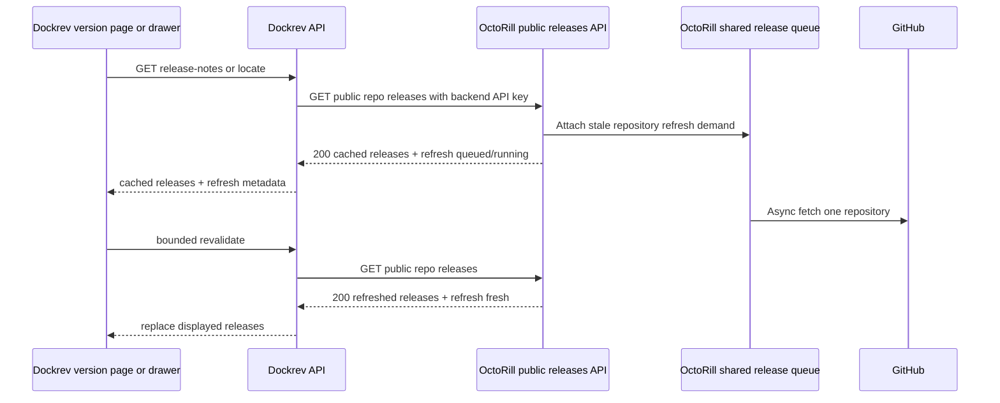

# Dockrev 打开版本记录时触发 OctoRill 单仓异步刷新

## 结论

采用已有的 Dockrev release-notes 读取链触发刷新，而不是新增 Dockrev 到 OctoRill 的 POST。

截图所示的版本记录入口采用 **30 秒最大缓存年龄**。OctoRill 的 public releases `GET` 在返回现有缓存时，对已解析且上次成功同步已超过 30 秒的单个仓库附加一项 interactive refresh demand；请求立即返回旧缓存及可选的刷新状态。Dockrev 将该状态透传给前端，并由共享的 `useServiceReleaseNotesSession` 在状态为 `queued` 或 `running` 时，在打开后的 30 秒预算内重新读取。同步完成后的下一次读取即可展示新版本记录。



这保留首屏的缓存响应，不把有历史记录的页面改成阻塞等待，也不会在每次翻页或同时打开两个入口时重复请求 GitHub。

## 已验证事实

### Dockrev

- 版本页在 [`ServiceVersionsSection.tsx`](https://github.com/IvanLi-CN/dockrev/blob/1f2b9a2f435008afdbd0fca83882a632e3259f6f/web/src/components/ServiceVersionsSection.tsx#L178-L196) 使用 `useServiceReleaseNotesSession`。
- 更新记录的“查看更新日志”打开全局 `GitHubReleaseDrawer`，[`RecentUpdateRecords.tsx`](https://github.com/IvanLi-CN/dockrev/blob/1f2b9a2f435008afdbd0fca83882a632e3259f6f/web/src/components/RecentUpdateRecords.tsx#L273-L282) 和 [`App.tsx`](https://github.com/IvanLi-CN/dockrev/blob/1f2b9a2f435008afdbd0fca83882a632e3259f6f/web/src/App.tsx#L592-L600) 建立该入口；抽屉也使用同一个 hook，[`GitHubReleaseDrawer.tsx`](https://github.com/IvanLi-CN/dockrev/blob/1f2b9a2f435008afdbd0fca83882a632e3259f6f/web/src/components/GitHubReleaseDrawer.tsx#L107-L137)。因此改动共享 hook 即覆盖两个界面。
- 前端仅访问 Dockrev 的相对路径 `GET /api/services/{id}/release-notes` 或 `/locate`，[`api.ts`](https://github.com/IvanLi-CN/dockrev/blob/1f2b9a2f435008afdbd0fca83882a632e3259f6f/web/src/api.ts#L343-L375)；后端路由也是只读 GET，[`api/mod.rs`](https://github.com/IvanLi-CN/dockrev/blob/1f2b9a2f435008afdbd0fca83882a632e3259f6f/crates/dockrev-api/src/api/mod.rs#L241-L248)。
- Dockrev 后端从设置读取 OctoRill 地址和 API key，再以 `Authorization: Bearer` 请求 OctoRill，[`release_notes.rs`](https://github.com/IvanLi-CN/dockrev/blob/1f2b9a2f435008afdbd0fca83882a632e3259f6f/crates/dockrev-api/src/api/services/release_notes.rs#L536-L635)。现有契约也明确 key 仅保存于后端，[`SPEC.md`](https://github.com/IvanLi-CN/dockrev/blob/1f2b9a2f435008afdbd0fca83882a632e3259f6f/docs/specs/x4edr-octorill-release-notes-provider/SPEC.md#L15-L19)。
- 共享 hook 只在初始读取时加载结果并缓存，未根据后台任务完成状态 revalidate，[`useServiceReleaseNotesSession.ts`](https://github.com/IvanLi-CN/dockrev/blob/1f2b9a2f435008afdbd0fca83882a632e3259f6f/web/src/useServiceReleaseNotesSession.ts#L196-L256)。

### OctoRill

- public releases 路由是 `GET /api/public/repos/{owner}/{repo}/releases`，[`src/server.rs`](/Users/ivan/.codex/worktrees/622e/octo-rill/src/server.rs:248)。
- `enqueue_public_repo_release_sync` 已将单仓 release 同步以 `public_release_access` 原因附加到 interactive shared queue，[`src/sync.rs`](/Users/ivan/.codex/worktrees/622e/octo-rill/src/sync.rs:4000)。队列按仓库复用运行中工作并使用 freshness window，因此可承受并发读取。
- 目前 public read 仅在仓库本地元数据已解析且 `release_count == 0` 时调用该函数，[`src/api.rs`](/Users/ivan/.codex/worktrees/622e/octo-rill/src/api.rs:9548)。已有缓存不会触发同步，正是内容可长期过时的原因。
- 现有通用 `REPO_RELEASE_FRESHNESS_WINDOW` 是 30 分钟，[`src/sync.rs`](/Users/ivan/.codex/worktrees/622e/octo-rill/src/sync.rs:42)。30 秒要求应作为 public-read 专用策略传入，不能改变该通用常量，否则会影响其他 release 同步工作流。

## 联合接口约定

将 `refresh` 作为 OctoRill public release 成功响应的可选字段。非 Dockrev 调用方和旧版 Dockrev 忽略未知字段后仍保持兼容。

```json
{
  "status": "ready",
  "items": [],
  "refresh": {
    "state": "fresh | queued | running",
    "last_success_at": "2026-08-20T01:02:03Z",
    "retry_after_seconds": 2
  }
}
```

- `fresh`：最近一次成功同步距当前不超过 30 秒，不需要客户端重读。
- `queued`：本次读取已创建或复用一项等待中的单仓同步。
- `running`：已有 worker 正在同步同一仓库。
- `retry_after_seconds` 只在 `queued` 或 `running` 时给出，Dockrev 应限制在 1--5 秒范围内使用，并且只在打开后的 30 秒预算内重读。
- 缓存中已有 release 时，一律继续返回 `200` 和现有内容；不能因为刷新任务存在而返回 `202`。已有的冷缓存 `202/pending` 行为保持不变。

30 秒是“缓存可被标记为 fresh 的最大年龄”，不是 GitHub 或队列的硬完成时限。若队列、GitHub 限流或网络故障使刷新未能在 30 秒内完成，页面必须继续明确显示正在更新或缓存过期状态，不能将旧内容误标为 fresh。

Dockrev 对外的 `ServiceReleaseNotesResponse` 增加语义相同的可选 `refresh` 字段，按现有序列化风格使用 camelCase：`lastSuccessAt` 与 `retryAfterSeconds`。

## OctoRill 实施方案

1. 在 public list 的首个窗口请求中，仓库已解析后调用现有 `enqueue_public_repo_release_sync`，不再以 `release_count == 0` 作为唯一条件。新增 `PUBLIC_RELEASE_READ_FRESHNESS_WINDOW = Duration::from_secs(30)`，作为该调用的专用 freshness 参数；新鲜结果仅复用，距 `last_success_at` 超过 30 秒才排入同步队列。游标翻页和 release content hydration 不额外触发 demand。
2. 将 `enqueue_public_repo_release_sync` 的布尔返回值扩展为结构化结果，并让其把上述专用 freshness 策略传入既有 attach 逻辑。基于既有的 attach 结果区分 `fresh`、`queued` 与 `running`，并读取已有工作项的 `last_success_at`。不新建第二套调度器或工作表，也不改变通用 30 分钟窗口。
3. 将该结果作为可选 `refresh` 写入 public list 的 `200` 响应。同步失败仍保留上一份缓存；下一次满足既有队列重试规则的可见读取可重新排队。
4. 更新 public releases API 文档，说明该 GET 具有“返回缓存并附加按需刷新”的语义，并规定消费者只能按 `retry_after_seconds` 做有限轮重读。

本方案不扩大未知仓库的冷启动范围：无法由已有元数据解析的仓库继续走当前 `pending/202` 契约。截图中的问题是已可展示但陈旧的仓库缓存，正好由上述变更解决。

## Dockrev 实施方案

1. 在 `crates/dockrev-api/src/api/services/release_notes.rs` 的 OctoRill public response 解析模型中加入可选 `refresh`，再映射到 `ServiceReleaseNotesResponse`。相应扩展 `crates/dockrev-api/src/api/types/services.rs` 和 `web/src/api.ts` 的类型。
2. 保持当前 provider 分支、后端 API key 代理和“同一来源不 fallback”规则；不要新增浏览器到 OctoRill 的请求，也不要把 API key 暴露给浏览器。
3. 在 `useServiceReleaseNotesSession` 的成功初始加载后，若来源为 OctoRill 且 `refresh.state` 为 `queued` 或 `running`，以 `retryAfterSeconds` 安排重读，直到收到 `fresh` 或打开后满 30 秒为止。继续使用当前 list 或 locate 请求参数，替换同一 session 的缓存快照和视图数据。建议采用 2、4、8、16 秒的退避，总预算不超过 30 秒。
4. 在 session/source/service 改变或组件卸载时取消定时器和未完成请求。不得使用无限 `setInterval`，不得把已缓存的版本记录重置为全屏 loading，也不得破坏分页游标或当前选中版本。
5. 在版本页与抽屉共用的现有状态提示中增加低干扰的“正在更新”及“缓存超过 30 秒”标记。该标记不应阻塞阅读或操作；在 30 秒内未完成时必须保留过期状态，不能显示为已刷新。

## 验收与测试

| 场景 | OctoRill 预期 | Dockrev 预期 |
| --- | --- | --- |
| 非空且超过 30 秒的缓存首次打开 | 立即 `200` 旧数据，`refresh.state=queued`，仅一条该仓库工作项 | 立即展示旧记录，在 30 秒预算内按时重读 |
| 同仓库已有 worker | `refresh.state=running`，不重复创建工作项 | 保持页面稳定并有限重读 |
| 同步成功后的重读 | `refresh.state=fresh`，返回新记录 | 替换列表和已定位版本的内容 |
| 最近成功同步不超过 30 秒 | `refresh.state=fresh`，不触发 GitHub 同步 | 不增加请求 |
| 同步失败、退避或 30 秒未完成 | 保留最后成功缓存，不返回空内容 | 停止 30 秒预算内的重读，保留缓存并明确标识过期 |
| 未解析的冷仓库 | 保持现有 `202/pending` 语义 | 保持现有等待/错误处理 |

OctoRill 需要覆盖 30 秒边界前后的非空缓存、并发 attach、运行中任务、worker 成功与失败退避，并验证通用 30 分钟窗口未被改变。Dockrev 需要以 mock upstream 验证字段透传，并用 fake timers 验证 hook 在 30 秒预算内的退避次数、取消和 locate/list 两条路径。版本页和抽屉各增加一条“缓存内容后台刷新”的 UI 测试或 Storybook 场景。

## 不采用的方案

- 浏览器直接调用 OctoRill：会把 API key 和跨域认证带到前端，违背现有后端代理边界。
- 调用现有 `POST /api/sync/releases`：它针对调用者可见的整体同步，不是单仓 interactive demand，负载和语义均不匹配。
- 新增 Dockrev 到 OctoRill 的 refresh POST：技术上可行，但 public list GET 已经负责缓存注册与按需 warm-up；新增端点会重复鉴权、状态和去重契约，不能解决读取完成后页面不重读的问题。

## 推荐交付顺序

1. Dockrev 先兼容可选 `refresh` 字段，并在字段存在时启用有限 revalidate；字段缺失时完全维持当前行为。
2. 部署 OctoRill 的 stale-cache attach 和响应元数据。
3. 用一个已有且上次成功同步超过 30 秒的仓库验证：首次打开即时显示缓存，队列只出现一条单仓任务，页面在 30 秒预算内重读并出现 GitHub 新 release；若任务未完成，页面明确显示缓存已过期。
