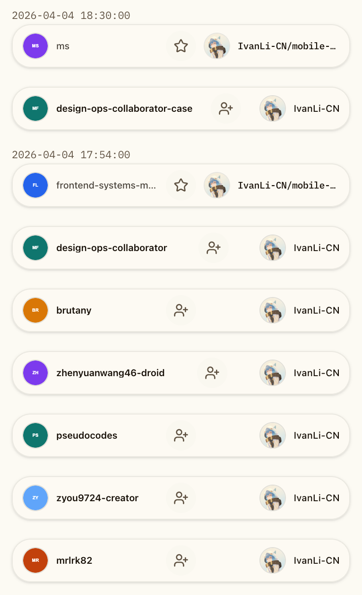

# Dashboard 社交卡片移动端横向紧凑重设计（#2bhas）

## 状态

- Status: 已完成
- Created: 2026-04-16
- Last: 2026-04-18

## 背景 / 问题陈述

`#vgqp9` 已经把 Dashboard 的社交活动流（被加星 / 被关注）接进主时间线，但当前 `SocialActivityCard` 只在 `md` 以上启用 actor / action / target 三段布局，导致 `<md` 移动端退化成纵向三层堆叠：上方 actor、中间动作、下方 target。

这种排版在窄屏下会严重拉高单条社交卡片的高度，尤其在 `全部` tab 混排时，会让社交卡片比 release card 更抢占纵向空间，破坏时间线的阅读节奏。

本 follow-up 只解决移动端社交卡片的横向紧凑编排，不回改 `#vgqp9` 已冻结的 feed 语义、后端 contract 与桌面端布局。

## 目标 / 非目标

### Goals

- 将移动端（主审阅口径 `390px`，兼顾 `375px`）的社交卡片改为默认横向三段式：左 actor、中王冠动作桥、右 target。
- 通过缩小 avatar、padding、gap 与动作节点尺寸，显著回收社交卡片的纵向高度。
- 保持 `repo_star_received` 继续显示时间与目标仓库，`follower_received` 继续不显示时间文案。
- 保持现有 GitHub 链接数量、点击去向、fallback 行为与桌面端编排不变。
- 补齐稳定的移动端 Storybook 证据入口、几何断言与 owner-facing 视觉证据。

### Non-goals

- 不改 Rust 后端、`/api/feed` 响应结构、同步链路或数据库。
- 不重做 release card、Dashboard 顶部 mobile shell 或 tab strip。
- 不把社交卡片在桌面端重新视觉设计成另一套样式。
- 不新增对外 API 字段；若测试稳定性需要，仅允许新增内部 `data-*` 几何钩子。

## 范围（Scope）

### In scope

- `web/src/feed/FeedItemCard.tsx`
- `web/src/stories/Dashboard.stories.tsx`
- `web/e2e/dashboard-social-activity.spec.ts`
- `docs/specs/README.md`
- `docs/specs/2bhas-dashboard-social-mobile-compact-layout/SPEC.md`

### Out of scope

- `src/**` Rust 服务端实现
- `/api/feed` contract、同步任务与 release feed 数据模型
- release card、日报、Inbox 与 Admin 视图
- Desktop / `md+` 版面的大改

## 接口契约（Interfaces & Contracts）

- 外部 feed union 与 `FeedItem` 判别联合类型保持不变。
- `repo_star_received`：
  - 继续显示时间文案
  - 继续保留 actor 与 repo 两个 GitHub 链接
- `follower_received`：
  - 继续不显示时间文案
  - 继续仅保留 actor 一个 GitHub 链接
- 内部允许新增稳定验证钩子：
  - `data-social-card-layout`
  - `data-social-card-row`
  - `data-social-card-segment`
  - `data-social-card-primary`
  - `data-social-card-entity-group="actor"`
  - `data-social-card-entity-group="target"`

## 功能与行为规格（Functional/Behavior Spec）

### 移动端三段横向编排

- `SocialActivityCard` 在移动端默认使用三列布局，而不是等到 `md` 才切换。
- actor 与 target 两侧卡片继续复用统一实体卡片样式，但移动端尺寸收紧。
- 中央动作桥继续保留图标 + 文案识别，但移动端改成更小的圆形节点与更紧凑的标签。
- 长 login / repo 名只允许单行截断，不得把三段结构挤成换行或纵向拆层。
- `centered` 模式下，左右两列可以继续等宽，但判定“贴边”的对象必须是**头像 + 文本实体组**，而不是可点击外框；左组贴左，右组贴右。
- `adaptive` 模式下，长边可以吃掉更多宽度，但右侧实体组仍必须真实贴右，不能出现文本结束后还残留大片 trailing whitespace。

### 语义与回退保持不变

- `repo_star_received` 仍显示时间戳，并在目标区展示仓库身份。
- `follower_received` 仍隐藏时间文案。
- actor avatar、repo avatar / fallback 与现有链接行为不变。
- 桌面端在 `md+` 继续沿用原有较宽尺寸口径，不以移动端紧凑化为代价回退桌面阅读性。

### Storybook / 验证面

- 增加固定移动端 viewport 的 `Evidence / Mobile Social Compact` story。
- story 必须一次性覆盖长 login、长 repo 名、star + follower 混排，并用 `play` 断言锁住“同一横排、不横向溢出、单行截断”的意图。
- 视觉证据优先来自 Storybook canvas，不使用真实页面截图。

## 验收标准（Acceptance Criteria）

- Given Dashboard 在 `390px` 或 `375px` 宽度下渲染 `repo_star_received`
  When 页面完成渲染
  Then actor / action / target 三段保持同一横排，且显示时间文案。

- Given Dashboard 在 `390px` 或 `375px` 宽度下渲染 `follower_received`
  When 页面完成渲染
  Then actor / action / target 三段保持同一横排，且不显示时间文案。

- Given actor login 或 repo_full_name 很长
  When 移动端社交卡片渲染
  Then 文案只做单行截断，不触发换列，也不产生横向滚动。

- Given `全部` / `被加星` / `被关注` 三个入口
  When 列表展示社交卡片
  Then 都复用同一套移动端横向紧凑布局，而不是分裂成不同样式。

- Given 移动端 `centered` 或 `adaptive` 社交卡片渲染完成
  When 测量 `[data-social-card-entity-group="target"]` 的真实右边缘
  Then 该实体组到卡片内边距的 gap 必须 `<= 14px`，不得再出现右侧整块 trailing whitespace。

- Given `被关注` tab 展示连续短文案 follower 列表
  When 检查短用户名与 viewer 实体组
  Then 右侧实体组仍真实贴右，不会因为 segment 外框占位而在名称后方留下大片空白。

- Given Storybook 与 Playwright 回归执行
  When 检查移动端社交卡片几何
  Then 可以稳定证明三段元素位于同一 row，且 `scrollWidth <= clientWidth + 1`。

## 非功能性验收 / 质量门槛（Quality Gates）

### Testing

- `cd /Users/ivan/.codex/worktrees/5abc/octo-rill/web && bun run build`
- `cd /Users/ivan/.codex/worktrees/5abc/octo-rill/web && bun run storybook:build`
- `cd /Users/ivan/.codex/worktrees/5abc/octo-rill/web && bun run e2e -- dashboard-social-activity.spec.ts`
- `cd /Users/ivan/.codex/worktrees/5abc/octo-rill/web && bun run lint`

### Visual verification

- 必须提供 Storybook canvas 的 owner-facing 移动端证据图。
- 视觉证据需写入本 spec 的 `## Visual Evidence`。
- 在 push 或 PR 复用该图前，必须先在聊天中回图并取得主人确认。

## 文档更新（Docs to Update）

- `docs/specs/README.md`
- `docs/specs/2bhas-dashboard-social-mobile-compact-layout/SPEC.md`

## 参考

- `docs/specs/vgqp9-dashboard-social-activity/SPEC.md`
- `web/src/feed/FeedItemCard.tsx`
- `web/src/stories/Dashboard.stories.tsx`
- `web/e2e/dashboard-social-activity.spec.ts`

## Visual Evidence

- source_type: storybook_canvas
  story_id_or_title: Pages/Dashboard · Evidence / Mobile Social Edge Case Matrix
  state: mobile social cards with entity-group edge alignment
  evidence_note: 验证在 390px 移动端宽度下，右长、左长、双长与短 follower 连续列表都以真实实体组为贴边基准；右侧实体组的 trailing whitespace 已收敛。

## 实现里程碑（Milestones / Delivery checklist）

- [x] M1: 冻结移动端 follow-up spec、范围与不回归语义。
- [x] M2: 落地 `SocialActivityCard` mobile-first 横向紧凑编排与内部验证钩子。
- [x] M3: 补齐 Storybook、几何断言、build / e2e 验证与视觉证据。

## 风险 / 假设

- 风险：移动端中央动作桥若收得过小，可能降低“标星 / 关注”的辨识度；本轮以“仍可一眼识别”为下限。
- 风险：长 repo 名截断后，target 区的视觉权重会比桌面端更低；这是为换取移动端时间线密度的有意取舍。
- 假设：移动端主验收宽度以 `390px` 为主，`375px` 作为长文案压力验证即可覆盖主要风险。
