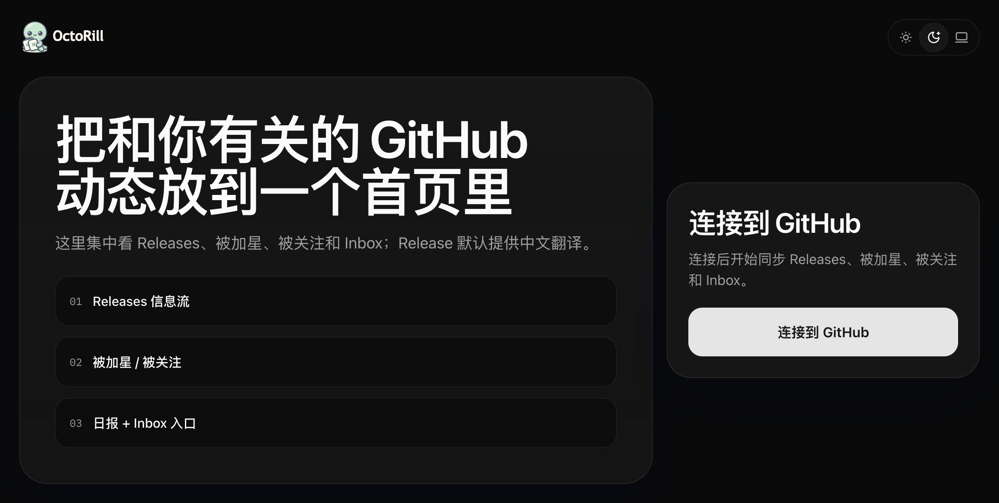
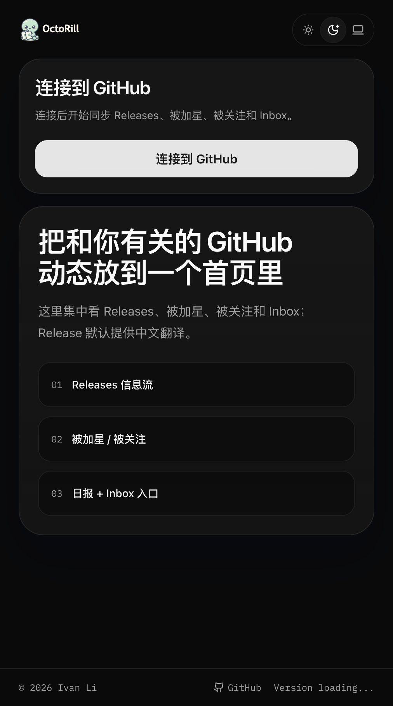

# Landing 登录页重做：降噪文案、重构布局、修复移动端 CTA（#2nsc2）

## 背景 / 问题陈述

- 当前 Landing 登录页文案过长、口径混杂，既像产品介绍又像 AI 营销页，首屏信息密度过高。
- 现有视觉结构存在明显“套娃卡片”问题：外层 Hero、内层品牌盒、卖点卡、登录卡同时抢焦点，导致页面不够干净。
- 首屏卖点的文案长度差异过大，桌面三列状态下难以形成稳定节奏，影响整体观感。
- 移动端首屏无法稳定看到登录按钮，用户需要先滚动才能完成核心操作，这与登录页的单一目标相冲突。

## 目标 / 非目标

### Goals

- 重写 Landing 首屏文案，只保留直白的产品收益表达。
- 重做 Landing 布局：桌面保留品牌说明区 + 登录卡双栏，移动端改为 CTA 优先单栏。
- 将登录卡标题与主按钮统一收口为 `连接到 GitHub`。
- 补齐 Storybook 审阅面、移动端回归断言与视觉证据。

### Non-goals

- 不修改 GitHub OAuth 后端链路或 `/auth/github/login` 地址。
- 不改 Dashboard、Admin 或其他路由页面。
- 不改全局认证状态、后端接口和数据模型。

## 范围（Scope）

### In scope

- `web/src/pages/Landing.tsx`
- `web/src/stories/AppLanding.stories.tsx`
- `web/e2e/landing-login.spec.ts`
- `docs/specs/README.md`

### Out of scope

- `src/**` Rust 后端
- Dashboard / Admin 页面
- GitHub OAuth 配置、会话管理与全局页脚逻辑

## 需求（Requirements）

### MUST

- 首屏主标题固定为 `集中查看与你相关的 GitHub 动态`。
- 首屏说明固定为 `登录后可在同一页面查看发布更新、获星与关注动态，并使用日报与通知入口；发布内容支持中文翻译与要点整理。`
- 首屏卖点压缩为 3 组统一结构的短文案：`发布更新 / 查看发布译文与要点`、`社交动态 / 查看获星与关注变化`、`日报通知 / 查看日报与通知入口`。
- 登录卡标题与主 CTA 统一为 `连接到 GitHub`，并继续链接到 `/auth/github/login`。
- 移动端 `375x667` 视口首屏无需滚动即可看到完整 CTA。
- `bootError` 存在时必须继续在登录卡内可见，且不能把 CTA 挤出首屏。
- Storybook 必须提供稳定的 Landing 默认态、错误态与移动端审阅入口。

### SHOULD

- 视觉层级应收敛为“品牌说明 > 主 CTA > 次级卖点”，不再出现多层描边与大块说明卡争抢注意力。
- Playwright 回归同时验证旧文案已移除，防止回滚。

### COULD

- 无。

## 功能与行为规格（Functional/Behavior Spec）

### Core flows

- 桌面宽度下，Landing 采用左侧品牌说明区、右侧登录卡的双栏结构；品牌区只保留 wordmark、标题、短说明和 3 组统一结构的卖点卡。
- 移动端宽度下，登录卡提前到首屏顶部，品牌说明跟随其后，确保核心 CTA 优先可见。
- 登录卡只保留简洁标题、简短说明、唯一主按钮与错误提示，不再展示冗余标签或两张辅助说明卡。

### Edge cases / errors

- `bootError` 存在时，仅在登录卡内部以内联错误块展示，不新增 toast 或顶部横幅。
- 主题切换控件继续可见且不遮挡首屏 CTA。

## 接口契约（Interfaces & Contracts）

### 接口清单（Inventory）

| 接口（Name） | 类型（Kind） | 范围（Scope） | 变更（Change） | 契约文档（Contract Doc） | 负责人（Owner） | 使用方（Consumers） | 备注（Notes） |
| --- | --- | --- | --- | --- | --- | --- | --- |
| Landing 登录 CTA accessible name | UI copy | external | Modify | None | web | 浏览器用户 / Storybook / Playwright | 从 `使用 GitHub 登录` 改为 `连接到 GitHub` |

### 契约文档（按 Kind 拆分）

- None

## 验收标准（Acceptance Criteria）

- Given 未登录访问 `/`
  When Landing 渲染完成
  Then 页面展示桌面双栏 / 移动端 CTA 优先单栏的新结构，且主标题为 `集中查看与你相关的 GitHub 动态`。

- Given 视口为 `375x667`
  When Landing 首屏加载完成
  Then `连接到 GitHub` 按钮无需滚动即可完整可见，且链接为 `/auth/github/login`。

- Given Landing 正常渲染
  When 检查首屏文案
  Then 页面只保留 1 个主标题、1 段短说明和 3 组结构统一的卖点卡，不再出现 `Start here`、`为 GitHub Release 阅读而生`、`使用 GitHub 登录` 等旧口径。

- Given `bootError` 有值
  When Landing 渲染
  Then 错误信息继续在登录卡内可见，且主 CTA 仍可见。

- Given Storybook 与 Playwright 回归执行
  When 检查 Landing
  Then 默认态、错误态与移动端 CTA 可见性都存在稳定断言。

## 实现前置条件（Definition of Ready / Preconditions）

- 首屏文案与 CTA 命名已经冻结。
- 本轮只处理 Landing 登录页，不扩 scope 到其他页面。
- Storybook 与 Playwright 基建已可直接扩展。

## 非功能性验收 / 质量门槛（Quality Gates）

### Testing

- E2E tests: `cd web && bun run e2e -- landing-login.spec.ts`

### UI / Storybook (if applicable)

- Stories to add/update: `web/src/stories/AppLanding.stories.tsx`
- Docs pages / state galleries to add/update: Landing autodocs
- `play` / interaction coverage to add/update: 默认态、错误态、移动端 CTA 断言
- Visual regression baseline changes (if any): 本 spec 的 `## Visual Evidence`

### Quality checks

- `cd web && bun run lint`
- `cd web && bun run build`
- `cd web && bun run storybook:build`

## Visual Evidence

- 桌面默认态：Landing 已收敛为更干净的双栏结构，左侧用 `发布更新 / 社交动态 / 日报通知` 三组统一卡片概括真实前台能力，右侧只保留简洁登录卡与唯一主 CTA。

- 移动端首屏：登录卡已经前置到品牌说明之前，`连接到 GitHub` 在首屏内完整可见，不需要向下滚动寻找按钮；品牌说明则继续承接发布阅读、社交动态与日报通知口径。

## 方案概述（Approach, high-level）

- 通过压缩首屏信息层级，把 Landing 收敛为“品牌说明 + 唯一登录动作”的登录页，而不是继续堆叠解释型内容。
- 桌面与移动端采用不同信息顺序，但使用同一组文案与组件，降低后续维护成本。
- 用 Storybook 与 Playwright 双轨固定新口径：Storybook 管视觉审阅，Playwright 管移动端 CTA 可见性与旧文案回归。

## 风险 / 开放问题 / 假设（Risks, Open Questions, Assumptions）

- 风险：若后续继续往首屏加入新 badge 或补充说明，移动端 CTA 可能再次被挤出首屏。
- 需要决策的问题：None。
- 假设（需主人确认）：Landing 首屏优先强调“与我相关的 GitHub 动态工作区”，明确覆盖发布阅读、社交动态、日报与通知入口，不把 AI 单独当主卖点。

## 参考（References）

- `docs/specs/3s4jc-landing-login-remove-dev-tip/SPEC.md`
- `docs/specs/76bxs-dashboard-header-brand-layout/SPEC.md`
