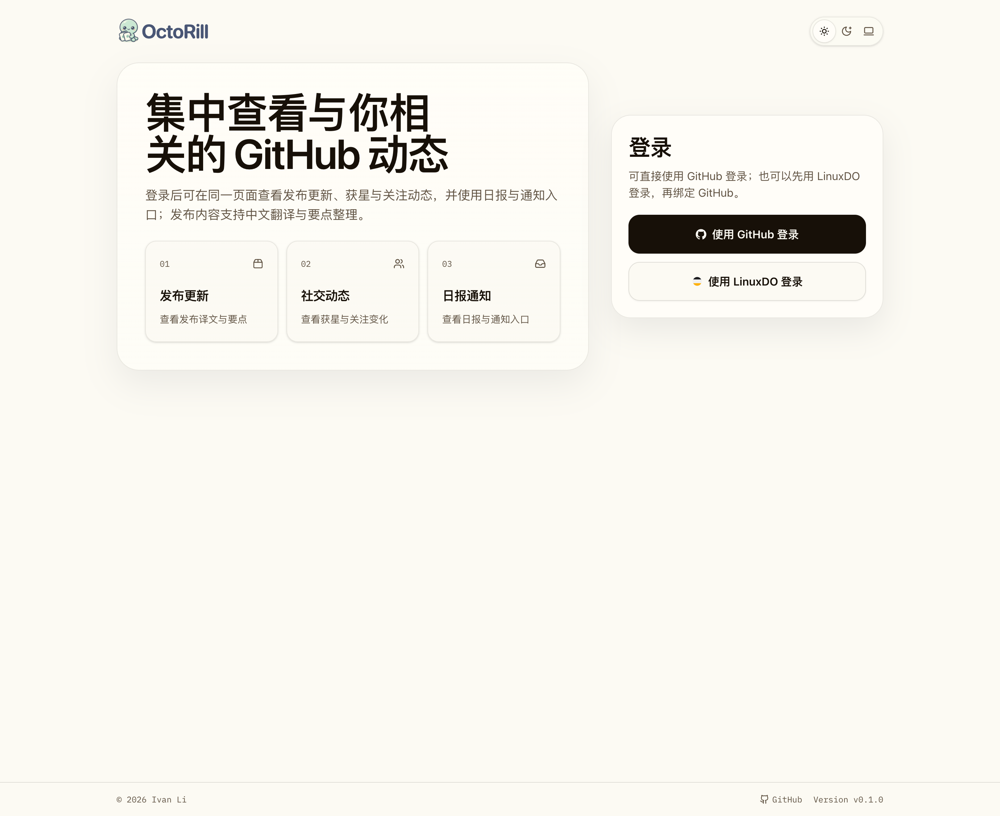
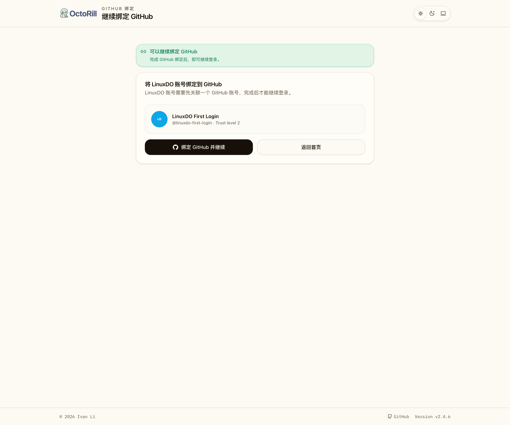
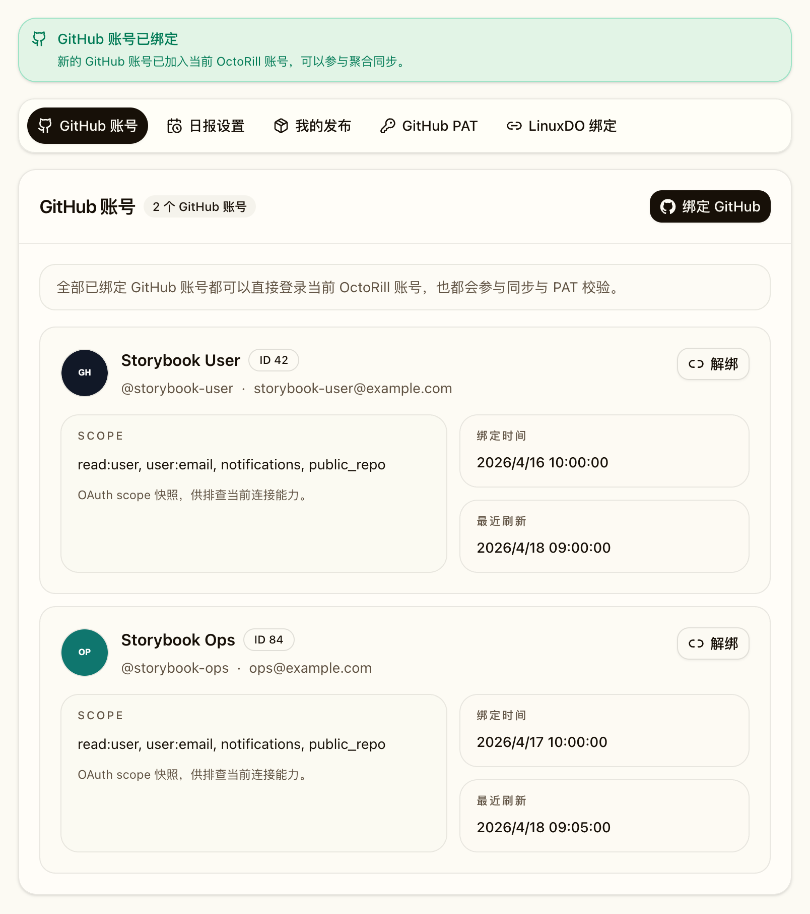
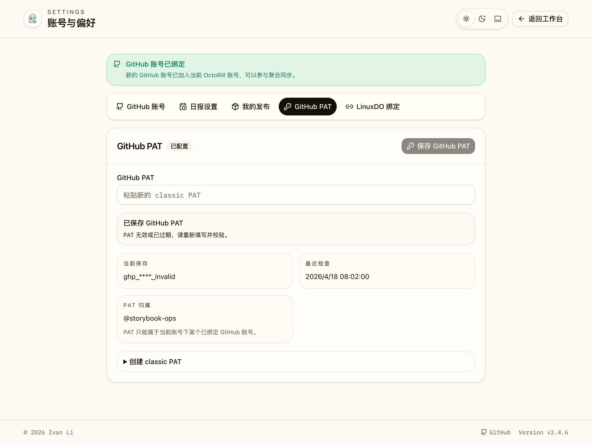

# 多 GitHub 绑定与 LinuxDO 首登补绑改造（#2v2aw）

## 背景 / 问题陈述

- 当前 `users` 仍然保留“一个账号对应一个 GitHub 身份”的历史形态，导致多 GitHub 绑定只能通过兼容层勉强承接，容易把内部实现细节外露到产品语义。
- LinuxDO 绑定链路原先假定用户已先进入 OctoRill；匿名从 LinuxDO 首次进入时，系统缺少“识别 LinuxDO → 补绑 GitHub → 完成登录”的闭环 onboarding。
- GitHub PAT 过去只校验 token 本身，不校验它是否属于当前 OctoRill 账号已绑定的 GitHub 身份。
- starred / releases / social / notifications 已经开始向账号聚合演进，但仍需要去掉对单一 GitHub “主槽位”的依赖，才能真正完成账号体系迁移。

## 数据库模型现状（Current vs Legacy）

| 维度 | 原方案 | 当前运行时 | 当前仍保留的 legacy |
| --- | --- | --- | --- |
| 账号主表 | `users = 内部账号 + 唯一 GitHub 身份摘要` | `users = OctoRill 内部账号` | `users.github_user_id/login/name/avatar_url/email` 仍留在 schema 中，但已降级为 legacy 摘要字段 |
| GitHub 绑定 | 无独立绑定表；一个账号只能有一个 GitHub | `github_connections` 是 GitHub 外部身份唯一真相源，支持 1:N | 无 |
| GitHub OAuth token | `user_tokens` 一账号一条 | token 跟随 `github_connections` 存储与读取 | `user_tokens` 仍留在 schema 中，仅作为历史迁移输入 |
| LinuxDO 绑定 | 无 / 分散在旧实现 | `linuxdo_connections` 维持 1:1 绑定 | 无 |
| PAT 归属 | `reaction_pat_tokens` 只保存 PAT 本身 | `reaction_pat_tokens + owner_*` 绑定到某条 GitHub connection | 旧 owner 为空的历史记录会在 backfill 后收敛 |

- 本规格的目标是：**先完成运行时迁移**，让登录、绑定、同步、PAT 校验全部只依赖新账号体系。
- `users.github_*` 与 `user_tokens` 在本轮结束后都应被明确视为 **legacy-only**。
- 物理 schema cleanup（删除 `users.github_*`、删除 `user_tokens`、收缩旧查询）可以放到后续版本，以独立 migration 安全完成。

## 目标 / 非目标

### Goals

- 把 `users` 收敛为 OctoRill 内部账号主表，把 `github_connections` 定义为 GitHub 外部身份的唯一真实来源。
- 去掉产品层“主账号 / 附加账号 / 设为主账号”概念；所有已绑定 GitHub 账号在登录、同步、PAT 校验上平权。
- 支持 GitHub 多账号绑定、解绑（非最后一条），并允许任一已绑定 GitHub 直接登录所属 OctoRill 账号。
- 支持 LinuxDO 匿名登录：若已绑定账号则直登；若未绑定则进入 `/bind/github` 补绑流程，待 GitHub 成功后再落 LinuxDO 绑定。
- 把 starred / releases / social / notifications 改成按“当前账号下全部 GitHub connections”聚合同步。
- 保持“一个 OctoRill 账号只有一个 PAT”，但 PAT 必须属于该账号下某个已绑定 GitHub connection，并在 UI 展示 owner。
- 明确 UI 默认头像规则：优先使用 LinuxDO 头像；若未绑定 LinuxDO，则使用按 `linked_at ASC, id ASC` 选出的第一条 GitHub 绑定头像。

### Non-goals

- 不做自动账号合并；LinuxDO 与 GitHub 若已分别归属不同内部账号，只返回冲突态。
- 不支持多 PAT，也不支持一个 OctoRill 账号绑定多个 LinuxDO。
- 不在本轮 feed 卡片上额外标注“这条数据来自哪个 GitHub 身份”。
- 不在本轮引入“按 GitHub 子身份切换视图”的多工作台体验。

## 范围（Scope）

### In scope

- `migrations/0039_multi_github_connections.sql` 与后端回填逻辑。
- GitHub / LinuxDO OAuth callback、session onboarding、冲突 guard 与连接管理 API。
- 多 GitHub 连接下的 starred / releases / social / notifications 聚合同步与 cursor 命名空间隔离。
- `/api/me` 与前台头像/设置页，确保不再暴露“主账号”语义。
- Landing 双登录入口、`/bind/github` 页面、Settings 的 GitHub 账号管理与 PAT owner 展示。
- Storybook / Playwright / owner-facing 视觉证据与 spec sync。

### Out of scope

- 跨账号 merge tooling、管理员代绑、后台人工合并账号。
- 多视角 Dashboard（按 GitHub 子身份过滤）与更细粒度的 PAT 使用审计。
- LinuxDO 数据消费、LinuxDO token 存储或 LinuxDO PAT。

## 需求（Requirements）

### MUST

- 一个 `users.id` 必须能关联多条 `github_connections`，且这些连接按 `linked_at ASC, id ASC` 形成稳定顺序。
- 旧数据升级后，每个已有用户必须自动回填至少 1 条 GitHub connection，原用户业务数据保持挂在原 `users.id`。
- 任一已绑定 GitHub 登录都必须直登所属 OctoRill 账号；已登录用户可追加绑定新的 GitHub，冲突时返回明确错误。
- LinuxDO 匿名登录若发现未绑定账号，必须保留 pending LinuxDO 快照到 session，并把用户导向 `/bind/github`；GitHub 成功后再完成 LinuxDO 绑定。
- GitHub 账号聚合必须覆盖 starred / releases / social / notifications；notifications cursor 必须按 connection 维度独立保存。
- PAT 保存前必须校验 `/user` 返回的 GitHub user id 属于当前账号任一 connection；状态接口必须返回 PAT owner 元数据。
- Settings 必须支持 GitHub 连接列表、追加绑定、解绑（非最后一条），并展示 LinuxDO 绑定态与 PAT owner。
- Landing 必须同时提供 GitHub 登录与 LinuxDO 登录入口。
- `/api/me` 的头像必须遵循“LinuxDO 优先，否则第一条 GitHub”规则。

### SHOULD

- 运行时不再依赖 `user_tokens` 或 `users.github_*` 作为 GitHub 账号归属、OAuth token 或连接顺序的真实来源。
- 若删除的是当前 PAT owner 对应 GitHub connection，应同步移除 PAT，避免 owner 悬空。
- 单个 GitHub connection 同步失败时，不应破坏其他 connection 的 cursor 与聚合结果。

### COULD

- 后续可以把 `users.github_user_id` 等历史字段彻底迁移出物理 schema；本轮只要求它们退出运行时真相源。
- 后续可以补一轮 destructive schema cleanup migration，正式删除 `user_tokens` 与 `users.github_*` 等 legacy 结构。

## 功能与行为规格（Functional/Behavior Spec）

### Core flows

- 用户匿名点击 Landing 的“使用 GitHub 登录”时，走 GitHub OAuth；若 GitHub 已绑定某个 OctoRill 账号，则直接登录该账号；若尚未绑定，则创建/确认内部账号并写入首条 GitHub connection。
- 已登录用户在 `/settings?section=github-accounts` 点击“绑定 GitHub”时，系统发起 `/auth/github/connect`；回调成功后新增 connection，不改变任何产品层“主从”状态，因为产品上不存在该概念。
- 用户匿名点击“使用 LinuxDO 登录”时：
  - 若该 LinuxDO 已绑定某个 OctoRill 账号，直接登录该账号；
  - 若未绑定，则把 LinuxDO 快照写入 session，并跳转 `/bind/github`；用户完成 GitHub 登录后，系统把 LinuxDO 绑定到该 OctoRill 账号并进入主界面。
- `/settings` 的 GitHub 账号 section 展示当前全部 connection，支持“绑定 GitHub”“解绑”；列表顺序固定为 `linked_at ASC, id ASC`。
- reaction PAT 保存/状态接口在返回 masked token 的同时，返回 owner connection id / GitHub user id / login，前端展示 `@login`。
- 后台同步按账号遍历全部 GitHub connections：
  - starred / social / releases 结果去重并聚合；
  - notifications 对每个 connection 使用独立 `sync_state` key，再合并写入账号级 inbox。
- UI 用户头像显示规则：
  - 若存在 `linuxdo_connections.avatar_url`，优先使用 LinuxDO 头像；
  - 否则使用第一条 GitHub connection 的头像；
  - 登录名、显示名、邮箱默认取第一条 GitHub connection 的摘要。

### Edge cases / errors

- LinuxDO 与 GitHub 若分属不同 OctoRill 账号，补绑流程必须停在明确冲突态（`linuxdo_account_conflict` / `github_already_bound`），不能自动 merge。
- 已登录用户若尝试绑定已被其他账号占用的 GitHub，回跳 `/settings?section=github-accounts&github=already_bound`。
- 删除 GitHub connection 时，如果这是最后一条 connection，则返回错误并阻止删除。
- LinuxDO OAuth 未配置时：
  - Settings 显示不可用状态；
  - 匿名 LinuxDO 登录或 callback 均回跳对应错误状态。
- PAT 若来自未绑定的 GitHub 身份，应返回 `pat_invalid`，并明确说明 owner 不属于当前账号。

## 接口契约（Interfaces & Contracts）

### 接口清单（Inventory）

| 接口（Name） | 类型（Kind） | 范围（Scope） | 变更（Change） | 契约文档（Contract Doc） | 负责人（Owner） | 使用方（Consumers） | 备注（Notes） |
| --- | --- | --- | --- | --- | --- | --- | --- |
| `github_connections` | DB | internal | New | ./contracts/db.md | backend | backend | GitHub OAuth token 与连接关系真相源 |
| `reaction_pat_tokens.owner_*` | DB | internal | Modify | ./contracts/db.md | backend | backend | PAT 归属 connection 元数据 |
| `sync_state` notifications cursor namespace | DB | internal | Modify | ./contracts/db.md | backend | backend | `notifications_since:<connection_id>` |
| `GET /api/me` | HTTP API | external | Modify | ./contracts/http-apis.md | backend | web | 头像与展示摘要按新规则解析 |
| `GET /api/me/github-connections` | HTTP API | external | New | ./contracts/http-apis.md | backend | web | GitHub 连接列表 |
| `DELETE /api/me/github-connections/{connection_id}` | HTTP API | external | New | ./contracts/http-apis.md | backend | web | 解绑非最后一条 GitHub |
| `GET /api/auth/bind-context` | HTTP API | external | New | ./contracts/http-apis.md | backend | web | 读取 pending LinuxDO onboarding 快照 |
| `GET /auth/github/login` | HTTP API | external | Modify | ./contracts/http-apis.md | backend | web | 匿名 GitHub 登录入口 |
| `GET /auth/github/connect` | HTTP API | external | New | ./contracts/http-apis.md | backend | web | 已登录用户追加绑定 GitHub |
| `GET /auth/github/callback` | HTTP API | external | Modify | ./contracts/http-apis.md | backend | GitHub OAuth | login/connect/onboarding 三模式收口 |
| `GET /auth/linuxdo/login` | HTTP API | external | Modify | ./contracts/http-apis.md | backend | web | 允许匿名进入 |
| `GET /auth/linuxdo/callback` | HTTP API | external | Modify | ./contracts/http-apis.md | backend | LinuxDO Connect | 已绑定直登 / 未绑定补绑 |
| `/bind/github` | Route | internal | New | ./contracts/http-apis.md | web | 前台用户 | LinuxDO 首登补绑页 |
| `GET /api/reaction-token/status` | HTTP API | external | Modify | ./contracts/http-apis.md | backend | web | 返回 PAT owner |
| `POST /api/reaction-token/check` | HTTP API | external | Modify | ./contracts/http-apis.md | backend | web | 校验 PAT owner 属于当前账号 |
| `PUT /api/reaction-token` | HTTP API | external | Modify | ./contracts/http-apis.md | backend | web | 保存唯一 PAT + owner 元数据 |

### 契约文档（按 Kind 拆分）

- [contracts/README.md](./contracts/README.md)
- [contracts/http-apis.md](./contracts/http-apis.md)
- [contracts/db.md](./contracts/db.md)

## 验收标准（Acceptance Criteria）

- Given 一个历史单 GitHub 账号完成 migration
  When 服务启动并执行 backfill
  Then 该账号会新增至少 1 条 `github_connections`，且后续运行时读取 GitHub 连接、PAT owner 与同步状态都不再依赖 `user_tokens`。

- Given 用户使用某个已绑定 GitHub 账号登录
  When GitHub OAuth callback 完成
  Then 用户必须登录到所属 OctoRill 账号，且不会出现“主账号切换”之类的产品副作用。

- Given 用户已登录并在设置页追加绑定新的 GitHub
  When 该 GitHub 尚未被其他账号占用
  Then 绑定成功，GitHub 连接列表出现新条目，并按绑定时间稳定排序。

- Given 用户匿名从 LinuxDO 登录且该 LinuxDO 尚未绑定任何 OctoRill 账号
  When LinuxDO callback 完成
  Then 系统把 LinuxDO 快照写入 session，并跳转 `/bind/github`，页面能展示待补绑的 LinuxDO 信息。

- Given 用户处于 `/bind/github`，且完成 GitHub OAuth
  When GitHub 账号未与其他 OctoRill 账号冲突
  Then 系统完成 GitHub 登录、写入 LinuxDO 绑定，并进入主界面；若冲突则回跳明确错误态。

- Given 当前账号绑定了多个 GitHub connections
  When 同步 notifications
  Then 每个 connection 的 cursor 使用独立 `notifications_since:<connection_id>` 键，且一个 connection 失败不会覆盖其他 connection 的同步进度。

- Given 用户输入一个 GitHub PAT
  When `/api/reaction-token/check` 调 GitHub `/user`
  Then 只有当返回的 GitHub user 已绑定到当前账号时才允许保存，并且 `/api/reaction-token/status` 返回 owner 元数据。

- Given 用户访问 `/settings?section=github-accounts`
  When 页面加载完成
  Then 页面能展示 GitHub 绑定列表、绑定/解绑入口、PAT owner 与 LinuxDO 绑定状态，且不出现“主账号 / 附加账号 / 设为主账号”语义。

- Given 当前账号同时绑定 LinuxDO 与 GitHub
  When `/api/me` 返回用户摘要
  Then `avatar_url` 必须优先使用 LinuxDO 头像；若未绑定 LinuxDO，则回退到第一条 GitHub 头像。

## 实现前置条件（Definition of Ready / Preconditions）

- `users` 继续作为内部账号主表、`github_connections` 作为 GitHub 外部身份层的语义已冻结。
- LinuxDO 首登补绑坚持“session-backed pending context，直到 GitHub 成功后再落持久账号/绑定”。
- 不自动 merge 账号的冲突策略已明确。
- PAT 继续保持“一账号一 PAT”，但 owner 必须属于当前账号任一 GitHub connection。
- 运行时不再依赖“主 GitHub 账号”概念。

## 非功能性验收 / 质量门槛（Quality Gates）

### Testing

- Rust tests: migration/backfill、GitHub login/connect、LinuxDO anonymous login/onboarding、冲突 guard、多连接 notifications cursor、PAT owner 校验。
- Web tests: Landing 双登录入口、`/bind/github` 页面、Settings GitHub 账号管理、PAT owner 展示、头像规则。
- E2E tests: `landing-login.spec.ts`、`settings.spec.ts`、`bind-github.spec.ts`、`app-auth-boot.spec.ts`。

### UI / Storybook (if applicable)

- Stories to add/update: `AppLanding`、`Settings`、`BindGitHub`。
- Docs pages / state galleries to add/update: Settings GitHub 账号 / PAT owner / LinuxDO onboarding 状态画廊。
- `play` / interaction coverage to add/update: Landing CTA 可见性、Settings 深链 section、补绑页状态展示。
- 最终 owner-facing 视觉证据写入本 spec 的 `## Visual Evidence`。

### Quality checks

- `cargo test`
- `cargo fmt --all -- --check`
- `cargo clippy --all-targets --all-features -- -D warnings`
- `cd web && bun run lint`
- `cd web && bun run build`
- `cd web && bun run storybook:build`
- `cd web && bunx playwright test e2e/landing-login.spec.ts e2e/settings.spec.ts e2e/bind-github.spec.ts e2e/app-auth-boot.spec.ts`

## Visual Evidence

Landing 双登录入口（storybook_canvas: `Pages/Landing / Default`）

LinuxDO 首登补绑页（storybook_canvas: `Pages/BindGitHub / Pending Linux Do`）

Settings GitHub 多账号管理（storybook_canvas: `Pages/Settings / Git Hub Accounts`）

Settings GitHub PAT owner 展示（storybook_canvas: `Pages/Settings / Deep Linked Git Hub Pat`）

## 方案概述（Approach, high-level）

- 后端把 GitHub OAuth token 与连接状态下沉到 `github_connections`，所有登录、同步、PAT owner 校验都围绕连接表运作。
- LinuxDO 首登不提前创建“半成品账号”，而是先把 LinuxDO 快照放进 session，等待 GitHub callback 决定账号归属。
- 多连接同步复用现有单连接同步逻辑：按 connection 枚举拉数据、在账号层做 union / cursor namespace / 错误隔离。
- 前台继续沿用 `/settings` 与 Storybook 能力，把多 GitHub 连接管理收束到单页 settings IA 内，不再引入“主从 GitHub 账号”概念。
- `users.github_*` 与 `user_tokens` 只承担历史回填输入或遗留存储角色，不再作为运行时真相源。

## 风险 / 开放问题 / 假设（Risks, Open Questions, Assumptions）

- 风险：多 connection 聚合同步会放大 GitHub API 调用次数，后续若用户连接数增大，需要继续关注速率限制与调度策略。
- 风险：历史 schema 中的 `users.github_*` 命名仍带有旧语义，未来若新增功能错误依赖这些字段，可能再次引入模型漂移。
- 需要决策的问题：None。
- 假设：LinuxDO 绑定仍只作为账号关联入口，不在本轮直接驱动其他业务内容同步。

## 参考（References）

- `docs/specs/y9ngx-linuxdo-user-settings/SPEC.md`
- `docs/specs/s8qkn-subscription-sync/SPEC.md`
- `docs/solutions/web/axum-spa-document-fallback.md`
