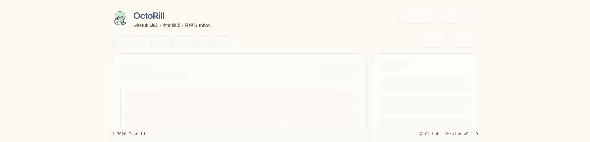
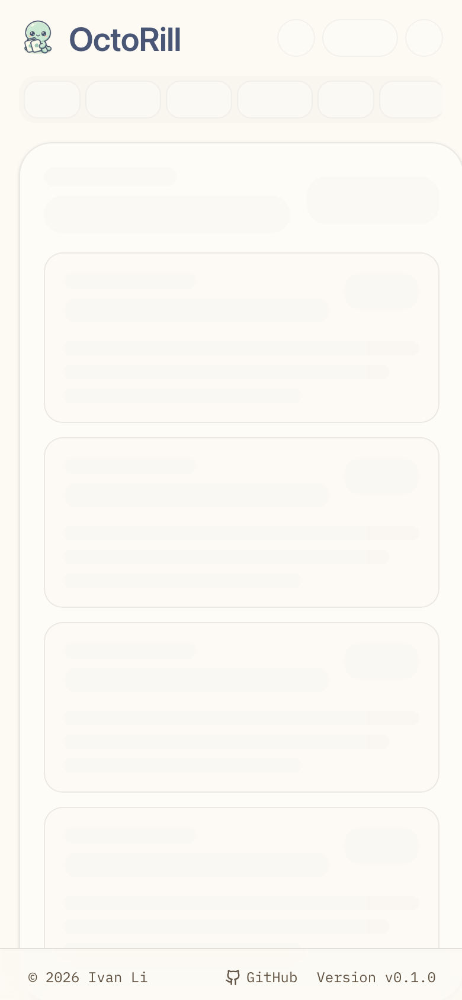

# Dashboard 启动骨架页头与 Tabs 占位收敛（#6x959）

## 背景 / 问题陈述

- 当前 `DashboardStartupSkeleton` 的首屏头部仍停留在“wordmark + login pill + 三枚带文案 tabs”的旧轮廓，和真实 Dashboard 壳层差异过大。
- 这种差异会让 warm skeleton 的品牌区看起来像另一套页面，而不是“已识别登录但数据仍在加载中的同一工作台”。
- skeleton tabs 直接显示 `动态 / 日报 / 通知` 等具体文案，也提前暴露了导航语义，不符合骨架态应使用中性占位的约束。

## 目标 / 非目标

### Goals

- 让 Dashboard warm skeleton 的首屏页头明显收敛到真实 Dashboard 壳层：桌面保留 mascot + 标题 + 固定副标题文案层级，移动端则切回真实单行 shell（隐藏副标题、品牌与右侧 actions 同行）。
- 删除 skeleton 中的用户 login pill，不再让用户身份信息长期占用品牌区。
- 把 tabs / controls 改成中性占位块，只保留结构节奏，不再显示任何具体导航文案。
- 补齐 Storybook 审阅断言与新的视觉证据，并把结果写回 spec。

### Non-goals

- 不改冷启动 `AppBoot` 的居中品牌初始化态。
- 不改真实 Dashboard `Header` / `Tabs` 的稳态文案、行为、路由或响应式策略。
- 不改 feed 主列、右侧栏或任何后端接口 / schema。

## 范围（Scope）

### In scope

- `web/src/pages/AppBoot.tsx`
- `web/src/stories/AppBoot.stories.tsx`
- `docs/specs/6x959-dashboard-startup-skeleton-header-tabs-alignment/assets/`
- `docs/specs/README.md`

### Out of scope

- `web/src/pages/DashboardHeader.tsx`
- `web/src/pages/DashboardControlBand.tsx`
- `src/**` Rust 后端与 `/api/me` 契约

## 需求（Requirements）

### MUST

- warm skeleton 页头不得再显示 `me.user.login` 或任何等价的 login pill。
- warm skeleton 左侧品牌区必须回到真实 Dashboard header 的品牌层级：桌面显示 `OctoRill` + 固定副标题文案，移动端隐藏副标题并保持单行品牌壳层。
- warm skeleton 右侧主操作区必须补成与真实页头接近的占位簇，而不是只剩单个主题切换控件。
- warm skeleton tabs / control band 只能渲染中性占位块，不得出现 `动态`、`日报`、`通知` 或其他具体 tabs 文案。
- Storybook `Pages/App Boot / Dashboard Warm Skeleton` 必须补充审阅断言，明确校验“无 login pill、无具体 tabs 文案、无登录 CTA”。
- 视觉证据必须重新生成并写回本 spec，证明新的 warm skeleton 已向真实 Dashboard 壳层收敛。

### SHOULD

- control band 的占位宽度节奏应尽量贴近真实 `DashboardTabsList` 与右侧次级 controls 的桌面布局。
- 视觉证据优先使用稳定 Storybook 画面，而不是临时浏览器截图。

### COULD

- 无。

## 功能与行为规格（Functional/Behavior Spec）

### Core flows

- 当用户已识别为登录态、但当前 Dashboard 路由还没有可复用热缓存时，页面继续显示 Dashboard layout skeleton。
- skeleton 页头左侧保留真实品牌识别层级：桌面显示 mascot、`OctoRill` 标题与固定副标题文案；移动端隐藏副标题并收成单行品牌壳层，不再包含用户身份 pill。
- skeleton 页头右侧显示一组中性动作占位，对齐真实页头的主题切换 / 主按钮 / 头像入口节奏，但不暴露真实操作文案。
- skeleton control band 继续提示“这里是 Dashboard 主导航区域”，但通过无文案占位块表达，而不是提前显示具体 tabs 名称。

### Edge cases / errors

- 无论 `/api/me` 何时完成，warm skeleton 都不得退化成 Landing 登录卡或出现 `连接到 GitHub` CTA。
- 本次收敛只作用于 warm skeleton；真实 Dashboard 稳态页头与 tabs 的可见文案完全保持不变。

## 验收标准（Acceptance Criteria）

- Given 已识别登录但 Dashboard 没有匹配热缓存
  When 页面渲染 `DashboardStartupSkeleton`
  Then 左上品牌区不再出现 login pill，且整体轮廓接近真实 Dashboard header。

- Given 进入 `Pages/App Boot / Dashboard Warm Skeleton`
  When 检查顶部 control band
  Then 仍可识别为主导航占位，但不存在 `动态`、`日报`、`通知` 等具体 tabs 文案。

- Given Storybook play 断言执行
  When 校验 warm skeleton
  Then 继续保证 `连接到 GitHub` CTA 为 0，并额外保证没有 login pill 与具体 tabs 文案。

- Given 更新后的视觉证据
  When 对照桌面与移动端 warm skeleton
  Then 可以直接看出“桌面品牌文案回归真实页头、移动端回到单行 shell、tabs 仍保持去语义化”。

## 实现前置条件（Definition of Ready / Preconditions）

- 当前真实 Dashboard header / tabs 桌面结构继续以 `DashboardHeader` + `DashboardTabsList` 为真相源。
- 本轮不修改真实 Dashboard 稳态组件，只允许在 skeleton 内部收敛轮廓。
- Storybook 已可用且支持 autodocs / canvas 审阅。

## 非功能性验收 / 质量门槛（Quality Gates）

### Testing

- `cd web && bun run lint`
- `cd web && bun run build`
- `cd web && bun run storybook:build`
- `cd web && bun run e2e -- app-auth-boot.spec.ts`

### UI / Storybook (if applicable)

- Stories to add/update: `web/src/stories/AppBoot.stories.tsx`（含移动端 shell 审阅入口）
- Docs pages / state galleries to add/update: `Pages/App Boot` autodocs
- `play` / interaction coverage to add/update: `Dashboard Warm Skeleton` 对“无 login pill / 无具体 tabs 文案 / 无登录 CTA”的断言；`Dashboard Warm Skeleton / Mobile shell` 对“副标题隐藏 / 单行 header / mobile actions 可见”的断言
- Visual regression baseline changes (if any): `docs/specs/6x959-dashboard-startup-skeleton-header-tabs-alignment/assets/dashboard-warm-skeleton-top-shell.png`, `docs/specs/6x959-dashboard-startup-skeleton-header-tabs-alignment/assets/dashboard-warm-skeleton-mobile-shell.png`

### Quality checks

- Lint / typecheck / formatting: `cd web && bun run lint && bun run build`
- Storybook: `cd web && bun run storybook:build`
- E2E: `cd web && bun run e2e -- app-auth-boot.spec.ts`

## Visual Evidence

- 证据绑定：本地 `HEAD`（2026-04-16）
- 证据源：Storybook stable canvas（`Pages/App Boot / Dashboard Warm Skeleton`）

- 证明点：桌面左侧品牌区已回到 mascot + `OctoRill` + 固定副标题文案层级，login pill 已移除；移动端已切回单行 shell，副标题隐藏，右侧改为 compact actions；顶部 tabs / controls 只保留中性占位块，不再显示具体 tabs 文案。

## 方案概述（Approach, high-level）

- 仅调整 `DashboardBootHeader`，让 warm skeleton 的左侧品牌层级借用真实 Dashboard header 的视觉语言，但继续保留 skeleton 语义。
- 顶部动作区与 control band 统一改成中性 pulse blocks，用结构占位替代真实文案。
- Storybook 断言与视觉证据同步更新，避免未来再次回归到“骨架态泄露真实 tabs 文案”或“移动端 header 结构失真”的状态。

## 风险 / 开放问题 / 假设（Risks, Open Questions, Assumptions）

- 风险：如果后续又往 warm skeleton 顶部塞入真实文案或身份信息，仍可能再次偏离真实 Dashboard 壳层。
- 需要决策的问题：None。
- 假设（需主人确认）：真实 Dashboard header 的桌面轮廓在本轮内保持稳定，不需要同步改动稳态组件。

## 参考（References）

- `docs/specs/y9qpf-tanstack-router-auth-boot-no-login-flicker/SPEC.md`
- `docs/specs/76bxs-dashboard-header-brand-layout/SPEC.md`
- `web/src/pages/DashboardHeader.tsx`
- `web/src/pages/DashboardControlBand.tsx`
