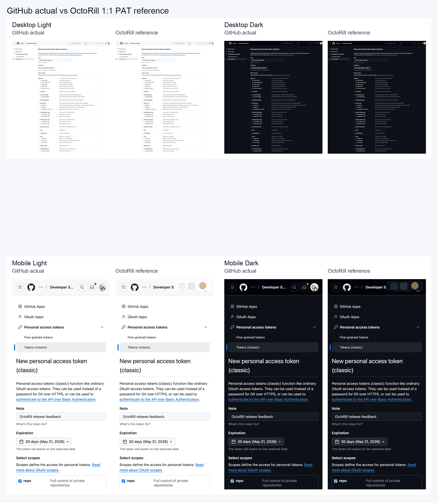
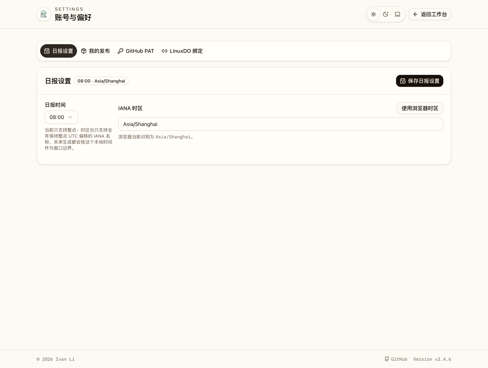

# GitHub PAT 1:1 参考界面（#6xaku）

## 状态

- Status: 已完成
- Created: 2026-04-20
- Last: 2026-04-21

## 背景 / 问题陈述

- `/settings?section=github-pat` 需要一个用户能直接照抄的 GitHub classic PAT 参考界面。
- 用户拒绝教程卡式自创结构、额外解释块、伪权限说明和任何不属于 GitHub 真页的辅助元素。
- 参考界面不仅要单独验收，还要真实嵌回 OctoRill 设置页，并在移动端保持稳定、不变形、低噪声。

## 目标 / 非目标

### Goals

- 保留现有 GitHub PAT 输入、800ms 防抖校验、状态提示、masked token 与保存能力。
- 提供 GitHub classic PAT 创建页的 1:1 DOM 参考界面，覆盖 desktop/mobile × light/dark 四个变体。
- 在设置页里把参考界面作为可照抄区域嵌入，并让移动端 section 导航可切换四个设置分区。
- 把移动端设置页外层 section 统一收成非卡片壳，减少噪声并节约空间。
- 提供 Storybook 入口、交互切换 story、E2E 断言与视觉证据。

### Non-goals

- 不修改 `/api/reaction-token/*` 接口与后端校验逻辑。
- 不自动创建、提交或修改 GitHub PAT。
- 不在参考界面中加入 GitHub 真页不存在的说明块、箭头、权限摘要或额外中文提示。

## 范围（Scope）

### In scope

- `/Users/ivan/.codex/worktrees/49f3/octo-rill/web/src/pages/Settings.tsx`
- `/Users/ivan/.codex/worktrees/49f3/octo-rill/web/src/settings/GitHubPatGuideCard.tsx`
- `/Users/ivan/.codex/worktrees/49f3/octo-rill/web/src/stories/Settings.stories.tsx`
- `/Users/ivan/.codex/worktrees/49f3/octo-rill/web/src/stories/GitHubPatGuideCard.stories.tsx`
- `/Users/ivan/.codex/worktrees/49f3/octo-rill/web/e2e/settings.spec.ts`
- `/Users/ivan/.codex/worktrees/49f3/octo-rill/docs/specs/6xaku-github-pat-inline-guide-mock/SPEC.md`
- `/Users/ivan/.codex/worktrees/49f3/octo-rill/docs/specs/6xaku-github-pat-inline-guide-mock/assets/*`

### Out of scope

- `/Users/ivan/.codex/worktrees/49f3/octo-rill/src/**`
- GitHub PAT 权限策略、数据库、migration、环境变量变更
- 任何会在 GitHub 上创建或修改 PAT 的自动化操作

## 需求（Requirements）

### MUST

- `GitHub PAT` section 继续保留真实输入框、自动校验、状态 badge、masked token、最近检查与“仅 valid 才允许保存”的语义。
- `GitHubPatGuideCard` 必须使用真实 DOM 复刻 GitHub classic PAT 创建页，而不是静态截图回放。
- 参考界面默认预填主人要求的建议值：
  - `Note = OctoRill release feedback`
  - `Expiration = No expiration`
  - `repo` 已勾选
- Storybook 必须提供四个独立 PAT 参考 story：desktop light、desktop dark、mobile light、mobile dark。
- Storybook 必须额外提供一个可在设置页里切换四个 section 的交互式 story。
- 移动端设置页的四个 section 导航必须稳定呈现 2×2 布局，并能在 story 内直接切换内容。
- 移动端设置页的 section 内容区不得继续使用外层大卡片壳。
- 参考界面在移动端必须保持最小宽度，空间不足时横向滚动，而不是继续挤压变形。

### SHOULD

- 移动端嵌入版在保持 GitHub 页面骨架的同时降低噪声，例如将长介绍替换成中性单行色块。
- 设置页与独立参考 story 的视觉行为应一致：主题切换切换主题，窄视口切换移动版骨架。

## 功能与行为规格（Functional / Behavior Spec）

### Core flows

- 用户打开 `/settings?section=github-pat` 后，先看到真实 PAT 输入区，再看到 GitHub classic PAT 参考界面。
- 用户在设置页中可直接照着参考界面抄写 `Note`、`Expiration` 和 `repo` 勾选状态，然后把 PAT 粘贴回真实输入框。
- 用户在移动端查看设置页时，顶部四个 section 导航以 2×2 布局出现，并在同一 story 内切换 `日报设置 / 我的发布 / GitHub PAT / LinuxDO 绑定`。
- 用户在移动端查看时，`GitHub PAT`、`我的发布`、`日报设置`、`LinuxDO 绑定` 的 section 内容区都不再有外层卡片壳，只保留必要分隔。

### Edge cases / errors

- 参考界面只负责展示 GitHub 真页结构，不承担任何 PAT 校验或保存逻辑。
- 容器宽度小于移动参考界面最小宽度时，只允许横向滚动，不允许继续压缩 DOM。
- 交互式 story 切换 section 时不得真的离开 Storybook 页面，只更新 story 内部状态。

## 验收标准（Acceptance Criteria）

- Given 用户访问 `/settings?section=github-pat`
  When 页面渲染完成
  Then 同一屏内能同时看到真实 PAT 输入区与 GitHub classic PAT 参考界面。

- Given 用户打开 GitHub PAT 独立 story
  When 切换 light/dark 与 desktop/mobile
  Then 四个变体都能显示正确主题和正确骨架。

- Given 用户打开 `Switchable Sections` story
  When 点击四个顶部导航项
  Then 不离开 story，即可切换到对应 section 内容。

- Given 用户在移动端查看 `Switchable Sections` story
  When 切到 `日报设置`、`GitHub PAT`、`LinuxDO 绑定` 或 `我的发布`
  Then section 内容不应继续包裹在外层卡片壳中。

- Given 用户在移动端查看 `GitHub PAT` section
  When 可用宽度小于参考界面最小宽度
  Then 参考界面横向滚动，而不是被压坏。

## 质量门槛（Quality Gates）

- `cd /Users/ivan/.codex/worktrees/49f3/octo-rill/web && bun run lint`
- `cd /Users/ivan/.codex/worktrees/49f3/octo-rill/web && bun run build`
- `cd /Users/ivan/.codex/worktrees/49f3/octo-rill/web && bun run storybook:build`
- `cd /Users/ivan/.codex/worktrees/49f3/octo-rill/web && bunx playwright test e2e/settings.spec.ts --project=chromium`

## Visual Evidence

PR: include
GitHub 实际界面 vs OctoRill 参考界面对比（desktop/mobile × light/dark）

设置页内嵌版的移动端最终形态（可切换 section story）

## 实现概述

- `GitHubPatGuideCard` 使用 DOM 复刻 GitHub classic PAT 页面骨架，并按主题与断点切换 desktop/mobile × light/dark 四个变体。
- 设置页保留真实 PAT 编辑能力，只把参考界面作为嵌入式抄写区域；移动端嵌入版允许横向滚动并降低说明噪声。
- `Settings.stories.tsx` 新增可切换 section 的 story，并在 story 内拦截导航跳转、改为本地状态切换。
- 移动端设置页导航拆成独立 2×2 网格渲染，避免桌面按钮变体导致选中态与布局失真。
- 移动端 `GitHub PAT`、`日报设置`、`我的发布`、`LinuxDO 绑定` 的外层 section 卡片壳统一抹平，保留导航和内容之间的明确分隔。

## 参考（References）

- https://github.com/settings/tokens/new
- https://github.com/settings/tokens
- /Users/ivan/.codex/worktrees/49f3/octo-rill/web/src/pages/Settings.tsx
- /Users/ivan/.codex/worktrees/49f3/octo-rill/web/src/settings/GitHubPatGuideCard.tsx
- /Users/ivan/.codex/worktrees/49f3/octo-rill/web/src/stories/Settings.stories.tsx
- /Users/ivan/.codex/worktrees/49f3/octo-rill/web/src/stories/GitHubPatGuideCard.stories.tsx
