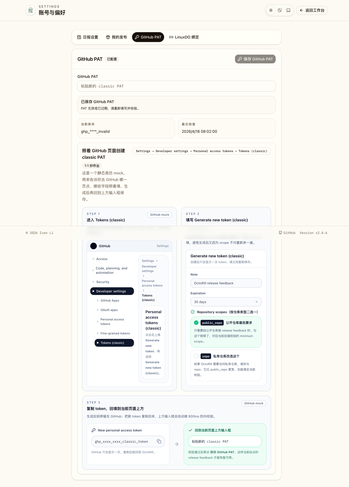

# GitHub PAT 内嵌高仿配置 Mock（#6xaku）

## 状态

- Status: 已完成
- Created: 2026-04-20
- Last: 2026-04-20

## 背景 / 问题陈述

- 当前 `/settings?section=github-pat` 仅在底部给出一行 `Settings → Developer settings → Personal access tokens → Tokens (classic)` 文本，不足以让用户 1:1 跟着 GitHub 界面照抄。
- OctoRill 的 PAT 校验与保存逻辑已经完整可用，但“去 GitHub 哪一页点、哪几个字段怎么填、scope 应该勾哪个”仍需要用户自行脑补，学习成本偏高。
- 产品目标不是跳转远程 GitHub DOM 做真嵌入，而是在当前设置页中提供一个稳定、静态、可控的 GitHub 风格 mock 教程卡，让用户不用离开页面也能照着完成 classic PAT 创建。

## 目标 / 非目标

### Goals

- 在 `GitHub PAT` section 中保留真实 PAT 输入、校验、保存能力。
- 把底部简短提示升级为内嵌式 GitHub 风格教程卡，固定为 3 步：进入路径、填写 classic token 表单、复制 token 回填 OctoRill。
- 让教程卡显式展示 GitHub 官方文案与关键标签：`Developer settings`、`Personal access tokens`、`Tokens (classic)`、`Generate new token (classic)`、`Note`、`Expiration`。
- 将 scope 指引与现有后端校验对齐：公开仓库至少 `public_repo`，私有仓库改选 `repo`。
- 补齐 Storybook 与定向 E2E，确保教程卡成为稳定视觉证据来源。

### Non-goals

- 不修改 `/api/reaction-token/*` 的接口与后端校验语义。
- 不嵌入真实 GitHub 页面，不依赖远程 iframe / DOM 抓取。
- 不改 LinuxDO / 我的发布 / 日报设置 section。
- 不追求移动端对 GitHub 设置页逐像素复刻；本轮只要求桌面端高仿、移动端信息完整可读。

## 范围（Scope）

### In scope

- `/Users/ivan/.codex/worktrees/49f3/octo-rill/web/src/pages/Settings.tsx`
- `/Users/ivan/.codex/worktrees/49f3/octo-rill/web/src/settings/GitHubPatGuideCard.tsx`
- `/Users/ivan/.codex/worktrees/49f3/octo-rill/web/src/stories/Settings.stories.tsx`
- `/Users/ivan/.codex/worktrees/49f3/octo-rill/web/e2e/settings.spec.ts`
- `/Users/ivan/.codex/worktrees/49f3/octo-rill/docs/specs/6xaku-github-pat-inline-guide-mock/SPEC.md`
- `/Users/ivan/.codex/worktrees/49f3/octo-rill/docs/specs/README.md`

### Out of scope

- `/Users/ivan/.codex/worktrees/49f3/octo-rill/src/**`
- 任意 GitHub OAuth / PAT 权限扩展、数据库、migration 或环境变量变更
- 真实 GitHub 页面截图、远程抓图或浏览器自动登录 GitHub 的产品方案

## 需求（Requirements）

### MUST

- `GitHub PAT` section 继续保留真实输入框、800ms 防抖校验、masked token、最近检查与“仅 valid 才允许保存”的现有语义。
- 教程卡必须内嵌在当前 settings 页面，用户无需跳离 OctoRill 即可照着完成 classic PAT 创建流程。
- 教程卡固定呈现 3 个顺序步骤，并用 GitHub 风格静态 mock 展示：
  1. `Settings → Developer settings → Personal access tokens → Tokens (classic)`
  2. `Generate new token (classic)` 表单中的 `Note`、`Expiration`、scope 区块
  3. 复制 `ghp_` token 并回填当前页面上方输入框
- scope 指引必须与当前后端门禁一致：公开仓库提示 `public_repo`；需要私有仓库能力时提示改选 `repo`。
- Storybook 的 `Settings` 场景必须新增或更新为可稳定验证该教程卡的入口。
- 定向 E2E 必须覆盖 `/settings?section=github-pat` 深链下教程卡存在且关键标签可见。

### SHOULD

- 教程卡整体视觉应明显接近 GitHub 设置页的信息架构与灰阶语义，但保持 OctoRill 当前视觉系统的可读性。
- 说明文案以中文解释为主，关键 GitHub 标签保留英文，方便用户真实对照 GitHub 页面。
- 教程卡的布局应优先优化桌面端阅读，移动端退化为纵向单列仍能顺序完成步骤。

### COULD

- 无。

## 功能与行为规格（Functional / Behavior Spec）

### Core flows

- 用户打开 `/settings?section=github-pat` 后，页面先展示现有 PAT 输入与状态区，再在下方看到 GitHub 风格教程卡。
- 用户按教程卡 Step 1 在 GitHub 中依次点击 `Settings`、`Developer settings`、`Personal access tokens`、`Tokens (classic)`。
- 用户按 Step 2 参考 mock 表单填写 `Note`、选择 `Expiration`，并根据仓库类型勾选 `public_repo` 或 `repo`。
- 用户生成 token 后，按 Step 3 把 `ghp_...` token 复制回当前页面上方的 `GitHub PAT` 输入框，等待 OctoRill 自动校验并保存。

### Edge cases / errors

- 若当前保存的 token 无效或已过期，原有错误态与 badge 行为保持不变；教程卡只负责引导，不替代校验结果。
- 若用户只需要公开仓库权限，不应被教程卡误导去勾选更宽的 `repo`；但需要私有仓库时必须明确提示改选 `repo`。
- 教程卡不得与真实输入框共享状态，不得因为用户输入变化而闪烁或重排。

## 验收标准（Acceptance Criteria）

- Given 用户访问 `/settings?section=github-pat`
  When 页面渲染完成
  Then 同一屏内能同时看到真实 PAT 输入区与 GitHub 风格教程卡。

- Given 用户阅读教程卡 Step 1
  When 按图索骥进入 GitHub 设置页
  Then 能看到 `Developer settings`、`Personal access tokens` 与 `Tokens (classic)` 的路径提示。

- Given 用户阅读教程卡 Step 2
  When 对照填写 classic PAT 表单
  Then 能看到 `Generate new token (classic)`、`Note`、`Expiration` 以及 `public_repo` / `repo` 的 scope 指引。

- Given 用户生成了 `ghp_` token
  When 阅读教程卡 Step 3
  Then 能明确知道要把 token 复制回当前页面上方输入框，而不是继续停留在 GitHub 页面。

- Given Storybook 与 Playwright 回归均运行
  When 检查 `github-pat` 场景
  Then 两者都能稳定断言教程卡关键标签存在，且原有 PAT 输入/状态信息仍可见。

## 实现前置条件（Definition of Ready / Preconditions）

- 仓库已具备 `SettingsPage`、`Settings.stories.tsx` 与 `/settings?section=github-pat` 深链。
- Storybook 已启用 docs/autodocs 能力，并可作为 Web UI 的稳定视觉证据源。
- 后端已固定 classic PAT scope 校验规则：`public_repo (public)` 或 `repo (private)`。

## 非功能性验收 / 质量门槛（Quality Gates）

### Testing

- `cd /Users/ivan/.codex/worktrees/49f3/octo-rill/web && npm run lint`
- `cd /Users/ivan/.codex/worktrees/49f3/octo-rill/web && npm run build`
- `cd /Users/ivan/.codex/worktrees/49f3/octo-rill/web && npm run storybook:build`
- `cd /Users/ivan/.codex/worktrees/49f3/octo-rill/web && npm run e2e -- settings.spec.ts`
- `codex -m gpt-5.4 -c model_reasoning_effort="low" --sandbox read-only -a never review --base origin/main`

### UI / Storybook (if applicable)

- `Settings` Storybook 场景必须显式展示 GitHub PAT guide mock。
- `play` 断言必须覆盖教程卡关键标签与原有输入区并存。
- 视觉证据优先来自 Storybook docs/canvas，而不是临时浏览器截图。

## 文档更新（Docs to Update）

- `/Users/ivan/.codex/worktrees/49f3/octo-rill/docs/specs/6xaku-github-pat-inline-guide-mock/SPEC.md`
- `/Users/ivan/.codex/worktrees/49f3/octo-rill/docs/specs/README.md`

## Visual Evidence

PR: include
设置页 GitHub PAT section 内嵌高仿 GitHub classic PAT 教程卡

## 实现里程碑（Milestones / Delivery checklist）

- [x] M1: 新建独立 spec，冻结教程卡的信息架构、scope 真相源与视觉证据要求。
- [x] M2: Settings 页改为“真实 PAT 表单 + GitHub 风格静态教程卡”双区块布局。
- [x] M3: 更新 Storybook 与定向 E2E，固定 `github-pat` 深链的可见性断言。
- [x] M4: 产出视觉证据并将其落盘到 spec assets。

## 方案概述（Approach, high-level）

- 新增独立 `GitHubPatGuideCard` 展示组件，以 GitHub 设置页的信息架构为骨架，用静态 mock 还原导航、表单与 token 回填步骤。
- `SettingsPage` 保持现有 PAT 输入与保存逻辑不动，只把原 `details` 简短提示替换为新的教程卡组件。
- Storybook 继续复用现有 `SettingsPage` mock fetch 方案，在 `github-pat` 深链故事里直接断言教程卡关键标签。
- Playwright 复用现有 `/settings` mock API，扩展 `github-pat` 深链用例以覆盖教程卡存在性与关键 scope 指引。

## 风险 / 开放问题 / 假设（Risks, Open Questions, Assumptions）

- 风险：GitHub 官方设置页未来若调整文案或导航层级，教程卡文案需要跟着更新。
- 风险：若后端未来进一步细分 scope 要求，前端教程卡必须同步更新以避免指引漂移。
- 开放问题：无。
- 假设：当前 classic PAT 校验语义继续保持 `public_repo` 或 `repo` 二选一即可通过。

## 参考（References）

- https://docs.github.com/en/authentication/keeping-your-account-and-data-secure/managing-your-personal-access-tokens
- `/Users/ivan/.codex/worktrees/49f3/octo-rill/docs/specs/y9ngx-linuxdo-user-settings/SPEC.md`
- `/Users/ivan/.codex/worktrees/49f3/octo-rill/src/api.rs`
- `/Users/ivan/.codex/worktrees/49f3/octo-rill/web/src/pages/Settings.tsx`
