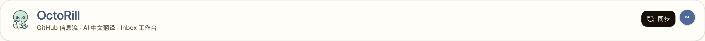
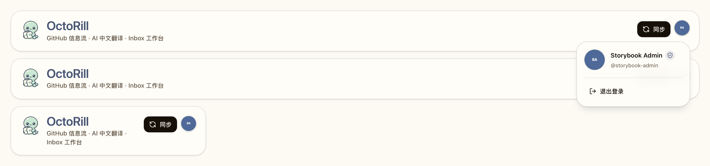
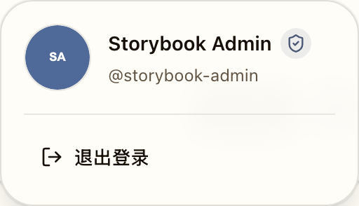

# Dashboard 页头品牌优先重设计（#76bxs）

## 状态

- Status: 已完成
- Created: 2026-04-10
- Last: 2026-04-10

## 背景 / 问题陈述

- 当前 Dashboard 页头把 `Loaded / inbox / briefs` 统计信息和品牌字标挤在同一层，视觉重心分散，品牌露出不稳定。
- `OctoRill` 虽然已有正式 wordmark 资产，但在 Dashboard 里被压缩到很扁的标题位，实际观感接近“只看到图标，看不清产品名”。
- 页头当前缺少一个明确的“品牌优先 + 账号次级 + 操作独立”的层次，导致顶部区域既不像品牌横幅，也不像清晰的工作台导航。

## 目标 / 非目标

### Goals

- 重做 Dashboard 页头为品牌优先双层布局，让 `OctoRill` wordmark 成为第一视觉焦点。
- 去掉页头中的 `Loaded / inbox / briefs` 统计文案，不再用数字占据品牌位。
- 保留现有 `同步` / `Logout` 行为与 busy 语义，只重排层级、间距与响应式换行。
- 为 Dashboard header 补齐稳定 Storybook 审阅入口，并把视觉证据写回 spec。

### Non-goals

- 不改动 Dashboard tabs、侧栏卡片、正文卡片或后台 API。
- 不改动 AdminHeader、Landing hero 或品牌资产本身。
- 不调整同步顺序、OAuth/PAT、URL 契约或任何后端数据结构。

## 范围（Scope）

### In scope

- `web/src/pages/DashboardHeader.tsx`
- `web/src/pages/Dashboard.tsx`
- `web/src/stories/DashboardHeader.stories.tsx`
- `web/src/stories/Dashboard.stories.tsx`
- `web/src/stories/BrandLogo.stories.tsx`
- `web/e2e/dashboard-access-sync.spec.ts`
- `docs/specs/README.md`

### Out of scope

- `src/**` Rust 后端
- Admin / Landing 页面布局
- 任何品牌 SVG、favicon 或 docs-site 导航

## 需求（Requirements）

### MUST

- Dashboard 页头必须显示完整 `OctoRill` wordmark，且不再出现 `Loaded {n} · {n} inbox · {n} briefs`。
- 品牌位必须包含产品定位文案：`GitHub 信息流 · AI 中文翻译 · Inbox 工作台`。
- 账号信息仍需保留 `login`、`Admin` 身份与 `AI 未配置` 提示，但默认收进右侧头像入口的浮层里，层级必须低于品牌位。
- `Admin` 身份必须以紧凑图标标记呈现，不得再单独占用一整行 badge。
- 右侧主操作区只保留 `同步` 与头像入口，不新增额外主按钮；`退出登录` 收进头像浮层。
- 中等/窄宽度下页头允许自然换行，但不得再次挤压到“产品名不可读”。
- Storybook 必须提供稳定的 Dashboard header 审阅面，并补齐至少一条校验“品牌可见 + 统计消失”的回归断言。

### SHOULD

- Dashboard 默认故事与 Playwright smoke 同步断言新的品牌层级，避免未来回归到“品牌旁边堆统计”。
- Brand gallery 中的 Dashboard header 展示面应同步刷新，便于统一品牌审阅。

### COULD

- 无。

## 功能与行为规格（Functional/Behavior Spec）

### Core flows

- Dashboard 页头左侧改为两层：第一层只放 `OctoRill` wordmark 与产品定位；账号细节不再长期占用品牌区。
- 右侧操作区仅保留 `同步` 主按钮与头像入口，与左侧品牌块分栏排列；窄屏时操作区下折但不再侵占品牌字标高度。
- 头像在 hover / click 时打开账号浮层，展示头像、显示名、`@login`、可选邮箱、`Admin` 图标标记、可选 `AI 未配置` 提示，以及 `退出登录` 动作。
- Dashboard 实际页面、Dashboard Storybook 与 Brand gallery 里的 header 展示面使用同一组件结果。

### Edge cases / errors

- `Generate brief` 等非全量同步 busy 状态不改变页头文案，只保留既有按钮禁用/旋转语义。
- `aiDisabledHint=true` 时，仅在头像浮层的账号信息层追加提示，不得上移到品牌主行。
- 没有统计信息后，页头不再依赖 feed / inbox / brief 数量 props。

## 接口契约（Interfaces & Contracts）

### 接口清单（Inventory）

| 接口（Name） | 类型（Kind） | 范围（Scope） | 变更（Change） | 契约文档（Contract Doc） | 负责人（Owner） | 使用方（Consumers） | 备注（Notes） |
| --- | --- | --- | --- | --- | --- | --- | --- |
| `DashboardHeaderProps` | React props | internal | Modify | None | web | Dashboard / Storybook / Brand gallery | 删除 count props，仅保留品牌/身份/操作相关输入 |

### 契约文档（按 Kind 拆分）

- None

## 验收标准（Acceptance Criteria）

- Given Dashboard 默认态
  When 页面加载完成
  Then 顶部能清晰看到完整 `OctoRill` 字标与产品定位，且不存在 `Loaded / inbox / briefs` 统计文案。

- Given 用户是管理员且当前登录成功
  When 页头渲染
  Then 右侧只显示头像入口；打开头像浮层后可看到 `@login`、可选邮箱与 `Admin` 图标标记，不与主品牌同行抢占视觉焦点。

- Given 用户需要退出登录
  When 打开头像浮层
  Then `退出登录` 仅作为低频动作出现在浮层内，不再单独占用页头主操作位。

- Given 用户触发全量同步
  When 顶部 `同步` 进入 busy 状态
  Then 按钮仍位于右侧主操作区，禁用且 icon 旋转，但左侧品牌位不抖动、不换成统计信息。

- Given Storybook 与 Playwright smoke 执行
  When 检查 Dashboard header
  Then 至少覆盖“OctoRill 品牌可见”与“Loaded 统计已移除”两类断言。

## 实现前置条件（Definition of Ready / Preconditions）

- 品牌文案固定沿用现有 `GitHub 信息流 · AI 中文翻译 · Inbox 工作台`。
- 本轮仅调整 Dashboard 页头，不扩展到其他页面或品牌资产重绘。
- Storybook 已可用且支持 docs/autodocs。

## 非功能性验收 / 质量门槛（Quality Gates）

### Testing

- `cd web && bun run build`
- `cd web && bun run storybook:build`
- `cd web && bun run e2e -- dashboard-access-sync.spec.ts`

### UI / Storybook (if applicable)

- Stories to add/update: `web/src/stories/DashboardHeader.stories.tsx`、`web/src/stories/Dashboard.stories.tsx`、`web/src/stories/BrandLogo.stories.tsx`
- Docs pages / state galleries to add/update: Dashboard header autodocs + state gallery
- `play` / interaction coverage to add/update: Dashboard header 默认/同步态断言、Dashboard 默认态 smoke 断言
- Visual regression baseline changes (if any): 本 spec 的 `## Visual Evidence`

### Quality checks

- Lint / typecheck / formatting: `cd web && bun run build`
- Storybook: `cd web && bun run storybook:build`
- E2E: `cd web && bun run e2e -- dashboard-access-sync.spec.ts`

## 文档更新（Docs to Update）

- `docs/specs/README.md`: 新增本 spec，并在完成后补充 PR 备注。
- `docs/specs/76bxs-dashboard-header-brand-layout/SPEC.md`: 同步最终状态、视觉证据与交付结论。

## 计划资产（Plan assets）

- Directory: `docs/specs/76bxs-dashboard-header-brand-layout/assets/`
- In-plan references: ``
- Visual evidence source: maintain `## Visual Evidence` in this spec

## Visual Evidence

- Dashboard 页头默认态已改为品牌优先布局：完整 `OctoRill` wordmark 位于左侧，右侧只保留 `同步` 与头像入口，顶部统计信息不再出现。

- 同一组 Storybook gallery 覆盖默认态、`AI 未配置`、紧凑宽度换行，以及头像浮层展开后的最终布局，用于确认品牌位不会再被统计或低频账号动作挤压。

- 账号浮层近景：`Admin` 已收敛为名字旁的紧凑图标标记，`退出登录` 作为低频动作保留在浮层内。

## 资产晋升（Asset promotion）

- None

## 实现里程碑（Milestones / Delivery checklist）

- [x] M1: DashboardHeader 改为品牌优先双层布局，并移除顶部统计信息 props / 文案。
- [x] M2: Storybook 审阅面、Dashboard smoke 与 Brand gallery 同步更新。
- [x] M3: 视觉证据与本地验证完成，页头账号入口收敛到头像浮层。

## 方案概述（Approach, high-level）

- 通过收窄 `DashboardHeaderProps`，让页头不再依赖 feed/inbox/brief 数量，彻底切断“统计数字占品牌位”的来源。
- 左侧品牌块固定拆成“wordmark + subtitle”两层，右侧独立保留 `同步` 与头像入口，把低频账号信息收进浮层。
- 新增独立 `Dashboard Header` Storybook 审阅面，并在 Dashboard 默认态与 Playwright smoke 中同时断言“品牌露出 + 统计消失”；头像浮层则额外断言管理员图标与退出登录入口。

## 风险 / 开放问题 / 假设（Risks, Open Questions, Assumptions）

- 风险：若后续再往页头主行塞入额外 badge/状态提示，仍可能重新挤压品牌位，需要继续守住 props 收敛边界。
- 需要决策的问题：None。
- 假设（需主人确认）：Dashboard 页头中的产品定位副标题继续沿用 Landing / Brand story 当前文案。

## 变更记录（Change log）

- 2026-04-10: 新建规格，冻结“品牌优先双层布局 + 移除统计信息 + Storybook 视觉证据”的交付口径。
- 2026-04-10: 实现完成；已补齐 Dashboard Header Storybook 审阅面、视觉证据与前端校验，并将账号信息收敛到头像浮层。

## 参考（References）

- `docs/product.md`
- `docs/specs/96dp9-dashboard-sync-unification/SPEC.md`
- `docs/specs/tvujt-brand-generated-icon-refresh/SPEC.md`
