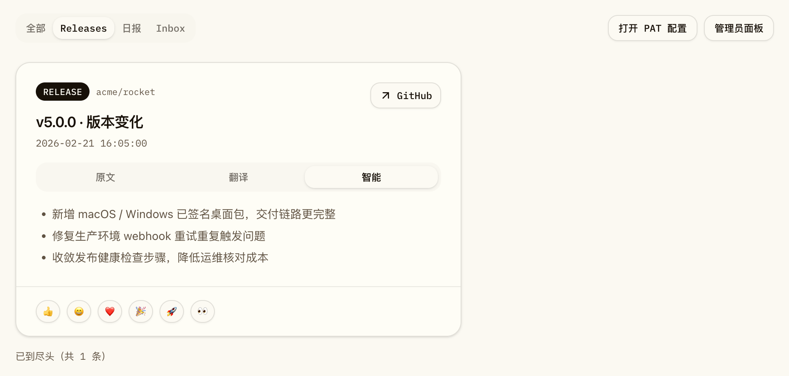
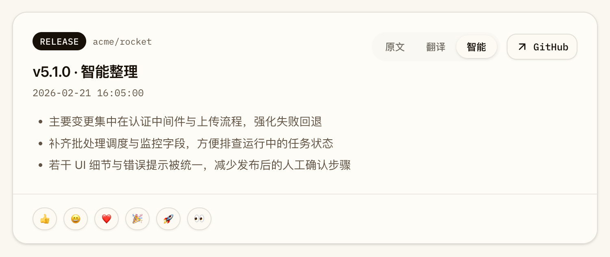
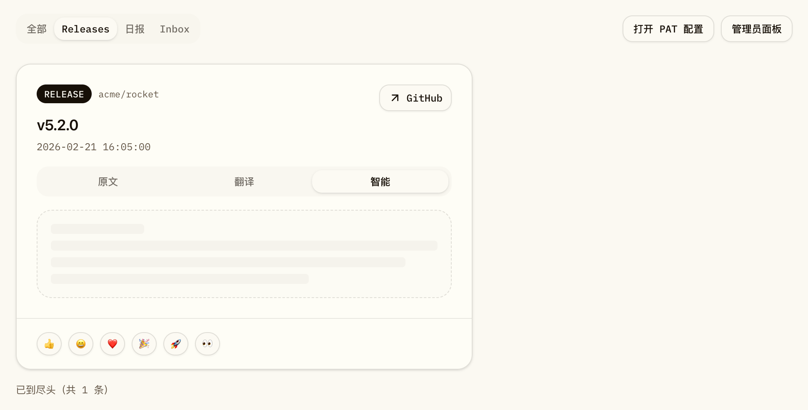
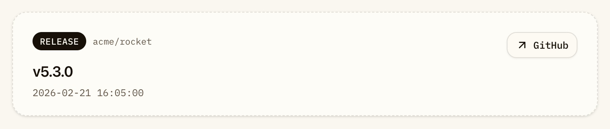

# Release Feed 三 Tabs 与智能版本变化卡片（#7f2b9）

## 状态

- Status: 已完成
- Created: 2026-04-07
- Last: 2026-04-08

## 背景 / 问题陈述

当前 Dashboard release feed 只有“原文 / 翻译”二选一，且中文内容本质上仍是直译，无法帮助用户快速理解“这个版本到底改了什么”。

对于大量 GitHub Release，正文可能为空、只有一句模板话术、或者只有链接；这类内容即使翻译出来，也不足以承担版本变化导读。我们需要把 feed 卡片升级为一个更适合快速浏览版本变化的阅读面：优先展示智能整理后的中文要点，必要时再按需分析 compare diff；若仍无法提炼出有效版本信息，则卡片收敛为仅保留版本号与元信息的折叠样式。

## 目标 / 非目标

### Goals

- Release feed 卡片改为 `原文 / 翻译 / 智能` 三 tabs。
- AI 可用时默认打开 `智能`；缺数据时进入可见区即展示呼吸态并自动生成。
- 新 release 在 sync 流程完成后，`智能` 需像 `翻译` 一样走后台预生成，优先命中缓存而不是等首次可见时才补算。
- `智能` 内容专门服务于“帮助快速理解版本变化”，输出纯要点列表，不做长段落直译。
- 智能工作流遵循：`正文有价值 -> 直接生成`，`正文无价值 -> 按需拉 compare diff`，`仍无价值 -> 折叠为仅版本号卡片`。
- 新增独立的 `release_smart` 调度/缓存语义，与现有 release 翻译缓存隔离。
- 为 UI 改动补齐 Storybook 场景、视觉证据和回归测试，并推进到 PR merge-ready。

### Non-goals

- 不扩展 Release detail 弹窗为三 tabs。
- 不为历史全量 release 做 smart 预热。
- 不重构 `ai_translations` 的全局唯一键结构。
- 不持久化完整 raw compare diff。

## 范围（Scope）

### In scope

- Dashboard release card header tabs 与卡片正文状态机。
- `release_smart` 的请求校验、缓存映射、批处理解析与 `/api/feed` smart lane。
- release body -> diff fallback -> insufficient collapse 的 LLM 工作流。
- compare diff 的按需精简 payload builder。
- 翻译 tab 的按需生成态与呼吸态。
- 仅版本号折叠卡片样式。
- 本地 SQLite 运行时稳定性修复，避免 smart/translation 后台任务把桌面预览拖进 `database is locked` 自锁状态。
- Storybook 状态覆盖、Playwright 回归、spec visual evidence。

### Out of scope

- Release detail 页面/弹窗的 smart lane。
- 历史 release 数据回填任务。
- 后台数据模型新增新的 terminal status 列举。
- 原始 GitHub diff 存档与下载能力。

## 接口契约（Interfaces & Contracts）

### `/api/feed` release item 扩展

- 现有 `translated` lane 保持兼容。
- 新增 `smart` lane：
  - `status` 允许 `ready | missing | disabled | error | insufficient`
  - `title` 为可选中文标题；为空时前端回退原始 title
  - `summary` 为 Markdown 列表
  - `auto_translate` 语义与现有 translated lane 对齐，用于前端决定是否自动排队/保留旧结果

### 翻译/生成请求语义

- 新 kind：`release_smart`
- 固定 variant：`feed_card`
- entity_type：`release_smart`
- target slots：`title_zh` + `body_md`

### Smart terminal mapping

- 底层继续使用 `missing` terminal state 表示“无有效版本信息”。
- `error_text` 使用稳定 reason code：`no_valuable_version_info`。
- `/api/feed` 把 `missing + no_valuable_version_info` 暴露为 `smart.status = insufficient`。

## 智能工作流

### 1. Body-first

- 输入：repo、release 标题/标签、规范化后的 release body。
- LLM 输出固定 JSON：

```json
{
  "valuable": true,
  "title_zh": "...",
  "summary_bullets": ["...", "..."]
}
```

- 目标：判断正文是否足以支撑“快速理解版本变化”的中文要点卡片。
- 若正文只有模板、链接、空话或无实际改动说明，则返回 `valuable=false`。

### 2. Diff fallback

- 仅在正文被判定为 `valuable=false` 时触发。
- compare base 取同仓库上一条 release tag；若无上一条 release，则直接结束为 `insufficient`。
- 程序生成精简 diff payload，包含：
  - compare range
  - commits subject 摘要
  - changed files 概览
  - 受限 patch excerpts
- 默认跳过 binary / lockfile / minified / generated 噪声文件。
- GitHub OAuth 登录默认申请 `public_repo`；对于历史旧 token 触发的 public compare scope 错误，后端需先回退匿名 compare 再决定终态，避免把可恢复的公共仓库错误直接暴露成失败卡片。
- 若 GitHub compare 拉取失败（鉴权 / 限流 / 网络 / 404），smart lane 进入 `error`，允许重试。

### 3. Collapse

- 当 body 与 diff 都无法提供有价值的版本变化说明时：
  - smart lane 状态变为 `insufficient`
  - 卡片进入仅版本号折叠样式
  - 不再渲染正文区与 tabs
  - 保留 repo / version / 时间 / GitHub 跳转
  - 若该卡片已有 reaction 数据，底部 reaction footer 仍保留

## 前端行为规格

- 默认 tab：AI 可用时优先 `智能`；AI disabled 时回退 `原文`。
- 智能 tab 缺数据：卡片进入可见区后自动展示呼吸态并排队生成。
- sync 新写入的 release：后台同时预热 `翻译` 与 `智能` 两条 lane；smart 预热除了本次新增 release，还要补覆盖当前 feed 最近一屏的未完成 smart 卡片，避免老数据长期停留在 missing。
- subscription sync 的 smart 预热必须使用“本次新增 + 最近窗口”的并集；即使某个用户本轮没有新增命中的 release，也不能跳过其 recent smart preheat。
- 若 smart cache 命中的是可重试的瞬时错误（如 `runtime_lease_expired`、`database is locked`、历史旧 token 触发的 `repo scope required; re-login via GitHub OAuth`），前端首屏预加载与后台预热都必须把它重新视作待生成，而不是把旧错误卡片直接钉死在界面上。
- 若进程曾在 translation batch 建立后、真正执行前退出，导致遗留 `translation_batches.status=queued` 与 `translation_work_items.status=batched`，调度器下一次 tick 必须优先接手旧 batch 并继续执行，而不是让卡片长期停在 `智能整理中`。
- queued batch recovery 只能接手**已经陈旧的遗留 batch**；刚创建、尚未进入执行阶段的 fresh batch 不能被第二个 scheduler tick 抢占重放。
- 本地 SQLite 运行时必须允许 feed 首屏查询、心跳与可见区智能预加载并存；不能因为连接池过小而让智能预加载长时间饥饿，看起来像“没有自动生成”。
- 翻译 / 智能 tab 缺数据：用户首次切入该 tab 时，`missing` lane 仍允许按需补算；但若 lane 已明确是 `error + auto_translate=false`，tab 切换只能展示当前终态，不能偷偷再发一次无效重试请求。
- 原文 tab 永远可立即阅读；若正文为空，仅显示无正文提示，不回退其它 lane 内容。
- 智能 ready 内容必须是纯要点列表，不得退化为原文直译。

## 验收标准（Acceptance Criteria）

- Given AI 可用且 release smart 结果缺失
  When 用户打开 release feed 且卡片进入可见区
  Then 默认进入 `智能` tab，正文区立即显示呼吸态，并自动发起 `release_smart` 请求。

- Given sync 刚写入新的 release 且 AI 可用
  When 后台预热任务入队
  Then `翻译` 与 `智能` 两条 lane 都会按同一批 release ID 预生成；用户再次打开 feed 时优先命中 ready/terminal 缓存，而不是只预热翻译。

- Given smart lane 之前落过可重试的瞬时错误
  When 用户重新打开 feed 或再次触发 sync
  Then 系统会把该卡片重新纳入智能预热/预加载，而不是继续展示陈旧错误态。

- Given feed 首次加载完成且当前页里仍有 missing 的 smart 卡片
  When 页面进入空闲态
  Then 前端会主动 prime 最近一批 smart 请求，而不是必须等主人滚动到每张卡片才开始生成。

- Given 首屏同时出现多张待整理的 release 卡片
  When 页面完成 feed 请求并自动触发智能预加载
  Then 卡片会先进入呼吸态 / `智能整理中`，随后持续回填结果；运行时不能长期卡在“还没有智能版本变化摘要”但实际上没有继续生成。

- Given 用户点击 `翻译` tab 且当前没有翻译结果
  When tab 切换完成
  Then 卡片正文区显示呼吸态，随后回填翻译结果。

- Given release 正文可直接说明版本变化
  When smart 生成完成
  Then 卡片展示 1-4 条中文要点，不拉 compare diff。

- Given release 正文没有有效内容，但 compare diff 能说明变化
  When smart 生成完成
  Then 卡片展示基于 diff digest 的中文要点。

- Given release 正文与 diff 都没有有效版本信息
  When smart 终态返回
  Then 卡片切为仅版本号折叠样式，不显示正文区。

- Given public release 之前因为旧 OAuth scope 落下 `repo scope required; re-login via GitHub OAuth` 错误
  When 用户重新打开 feed 或 sync 再次触发 smart 预热
  Then 系统会自动把它重新纳入生成，并优先尝试匿名 public compare，而不是继续展示旧错误卡片。

- Given 调度器曾在 batch 已入库、但实际执行前中断
  When 服务重启后下一个 translation scheduler tick 到来
  Then 旧的 queued batch 会被重新接手并继续执行，卡片不会永久停在 `智能整理中`。

- Given 一个 queued batch 刚被当前 worker 创建、但尚未进入执行阶段
  When 另一个 scheduler tick 紧接着运行
  Then 该 fresh queued batch 不会被当作遗留任务重复接手，避免同一批 work items 被并发重放。

- Given 某个翻译或智能 lane 已明确返回 `error + auto_translate=false`
  When 用户只是切换到对应 tab
  Then 前端不会把 tab 切换当成新的自动重试信号，也不会静默发出明知无效的请求。

- Given compare diff 拉取失败
  When smart 终态返回
  Then smart lane 为 `error`，而不是 `insufficient`。

- Given 同一 release 同时存在 translated 与 smart 结果
  When feed 刷新
  Then 两者互不覆盖，分别保持独立缓存与状态。

## 非功能性要求 / 质量门槛

- Rust：补 smart prompt/parser/diff fallback/read-model 单测。
- Web：通过 `bun run build` 与 `bun run storybook:build`。
- E2E：扩展 `web/e2e/release-detail.spec.ts` 覆盖三 tabs 与 insufficient 卡片。
- UI-affecting 变更必须补 Storybook 稳定场景，并提供视觉证据。
- 本地开发运行时不得因为单进程内多个 SQLite pool 连接相互争抢写锁而频繁出现 `database is locked`；对桌面预览场景，SQLite 访问应串行化，保证 smart 生成与后台 worker 同时开启时页面仍可稳定打开。

## 实现里程碑（Milestones / Delivery checklist）

- [x] M1: Spec 与 API/数据契约冻结。
- [x] M2: 后端 `release_smart` 调度、prompt、diff fallback 与 `/api/feed` smart lane 完成。
- [x] M3: 前端三 tabs、呼吸态、折叠卡片与 on-demand 生成完成。
- [ ] M4: Storybook / Playwright / visual evidence / PR merge-ready 收敛完成。

## Visual Evidence

- source_type: `storybook_canvas`
  story_id_or_title: `Pages/Dashboard/SmartReadyBody`
  state: `smart-ready-body`
  evidence_note: 验证默认落在“智能” tab，且正文可直接生成版本变化要点而非直译。

  

- source_type: `storybook_canvas`
  story_id_or_title: `Pages/Dashboard/SmartReadyDiff`
  state: `smart-ready-diff`
  evidence_note: 验证 release body 无价值时，智能总结回退到 diff digest，并输出适合快速理解版本变化的中文要点。

  

- source_type: `storybook_canvas`
  story_id_or_title: `Pages/Dashboard/SmartLoading`
  state: `smart-loading`
  evidence_note: 验证智能 lane 缺数据时立即进入呼吸态骨架，不在界面直接暴露内部分析流程。

  

- source_type: `storybook_canvas`
  story_id_or_title: `Pages/Dashboard/SmartInsufficient`
  state: `smart-insufficient`
  evidence_note: 验证 body 与 diff 都没有有效版本信息时，卡片收敛为仅版本号折叠样式，不再渲染 tabs 与正文区。

  
