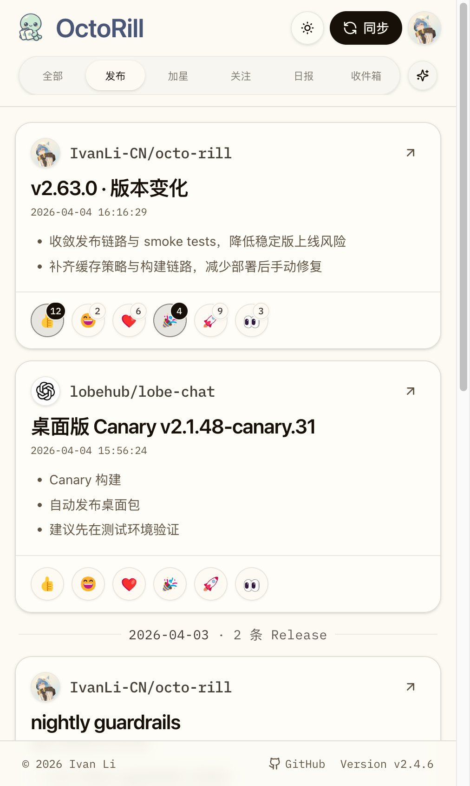
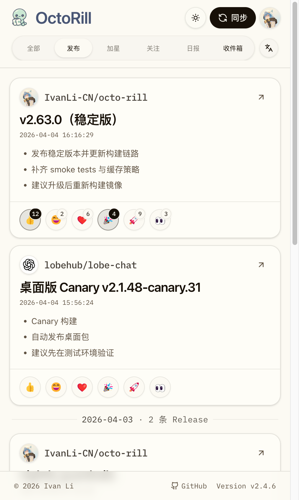

# Dashboard 移动端 release 卡片操作收敛（#7yr2m）

## 背景 / 问题陈述

当前 release feed 已经有页面级默认显示模式控制器，但移动端卡片内部仍重复显示单卡 `原文 / 翻译 / 润色` 切换器，同时 `GitHub` 打开方式还是带 label 的按钮。

这会让窄屏卡片头部过度拥挤：同一层级同时出现“页面级控制 + 单卡控制 + GitHub 按钮”，阅读节奏被打断，也与移动端壳层已经收敛出的“顶部统一控制、卡片只保留必要动作”的方向冲突。

本 follow-up 只处理移动端 release 卡片头部与操作区收敛，不回改桌面端交互语义，也不改变翻译 / 润色数据流。

## 目标 / 非目标

### Goals

- 移动端 release 卡片不再显示单卡 lane tabs，只保留顶部页面级阅读模式入口。
- 移动端 `GitHub` 打开入口改为卡片右上角的 icon-only 链接，不显示 label，不使用按钮式 CTA。
- 移动端页面级 lane 切换后，当前 release feed 卡片统一跟随页面默认 lane，不保留不可见的单卡 override 状态。
- 补齐稳定 Storybook 入口、移动端回归断言、视觉证据与 spec/index 记录。

### Non-goals

- 不改桌面端 release 卡片的 lane tabs 与 GitHub 按钮样式。
- 不改社交卡片、Inbox 卡片、Release detail 弹窗、Dashboard 顶栏以外的视觉结构。
- 不改 Rust 后端、`/api/feed`、翻译/润色调度、数据库或公开接口。

## 范围（Scope）

### In scope

- `web/src/feed/FeedItemCard.tsx`
- `web/src/pages/Dashboard.tsx`
- `web/src/stories/Dashboard.stories.tsx`
- `web/e2e/release-detail.spec.ts`
- `docs/specs/README.md`
- `docs/specs/7yr2m-dashboard-mobile-release-card-action-polish/SPEC.md`

### Out of scope

- `src/**`
- 其他 Dashboard 卡片类型
- 桌面端 release card 视觉收敛
- 新增 API / schema / type contract

## 接口契约（Interfaces & Contracts）

- 不新增或修改任何公开 API 字段。
- `FeedLane`、`FeedItem`、`/api/feed` 响应与 lane 状态机保持兼容。
- 如验证需要，仅允许新增内部 `data-*` 钩子：
  - `data-feed-mobile-github-link`

## 功能与行为规格（Functional / Behavior Spec）

### 移动端卡片头部收敛

- `<sm` 下 release 卡片头部不再显示单卡 lane tabs。
- 页面级移动端 lane menu 继续作为唯一阅读模式入口，位置保持在顶部壳层。
- `GitHub` 入口放到卡片头部右上角，使用 icon-only 链接；视觉上不出现 `GitHub` label，也不使用 outline button 容器。
- `GitHub` 链接仍保留可访问名称 `GitHub`，便于键盘与自动化测试定位。

### 移动端 lane 解析规则

- 当视口 `<sm` 时，release 卡片统一跟随页面级默认 lane。
- 已存在的 `selectedLaneByKey` 仅在 `sm+` 生效；移动端忽略单卡 override，避免隐藏控件后仍残留不可见状态。
- 当视口回到 `sm+`，桌面端继续允许单卡临时覆盖。

### Storybook / 回归

- 新增移动端 Storybook 场景，固定 `390x844` viewport。
- 该 story 需证明：
  - 卡片内无单卡 lane tabs；
  - 右上角只保留 icon-only GitHub 入口；
  - 顶部 lane menu 切到 `翻译` 后，当前卡片标题同步切换。
- Playwright 回归需覆盖同一口径，并验证移动端 GitHub 入口宽度保持紧凑。

## 验收标准（Acceptance Criteria）

- Given `390px` / `375px` 移动端 release feed
  When 卡片渲染完成
  Then 卡片内部不显示 `原文 / 翻译 / 润色` tabs，顶部页面级 lane menu 仍可见。

- Given 移动端 release 卡片头部
  When 用户查看 GitHub 打开入口
  Then 入口位于卡片右上角，表现为 icon-only 链接，而不是带 `GitHub` label 的按钮。

- Given 移动端顶部页面级 lane menu 从 `润色` 切到 `翻译`
  When 切换完成
  Then 当前 release 卡片标题与正文同步切到翻译 lane。

- Given 桌面端 release feed
  When 页面渲染完成
  Then 单卡 lane tabs 与 GitHub 按钮保持原样，不发生回归。

## 非功能性验收 / 质量门槛（Quality Gates）

### Testing

- `cd /Users/ivan/.codex/worktrees/a16c/octo-rill/web && bun run lint`
- `cd /Users/ivan/.codex/worktrees/a16c/octo-rill/web && bun run build`
- `cd /Users/ivan/.codex/worktrees/a16c/octo-rill/web && bun run storybook:build`
- `cd /Users/ivan/.codex/worktrees/a16c/octo-rill/web && bun run e2e -- release-detail.spec.ts`

### Visual verification

- 视觉证据源固定为 `storybook_canvas`。
- 必须先在聊天中回传移动端证据图，再决定是否允许把带截图的改动推进到远端。
- 证据需要绑定当前本地实现的最新 `HEAD`。

## Visual Evidence

- source_type: `storybook_canvas`
  story_id_or_title: `Pages/Dashboard/MobileReleaseCardActionPolish`
  state: `mobile-release-card-action-polish-default`
  evidence_note: 验证移动端 release 卡片已去掉单卡 lane tabs，顶部只保留页面级阅读模式入口，同时 GitHub 打开入口收敛到卡片右上角的 icon-only 链接。
  PR: include
  image:
  

- source_type: `storybook_canvas`
  story_id_or_title: `Pages/Dashboard/MobileReleaseCardActionPolish`
  state: `mobile-release-card-action-polish-translated`
  evidence_note: 验证移动端顶部页面级 lane menu 切到 `翻译` 后，release 卡片会统一切换到翻译标题与正文。
  PR: include
  image:
  

## 风险 / 假设

- 风险：移动端移除单卡 lane tabs 后，个别用户会失去“只改当前卡片”的快捷入口；本轮明确以页面级统一控制优先。
- 风险：GitHub 入口改成纯图标后，辨识度更多依赖位置与外链箭头形态；因此保留可访问名称与 hover/focus 态。
- 假设：移动端验收以 `<sm`（主口径 `390px`，兼顾 `375px`）为准。
