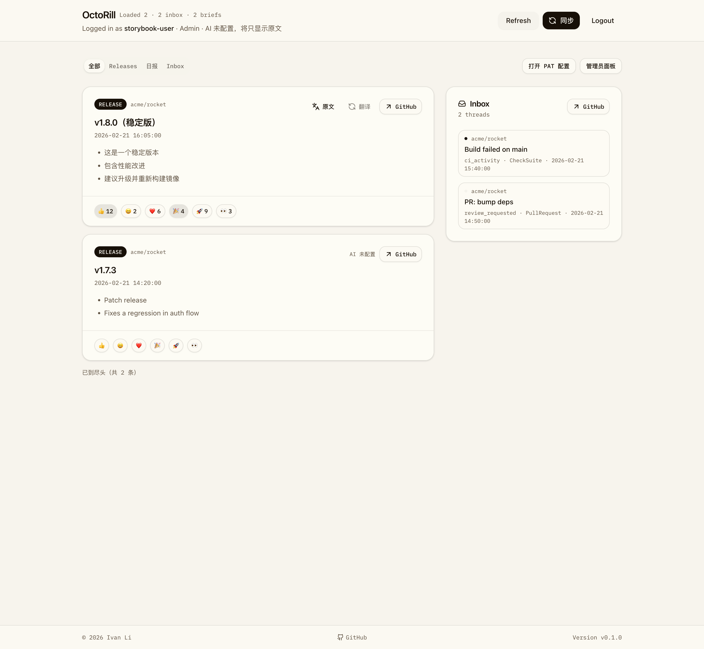

# Dashboard 同步入口收敛与顺序固定（#96dp9）

## 状态

- Status: 已完成
- Created: 2026-03-27
- Last: 2026-03-27

## 背景 / 问题陈述

- Dashboard 顶部同时暴露 `Sync all`、`Sync starred`、`Sync releases`、`Sync inbox` 多个入口，界面操作噪音过高。
- 页面内空态和 release 反馈场景还存在局部同步按钮，和“统一从顶部触发同步”的心智不一致。
- 主同步流程虽然当前已按 `starred -> releases -> notifications` 顺序串行执行，但界面未明确收敛到唯一入口，也缺少对应的视觉回归证据。

## 目标 / 非目标

### Goals

- 将 Dashboard 头部操作收敛为 `同步` 与 `Logout`，不再保留单独的 `Refresh`。
- 主同步按钮使用左侧刷新 icon，并且只在全量同步执行中旋转。
- 保证客户端全量同步顺序固定为 `starred -> releases -> notifications -> refreshAll`。
- 更新 Storybook 审阅入口，并保留一张默认态视觉证据。

### Non-goals

- 不改动后端同步 API、任务模型或返回契约。
- 不新增独立的 inbox/release 局部同步逻辑。
- 不改动管理员页面、OAuth 流程或 PAT 配置行为。

## 范围（Scope）

### In scope

- `web/src/pages/Dashboard.tsx`
- `web/src/pages/DashboardHeader.tsx`
- `web/src/feed/FeedList.tsx`
- `web/src/feed/FeedItemCard.tsx`
- `web/src/inbox/InboxList.tsx`
- `web/src/stories/Dashboard.stories.tsx`
- `docs/specs/README.md`

### Out of scope

- Rust 后端 API 与任务编排
- 非 Dashboard 页面或 admin 界面
- Playwright 登录流扩展

## 需求（Requirements）

### MUST

- 顶部同步操作只保留一个名为 `同步` 的按钮。
- 顶部不得再显示单独的 `Refresh` 按钮。
- `同步` 按钮左侧必须有刷新系 icon，并在全量同步执行中旋转。
- `Sync starred`、`Sync releases`、`Sync inbox` 的顶部按钮必须移除。
- Feed 空态仅保留一个页面内 `同步` CTA，不再展示拆分同步按钮。
- Inbox 空态与 release reaction `sync_required` 场景不得再渲染局部同步按钮。
- 点击 `同步` 时，客户端必须按 `starred -> releases -> notifications -> refreshAll` 顺序串行执行。

### SHOULD

- Storybook 应提供默认态、同步中与空态的可审阅入口。
- 文案应明确顶部 `同步` 是统一入口，避免残留旧按钮名称。

### COULD

- 无。

## 功能与行为规格（Functional/Behavior Spec）

### Core flows

- 用户在 Dashboard 顶部点击 `同步`，页面进入 busy 状态；按钮禁用并展示旋转 icon。
- 同步流程依次请求 starred、releases、notifications 三个端点；任一步失败时沿用既有 `run/busy` 错误处理，不继续后续请求。
- Feed 空态仍可提供一个页面内 `同步` CTA，但其行为与顶部主按钮完全一致。

### Edge cases / errors

- `Generate brief` 等非全量同步 busy 状态不应让 `同步` icon 旋转。
- Inbox 为空时只提示使用顶部 `同步` 获取数据，不再出现 `Sync inbox` 局部按钮。
- release 反馈需要 release 数据时，只提示使用顶部 `同步` 更新 releases，不再提供卡片级 `Sync releases`。

## 接口契约（Interfaces & Contracts）

- `DashboardHeaderProps`：收敛为单一 `onSyncAll` 入口，并增加显式全量同步渲染态 `syncingAll`。
- `FeedList` / `FeedItemCard`：移除 `onSyncReleases` 透传，`sync_required` 仅保留提示文案。

## 验收标准（Acceptance Criteria）

- Given Dashboard 默认态
  When 页面渲染完成
  Then 顶部只出现一个名为 `同步` 的同步按钮，且不存在 `Refresh`、`Sync starred`、`Sync releases`、`Sync inbox` 按钮。

- Given 用户触发全量同步
  When `同步` 流程进行中
  Then 顶部 `同步` 按钮禁用，左侧 icon 旋转，且流程顺序为 starred、releases、notifications。

- Given Feed 为空
  When 空态卡片显示
  Then 页面内只保留一个 `同步` CTA，并提示实际顺序是 starred → releases → Inbox。

- Given Inbox 为空或 release 反馈尚未就绪
  When 相应空态/提示渲染
  Then 只展示“使用顶部同步”的文案，不出现局部同步按钮。

## 实现前置条件（Definition of Ready / Preconditions）

- [x] Dashboard 同步入口现状已确认。
- [x] Storybook 已存在且支持 docs/autodocs。
- [x] 同步顺序与收敛边界已冻结。

## 非功能性验收 / 质量门槛（Quality Gates）

### Testing

- `cd web && bun run build`
- `cd web && bun run storybook:build`

### Visual verification

- 使用 Storybook 产出一张 Dashboard 默认态视觉证据。
- 视觉证据需写入本 spec 的 `## Visual Evidence`。

## 文档更新（Docs to Update）

- `docs/specs/README.md`
- `docs/specs/96dp9-dashboard-sync-unification/SPEC.md`

## 计划资产（Plan assets）

- Directory: `docs/specs/96dp9-dashboard-sync-unification/assets/`

## Visual Evidence

## 实现里程碑（Milestones / Delivery checklist）

- [x] M1: 新建 spec 并写入 `docs/specs/README.md`。
- [x] M2: 完成 Dashboard 同步入口与文案收敛。
- [x] M3: 完成 Storybook、视觉证据、快车道 PR 与 review-loop 收敛。

## 方案概述（Approach, high-level）

- 仅保留一个顶部主同步入口，并将全量同步渲染态与业务顺序解耦成明确状态。
- 页面内所有局部同步入口统一改成引导文案，避免行为分叉。
- 通过 Dashboard Storybook stories 呈现默认态、同步中和空态，其中默认态作为最终视觉证据源。

## 风险 / 开放问题 / 假设（Risks, Open Questions, Assumptions）

- 风险：若 props 收敛不完整，Storybook 与页面实现可能出现类型漂移。
- 开放问题：无。
- 假设：顶部仍保留 `Logout`，但同步相关入口只剩一个 `同步`。

## 变更记录（Change log）

- 2026-03-27: 创建规格，冻结“单一同步入口 + 顺序固定 + Storybook 视觉证据”的执行口径。
- 2026-03-27: 完成 Dashboard 同步入口、空态文案与 reaction 提示收敛，并更新 Dashboard Storybook stories。
- 2026-03-27: 通过 `bun run lint`、`bun run build`、`bun run storybook:build`，并补入 Storybook 视觉证据，状态更新为 `部分完成（2/3）`。
- 2026-03-27: 根据最新产品口径移除顶部 `Refresh`，保持头部只剩 `同步` 与 `Logout`，并完成视觉证据刷新。
- 2026-03-27: 将最终保留的视觉证据收敛为一张默认态截图，移除多余截图资产。
- 2026-03-27: 创建 PR #39 并完成快车道收敛，规格状态更新为 `已完成`。

## 参考（References）

- `web/src/pages/Dashboard.tsx`
- `web/src/pages/DashboardHeader.tsx`
- `web/src/stories/Dashboard.stories.tsx`
