# 管理员 LLM 多模型路由与故障切换

## 背景 / 问题陈述

- 当前运行时只接受单个 `AI_MODEL`，管理员后台只能配置 `max_concurrency` 与可选的 `ai_model_context_limit`。
- 管理员无法在控制台维护多个候选模型，也无法调整优先顺序。
- 当首选模型持续失败时，系统只能在同一模型内部重试，无法自动切走后备模型。
- 现有 `effective_model_input_limit` 与翻译批处理预算默认按单模型口径计算；如果直接引入多模型而不改预算来源，会出现“按模型 A 计算预算、实际却使用模型 B”的错配。

## 目标 / 非目标

### Goals

- 在 `/admin/jobs/llm` 的设置弹窗中支持维护**同一 provider / key** 下的多个模型 ID。
- 模型列表支持排序，调度对新请求始终优先选择排在前面且未处于冷却中的模型。
- 保留现有单模型内部重试语义；某模型在一次调用内跑完现有重试预算后仍失败，才记为一次模型级最终失败。
- 同一模型连续 3 次最终失败后进入 10 分钟冷却，后续新请求优先改用后续模型；冷却到期后自动恢复优先尝试。
- 输入预算、管理员状态接口、调用日志与翻译批次画像一起收敛到多模型语义。
- 在管理员 LLM 调度卡片中按最近 50 个 UTC 小时展示逐模型终态调用活动，并保留模型状态卡片视图。

### Non-goals

- 不支持每个模型独立的 `base_url`、`api_key`、provider 或加密密钥存储。
- 不在同一次 `chat_completion` 请求内做跨模型接力重试。
- 不引入权重路由、随机打散、按任务类型定向模型、按模型独立上下文上限覆盖。
- 不把模型冷却状态持久化到数据库；冷却与连续失败计数仅是进程内 runtime state。

## 范围（Scope）

### In scope

- `admin_runtime_settings` 新增持久化模型列表真相源。
- 启动 seed / 旧实例 backfill：无模型列表时使用当前 `AI_MODEL` 生成单元素列表。
- 后端 LLM 运行时：选模、冷却、连续失败计数、状态接口扩展、输入预算按实际选中模型计算。
- 管理端 LLM 调度设置弹窗、状态摘要与逐模型状态展示。
- Storybook、Rust tests、Playwright / build checks、相关 docs/config 口径同步。

### Out of scope

- 多 provider failover。
- 历史 `llm_calls` / `translation_batches` 数据回填为新路由画像。
- 可配置桶宽、桶数、历史回填、跨实例聚合或独立健康面板。
- 用活动颜色表达成功率；活动颜色只表达成功与失败终态调用总量。

## 需求（Requirements）

### MUST

- `PATCH /api/admin/jobs/llm/runtime-config` 必须支持提交有序 `llm_models` 数组，数组元素为 trim 后的非空模型 ID。
- 管理端模型列表必须至少保留 1 个模型，且 trim / normalize 后不得重复。
- 新请求选模顺序固定为管理员排序后的第一个可用模型；若全部处于冷却，则选择 `cooldown_until` 最早到期的模型继续探测，不得直接返回“无模型可用”。
- 模型级最终失败的定义必须是：一次 `chat_completion` 已用完该模型的现有内部重试预算后仍失败。
- 某模型连续 3 次最终失败后进入 10 分钟冷却；成功一次则该模型的连续失败计数清零。
- `effective_model_input_limit` 必须与“下一次新请求将会选中的模型”一致；所有批处理预算也必须按该实际候选模型计算。

### SHOULD

- 管理台状态接口暴露逐模型状态：模型名、排序位置、冷却状态、连续失败次数、冷却截止时间、该模型的有效输入上限及来源。
- 翻译批次 / work item 的 `model_profile` 改为记录稳定的“有序模型路由画像”，避免 failover 把缓存键打散。

### COULD

- 后续再补按模型维度的 24h 健康聚合与管理端筛选项。

## 功能与行为规格（Functional / Behavior Spec）

### 1. 管理端模型列表设置

- `LLM 调度` 卡片右上角设置弹窗升级为三段：
  - 最大并发数
  - `LLM 输入长度上限（tokens）`
  - 模型路由列表
- 模型路由列表默认回填持久化顺序。
- 每个条目支持新增、删除、上移、下移。
- 模型列表至少保留 1 项；空白项、纯空格项、重复项提交时前端阻止，后端也必须返回 `400 bad_request`。

### 2. 运行时选模与冷却

- 每次新 LLM 请求在进入 upstream 调用前，先依据当前持久化模型列表与 runtime 健康态解析“本次选中的模型”。
- 该次请求在整个内部重试周期中都固定使用同一个模型，不在 attempt 之间切换模型。
- 若该次请求最终成功：
  - 记录实际模型到 `llm_calls.model`
  - 清零该模型的 `consecutive_final_failures`
- 若该次请求最终失败：
  - 对该模型的 `consecutive_final_failures += 1`
  - 若累计达到 3，则写入 `cooldown_until = now + 10m`

### 3. 预算与模型画像

- 全局手动覆盖值 `ai_model_context_limit` 继续存在；若不为空，对所有模型都生效。
- 若覆盖值为空，则按“本次实际选中的模型”解析 `effective_model_input_limit` 与 source。
- release detail chunk budget、release batch budget、notification batch budget、日报批处理预算都必须改为依赖该选模结果。
- `translation_work_items.model_profile` / `translation_batches.model_profile` 改为稳定记录有序模型列表画像，而不是单次实际命中的模型。

### 4. 管理端状态接口

- `GET /api/admin/jobs/llm/status` 顶层继续返回 `ai_model_context_limit`、`effective_model_input_limit`、`effective_model_input_limit_source`，但语义改为“下一次新请求会使用的模型”。
- 新增：
  - `llm_models: string[]`
  - `selected_model_for_new_calls: string`
  - `model_statuses: [...]`
- `model_statuses` 每项至少包含：
  - `model`
  - `priority`
  - `status = ready | cooldown`
  - `consecutive_final_failures`
  - `cooldown_until`
  - `effective_input_limit`
  - `effective_input_limit_source`

### 5. 模型活动窗口

- `GET /api/admin/jobs/llm/activity` 是独立的管理员只读接口，不接受查询参数。
- 响应固定为 `bucket_minutes = 60`、`bucket_count = 50`；窗口包含当前 UTC 小时及前 49 小时，`window_started_at` 与 `window_ended_at` 分别为完整窗口的左闭、右开边界。
- 只有 `succeeded | failed` 终态进入统计，以 `finished_at` 为首选终态时间；运行时 override 覆盖尚未持久化的状态和时间后再聚合。
- 当前配置模型先按优先级排列；窗口内有终态活动但已移除的模型随后按最近活动时间倒序、模型名升序排列。
- 所有模型均补齐 50 个桶以及零计数单元，响应中的每个桶按相同模型顺序返回计数。
- 活动图默认展示，使用设置按钮旁的图表/卡片图标分段控件切换；选择仅存在于当前组件生命周期，不影响调用列表筛选。
- 活动图按实际可用网格宽度动态展示最近小时桶，最多为响应中的 `50` 个桶；`>=1024px`、`640-1023px` 和 `<640px` 的最小单元尺寸分别为 `12px`、`11px` 和 `9px`。宽度不足时减少桶数，宽度充足时列会拉伸以填满网格；键盘左右漫游只在当前实际可见窗口内进行。
- 网格在所有断点均以 `width: 100%` 与自适应列宽渲染，不产生页面或网格横向滚动。单元格保持正方形，相邻单元不得重叠；桌面与平板的稀疏时间刻度保持水平，首尾分别从网格边界向内对齐，末桶会替代距离不足三格的常规刻度，不得截断、重叠或额外造成溢出。
- 窄屏左轴只显示模型优先级标记，完整模型名固定显示在网格下方的图例中；不提供会改变网格列宽的模型名开关。
- 单元格活动量为 `succeeded + failed`。零调用显示中性灰，非零单元按 `ceil(4 * cell_count / visible_max)` 映射四级活动颜色。
- 悬浮、键盘聚焦或点击任一时间列时，聚合窗逐模型显示成功数、失败数、`成功 / (成功 + 失败)` 与 `模型成功 / 桶内全部模型成功`；零分母显示 `--`。
- 聚合窗通过 body portal 使用 fixed 定位：指针移动时跟随指针，焦点与点击时锚定活动单元格；定位器以 `12px` 安全间距依次尝试网格下方、上方、右侧、左侧，始终避开整个活动网格并夹紧在视口内。
- 聚合窗不接收指针事件。文档级命中检测将网格与上一帧浮窗矩形视为同一安全区，指针进入浮窗区域时保留最后的有效位置，只有离开两者后才关闭；点击固定，外部点击或 Escape 关闭。
- 浮窗和活动网格在矮视口中均受限于 `min(30vh, 12rem)` 的最大高度并仅允许纵向滚动，避免模型数量增长时浮窗越出视口或覆盖活动区域。
- 图表拥有独立的首次加载、错误、重试和后台刷新状态；SSE 或手动刷新期间保留旧网格，直到新响应到达。
- 网格单元格和模型状态卡片均提供“查看失败调用”与“查看全部调用”操作。网格操作带入精确模型及该桶终态时间的 `[started_at, ended_at)` 范围；状态卡片仅带入精确模型，并使用调用记录既有七日保留期。
- 排障跳转必须清空来源、请求用户、旧状态、旧时间和分页等冲突筛选，再设置目标状态、模型和时间范围；跳转将完整筛选写入 URL 并新增一条浏览器历史记录，加载后将焦点移动到调用记录结果区域。
- 调用列表筛选状态由 URL 恢复：`llm_status`、`llm_model`、`llm_source`、`llm_requested_by`、`llm_started_from`、`llm_started_to`、`llm_finished_from`、`llm_finished_before`。时间值使用 UTC RFC3339；开始时间与结束时间范围可同时生效，并由两个彼此独立的范围控件呈现，每个控件只负责一个时间口径。开始时间上限保持包含语义，结束时间上限为“结束时间前”的排他语义。历史单口径参数 `llm_time_field`、`llm_time_from`、`llm_time_to` 必须可解析，并在 URL 规范化时迁移到对应的新参数。
- 调用列表支持精确模型筛选和终态时间范围。终态时间统一按 `COALESCE(finished_at, updated_at, created_at)` 计算，`finished_from` 为包含下限，`finished_before` 为排他上限；持久化记录和 runtime override 合并后必须遵循同一筛选与分页语义。

## 接口契约（Interfaces & Contracts）

### 接口清单（Inventory）

| 接口（Name） | 类型（Kind） | 范围（Scope） | 变更（Change） | 契约文档（Contract Doc） | 负责人（Owner） | 使用方（Consumers） |
| --- | --- | --- | --- | --- | --- | --- |
| `GET /api/admin/jobs/llm/status` | HTTP API | external | Modify | `./contracts/http-apis.md` | backend | web-admin |
| `GET /api/admin/jobs/llm/activity` | HTTP API | external | New | `./contracts/http-apis.md` | backend | web-admin |
| `GET /api/admin/jobs/llm/calls` | HTTP API | external | Modify | `./contracts/http-apis.md` | backend | web-admin |
| `PATCH /api/admin/jobs/llm/runtime-config` | HTTP API | external | Modify | `./contracts/http-apis.md` | backend | web-admin |
| `admin_runtime_settings.llm_models_json` | DB schema | internal | New | `./contracts/db.md` | backend | backend |
| LLM runtime model health state | Runtime contract | internal | New | `./contracts/db.md` | backend | backend |
| translation `model_profile` semantics | Runtime contract | internal | Modify | `./contracts/db.md` | backend | backend |

### 契约文档（按 Kind 拆分）

- [contracts/http-apis.md](./contracts/http-apis.md)
- [contracts/db.md](./contracts/db.md)

## 验收标准（Acceptance Criteria）

- Given 管理员打开 `/admin/jobs/llm` 设置弹窗
  When 查看模型配置区域
  Then 可以看到按顺序回填的模型列表，并支持新增、删除、上移、下移。

- Given 管理员提交空模型、重复模型或空数组
  When 保存设置
  Then 前端阻止提交，后端也返回 `400 bad_request`。

- Given 模型列表为 `[A, B, C]` 且 `A` 未冷却
  When 发起新的 LLM 请求
  Then 该请求使用 `A`，并在整次内部重试周期中保持使用 `A`。

- Given 管理员从活动图单元格打开失败调用
  When 该单元格对应模型 `A` 和时间桶 `[from, before)`
  Then 调用列表精确筛选模型 `A`、失败状态及相同终态时间范围，并可由复制后的 URL 恢复。

- Given 管理员从模型状态卡片打开全部调用
  When 目标模型为 `A`
  Then 调用列表仅保留模型 `A` 的七日保留期记录，且来源、请求用户、旧状态、旧时间和分页筛选已清除。

- Given `A` 连续 3 次“最终失败”
  When 发起新的 LLM 请求
  Then 新请求优先改用 `B`，且 `GET /api/admin/jobs/llm/status` 中 `A.status = cooldown`、`cooldown_until` 非空。

- Given `A` 的冷却时间已过
  When 再发起新的 LLM 请求
  Then 系统重新优先尝试 `A`。

- Given `ai_model_context_limit = null` 且模型列表第一项为小上下文模型
  When 读取 `GET /api/admin/jobs/llm/status`
  Then `effective_model_input_limit` 与 `selected_model_for_new_calls` 对应模型一致。

- Given 管理员首次打开 LLM 调度页
  When 活动数据加载完成
  Then 默认显示逐模型活动图；组件按实际可用宽度显示最近的尽可能多小时桶（最多 50），并可切回原有模型卡片。

- Given 任一活动图断点
  When 计算网格布局
  Then 页面与网格均没有横向溢出，最后一格贴合可用右边界且相邻单元不重叠；窄屏模型名只出现在网格下方图例。

- Given 某小时同时存在多个模型的成功与失败调用
  When 悬浮、聚焦或固定该时间列
  Then 聚合窗按模型显示精确计数、成功率和按成功计的使用率，并始终避开活动网格与视口边界；指针进入聚合窗区域不会关闭它。

## 非功能性验收 / 质量门槛（Quality Gates）

- Rust tests: `cargo test`
- Rust lint: `cargo clippy --all-targets -- -D warnings`
- Web checks: `cd web && bun run lint`、`cd web && bun run build`
- Storybook / UI checks: `cd web && bun run storybook:build`
- E2E: `cd web && bun run e2e -- admin-jobs.spec.ts`

## Visual Evidence

### Storybook canvas

- 多模型设置弹窗（排序 / 新增 / 删除 / 输入长度上限）

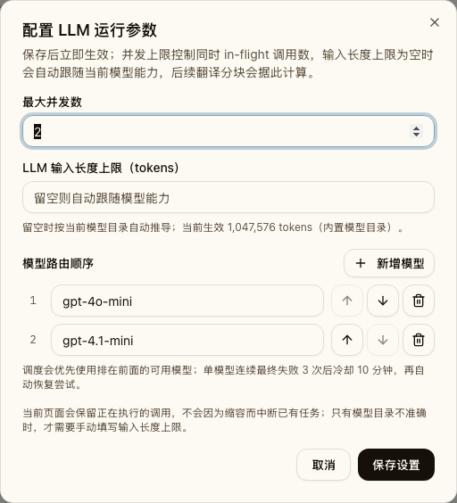

- 冷却切换状态卡（首选模型冷却，次选模型接管）

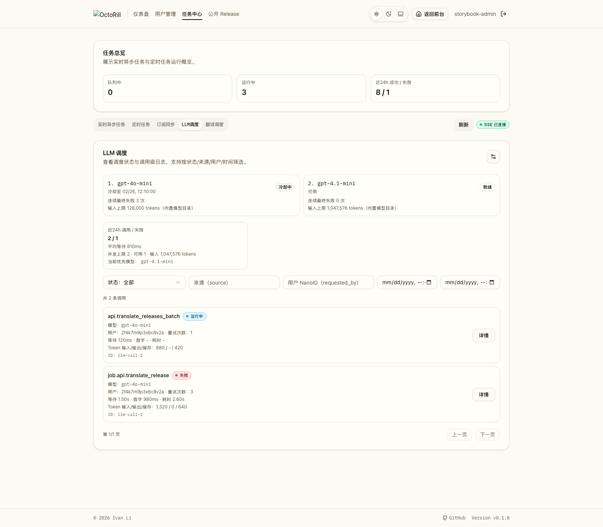

- 管理端 `LLM 调度` 多模型设置弹窗（含排序按钮）Storybook canvas。
- 管理端 `LLM 调度` 状态卡展示首选模型冷却、次选模型接管的 Storybook canvas。
- 管理端活动图桌面深色完整 50 桶页面（含完整、不重叠的首尾时间刻度）、`393x852` 移动端浅色按容器容量紧凑页面，以及 Storybook 37 桶聚合窗组件证据。

PR: include
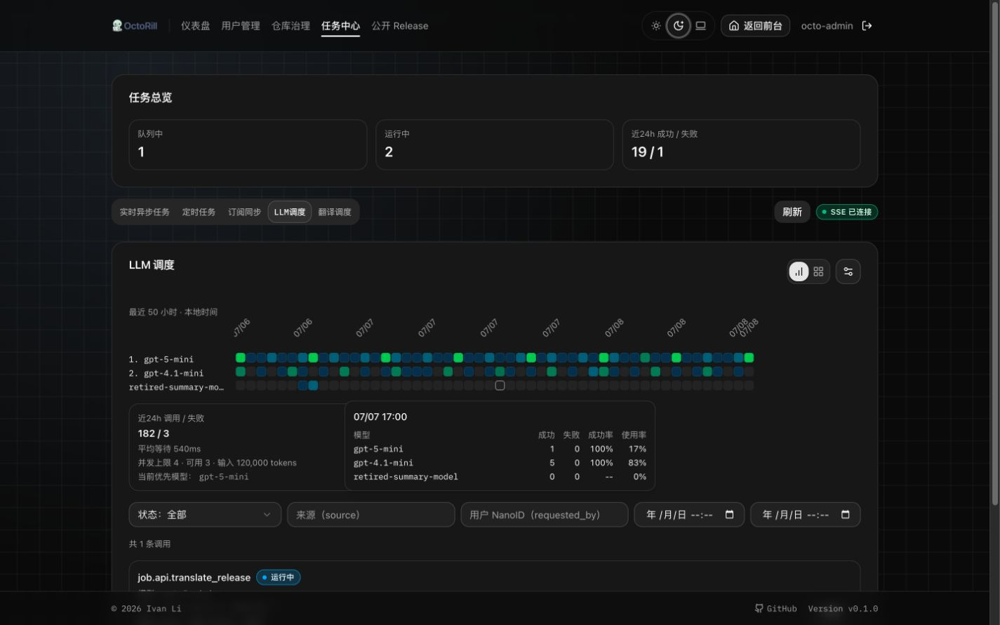

PR: include
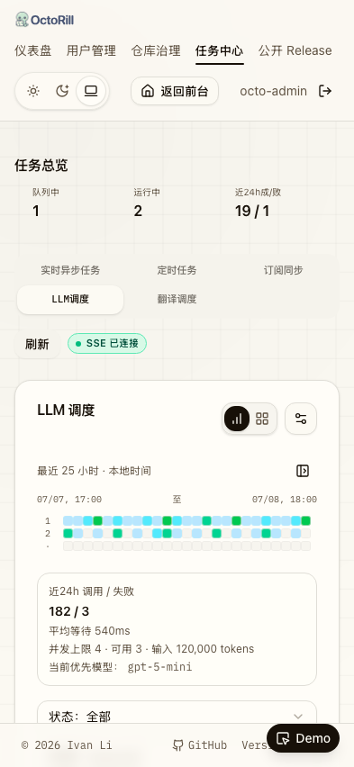

PR: include
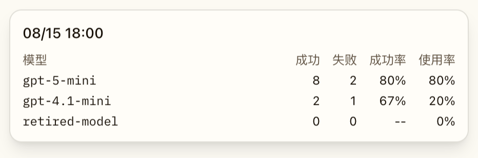

### 调用排障跳转

- `ui_demo`：桌面活动桶菜单，覆盖“查看失败调用 / 查看全部调用”。

PR: include
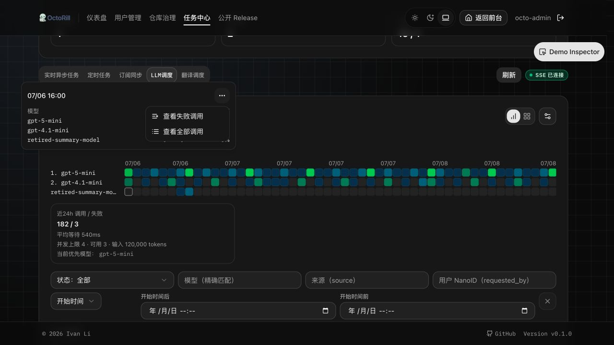

- `ui_demo`：`393x852` 移动端终态筛选和失败调用结果。

PR: include
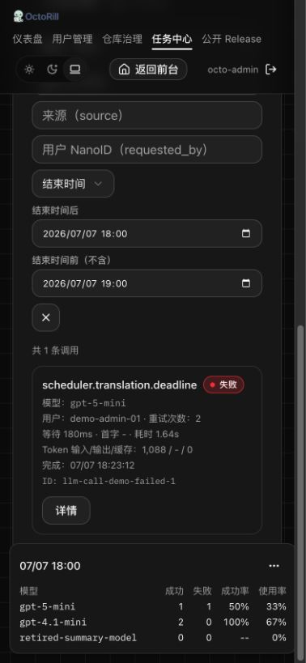

- `ui_demo`：`393x852` 移动端显式操作菜单。

PR: include
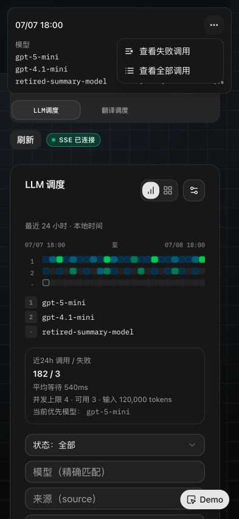

- `storybook_canvas`：活动网格右键上下文菜单。

PR: include
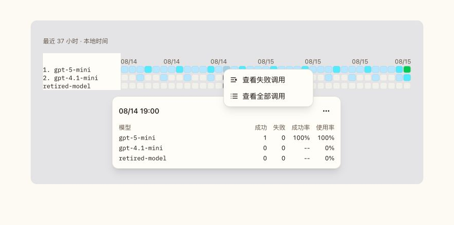

### 调用时间范围控件

- `ui_demo`：桌面调用时间筛选，开始时间与结束时间各自拥有独立的范围控件和弹层。

PR: include
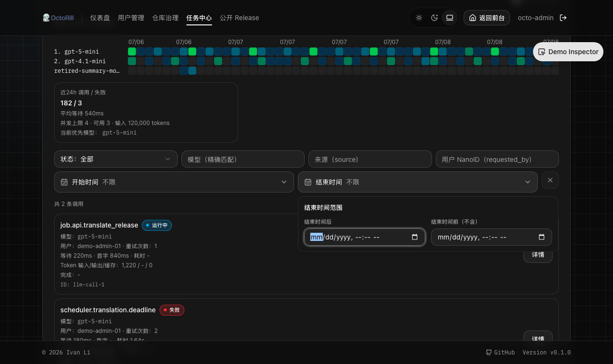

- `ui_demo`：`393x852` 移动端开始/结束两个范围控件纵向排列；每个弹层只展示自身的两个边界输入。

PR: include
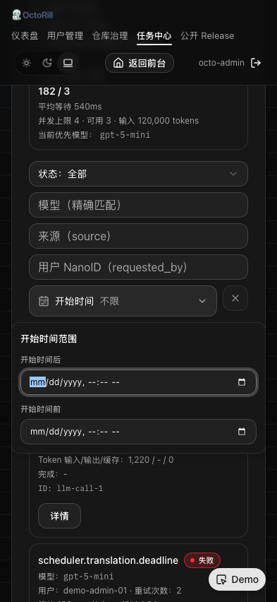

- `storybook_canvas`：两个受控范围组件分别展示开始/结束时间；结束时间控件保持排他上限语义。

PR: include
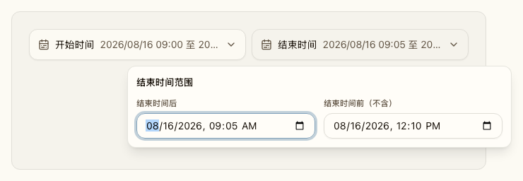

## 风险 / 开放问题 / 假设（Risks, Open Questions, Assumptions）

- 假设：多模型 v1 只运行在同一 provider/base URL/api key 下；这轮不做多密钥与 provider 抽象。
- 假设：模型冷却状态进程内持有即可接受；服务重启后允许恢复为 clean state。
- 风险：若模型目录缺失某模型的上下文窗口，系统会回落到 builtin / unknown fallback，可能让小上下文模型在估算上偏乐观或偏保守。
- 假设：现有 `llm_calls` 七日保留期足以覆盖 50 小时窗口；无需 migration 或 ADR，因为没有新增持久化真相源、跨模块架构边界或不可逆技术决策。
