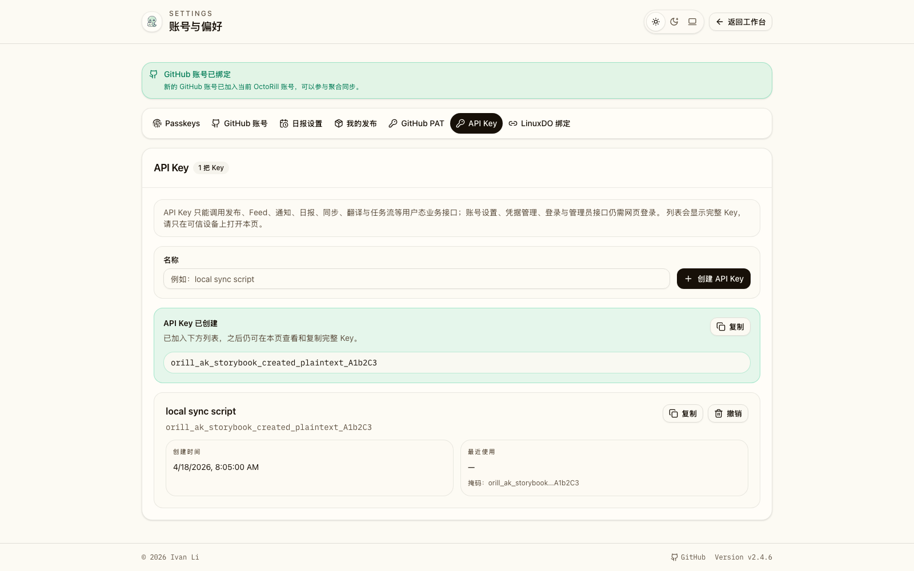
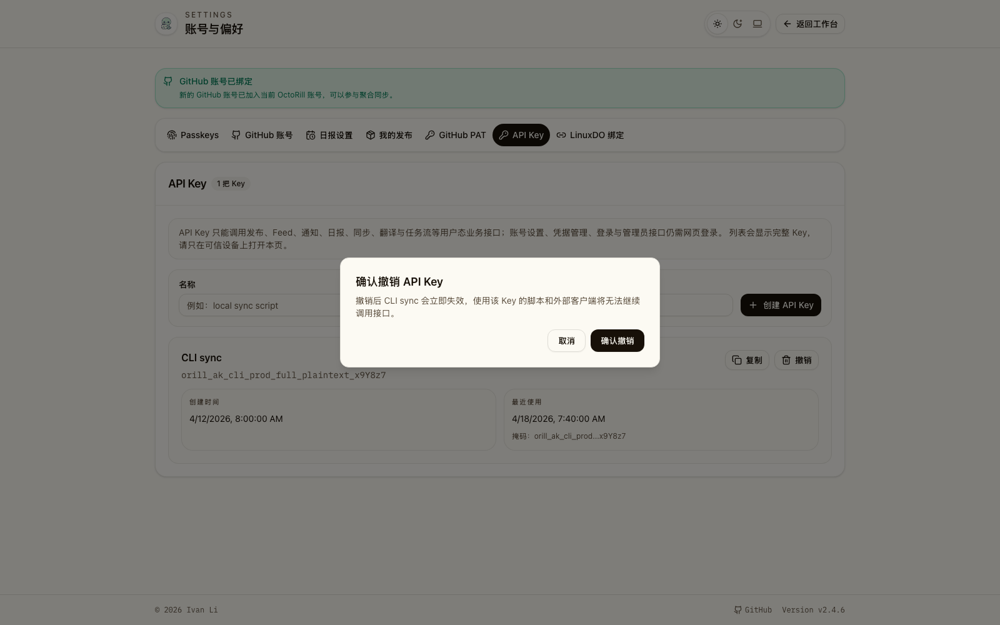
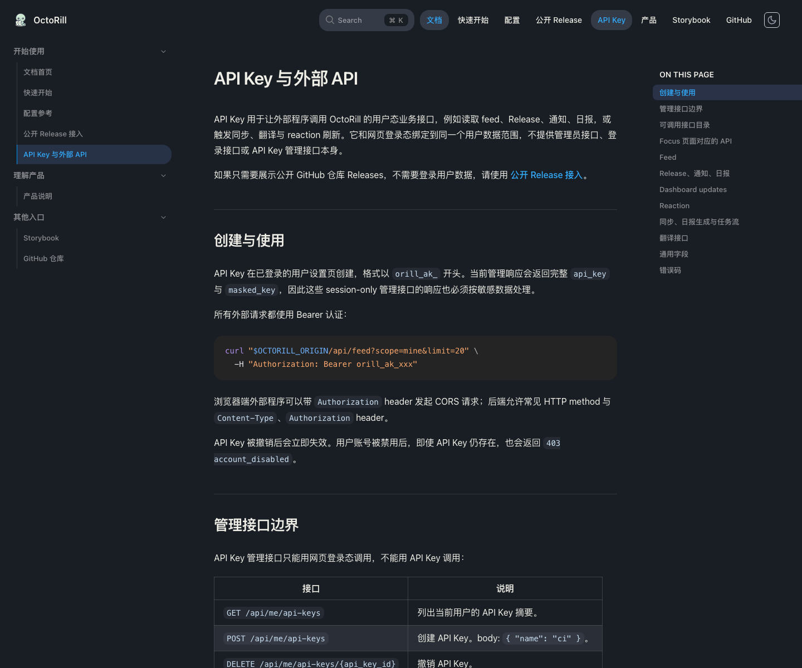

# API Key 用户接口调用

> 当前有效规范以本文为准；实现覆盖与当前状态见 `./IMPLEMENTATION.md`，关键演进原因见 `./HISTORY.md`。

## 背景 / 问题陈述

- OctoRill 现有用户态 API 依赖浏览器 session，适合 Web UI，但不适合脚本、自动化和外部客户端调用。
- 用户需要为自己的账号创建可撤销的 API Key，以便通过现有 `/api/...` 业务接口读取和触发个人工作流。
- API Key 若不明确权限边界，容易被误用为完整网页登录凭据，进而放大账号绑定、Passkey、PAT、admin 等高风险能力。

## 目标 / 非目标

### Goals

- 用户可在设置页创建、查看和撤销多把命名 API Key。
- API Key 通过 `Authorization: Bearer <key>` 调用现有 `/api/...` 用户态业务接口。
- API Key 只代表当前用户的业务调用身份，不具备账号设置、凭据管理、登录或 admin 能力。
- API Key 可在设置页持续回显；后端使用 hash 做认证，并用 AES-256-GCM 加密保存回显所需明文。

### Non-goals

- 不新增独立 `/api/v1`。
- 不支持 per-key scope、强制过期时间、管理员代建 Key 或组织级 Key。
- 不允许 API Key 管理 GitHub PAT、Passkey、GitHub/LinuxDO 绑定、日报偏好或 API Key 自身。
- 不引入新的全局限流系统；沿用既有业务接口与后台任务治理。

## 范围（Scope）

### In scope

- `user_api_keys` 数据表、Key 生成、hash 校验、最近使用时间维护。
- session-only API Key 管理接口。
- 允许的用户态业务接口接入 Bearer Key 认证。
- `/settings?section=api-keys` UI、Storybook 覆盖、E2E 回归与视觉证据。

### Out of scope

- admin API、auth/login API、账号绑定 API、设置/凭据 API 的 API Key 访问。
- 外部公开 API 版本化、OpenAPI 文档生成、SDK 或 CLI。
- API Key 使用量统计、审计报表、速率限制或到期策略。

## 需求（Requirements）

### MUST

- API Key 明文格式必须带 OctoRill 专用前缀，便于用户识别和服务端快速拒绝非本产品 token。
- 服务端不得存储 API Key 明文；必须保存 hash 用于认证，并保存加密密文与 nonce 用于 session-only 设置页回显。
- `GET /api/me/api-keys`、`POST /api/me/api-keys`、`DELETE /api/me/api-keys/{api_key_id}` 必须只接受网页登录 session，不接受 API Key。
- Bearer API Key 只能调用业务数据与任务接口：release/feed/notification/brief 读取、sync、translation、brief generation、reaction refresh/toggle、task/translation stream。
- Bearer API Key 调用 `/api/me*`、`/api/reaction-token*`、`/api/auth*`、`/api/admin*`、`/auth*` 必须失败。
- 被禁用用户的 API Key 必须立即不可用。
- 撤销 API Key 后，同一明文 Key 必须立即不可用。

### SHOULD

- 创建 API Key 时允许用户填写简短名称；名称为空时使用稳定默认名称。
- 列表按创建时间倒序展示，显示名称、完整 Key、创建时间、最近使用时间和撤销入口。
- 创建成功态应提供复制能力，并清楚提示之后仍可在本页查看完整 Key。
- 撤销入口必须在发起 DELETE 前提供二次确认。

### COULD

- 后续可增加 per-key scope、过期时间、使用量统计或审计日志；本轮不预埋 UI 控件。

## 功能与行为规格（Functional/Behavior Spec）

### Core flows

- 用户打开 `/settings?section=api-keys`，若没有 Key，看到空态说明和创建入口。
- 用户输入名称并创建 API Key，后端返回新 Key 明文和列表项；前端展示复制区和最新列表。
- 用户刷新页面或重新打开列表，仍能看到完整 Key 并复制。
- 外部客户端携带 `Authorization: Bearer <key>` 调用允许的 `/api/...` 业务接口，后端按 Key 归属用户执行业务逻辑。
- 用户撤销某把 Key 后，该 Key 后续调用返回未授权。

### Edge cases / errors

- `Authorization` 缺失或格式不是 `Bearer <key>` 时，仍按现有 session 认证路径处理。
- Bearer token 前缀不匹配、hash 不匹配、Key 已撤销或用户不存在时返回 `401 unauthorized`。
- API Key 归属用户被禁用时返回 `403 account_disabled`。
- API Key 调用明确禁止的路由时返回 `401 unauthorized`，不回退到同请求中的空 session。
- 创建名称过长时返回 `400 bad_request`。

## 接口契约（Interfaces & Contracts）

### 接口清单（Inventory）

| 接口（Name） | 类型（Kind） | 范围（Scope） | 变更（Change） | 契约文档（Contract Doc） | 负责人（Owner） | 使用方（Consumers） | 备注（Notes） |
| --- | --- | --- | --- | --- | --- | --- | --- |
| `user_api_keys` | DB | internal | New | ./contracts/db.md | backend | backend | 存 Key hash、加密密文与元数据 |
| `GET /api/me/api-keys` | HTTP API | external | New | ./contracts/http-apis.md | backend | web | session-only |
| `POST /api/me/api-keys` | HTTP API | external | New | ./contracts/http-apis.md | backend | web | 创建响应含完整 Key |
| `DELETE /api/me/api-keys/{api_key_id}` | HTTP API | external | New | ./contracts/http-apis.md | backend | web | session-only revoke |
| `Authorization: Bearer <api_key>` | HTTP auth | external | Modify | ./contracts/http-apis.md | backend | external clients | 仅允许用户态业务接口 |
| `/settings?section=api-keys` | Web route | internal | Modify | ./contracts/http-apis.md | web | user | 新增设置页 section |

### 契约文档（按 Kind 拆分）

- [contracts/http-apis.md](./contracts/http-apis.md)
- [contracts/db.md](./contracts/db.md)

## 验收标准（Acceptance Criteria）

- Given 用户已登录 OctoRill
  When 访问 `/settings?section=api-keys`
  Then 可以看到 API Key section、创建表单、列表或空态。

- Given 用户创建 API Key
  When 创建成功响应返回
  Then 页面显示完整 Key，并可在刷新后继续查看和复制。

- Given 客户端携带有效 API Key
  When 调用允许的用户态业务接口
  Then 后端以 Key 归属用户执行请求，并更新该 Key 的最近使用时间。

- Given 客户端携带有效 API Key
  When 调用 `/api/me/profile`、`/api/me/api-keys`、`/api/reaction-token/status` 或 `/api/admin/users`
  Then 请求失败，不执行对应账号/凭据/admin 行为。

- Given 用户撤销某把 API Key
  When 客户端继续使用该 Key
  Then 请求返回未授权。

## 验收清单（Acceptance checklist）

- 核心路径的长期行为已被明确描述。
- 关键边界/错误场景已被覆盖。
- 涉及的接口/契约已写清楚或明确为 `None`。
- 相关验收条件已经可以用于实现与 review 对齐。

## 非功能性验收 / 质量门槛（Quality Gates）

### Testing

- Rust tests: Key 生成/存储不落明文、有效 Key 调用允许接口、撤销/禁用/禁止路由失败。
- Web tests: settings API Key section 空态、创建成功回显态、列表态、撤销二次确认态。
- E2E tests: `/settings?section=api-keys` 深链、创建/撤销确认 mock flow、完整 Key 回显。

### UI / Storybook (if applicable)

- Stories to add/update: `Pages/Settings` API Key section states。
- Docs pages / state galleries to add/update: Settings state gallery 覆盖 API Key 空态、列表态、创建成功态。
- `play` / interaction coverage to add/update: 默认 settings story 能切到 API Key；API Key story 验证创建成功提示与列表内容。
- Visual regression baseline changes: 新增 API Key settings 视觉证据。

### Quality checks

- `cargo test`
- `cd web && npm run lint`
- `cd web && npm run build`
- `cd web && npm run storybook:build`
- targeted `cd web && npx playwright test e2e/settings.spec.ts --project=chromium`

## Visual Evidence

创建成功后，完整 API Key 会出现在成功提示和下方列表中，可继续查看与复制。

PR: include

点击撤销后会先出现二次确认弹窗，确认前不会删除 Key。

PR: include

API Key 外部 API 文档页提供 Bearer 用法、可访问接口目录、scoped focus feed 映射、字段级响应与错误码说明。

PR: include

## 风险 / 开放问题 / 假设（Risks, Open Questions, Assumptions）

- 风险：现有 handler 大量直接消费 session 用户 id，接入 Bearer Key 时必须避免误开放账号管理与 admin 路由。
- 风险：API Key 可回显依赖服务端加密密文；设置页必须提示只在可信设备打开。
- 需要决策的问题：None
- 假设（已确定）：本轮不做 per-key scope、强制过期时间或全局限流。

## 参考（References）

- [LinuxDO 绑定与用户设置页改造](../linuxdo-user-settings/SPEC.md)
- [运行时结构化日志合同与容器日志收口](../runtime-structured-logging/SPEC.md)
