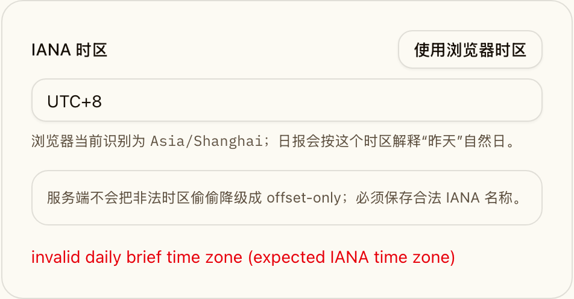
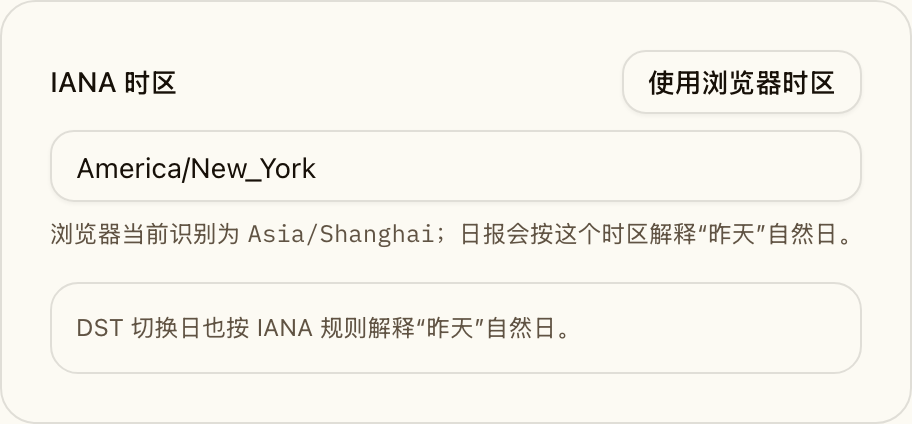
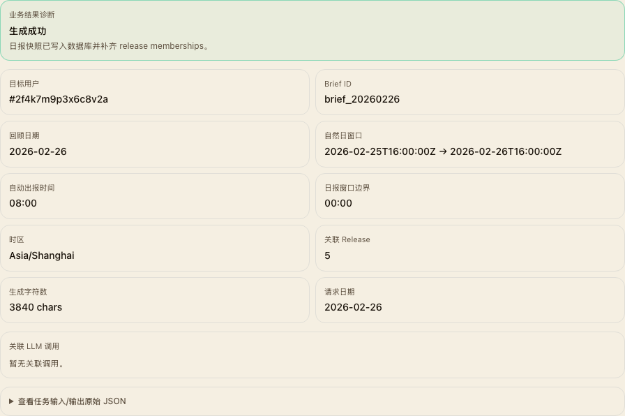
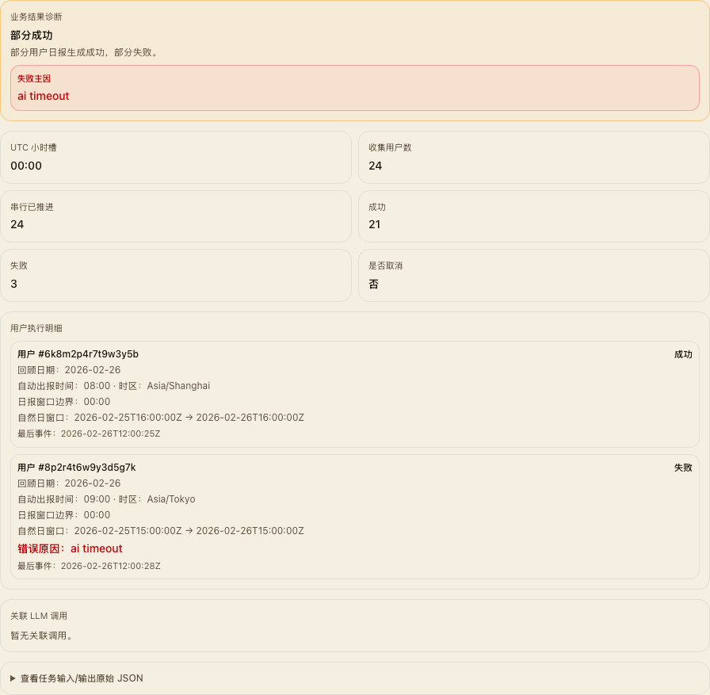
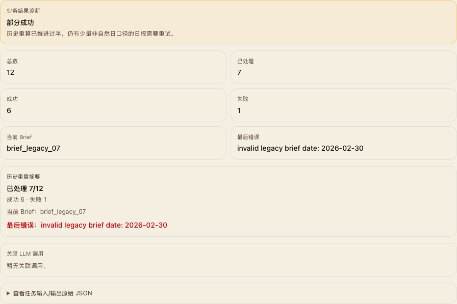

# 日报快照与时区去敏改造

## 背景 / 问题陈述

- 历史日报当前只依赖 `briefs.date + content_markdown`，前端折叠又按当前日组边界反推，导致管理员调整自动出报时间、服务端时区漂移或浏览器时区差异时，历史折叠结果会失真。
- `users.daily_brief_utc_time` 只能表达 UTC 时钟值，无法完整承载“本地整点 + IANA 时区 + DST 规则”的用户偏好。
- 现有 brief 与 release 的关联只存在于 Markdown 里的链接文本，无法稳定支撑历史折叠、详情回链、审计回放与历史重算。

## 目标 / 非目标

### Goals

- 把 brief 升级为不可变快照：每条 brief 必须记录窗口、时区、本地边界与显式 release memberships。
- 把日报设置统一为“管理员全局 `daily_brief_schedule_local_time` + 用户 `daily_brief_time_zone`”，并把“自动出报时刻”与“内容自然日窗口”彻底拆开。
- 让 Dashboard 历史折叠只按 snapshot memberships 命中，不再按当前服务端 Local 或 `brief.date` 反推。
- 提供普通用户与管理员两套日报设置入口，并补齐 Storybook 场景与视觉证据。
- 在启动后自动排队一次历史 brief 重算任务，把 legacy / boundary-based brief 迁入“昨天自然日”快照语义。

### Non-goals

- 不扩展成任意自定义时间段或分钟级内容边界。
- 不为从未存在过 brief 的历史日期补造新日报。
- 不改 release feed、Inbox 或 reaction 功能的主体业务语义。

## 范围（Scope）

### In scope

- `migrations/0035_daily_brief_snapshots.sql`
- `src/briefs.rs`
- `src/ai.rs`
- `src/api.rs`
- `src/jobs.rs`
- `src/server.rs`
- `src/auth.rs`
- `src/config.rs`
- `web/src/pages/Dashboard.tsx`
- `web/src/feed/**`
- `web/src/admin/**`
- `web/src/sidebar/**`
- `web/src/stories/**`
- `docs/specs/brief-snapshot-timezone/**`

### Out of scope

- 旧 brief 的精准“生成时原配置”回放（旧模型天然缺信息）
- 非 Dashboard / Admin 的信息架构改造

## 数据与接口契约

- 数据库：见 `./contracts/db.md`
- HTTP API：见 `./contracts/http-apis.md`

## 验收标准（Acceptance Criteria）

- Given 某条 brief 已经生成并写入 snapshot 字段与 memberships
  When 管理员之后修改全局自动出报时间，或用户修改时区
  Then 历史 brief 的窗口、正文与 Dashboard 折叠结果保持不变。

- Given Dashboard `全部` tab 存在一批被 snapshot memberships 命中的历史 release
  When 页面渲染完成
  Then 这些 release 会优先折叠成对应 brief；未被 membership 命中的 release 不会误折进 brief，且历史卡与 `/briefs` 主卡都继续通过 `GET /api/briefs/{brief_id}` 懒加载完整正文，而不是把完整 markdown 塞回 `GET /api/briefs` 列表响应。

- Given 用户在自助设置中提交非法时区，或管理员在任务中心提交非法整点时间
  When 服务端接收 PATCH
  Then 请求被拒绝，并返回校验错误，而不是悄悄回退成 offset-only。

- Given 历史库里存在 legacy brief
  When 应用启动并触发历史重算任务
  Then 任务会幂等地把 legacy brief 迁入 snapshot 语义，并补齐 memberships。

## Visual Evidence

- 普通用户日报设置（默认态）：界面只暴露“昨天”自然日对应的 IANA 时区，不再展示自动出报时间

- 普通用户日报设置（非法时区会被拒绝，不退化成 offset-only）

- 普通用户日报设置（DST-aware IANA 时区示例）

- 管理员任务详情：`brief.generate` 把“回顾日期 / 自然日窗口 / 自动出报时间 / 日报窗口边界”拆开展示

- 管理员任务详情：`brief.daily_slot` 对每个用户同时展示自动出报时间与自然日窗口，便于排障

- 管理员任务详情：`brief.history_recompute` 明确展示仍待收敛的 legacy brief 数量与重试错误

- Dashboard/历史折叠相关视觉证据移至 `docs/specs/dashboard-day-grouping/SPEC.md` 的 `## Visual Evidence`。

## 参考

- `docs/specs/dashboard-day-grouping/SPEC.md`
- `docs/specs/admin-job-center-phase2/SPEC.md`
