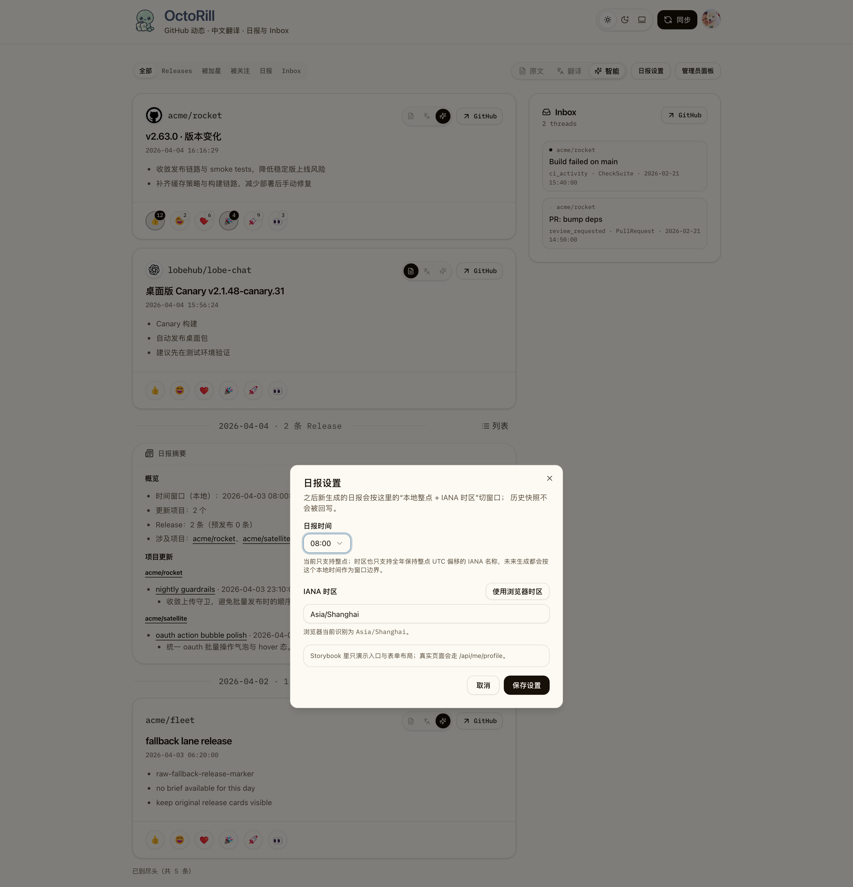
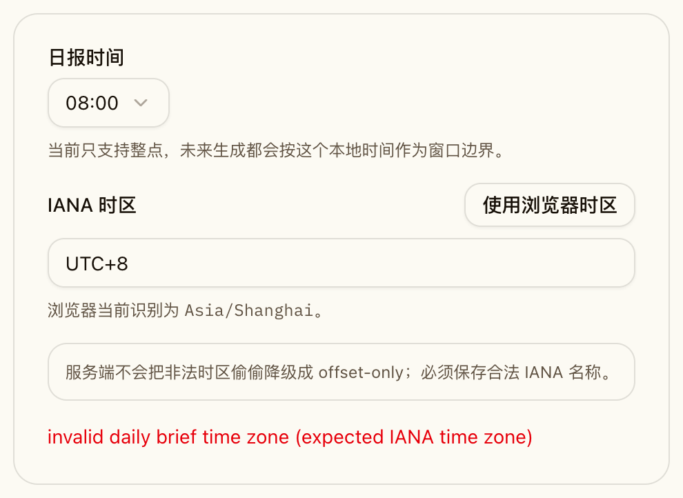
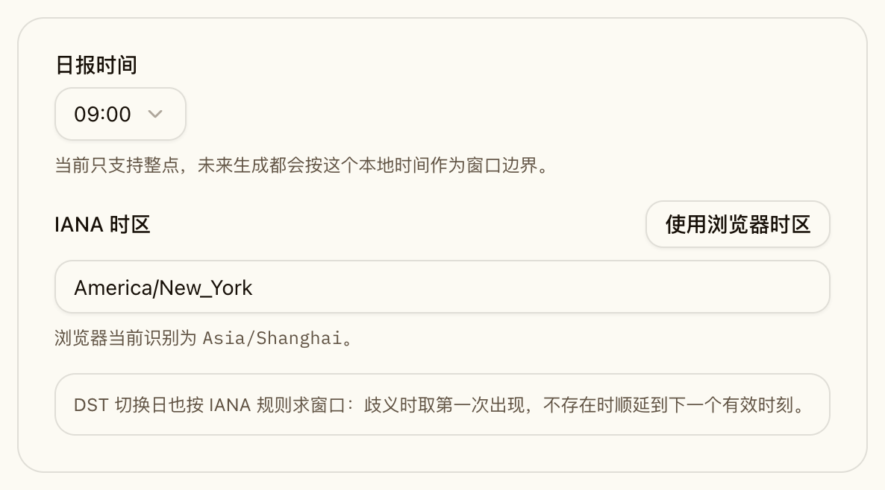
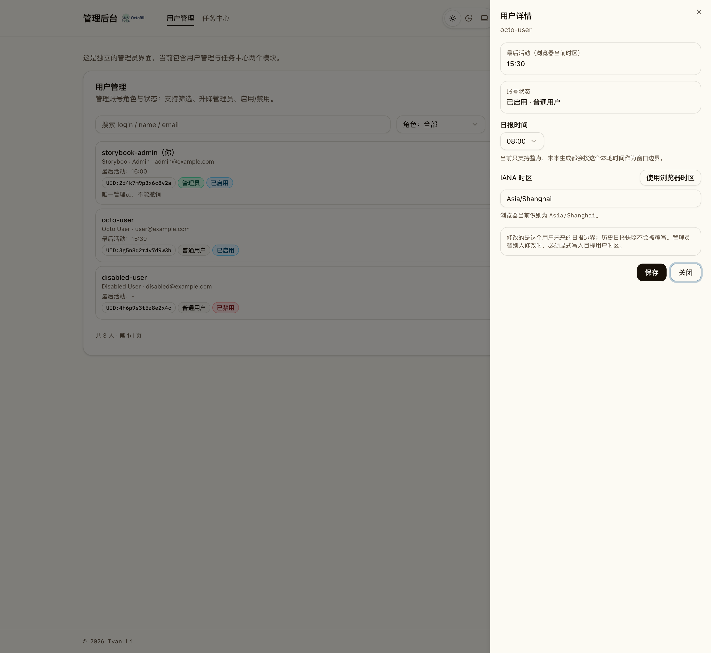
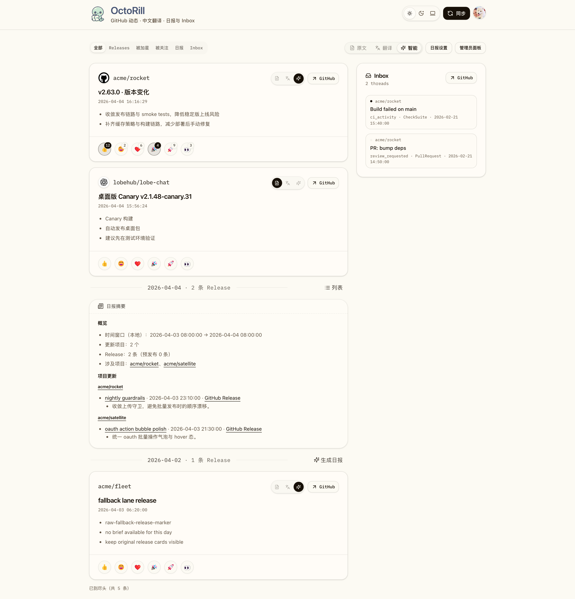
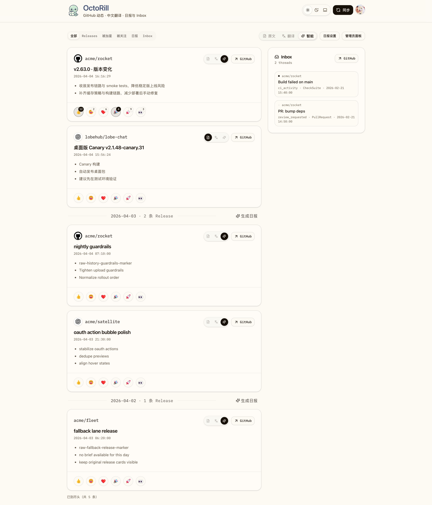
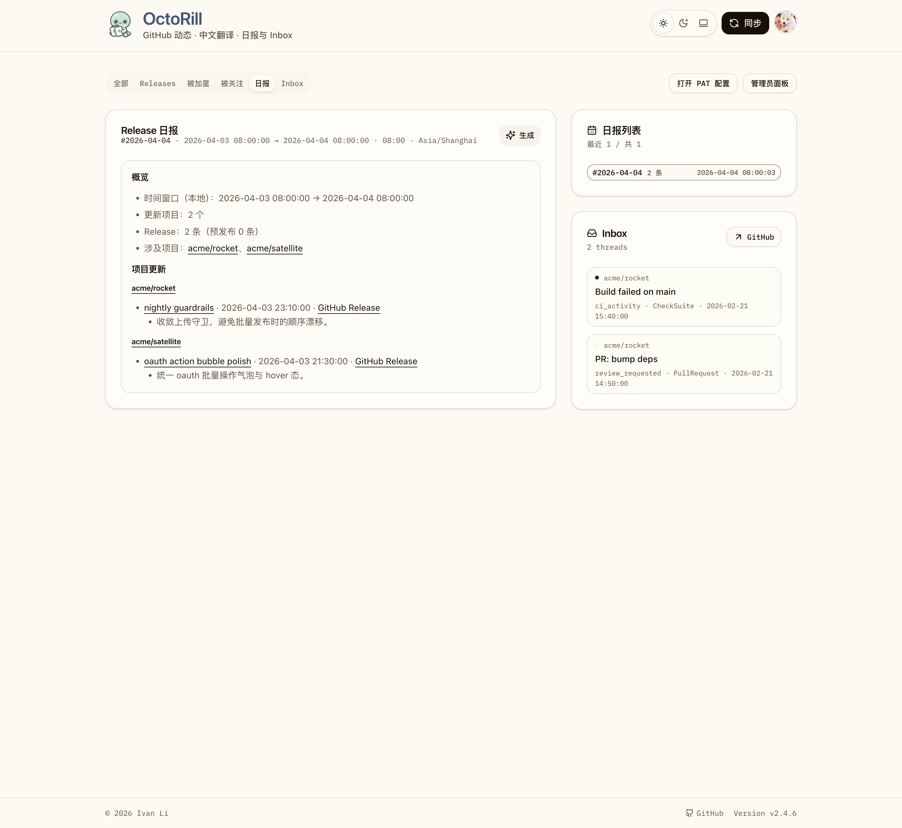
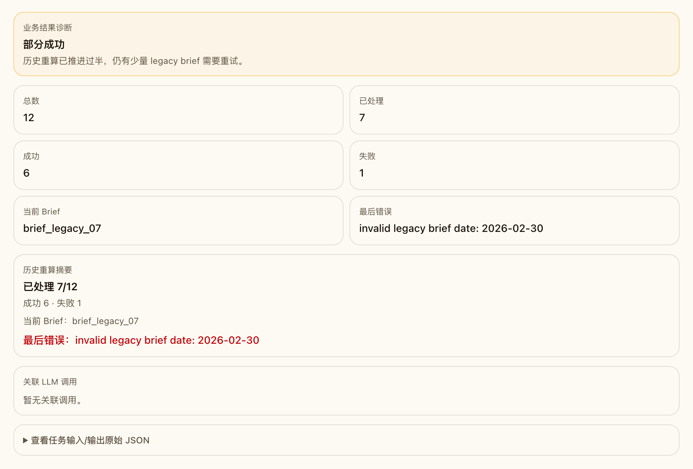

# 日报快照与时区去敏改造（#bt8w2）

## 状态

- Status: 已实现
- Created: 2026-04-13
- Last: 2026-04-13

## 背景 / 问题陈述

- 历史日报当前只依赖 `briefs.date + content_markdown`，前端折叠又按当前日组边界反推，导致用户修改日报时间、服务端时区漂移或浏览器时区差异时，历史折叠结果会失真。
- `users.daily_brief_utc_time` 只能表达 UTC 时钟值，无法完整承载“本地整点 + IANA 时区 + DST 规则”的用户偏好。
- 现有 brief 与 release 的关联只存在于 Markdown 里的链接文本，无法稳定支撑历史折叠、详情回链、审计回放与历史重算。

## 目标 / 非目标

### Goals

- 把 brief 升级为不可变快照：每条 brief 必须记录窗口、时区、本地边界与显式 release memberships。
- 把用户偏好统一为 `daily_brief_local_time + daily_brief_time_zone`，并显式配置旧用户默认时区。
- 让 Dashboard 历史折叠只按 snapshot memberships 命中，不再按当前服务端 Local 或 `brief.date` 反推。
- 提供普通用户与管理员两套日报设置入口，并补齐 Storybook 场景与视觉证据。
- 在启动后自动排队一次历史 brief 重算任务，把 legacy brief 迁入 snapshot 语义。

### Non-goals

- 不引入分钟级日报边界。
- 不为从未存在过 brief 的历史日期补造新日报。
- 不改 release feed、Inbox 或 reaction 功能的主体业务语义。

## 范围（Scope）

### In scope

- `migrations/0033_daily_brief_snapshots.sql`
- `src/briefs.rs`
- `src/ai.rs`
- `src/api.rs`
- `src/jobs.rs`
- `src/server.rs`
- `src/auth.rs`
- `src/config.rs`
- `web/src/pages/Dashboard.tsx`
- `web/src/feed/**`
- `web/src/admin/**`
- `web/src/sidebar/**`
- `web/src/stories/**`
- `docs/specs/bt8w2-brief-snapshot-timezone/**`

### Out of scope

- 旧 brief 的精准“生成时原配置”回放（旧模型天然缺信息）
- 非 Dashboard / Admin 的信息架构改造

## 数据与接口契约

- 数据库：见 `./contracts/db.md`
- HTTP API：见 `./contracts/http-apis.md`

## 验收标准（Acceptance Criteria）

- Given 某条 brief 已经生成并写入 snapshot 字段与 memberships
  When 用户之后修改日报时间或时区
  Then 历史 brief 的窗口、正文与 Dashboard 折叠结果保持不变。

- Given Dashboard `全部` tab 存在一批被 snapshot memberships 命中的历史 release
  When 页面渲染完成
  Then 这些 release 会优先折叠成对应 brief；未被 membership 命中的 release 不会误折进 brief。

- Given 用户在自助设置或管理员编辑中提交非法时区 / 非整点时间
  When 服务端接收 PATCH
  Then 请求被拒绝，并返回校验错误，而不是悄悄回退成 offset-only。

- Given 历史库里存在 legacy brief
  When 应用启动并触发历史重算任务
  Then 任务会幂等地把 legacy brief 迁入 snapshot 语义，并补齐 memberships。

## 实现概述

- 新增 `src/briefs.rs` 统一承载用户偏好解析、IANA 时区校验、DST 决策与窗口计算；服务端任何 brief 边界计算都必须复用该模块。
- 通过 migration 扩展 `users`、重建 `briefs`、新增 `brief_release_memberships`，并引入 `(user_id, window_start_utc, window_end_utc)` 唯一性。
- `src/ai.rs` 中的 brief 生成链路统一写入 snapshot 与 memberships；`src/jobs.rs` 的定时槽调度按用户偏好计算到期窗口，而不是按服务端 Local 切分。
- Dashboard `FeedGroupedList` 结合 memberships 构建历史 brief 组，raw day grouping 仅对未命中 snapshot 的项目兜底。
- Web 端新增普通用户“日报设置”与管理员资料编辑能力，所有历史/详情展示都读取落库 snapshot 字段。

## 测试与验证

- `cargo check`
- `cargo test`
- `cd web && npm run build`
- `cd web && npm run storybook:build`
- 重点视觉场景：
  - 普通用户日报设置表单（默认 / 错误 / DST）
  - 管理员用户详情中的日报设置编辑
  - Dashboard 历史 brief 折叠与 raw fallback
  - Admin task details 的 brief 生成 / daily slot / history recompute 诊断

## Visual Evidence

- 普通用户 Dashboard 顶部“日报设置”入口与日报设置（默认态）

- 普通用户日报设置（非法时区会被拒绝，不退化成 offset-only）

- 普通用户日报设置（DST-aware IANA 时区示例）

- 管理员用户详情抽屉中的日报设置编辑

- Dashboard `全部` tab：历史 release 已命中 snapshot memberships 时，优先折叠为 brief

- Dashboard `全部` tab：未命中 snapshot memberships 时，保留 raw release fallback

- Dashboard `日报` tab：brief 头部直接展示落库快照窗口与 effective time zone

- 管理员任务详情：历史日报重算任务可观测摘要

## 参考

- `docs/specs/xaycu-dashboard-day-grouping/SPEC.md`
- `docs/specs/gd6zm-admin-job-center-phase2/SPEC.md`
