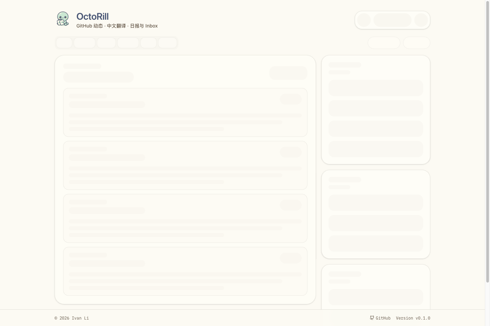
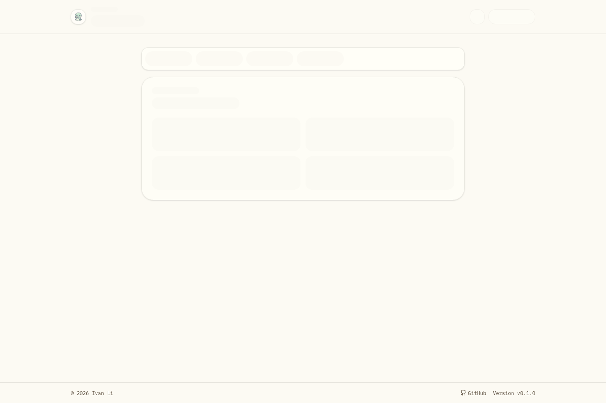
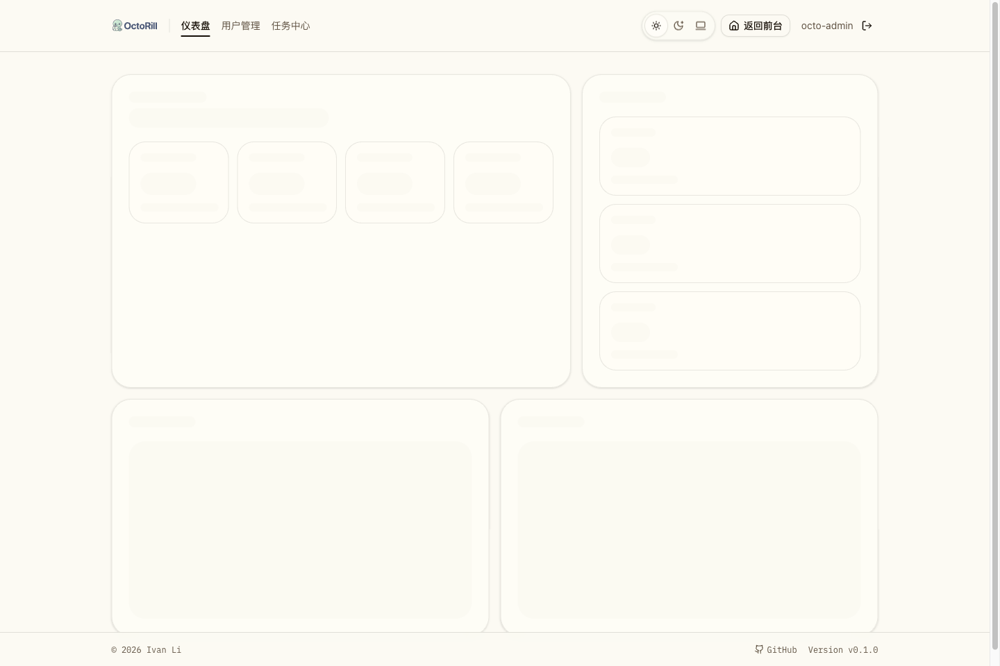
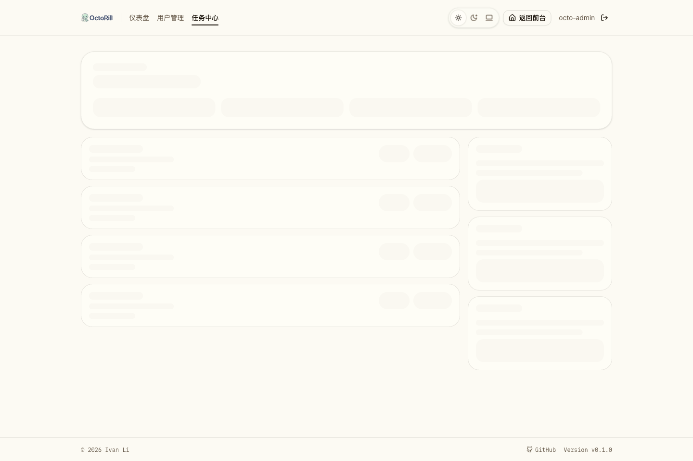

# Web 前端懒路由与按需拆包（#bydfx）

## 状态

- Status: 待实现
- Created: 2026-04-20
- Last: 2026-04-20

## 背景 / 问题陈述

当前前端虽然已经切到 TanStack Router，但 `web/src/routes/**` 仍主要以静态 surface import 为主：

- `/` 会在同一个入口里直接拉入 Landing / Dashboard 相关 surface。
- `/admin`、`/admin/jobs`、`/admin/users`、`/settings` 等重页面没有稳定的 route-level split 契约。
- 首开和站内导航缺少“chunk 拉取期间的稳定 fallback”，会限制后续 bundle 继续收敛。

需要把现有前端升级为“Router 自动拆包 + 关键入口手动分支拆包”的模型，在不改变 URL / auth / API 契约的前提下，降低非当前页面代码进入主包的概率。

## 目标 / 非目标

### Goals

- 在 `web/vite.config.ts` 启用 TanStack Router `autoCodeSplitting`。
- 让 `/admin`、`/admin/users`、`/admin/jobs`、`/admin/jobs/tasks/:taskId`、`/settings` 形成稳定 route-level lazy chunks。
- 让 `/` 额外做 Landing / Dashboard 分支级懒加载，避免匿名首开把 Dashboard surface 一起带入。
- 为懒路由补齐稳定 pending fallback：禁止白屏、禁止回退登录页闪烁、禁止破坏现有 search 规范化。
- 补齐 Storybook、Playwright 与构建证据，证明 chunk 按路由按需加载。

### Non-goals

- 不修改 `/api/me`、OAuth/session、已有 URL/search 契约。
- 不拆分 `__root.tsx`。
- 不做与本次按需拆包无关的业务逻辑重构。

## 范围

### In scope

- `web/vite.config.ts`
- `web/src/routes/**`
- 为避免主包回流所需的轻量 route-state/helper 抽离
- Storybook / Playwright / Visual Evidence / spec 同步

### Out of scope

- 后端 API / 数据库 / session 行为
- 文档站与公开 URL 策略调整
- 非路由 surface 的额外性能优化（如列表虚拟化、图片压缩）

## 规格与实现约束

### 路由拆包契约

- `__root.tsx` 继续 eager。
- `/settings`、`/admin/`、`/admin/users`、`/admin/jobs/`、`/admin/jobs/llm`、`/admin/jobs/scheduled`、`/admin/jobs/translations`、`/admin/jobs/tasks/:taskId`、`/admin/jobs/tasks/:taskId/llm/:callId` 必须具备 route-level lazy 入口。
- 若 split 文件需要路由 typed hooks，必须通过 `getRouteApi('/path')` 获取；不得直接 import 主 route `Route` 对象。
- `/` 除 route-level lazy 外，还必须把 Landing surface 与 Dashboard surface 继续拆到独立动态模块。

### Fallback 契约

- 匿名访问 `/` 时：auth 未决只显示现有 `AppBoot`；Landing chunk 未就绪前允许继续保持 `AppBoot`，但不得提前露出登录 CTA。
- 已登录访问 `/` 时：Dashboard chunk 未就绪前显示 `DashboardStartupSkeleton`。
- `/settings` chunk 未就绪前显示新的 settings shell-level skeleton。
- `/admin*` chunk 未就绪前显示对应 admin skeleton。
- 任何 pending fallback 都不得改变最终 URL/search 规范化结果。

### 产物与验证契约

- `bun run build` 后必须出现新增 route chunks，而不是继续只有单一大 bundle。
- Storybook 至少要提供：Landing lazy 首开、Dashboard lazy 首开、Settings pending、Admin Dashboard pending、Admin Jobs pending、稳态 settings/admin/jobs surface。
- Playwright 至少要证明：
  - 匿名 `/` 首开不会提前拉取 admin/settings/jobs lazy modules；
  - 访问 `/settings`、`/admin`、`/admin/jobs/...` 时才会请求对应 chunk；
  - 现有 auth boot、deep link、route search 规范化不回归。

## 验收标准

- Given 匿名用户首次打开 `/`
  When auth 仍未完成
  Then 页面只显示 `AppBoot`，且 network 中不应出现 admin/settings/jobs surface 对应的 lazy module 请求。

- Given 已登录用户首次打开 `/`
  When Dashboard surface 仍在拉取 chunk
  Then 页面显示 `DashboardStartupSkeleton`，并在 chunk 就绪后进入现有 Dashboard 工作台。

- Given 用户直接访问 `/settings`
  When settings chunk 尚未就绪
  Then 页面显示 settings shell-level skeleton；chunk 就绪后仍按现有 `section/linuxdo` search 规范化规则落到正确视图。

- Given 管理员访问 `/admin/jobs/tasks/:taskId`
  When jobs route chunk 尚未就绪
  Then 页面显示 admin jobs skeleton；chunk 就绪后仍保留现有任务抽屉与 `from/view` 语义。

- Given 执行生产构建
  When 查看 `dist/assets`
  Then 可见新增 route-level 或 branch-level chunk，且 `/settings`、`/admin*`、Landing、Dashboard 不再全部静态折叠进同一入口文件。

## 非功能性验收 / 质量门槛

### Testing

- `cd web && bun run build`
- `cd web && bun run storybook:build`
- `cd web && bun run e2e -- app-auth-boot.spec.ts landing-login.spec.ts dashboard-access-sync.spec.ts settings.spec.ts admin-jobs.spec.ts`
- 如新增 route lazy network proof spec，也必须纳入本轮验证。

### Visual Evidence

- 视觉证据优先使用 Storybook 稳定入口。
- 最终证据写入本 spec 的 `## Visual Evidence`。

## 实现里程碑（Milestones / Delivery checklist）

- [x] M1: 启用 Router 自动拆包，并抽离会导致主包回流的 route-state helpers。
- [x] M2: `/`、`/settings`、`/admin*` 完成 lazy route / branch split 与 pending fallback。
- [x] M3: Storybook 与 Playwright 补齐 lazy loading 验证入口。
- [ ] M4: 构建、视觉证据、review-loop、PR 合并与 cleanup 收口。

## Visual Evidence

- source_type: storybook_canvas
  story_id_or_title: Pages/App Boot / Landing Lazy Pending
  state: landing lazy pending
  evidence_note: 验证匿名访问 `/` 且 Landing chunk 仍在拉取时，页面继续保持中性 AppBoot，不提前露出登录 CTA。
  image:
  

- source_type: storybook_canvas
  story_id_or_title: Pages/App Boot / Dashboard Warm Skeleton
  state: dashboard warm skeleton
  evidence_note: 验证已登录访问 `/` 时，Dashboard surface pending 阶段使用工作台壳层 skeleton，而不是白屏或回退 Landing。
  image:
  

- source_type: storybook_canvas
  story_id_or_title: Pages/App Boot / Settings Warm Skeleton
  state: settings warm skeleton
  evidence_note: 验证 `/settings` 懒路由 pending 阶段保持 shell-level skeleton，并保留页头/页脚结构。
  image:
  

- source_type: storybook_canvas
  story_id_or_title: Pages/App Boot / Admin Dashboard Warm Skeleton
  state: admin dashboard warm skeleton
  evidence_note: 验证 `/admin` 懒路由 pending 阶段展示管理员壳层 skeleton。
  image:
  

- source_type: storybook_canvas
  story_id_or_title: Pages/App Boot / Admin Jobs Warm Skeleton
  state: admin jobs warm skeleton
  evidence_note: 验证 `/admin/jobs*` 懒路由 pending 阶段展示 jobs shell skeleton，并为任务抽屉/调度视图保留稳定框架。
  image:
  

## 风险 / 假设

- 风险：若 route helper 仍从重 surface 反向 import，会把 chunk 再次拉回主包。
- 风险：Vite dev server 下的 lazy module 请求路径可能带查询串，Playwright 断言需要按稳定子串匹配。
- 假设：当前 TanStack Router + Vite 插件版本支持 `autoCodeSplitting: true` 与 `.lazy.tsx` 并存。
- 假设：现有 auth bootstrap 语义允许在 chunk pending 期间继续复用 `AppBoot` / skeleton，不需要额外后端配合。
