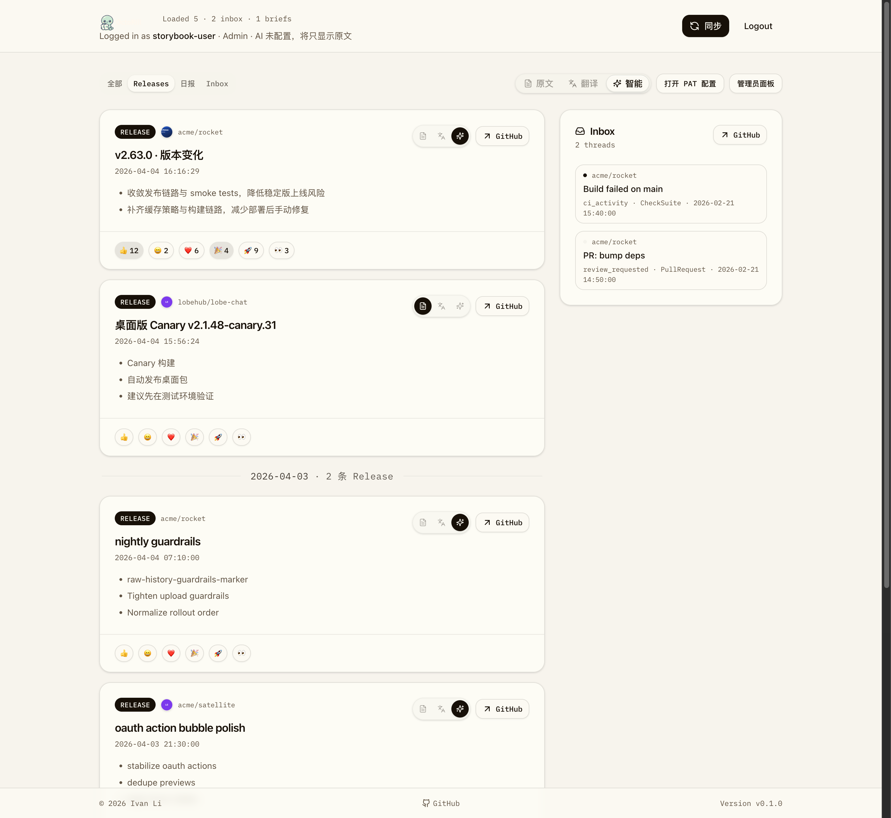
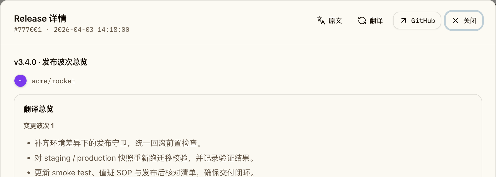

# Release 视图仓库图标补齐（#crzva）

## 状态

- Status: 已完成
- Created: 2026-04-10
- Last: 2026-04-10

## 背景 / 问题陈述

当前 Dashboard 的 Release Feed 卡片和 Release 详情侧栏只显示仓库全名文本，没有 GitHub 仓库在社交卡片或 owner 头像层面的视觉识别信息。对大量 release 连续阅读时，用户只能靠文本辨认来源仓库，缺少足够稳定的视觉锚点。

GitHub 官方语义里，仓库未设置自定义 social preview 时，链接默认展示 owner avatar；设置后则展示仓库自己的 social preview。本轮需要把这条语义引入 OctoRill 的 Release 视图，但不额外为历史未 star 仓库发实时 GitHub 补查。

## 目标 / 非目标

### Goals

- 在 Release Feed 卡片和 Release 详情侧栏补齐仓库图标。
- 图标来源固定为：`custom social preview -> owner/org avatar -> text-only`。
- 复用现有 starred repo sync，落库并透传 `openGraphImageUrl`、`usesCustomOpenGraphImage`、`owner.avatarUrl`。
- 前端通过统一 helper / 组件处理候选图与图片失败回退，避免 broken image。
- 补齐 Storybook、视觉证据与相关自动化测试，推进到 PR-ready。

### Non-goals

- 不修改 GitHub 原生 Release 页面或仓库 social preview 设置本身。
- 不为历史 brief-only 且当前未 star 的 release 发起额外 GitHub metadata 补查。
- 不把 repo visual 扩展到日报 Markdown、Inbox 或其他非 Release 展示面。

## 范围（Scope）

### In scope

- `starred_repos` schema、GraphQL sync 查询、落库与测试 helper。
- `/api/feed` 与 `/api/releases/:id/detail` 的 repo visual 响应扩展。
- Feed 卡片与 Release 详情侧栏的统一 repo visual 渲染。
- Dashboard Storybook mock、docs/play 场景与相关 Playwright mock 数据。
- `## Visual Evidence` 里的 owner-facing 截图。

### Out of scope

- Release workflow、CI、GitHub Release 自动化与 PR comment。
- 实时读取 GitHub repo metadata 的新后端接口。
- 除 Feed/详情侧栏外的其他产品面图标统一。

## 接口契约（Interfaces & Contracts）

### 新增响应结构：`repo_visual`

Feed release item 与 Release detail response 都新增：

- `owner_avatar_url: string | null`
- `open_graph_image_url: string | null`
- `uses_custom_open_graph_image: boolean`

约束：

- 仅当 `uses_custom_open_graph_image=true` 且 `open_graph_image_url` 非空时，前端才把 social preview 当作首选候选图。
- 若 `repo_visual` 整体缺失或两个 URL 都为空，前端必须退回文本仓库名，不渲染占位破图。

### 数据来源

- GraphQL `viewer.starredRepositories` 节点补拉：
  - `openGraphImageUrl`
  - `usesCustomOpenGraphImage`
  - `owner { login avatarUrl(size: 80) }`
- 这些字段只写入 `starred_repos`，Release feed/detail 从 join 结果读取，不新增 detail 临时补查路径。

## 功能与行为规格（Functional/Behavior Spec）

### Feed 卡片

- repo badge 行在 `RELEASE` / `未读` 之后显示统一 repo visual。
- custom social preview 使用固定尺寸、圆角裁切的小图块，保持头部布局稳定。
- social preview 加载失败时自动切回 owner/org avatar；avatar 再失败则只保留仓库名文本。

### Release 详情侧栏

- 仓库名上方标题区域使用同一 repo visual 规则。
- detail 若来自历史 brief link 且当前没有 `starred_repos` metadata，只显示 repo full name 文本，不显示损坏图片。

### Storybook / mock

- Dashboard stories 至少覆盖：
  - social preview 生效
  - avatar fallback
  - text-only fallback
- 视觉证据优先来自 Storybook，不依赖真实 GitHub 页面截图。

## 验收标准（Acceptance Criteria）

- Given 某仓库配置了 custom social preview
  When 它出现在 Feed 中
  Then 卡片头部显示 social preview 缩略图，且 repo 名、时间与右侧操作按钮布局稳定。

- Given 某仓库没有 custom social preview 但存在 owner/org avatar
  When 它出现在 Feed 或 Release detail 中
  Then 两处都显示 owner/org avatar。

- Given social preview URL 加载失败
  When 前端尝试渲染图标
  Then UI 自动回退到 avatar；若 avatar 也失败则只保留文本，不显示 broken image。

- Given release detail 只能通过历史 brief link 打开，且当前无 starred repo metadata
  When 用户打开 detail
  Then detail 仍可正常显示标题与 repo 名，但 repo visual 保持 text-only fallback。

- Given Storybook 构建与相关测试通过
  When 查看对应 stories/docs
  Then 可以稳定复核 social preview / avatar / text-only 三态。

## 非功能性验收 / 质量门槛（Quality Gates）

### Testing

- `cargo test`（至少覆盖 repo visual API / feed row / detail row / sync snapshot 相关新增用例）
- `cd web && bun run build`
- `cd web && bun run storybook:build`
- 相关 Playwright / mock 回归（若仓库已有稳定场景，则优先补充该场景）

### UI / Storybook

- Dashboard Storybook 必须提供可稳定截图的 release repo visual gallery/state。
- 视觉证据必须绑定本轮实现的最新本地 `HEAD`。

## 文档更新（Docs to Update）

- `docs/specs/README.md`
- 本 spec 的 `## Visual Evidence`

## Visual Evidence

- Storybook canvas：`pages-dashboard--release-repo-visuals`
  - 验证 Feed 在同一组稳定 mock 中同时覆盖 `social preview -> owner avatar -> text-only` 三态。

- Storybook canvas：`pages-dashboard--briefs-long-content-with-detail`
  - 验证从 brief 打开的 Release 详情在有 metadata 时显示 owner avatar fallback。

## 实现里程碑（Milestones / Delivery checklist）

- [x] M1: starred repo sync 与 schema 完成 repo visual metadata 落库。
- [x] M2: Feed / Release detail API 与前端统一 repo visual 渲染完成。
- [x] M3: Storybook、测试与视觉证据刷新完成。

## 风险 / 假设

- 风险：custom social preview 多为横图，小尺寸裁切后可读性可能不稳定；需要用统一容器尺寸和对象裁切策略保证观感。
- 假设：本轮只接受 sync 已落库的 repo metadata，不为 detail 新增实时 GitHub 查询链路。
