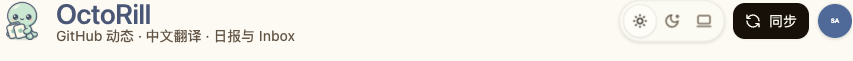
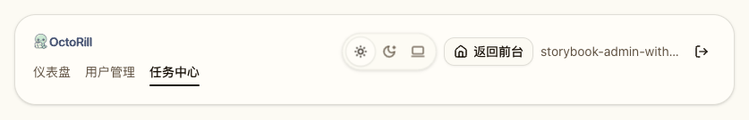
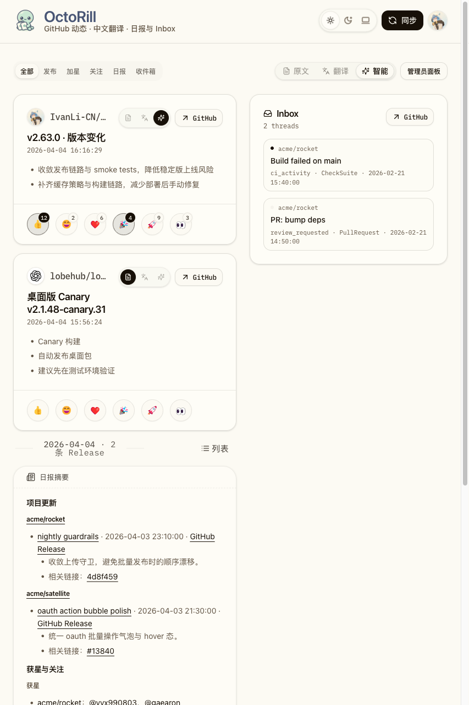

# Dashboard / Admin 平板页头对齐修复（#cuz3w）

## 状态

- Status: 部分完成（3/4）
- Created: 2026-04-21
- Last: 2026-04-21

## 背景 / 问题陈述

- 主人反馈在 `853x1280` 一类平板视口下，Dashboard 与 Admin 页头会退回移动前的纵向堆叠：utility actions 从品牌 / 导航块下方起排，导致顶部结构错位。
- 当前 `DashboardHeader` 与 `AdminHeader` 都把“同排对齐”的布局切换点压在 `lg (>=1024px)`，`768–1023px` 区间缺少独立的 tablet contract。
- 现有 Storybook 与 Playwright 覆盖主要集中在桌面与手机壳层，缺少平板视口下“主行对齐 + 无横向溢出”的稳定回归。

## 目标 / 非目标

### Goals

- 为 Dashboard / Admin 页头补齐 `768–1023px` 的 tablet-inline 两列合同。
- 保持 Dashboard 品牌区 / tabs 控制带、Admin 导航区的现有信息层级，只修正 utility actions 的对齐与挤压问题。
- 为 DashboardHeader、Dashboard 页面与 AdminHeader 增加平板 Storybook 审阅入口和回归断言。
- 为 dashboard/admin Playwright 增加 `853x1280` 平板 smoke，锁住“同排对齐 + 无横向溢出”。

### Non-goals

- 不改动 `<=639px` 的 mobile compact shell、手势、sticky rail 或 footer auto-hide 语义。
- 不改动 `>=1024px` 的 desktop 品牌 / 导航布局语义。
- 不调整 Feed / Inbox / Release 卡片结构，不修改 API、路由、schema、数据库或权限逻辑。

## 范围（Scope）

### In scope

- `web/src/pages/DashboardHeader.tsx`
- `web/src/layout/AdminHeader.tsx`
- `web/src/stories/DashboardHeader.stories.tsx`
- `web/src/stories/Dashboard.stories.tsx`
- `web/src/stories/AdminHeader.stories.tsx`
- `web/e2e/dashboard-access-sync.spec.ts`
- `web/e2e/admin-users.spec.ts`
- `web/e2e/admin-jobs.spec.ts`
- `docs/specs/README.md`
- `docs/specs/cuz3w-dashboard-admin-tablet-header-alignment/SPEC.md`

### Out of scope

- `src/**` Rust backend
- Landing、Settings 与非页头 UI
- 任何新增公开 props / API contract

## 需求（Requirements）

### MUST

- DashboardHeader 在 `768–1023px` 必须采用两列主行：左列品牌 / 副标题，右列 `ThemeToggle + 同步 + avatar`。
- AdminHeader 在 `768–1023px` 必须采用两列主行：左列品牌 + 管理员导航块，右列 `ThemeToggle + 返回前台 + login/logout`。
- Dashboard / Admin 页头在 `853x1280` 下不得出现 utility actions 从品牌 / 导航块下方起排的错位。
- 平板合同下页头容器不得产生水平滚动；长 login 文本需要安全收口，不得把返回前台按钮挤出可视区。
- Storybook 必须提供稳定的平板 viewport 审阅入口，并通过 `play` 断言验证“主行同排 + 无横向溢出”。
- Playwright 必须补齐 Dashboard / Admin 的平板 smoke，覆盖 `853x1280`。

### SHOULD

- 尽量复用现有 `data-dashboard-brand-block`、`data-dashboard-primary-actions` 等锚点，只补最少的新 `data-*` 合同。
- `640–767px` 若顺带改善可以接受，但不单独扩 scope 或新增额外断言。

### COULD

- 无。

## 功能与行为规格（Functional/Behavior Spec）

### Core flows

1. **Dashboard tablet shell**
   - `DashboardHeader` 在平板区间进入两列主行。
   - 品牌块继续显示 `OctoRill` 与副标题。
   - `ThemeToggle`、`同步`、头像入口固定在右列，不再被挤到品牌块下方。
   - 下方 tabs / secondary controls 继续保留为后续控制带。

2. **Admin tablet shell**
   - `AdminHeader` 在平板区间进入两列主行。
   - 左列继续保持品牌块在上、管理员导航在下的结构。
   - 右列固定 utility actions，并允许 login 文本截断。

3. **Storybook / Playwright validation**
   - Storybook 暴露 `853x1280` 平板入口，断言主行对齐与无横向溢出。
   - Playwright 在相同视口验证 Dashboard 与 Admin 页头布局稳定。

### Edge cases / errors

- `login` 较长时，AdminHeader 只允许 login 文本截断，不得压坏 `返回前台` 与退出登录按钮。
- Dashboard tablet 布局不能破坏手机单行壳层，也不能影响桌面 `lg` 以上现有品牌优先布局。

## 接口契约（Interfaces & Contracts）

### 接口清单（Inventory）

| 接口（Name） | 类型（Kind） | 范围（Scope） | 变更（Change） | 契约文档（Contract Doc） | 负责人（Owner） | 使用方（Consumers） | 备注（Notes） |
| --- | --- | --- | --- | --- | --- | --- | --- |
| `DashboardHeader` layout contract | React component | internal | Modify | None | web | Dashboard / Storybook / Playwright | 新增 tablet 主行锚点，不扩公开 props |
| `AdminHeader` layout contract | React component | internal | Modify | None | web | Admin pages / Storybook / Playwright | 新增 tablet 主行锚点，不扩公开 props |

### 契约文档（按 Kind 拆分）

- None

## 验收标准（Acceptance Criteria）

- Given `853x1280` 打开 Dashboard
  When 页头完成渲染
  Then 品牌块与 `ThemeToggle / 同步 / avatar` 处于同一顶层主行，且页头容器无水平滚动。

- Given `853x1280` 打开 Admin Users 或 Admin Jobs
  When 页头完成渲染
  Then utility actions 固定在品牌 / 导航块右侧，`返回前台` 仍可见可点，login 文本即使过长也只截断自身。

- Given Storybook 平板审阅入口
  When 运行对应 `play`
  Then 必须断言主行对齐、actions 不落到品牌 / 导航块下方，且无横向溢出。

- Given 运行 `dashboard-access-sync.spec.ts`、`admin-users.spec.ts` 与 `admin-jobs.spec.ts`
  When 切换到 `853x1280`
  Then 目标用例必须通过，不回退移动端 / 桌面既有合同。

## 实现前置条件（Definition of Ready / Preconditions）

- Storybook 已接通 `storybook/viewport`，可新增稳定的平板 viewport。
- 当前仓库允许在页头组件与 E2E 中新增内部 `data-*` 测试钩子。

## 非功能性验收 / 质量门槛（Quality Gates）

### Testing

- `cd web && bun run build`
- `cd web && bun run storybook:build`
- `cd web && bun run e2e -- dashboard-access-sync.spec.ts admin-users.spec.ts admin-jobs.spec.ts`

### UI / Storybook (if applicable)

- Stories to add/update: `web/src/stories/DashboardHeader.stories.tsx`、`web/src/stories/Dashboard.stories.tsx`、`web/src/stories/AdminHeader.stories.tsx`
- Visual evidence source: Storybook canvas
- Visual evidence sink: `## Visual Evidence`

## 文档更新（Docs to Update）

- `docs/specs/README.md`
- `docs/specs/cuz3w-dashboard-admin-tablet-header-alignment/SPEC.md`

## 计划资产（Plan assets）

- Directory: `docs/specs/cuz3w-dashboard-admin-tablet-header-alignment/assets/`

## Visual Evidence

- source_type: `storybook_canvas`
  target_program: `mock-only`
  capture_scope: `browser-viewport`
  requested_viewport: `853x1280`
  viewport_strategy: `devtools-emulate`
  sensitive_exclusion: `N/A`
  submission_gate: `pending-owner-approval`
  story_id_or_title: `Pages/Dashboard Header / Evidence / Tablet Inline Header`
  state: `tablet-inline-dashboard-header`
  evidence_note: 验证 DashboardHeader 在 `853x1280` 下已切到平板两列主行，品牌区与 `ThemeToggle / 同步 / avatar` 保持同排对齐，没有回退到品牌块下方堆叠。
  image:
  

- source_type: `storybook_canvas`
  target_program: `mock-only`
  capture_scope: `browser-viewport`
  requested_viewport: `853x1280`
  viewport_strategy: `devtools-emulate`
  sensitive_exclusion: `N/A`
  submission_gate: `pending-owner-approval`
  story_id_or_title: `Layout/Admin Header / Evidence / Tablet Inline Header`
  state: `tablet-inline-admin-header`
  evidence_note: 验证 AdminHeader 在 `853x1280` 下把 utility cluster 固定在品牌 / 管理导航右侧，`返回前台` 保持可见，长 login 仅截断自身。
  image:
  

- source_type: `storybook_canvas`
  target_program: `mock-only`
  capture_scope: `browser-viewport`
  requested_viewport: `853x1280`
  viewport_strategy: `devtools-emulate`
  sensitive_exclusion: `N/A`
  submission_gate: `pending-owner-approval`
  story_id_or_title: `Pages/Dashboard / Evidence / Tablet Header Inline`
  state: `tablet-inline-dashboard-page`
  evidence_note: 验证 Dashboard 页面级壳层在平板口径下维持页头主行同排、tabs / secondary controls 仍位于后续控制带，且容器没有水平滚动回归。
  image:
  

## 实现里程碑（Milestones / Delivery checklist）

- [x] M1: 冻结平板页头 spec 与 README 索引。
- [x] M2: 完成 Dashboard / Admin 页头 tablet-inline 布局与内部测试锚点。
- [x] M3: 补齐 Storybook 平板入口、Playwright 回归与视觉证据。
- [ ] M4: 在主人确认截图可用于后续 push / PR 后，推进快车道 PR-ready 收口。

## 方案概述（Approach, high-level）

- 让两个页头在 `md` 区间切到 grid 两列主行，把 utility actions 固定到右列。
- 保持 Dashboard tabs / Admin 导航块的现有层级，不扩大到信息架构改造。
- 用 Storybook 与 Playwright 同时锁住 `853x1280` 的布局合同，避免再次回归到“平板看起来像手机堆叠”。

## 风险 / 开放问题 / 假设（Risks, Open Questions, Assumptions）

- 风险：若后续再往 utility actions 塞入新按钮，平板主行可能再次被挤压，需要继续守住截断与两列合同。
- 开放问题：无。
- 假设：`853x1280` 是本轮最关键的 canonical tablet proof，`768–1023px` 可以作为统一合同区间。

## 变更记录（Change log）

- 2026-04-21: 创建 follow-up spec，冻结 Dashboard / Admin 平板页头对齐修复合同。
- 2026-04-21: 已完成 Dashboard / Admin 平板页头两列主行实现，补齐 Storybook `853x1280` 审阅入口、Playwright tablet smoke 与本地视觉证据；后续仅等待主人确认截图是否可进入 push / PR。

## 参考（References）

- `docs/specs/76bxs-dashboard-header-brand-layout/SPEC.md`
- `docs/specs/p82d7-dashboard-admin-mobile-shell-polish/SPEC.md`
- `docs/specs/kgepw-dashboard-all-tab-mobile-header-scroll/SPEC.md`
