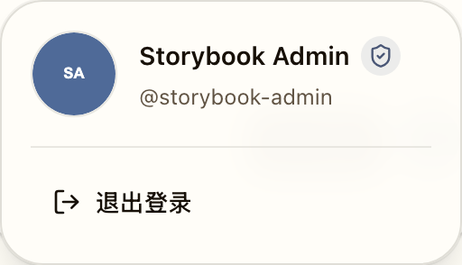

# Dashboard 页头品牌与账号菜单

> 本文件是 Dashboard 页头的长期需求合同。实现覆盖见 `IMPLEMENTATION.md`，主题演进见 `HISTORY.md`。

## Context and Scope

- Context: Dashboard 是高频阅读工作台，页头必须让产品品牌、主同步操作与低频账号操作形成稳定层次，而不是争夺同一视觉区域。
- In scope: `DashboardHeader` 的品牌布局、主操作区、账号菜单、响应式排列与关联的可复现前端验证。
- Out of scope: Dashboard 正文、侧栏、AdminHeader、Landing、品牌资产、后端同步流程、OAuth/PAT 与 URL 契约。

## Terms and Interfaces

- 品牌位: 包含 `OctoRill` 字标及其产品定位的 Dashboard 页头主视觉区。
- 账号菜单: 由右侧头像触发的浮层，承载账号详情、设置、管理员入口与退出登录等低频操作。
- Hover bridge: 位于头像和账号菜单视觉间距中的透明可达区域，使指针在二者间移动时仍属于账号菜单。
- Interface: `DashboardHeaderProps` 是 Dashboard、Storybook 和品牌展示面共享的内部 React 接口。

## Requirements

### REQ-DASHBOARD-HEADER-001

- Dashboard 页头必须显示完整 `OctoRill` 字标及产品定位，且不得显示 `Loaded / inbox / briefs` 统计文案。
- 右侧主操作区只能包含 `同步` 与头像入口；退出登录只能位于账号菜单内。

### REQ-DASHBOARD-HEADER-002

- 账号菜单必须在 hover 或 click 时展示显示名、`@login`、可选邮箱、管理员图标标记、可选 `AI 未配置` 提示以及低频操作。
- 管理员身份不得在品牌主行占用独立 badge 或额外主操作位。

### REQ-DASHBOARD-HEADER-003

- 账号菜单必须在头像与浮层之间保留连续的 hover 可达范围。
- 指针以自然速度跨越该视觉间距时，浮层不得提前关闭；只有指针离开整个账号菜单后才可关闭。触摸输入仍以点击固定打开语义为准。
- 浮层显示时必须从头像所在的右上锚点以短暂淡入和轻微位移建立空间连续性；隐藏时更快淡出。系统要求减少动态效果时保留淡入淡出并移除空间位移与缩放。

### REQ-DASHBOARD-HEADER-004

- 页头必须在中等与窄宽度下保持品牌可读，且同一组件结果必须供 Dashboard、Storybook 与品牌展示面使用。

## Verification

### VER-DASHBOARD-HEADER-001

- Method: Dashboard Header Storybook 默认态与 Playwright 管理员 Dashboard smoke。
- covers: `REQ-DASHBOARD-HEADER-001`, `REQ-DASHBOARD-HEADER-002`
- Pass condition: 字标、产品定位、同步和头像入口可见，账号菜单包含约定内容，且旧统计文案不存在。

### VER-DASHBOARD-HEADER-002

- Method: Dashboard Header Storybook `Evidence / Account menu hover bridge` 的交互断言与视觉审阅。
- covers: `REQ-DASHBOARD-HEADER-003`
- Pass condition: hover 打开账号菜单后，透明 bridge 存在且面板以打开动效状态保持原有视觉间距与可见状态。

### VER-DASHBOARD-HEADER-003

- Method: Playwright `dashboard-access-sync.spec.ts` 的头像到面板慢速斜向指针路径。
- covers: `REQ-DASHBOARD-HEADER-003`
- Pass condition: 指针逐步移动到面板内部后，账号菜单仍保持展开；离开整个菜单后，面板先进入关闭动效状态再卸载。

### VER-DASHBOARD-HEADER-004

- Method: Dashboard Header 的平板与移动端 Storybook 场景以及前端构建。
- covers: `REQ-DASHBOARD-HEADER-004`
- Pass condition: 已定义的响应式页头场景通过构建并保持可读的品牌和操作布局。

## Related ADRs

- None

## Visual Evidence

- Dashboard 页头默认态确认品牌位、同步与头像入口的层次。

- 账号浮层近景确认菜单中的账号信息、管理员图标与低频退出入口；hover bridge 保持透明，因此不改变该面板的视觉间距。

## References

- `./IMPLEMENTATION.md`
- `./HISTORY.md`
- `web/src/pages/DashboardHeader.tsx`
- `web/src/stories/DashboardHeader.stories.tsx`
- `web/e2e/dashboard-access-sync.spec.ts`
