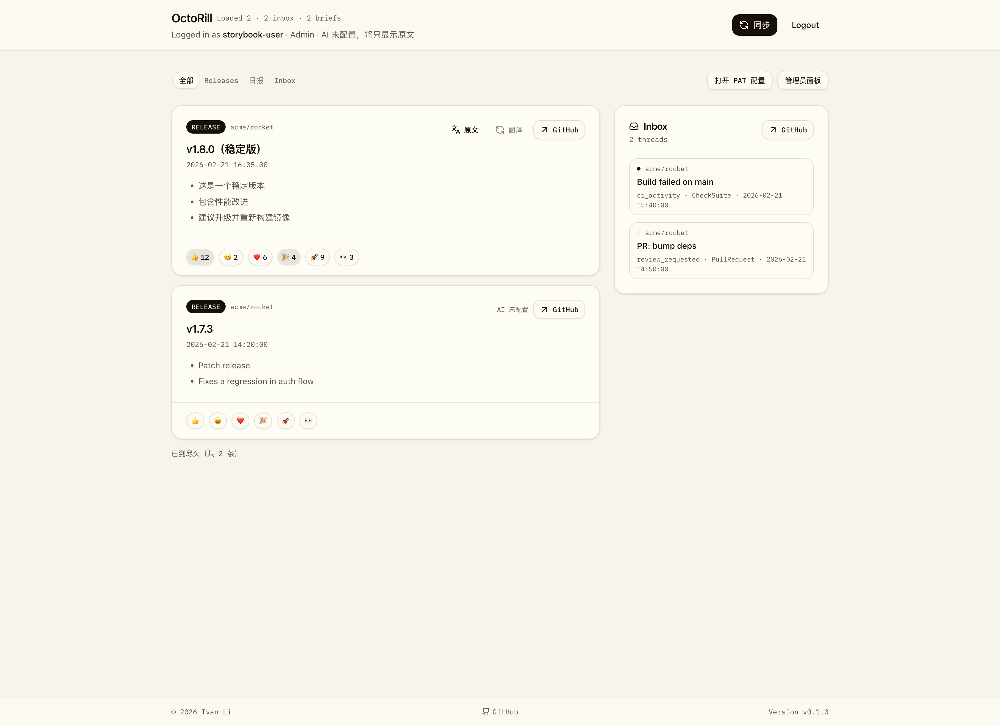
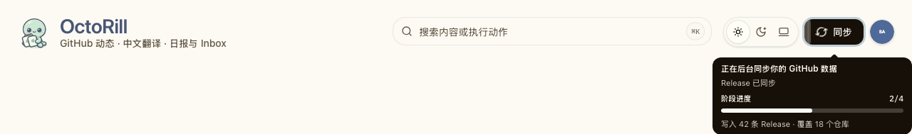
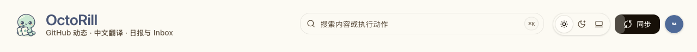
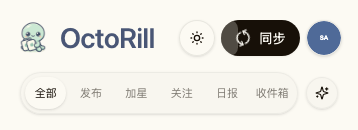

# Dashboard 同步入口收敛与顺序固定

## Context and Scope

- Dashboard 顶部同时暴露 `Sync all`、`Sync starred`、`Sync releases`、`Sync inbox` 多个入口，界面操作噪音过高。
- 页面内空态和 release 反馈场景还存在局部同步按钮，和“统一从顶部触发同步”的心智不一致。
- 主同步流程虽然当前已按 `starred -> releases -> notifications` 顺序串行执行，但界面未明确收敛到唯一入口，也缺少对应的视觉回归证据。

本主题覆盖 Dashboard React 页面、同步任务 SSE 消费、顶部同步 Header、Feed/Inbox 空态入口、Storybook 和 Dashboard Playwright 回归；不改变 Rust 后端同步 API、任务模型或事件名称。

## 目标 / 非目标

### Goals

- 将 Dashboard 头部操作收敛为 `同步` 与 `Logout`，不再保留单独的 `Refresh`。
- 主同步按钮使用左侧刷新 icon，并且只在全量同步执行中旋转；同步中按钮保持可点击，进度气泡默认收起，详情由用户主动打开。
- 主同步按钮将确认进度作为锚点，以从左到右的按钮背景填充展示受限、单调、连续的预测进度；预测值只承担视觉连续性，不替代后端确认进度。
- 保证客户端全量同步顺序固定为 `starred -> releases -> notifications -> refreshAll`。
- 更新 Storybook 审阅入口，并保留一张默认态视觉证据。

### Non-goals

- 不改动后端同步 API、任务模型或返回契约。
- 不新增独立的 inbox/release 局部同步逻辑。
- 不改动管理员页面、OAuth 流程或 PAT 配置行为。

## 范围（Scope）

### In scope

- `web/src/pages/Dashboard.tsx`
- `web/src/pages/DashboardHeader.tsx`
- `web/src/feed/FeedList.tsx`
- `web/src/feed/FeedItemCard.tsx`
- `web/src/inbox/InboxList.tsx`
- `ui_demo: ./demo/focus/repo/octo-demo/release-lab?demo=dashboard-repo-publish`
- `docs/specs/README.md`

### Out of scope

- Rust 后端 API 与任务编排
- 非 Dashboard 页面或 admin 界面
- Playwright 登录流扩展

## Requirements

### MUST

- REQ-SYNC-ENTRY: 顶部同步操作 MUST 只保留一个名为 `同步` 的按钮，不得显示 `Refresh`、`Sync starred`、`Sync releases` 或 `Sync inbox`。
- REQ-SYNC-DETAIL-DISCLOSURE: 全量同步开始时进度气泡 MUST 默认收起；用户 hover、聚焦或点击同步按钮时才显示详情，outside-click / `Escape` 关闭后可再次恢复。
- REQ-SYNC-CONFIRMED-PROGRESS: 详情中的阶段数字和工作量 MUST 只使用现有 `task.progress` SSE 事件确认的值，预测值不得写入详情数字或业务状态。
- REQ-SYNC-PREDICTION: 按钮背景 MUST 从左到右展示受限、单调、连续的预测填充，不得越过下一个确认阶段锚点；阶段事件到达时必须平滑校准，不显示 ETA。
- REQ-SYNC-LIFECYCLE: SSE 暂时断线或重连时预测填充 MUST 保持当前阶段边界；只有任务完成且 `refreshAll` 成功后才可平滑填满 100%，失败不得伪装成完成。
- REQ-SYNC-MOTION: 系统启用 `prefers-reduced-motion` 时 MUST 保留确认进度和填充位置，但取消连续缓动、移动高光和同步 icon 旋转。
- REQ-SYNC-DEDUPE: 全量同步进行中按钮 MUST 保持可点击，重复点击不得新建第二个同步任务或显示替代详情的 toast。
- REQ-SYNC-ORDER: 点击 `同步` 时客户端 MUST 按 `starred -> releases -> notifications -> refreshAll` 顺序串行执行，且不得新增局部同步入口。

### SHOULD

- Storybook 应提供默认态、同步中与空态的可审阅入口。
- 文案应明确顶部 `同步` 是统一入口，避免残留旧按钮名称。

### COULD

- 无。

## 功能与行为规格（Functional/Behavior Spec）

### Core flows

- 用户在 Dashboard 顶部点击 `同步`，页面进入 busy 状态；按钮保持可点击并展示旋转 icon。
- 同步开始后 tooltip 默认不显示；用户主动 hover、聚焦或点击按钮时，tooltip 展示“正在后台同步你的 GitHub 数据”、当前阶段、`0/4` 到 `4/4` 确认进度，以及 SSE payload 中已有的仓库、Release、社交事件或 Inbox 通知计数。
- 按钮背景使用确认阶段作为锚点计算预测进度：当前锚点为 `currentStep / totalSteps`，预测上限为下一个阶段锚点；进度用单调缓动持续逼近，约在一个软时间常数后接近区间的 90%，随后渐近逼近但不越界，不显示 ETA。
- 阶段事件到达时，按钮背景从当前视觉位置平滑过渡到新的确认锚点；任何异常、重复或乱序事件都不得造成视觉倒退。
- 同步中 tooltip 支持 outside-click dismissal：点击同步按钮与气泡自身不关闭，点击页面其它空白区域或按 `Escape` 关闭当前气泡；下一次 hover、聚焦或点击同步按钮可恢复当前确认详情。
- 同步中再次点击 `同步` 时，前端恢复当前进度气泡，不再次调用 `/api/sync/all?return_mode=task_id`，也不发出替代详情的 toast。
- 同步流程依次请求 starred、releases、notifications 三个端点；任一步失败时沿用既有 `run/busy` 错误处理，不继续后续请求。
- `task.completed` 后的 `refreshAll` 仍属于同步生命周期；页面刷新成功前不得把按钮视为 100%。成功时平滑填满并短暂保持，随后清除填充；失败时保留当前视觉位置并使用既有错误提示。
- Feed 空态仍可提供一个页面内 `同步` CTA，但其行为与顶部主按钮完全一致。

### Edge cases / errors

- `Generate brief` 等非全量同步 busy 状态不应让 `同步` icon 旋转。
- Inbox 为空时只提示使用顶部 `同步` 获取数据，不再出现 `Sync inbox` 局部按钮。
- release 反馈需要 release 数据时，只提示使用顶部 `同步` 更新 releases，不再提供卡片级 `Sync releases`。
- 预测进度只用于按钮视觉填充；详情中的阶段数字、工作量和错误文案仍以确认事件及终态为准。
- 预测进度不得改变同步请求顺序、任务去重、刷新时机或任何后端契约。

## 接口契约（Interfaces & Contracts）

- `DashboardHeaderProps`：收敛为单一 `onSyncAll` 入口，并增加显式全量同步渲染态 `syncingAll` 与前端内部 `syncLifecycle`；同步进度作为内部 UI props 传入，不改变后端接口契约。
- `FeedList` / `FeedItemCard`：移除 `onSyncReleases` 透传，`sync_required` 仅保留提示文案。

## Related ADRs

None

## Verification

- VER-SYNC-ENTRY: covers: REQ-SYNC-ENTRY; Storybook Default and Dashboard E2E assert the single top-level sync action and absence of legacy labels.
- VER-SYNC-DETAIL-DISCLOSURE: covers: REQ-SYNC-DETAIL-DISCLOSURE; Storybook Warmup/Syncing/SyncingMobile and Dashboard E2E assert default closed, hover/focus/click recovery, outside-click, and Escape dismissal.
- VER-SYNC-CONFIRMED-PROGRESS: covers: REQ-SYNC-CONFIRMED-PROGRESS; tooltip progressbar and task stream fixtures assert displayed `currentStep/totalSteps` remains confirmed SSE data.
- VER-SYNC-PREDICTION: covers: REQ-SYNC-PREDICTION; Storybook DOM probe and Dashboard E2E assert monotonic button fill, stage-boundary cap, smooth event interpolation, and no ETA text.
- VER-SYNC-LIFECYCLE: covers: REQ-SYNC-LIFECYCLE; task stream fixtures cover reconnect/failure, refresh completion gating, success fill, and failure hold without false 100%.
- VER-SYNC-MOTION: covers: REQ-SYNC-MOTION; reduced-motion browser run and CSS media rules assert no continuous fill animation, sheen, or icon rotation while confirmed fill remains visible.
- VER-SYNC-DEDUPE: covers: REQ-SYNC-DEDUPE; Dashboard E2E repeats the sync click and asserts one `/api/sync/all?return_mode=task_id` request.
- VER-SYNC-ORDER: covers: REQ-SYNC-ORDER; existing Dashboard sync stream tests and `bun run build` preserve the client request ordering and shared CTA contract.

## 验收标准（Acceptance Criteria）

- Given Dashboard 默认态
  When 页面渲染完成
  Then 顶部只出现一个名为 `同步` 的同步按钮，且不存在 `Refresh`、`Sync starred`、`Sync releases`、`Sync inbox` 按钮。

- Given 用户触发全量同步
  When `同步` 流程进行中
  Then 顶部 `同步` 按钮可点击，左侧 icon 旋转，详情默认收起；按钮背景从左到右连续展示不超过下一个阶段锚点的预测进度，用户主动悬浮、聚焦或点击后才看到确认阶段与已完成工作量；重复点击不会新建第二个同步任务或显示替代详情的 toast。

- Given 全量同步进度气泡已经显示
  When 用户点击页面空白处或按 `Escape`
  Then 气泡关闭，后台同步继续运行；下一次 hover、聚焦或点击同步按钮时可恢复详情，下一次全量同步开始时按钮重新计算预测进度但详情仍默认收起。

- Given 全量同步进度气泡已被当前用户收起
  When 用户再次 hover、聚焦或点击顶部 `同步`
  Then 当前阶段进度与已完成工作量重新显示，且 `/api/sync/all?return_mode=task_id` 请求次数不增加。

- Given 全量同步在两个 `task.progress` 事件之间持续运行
  When 页面仍处于同步状态
  Then 按钮预测填充单调、连续、平滑地逼近下一阶段锚点；它不倒退、不越界、不显示 ETA，确认事件到达后平滑校准。

- Given 同步事件流暂时断线后恢复
  When 断线尚未进入最终失败
  Then 预测填充保持当前阶段边界内的连续状态；恢复后按新的确认阶段校准，不出现归零或倒退。

- Given 后台任务已完成但 `refreshAll` 尚未成功
  When 页面刷新仍在进行
  Then 按钮不得显示 100%；只有刷新成功后才平滑填满，短暂保持后恢复普通背景。

- Given 系统启用 `prefers-reduced-motion`
  When 全量同步进行中
  Then 仍显示确认进度与填充位置，但不播放连续缓动、移动高光或旋转 icon。

- Given Feed 为空
  When 空态卡片显示
  Then 页面内只保留一个 `同步` CTA，并提示实际顺序是 starred → releases → Inbox。

- Given Inbox 为空或 release 反馈尚未就绪
  When 相应空态/提示渲染
  Then 只展示“使用顶部同步”的文案，不出现局部同步按钮。

## 实现前置条件（Definition of Ready / Preconditions）

- Dashboard 同步入口现状已确认。
- Storybook 已存在且支持 docs/autodocs。
- 同步顺序与收敛边界已冻结。

## 非功能性验收 / 质量门槛（Quality Gates）

### Testing

- `cd web && bun run build`
- `cd web && bun run storybook:build`
- 覆盖详情默认收起、主动恢复、预测进度单调不倒退、不越过阶段锚点、乱序事件忽略、断线重连和 reduced-motion。

### Visual verification

- 使用 Storybook 产出一张 Dashboard 默认态视觉证据。
- 使用 Storybook 产出桌面端与 390px 移动端的同步进度恢复视觉证据。
- 使用 Storybook 产出同步按钮预测填充、阶段校准、成功填满与失败停留的视觉证据。
- 视觉证据需写入本 spec 的 `## Visual Evidence`。

## Visual Evidence

- source_type: `storybook_canvas`
  target_program: `mock-only`
  capture_scope: `browser-viewport`
  requested_viewport: `none`
  viewport_strategy: `storybook-viewport`
  sensitive_exclusion: `N/A`
  submission_gate: `approved`
  story_id_or_title: `Pages/Dashboard Header / Syncing`
  state: `sync-progress-tooltip`
  evidence_note: 验证 Dashboard 页头 `同步` 按钮在全量同步中保持可点击、背景从左到右填充预测进度，刷新 icon 旋转；用户主动交互后悬浮气泡展示确认阶段与已完成工作量。
  image:
  

- source_type: `storybook_canvas`
  target_program: `mock-only`
  capture_scope: `browser-viewport`
  requested_viewport: `1280x720`
  viewport_strategy: `storybook-viewport`
  margin_policy: `trim_only`
  evidence_surface: `page`
  sensitive_exclusion: `N/A`
  submission_gate: `approved`
  story_id_or_title: `Pages/Dashboard Header / Syncing`
  state: `sync-progress-recovery-desktop`
  evidence_note: 验证桌面端同步开始时详情默认收起，按钮背景保留预测填充；重新 hover、聚焦或点击同步按钮均恢复同一份确认阶段与工作量详情。
  image:
  

- source_type: `storybook_canvas`
  target_program: `mock-only`
  capture_scope: `browser-viewport`
  requested_viewport: `390x844`
  viewport_strategy: `storybook-viewport`
  margin_policy: `trim_only`
  evidence_surface: `page`
  sensitive_exclusion: `N/A`
  submission_gate: `approved`
  story_id_or_title: `Pages/Dashboard Header / Regression / Mobile sync recovery`
  state: `sync-progress-recovery-mobile`
  evidence_note: 验证 390px 移动端同步详情默认收起，按钮背景按确认阶段展示预测填充，触控点击同步按钮恢复当前详情且布局不溢出。
  image:
  

## 方案概述（Approach, high-level）

- 仅保留一个顶部主同步入口，并将全量同步渲染态与业务顺序解耦成明确状态。
- 页面内所有局部同步入口统一改成引导文案，避免行为分叉。
- 通过 Dashboard Storybook stories 呈现默认态、同步中和空态，其中默认态作为最终视觉证据源。

## 风险 / 开放问题 / 假设（Risks, Open Questions, Assumptions）

- 风险：若 props 收敛不完整，Storybook 与页面实现可能出现类型漂移。
- 开放问题：无。
- 假设：顶部仍保留 `Logout`，但同步相关入口只剩一个 `同步`。

## 参考（References）

- `web/src/pages/Dashboard.tsx`
- `web/src/pages/DashboardHeader.tsx`
- `ui_demo: ./demo/focus/repo/octo-demo/release-lab?demo=dashboard-repo-publish`
