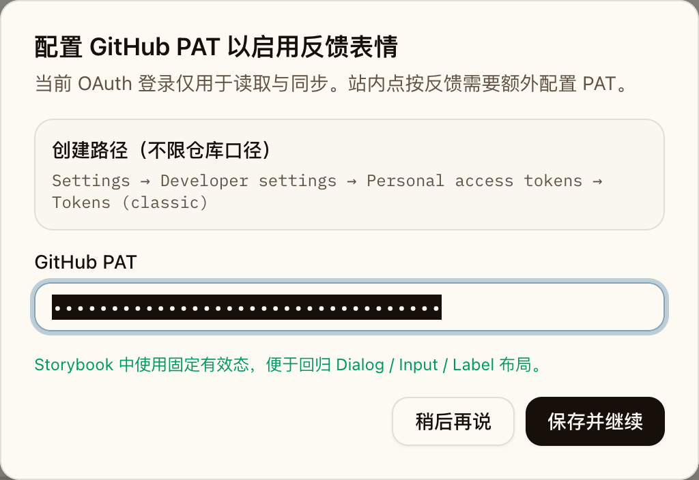
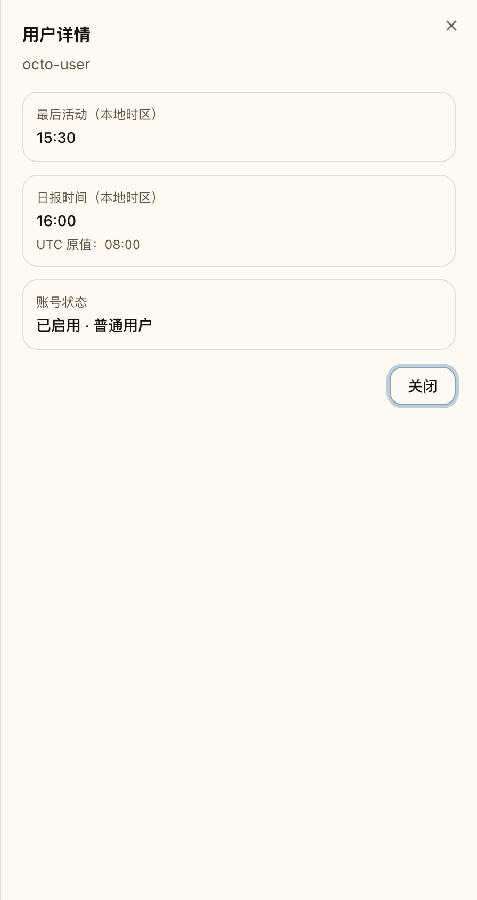
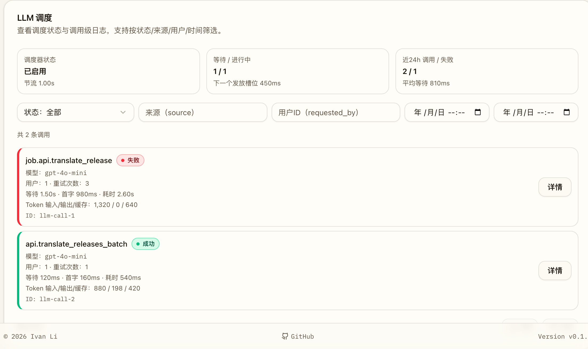
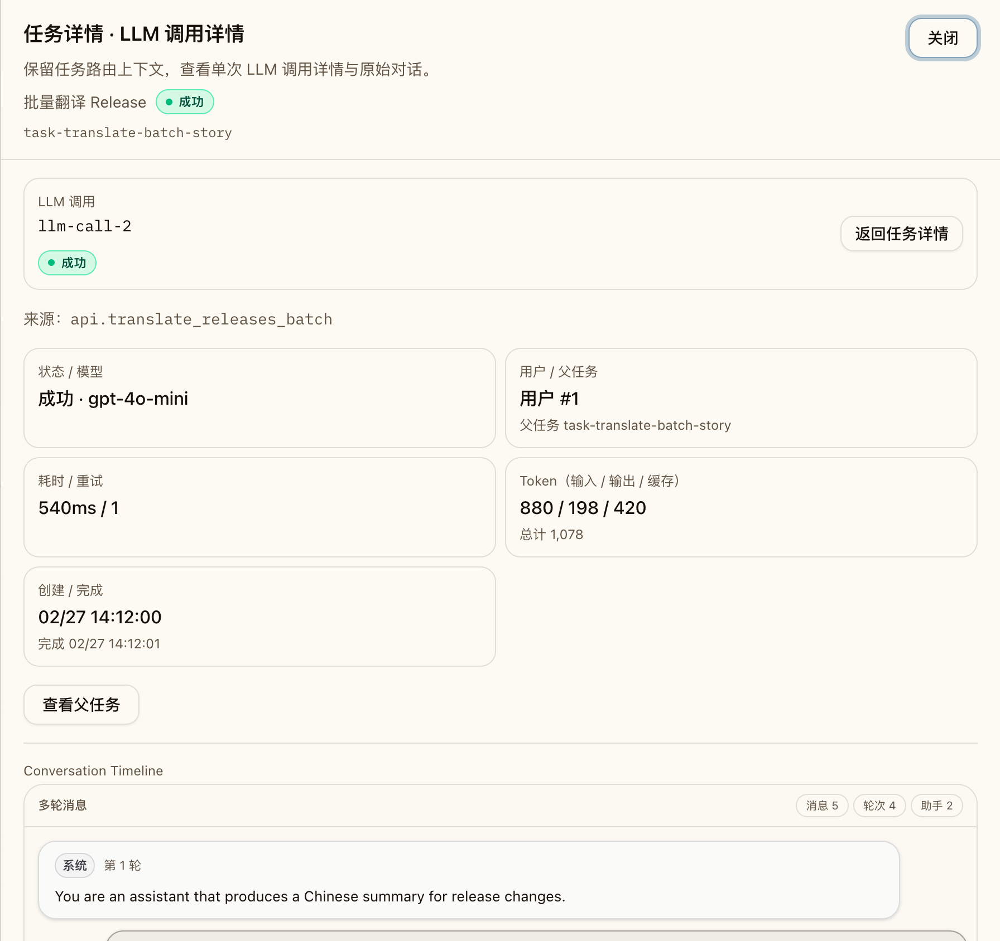

# shadcn/ui 全量整改与组件收敛（#dynup）

## 状态

- Status: 已完成
- Created: 2026-03-06
- Last: 2026-03-08

## 背景 / 问题陈述

- 当前前端已接入 shadcn 配置，但实际只稳定使用了 `Button` 与 `Card`。
- Dashboard、Admin Users、Admin Jobs 仍保留大量手写 dialog/drawer/tooltip、原生 input/select/label、伪 tabs 与状态胶囊，造成可访问性与视觉一致性分散。
- 不做本轮收敛的话，后续前端继续迭代会重复扩散近似组件，增加维护与测试成本。

## 目标 / 非目标

### Goals

- 补齐并统一使用官方 shadcn primitives：`alert-dialog`、`badge`、`dialog`、`input`、`label`、`select`、`sheet`、`table`、`tabs`、`tooltip`。
- 清零本轮审计命中的手写重复实现，统一交互语义、键盘可达性与视觉层级。
- 保持 Dashboard、Admin Users、Admin Jobs 的现有业务逻辑、查询参数、路由与守卫行为不变。
- 同步更新 Storybook、Playwright 与规格文档，确保 UI 重构可回归验证。

### Non-goals

- 不改后端接口、数据库、迁移、任务调度或业务状态机。
- 不做额外品牌视觉重设计。
- 不为了组件统一而替换原生语义结构标签（如 `nav`、`section`、`aside`、`details`、`summary`）。

## 范围（Scope）

### In scope

- `web/src/components/ui/**`：新增官方 shadcn primitives，并将 shared provider 接入 app / Storybook。
- `web/src/pages/Dashboard.tsx`、`web/src/feed/FeedItemCard.tsx`、`web/src/sidebar/BriefListCard.tsx`、`web/src/components/Markdown.tsx`：完成 Dashboard 面所有审计命中项收敛。
- `web/src/admin/UserManagement.tsx`：完成筛选、详情侧板、管理员确认弹窗的收敛。
- `web/src/admin/JobManagement.tsx`：完成 tabs、tooltip、筛选区、details sheet、状态 badge 收敛。
- `web/src/stories/**` 与 `web/e2e/**`：补齐故事与端到端断言。

### Out of scope

- Landing 页与非审计命中页面的额外组件翻新。
- 表格数据模型、筛选参数语义或分页协议变更。

## 需求（Requirements）

### MUST

- 目标页面不再保留手写 overlay/dialog/drawer 壳。
- 目标页面不再保留原生 `input` / `select` / `label` 筛选控件。
- 顶部 tab 切换统一迁移为 shadcn `Tabs`。
- 状态胶囊统一迁移为 shadcn `Badge`，并共享 tone 映射。
- 所有改动保持既有业务行为与验收口径兼容。

### SHOULD

- Storybook 为重构后的关键状态提供稳定 story。
- Playwright 断言优先迁到 role/name 驱动，减少 DOM 结构耦合。

### COULD

- 在不扩大范围的前提下顺手抽出少量复用 helper（如 badge tone helper）。

## 功能与行为规格（Functional/Behavior Spec）

### Core flows

1. Dashboard 顶部内容切换改为 `Tabs`，仍与 `tab` / `release` URL 参数同步。
2. PAT 配置流程改为 `Dialog + Label + Input`，保留 800ms 防抖校验、保存按钮门禁、显式关闭路径与 `Esc` 关闭。
3. 用户管理筛选改为 `Input + Select`，用户详情改为右侧 `Sheet`，管理员权限二次确认改为 `AlertDialog`。
4. 任务中心 tabs、tooltip、筛选区、任务详情与 LLM 详情统一迁移到 shadcn 组件，并保持现有 route/state 驱动联动行为。

### Edge cases / errors

- PAT dialog 禁止误触遮罩直接关闭，避免丢失输入态。
- 管理员确认框只允许显式取消/确认，不改变 guard rails。
- 任务详情与 LLM 详情切换后，返回任务详情链路保持可用。

## 接口契约（Interfaces & Contracts）

None

## 验收标准（Acceptance Criteria）

- Given Dashboard 首页
  When 用户切换顶部内容页签
  Then 页面使用可访问 `Tabs` 语义，并保持原有 URL 同步与内容切换行为。

- Given Dashboard 首页中的 release / brief / inbox 时间戳，以及日报卡片标题/Markdown 正文里的 RFC3339 时间
  When 页面渲染这些 RFC3339 时间
  Then 统一按浏览器当前时区显示本地 `YYYY-MM-DD HH:mm:ss`，不再直接去掉 `Z` 后原样展示，也不再把日报正文里的原始 UTC 字符串直接泄漏给用户。

- Given Dashboard PAT 配置弹窗
  When 用户输入、校验、保存或取消
  Then 保持原有防抖校验/保存门禁，并使用 `Dialog` / `Input` / `Label` 语义。

- Given 管理员用户管理页
  When 用户执行筛选、打开详情、确认管理员权限变更
  Then 页面分别使用 `Input` / `Select`、`Sheet`、`AlertDialog`，且 guard rails 行为保持不变。

- Given 管理员任务中心
  When 用户切换 tabs、查看 tooltip、筛选任务、打开任务详情与 LLM 详情
  Then 页面使用 shadcn `Tabs` / `Tooltip` / `Select` / `Input` / `Sheet` / `Badge`，且详情联动与任务操作行为保持兼容。

- Given Storybook 与 Playwright 回归
  When 执行 UI stories 与 e2e
  Then 关键状态可稳定渲染，且断言基于更新后的可访问语义通过。

## 实现前置条件（Definition of Ready / Preconditions）

- 本轮整改目标页面与审计清单已冻结。
- 共享 shadcn primitives 已可在 Vite + Storybook 环境中编译。
- 相关页面已有 stories / e2e 可供回归扩展。

## 非功能性验收 / 质量门槛（Quality Gates）

### Testing

- E2E tests: 更新 `release-detail.spec.ts`、`admin-users.spec.ts`、`admin-jobs.spec.ts` 覆盖新的 shadcn 语义。

### UI / Storybook (if applicable)

- Stories to add/update: `Dashboard.stories.tsx`、`AdminPanel.stories.tsx`、`AdminJobs.stories.tsx`。
- Visual regression baseline changes: 需要为 Dashboard、Admin Users、Admin Jobs 生成新的 Storybook 视觉证据。

### Quality checks

- `cd web && bun run lint`
- `cd web && bun run build`
- `cd web && bun run storybook:build`
- `cd web && bun run e2e`

## 文档更新（Docs to Update）

- `docs/specs/README.md`: 新增规格索引并在收敛后更新状态。
- `docs/specs/dynup-shadcn-ui-full-remediation/SPEC.md`: 跟踪里程碑、视觉证据与收敛结果。

## 计划资产（Plan assets）

- Directory: `docs/specs/dynup-shadcn-ui-full-remediation/assets/`
- In-plan references: ``
- PR visual evidence source: maintain `## Visual Evidence (PR)` in this spec when PR screenshots are needed.

## Visual Evidence (PR)

- Dashboard PAT Dialog: 
- Admin Users Profile Sheet: 
- Admin Users Alert Dialog: 
- Admin Jobs LLM Filters: 
- Admin Jobs Task LLM Sheet: 

## 资产晋升（Asset promotion）

None

## 实现里程碑（Milestones / Delivery checklist）

- [x] M1: 补齐 shadcn shared primitives、provider 接入与规格基线。
- [x] M2: 完成 Dashboard 面组件收敛与 story 更新。
- [x] M3: 完成 Admin Users / Admin Jobs 面组件收敛与测试更新。
- [x] M4: 完成 Storybook 视觉证据、质量门禁、PR 与 review-loop 收敛。

## 方案概述（Approach, high-level）

- 先落共享 primitives 与 provider，再按 Dashboard / Admin Users / Admin Jobs 三块并行替换，最后统一收口测试与 PR 证据。
- 页面级替换优先保持现有 props、state、URL 同步与 guard 逻辑不变，避免引入行为偏差。

## 风险 / 开放问题 / 假设（Risks, Open Questions, Assumptions）

- 风险：官方 CLI 生成文件与仓库路径/格式约定存在偏差，需要人工收口。
- 风险：e2e 可能少量依赖旧 DOM，需要迁移到 role/name 断言。
- 需要决策的问题：无。
- 假设：无。

## 变更记录（Change log）

- 2026-03-06: 新建规格，冻结 shadcn/ui 全量整改范围与验收口径。
- 2026-03-06: 已补齐官方 shadcn primitives，完成 Dashboard / Admin Users / Admin Jobs 的页面级收敛，并更新 stories / e2e。
- 2026-03-06: 已生成 Dashboard、Admin Users、Admin Jobs 的 Storybook 视觉证据并完成 `bun run lint`、`bun run build`、`bun run storybook:build`、`bun run e2e`。
- 2026-03-07: 完成 rebase 收口、修复 Storybook autodocs 自动弹层与 Admin Jobs LLM detail 刷新串位问题，PR #25 全部 checks 转绿且无阻塞 review。
- 2026-03-08: 修复 Dashboard 前台 release / brief / inbox 列表与 release detail 中 RFC3339 UTC 时间被当成本地时间直出的回归，统一改为浏览器当前时区格式化并补充 Playwright 覆盖。
- 2026-03-08: 继续收敛 brief 卡片标题与 Markdown 正文中的 RFC3339 时间，统一在浏览器渲染期做本地化，避免历史 UTC 字符串在日报正文中继续直出。
- 2026-03-08: 对齐 dashboard / sidebar 相关 Playwright 断言与合并门禁证据，保持浏览器时区回归覆盖稳定。

## 参考（References）

- `web/components.json`
- 本轮 shadcn/ui 审计结果
