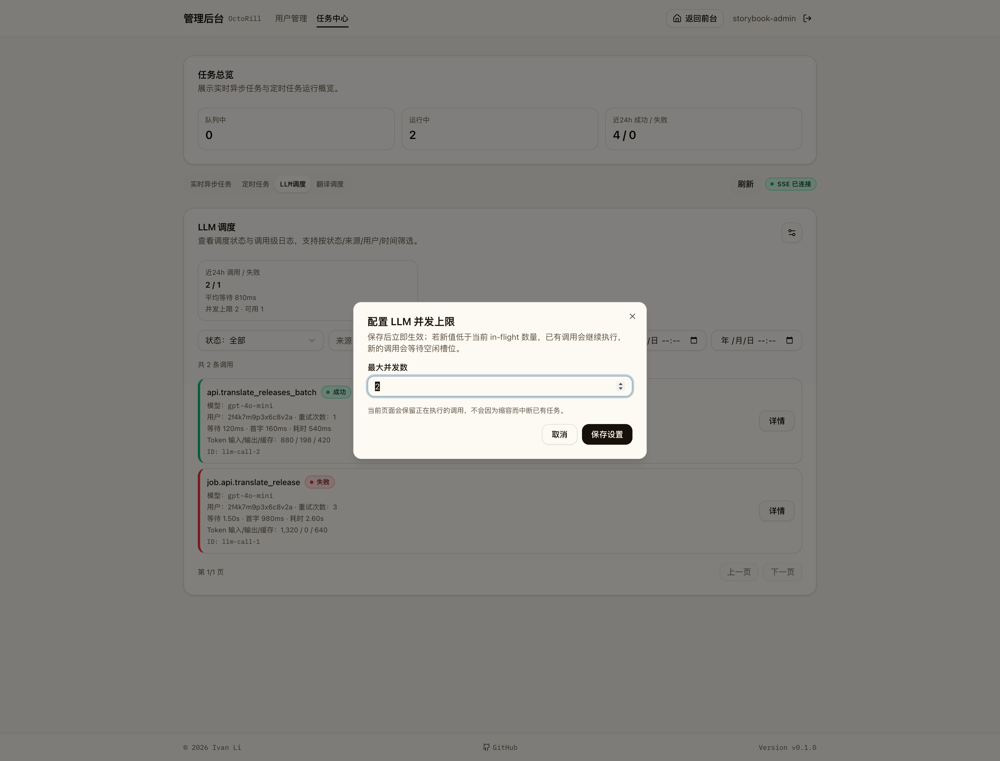
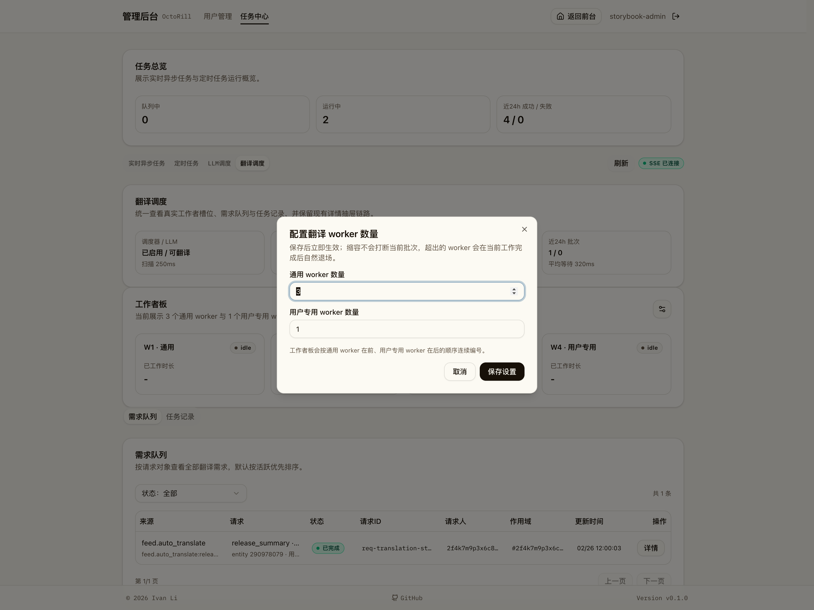
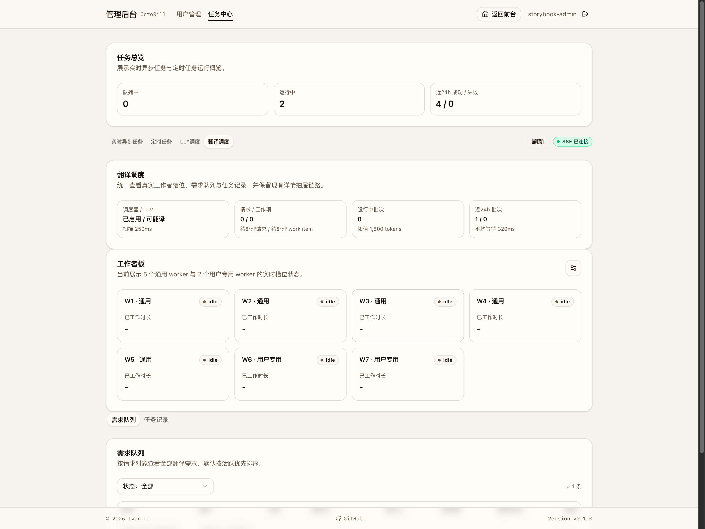

# 管理员任务中心运行时 worker 数量设置（#epn56）

## 状态

- Status: 已完成
- Created: 2026-03-27
- Last: 2026-03-28

## 背景 / 问题陈述

当前管理员任务中心已经能展示 LLM 调度与翻译调度的实时运行态，但这两个页面仍缺少运行时并发设置入口：

- `LLM 调度` 只能展示当前 `max_concurrency`，不能由管理员在线调整。
- `翻译调度` 的工作者板仍默认绑定为固定 `3 general + 1 user_dedicated`，页面说明文案也写死了该组合。
- 运行时并发数只来自进程启动配置；重启前后缺少一个可持久化、可回填、可热更新的单例真相源。
- 缩容时如果直接终止运行中的调用或 batch，会让管理端配置动作变成高风险操作。

需要把管理员任务中心补成“可配置并立即生效”的运行时调度控制面，同时保证缩容走排空退场，不打断已经在执行的工作。

## 目标 / 非目标

### Goals

- 在 `/admin/jobs/llm` 的 `LLM 调度` 卡片右上角增加设置 icon，打开对话框并允许管理员修改 `max_concurrency`。
- 在 `/admin/jobs/translations` 的 `工作者板` 右上角增加设置 icon，打开对话框并允许分别修改 `general_worker_concurrency` 与 `dedicated_worker_concurrency`。
- 新增持久化单例配置表，首次无记录时用当前 env/runtime 有效值做种子；后续以管理员保存值为重启真相源。
- LLM permit 上限与 translation worker runtime 都支持热更新；缩容时只阻止新任务进入，不中断当前 in-flight 调用或运行中的 batch。
- 补齐 Storybook、Playwright、Rust tests、spec contracts 与视觉证据。

### Non-goals

- 不为实时异步任务、定时任务或其它后台 worker 增加类似入口。
- 不引入按模型、按用户、按任务类型的细粒度并发配额。
- 不在缩容时强制取消或回收正在执行中的 LLM 调用或翻译 batch。
- 不做跨实例共享配额或跨标签页同步广播。

## 范围（Scope）

### In scope

- 后端单例配置存储、启动种子逻辑、热更新接口与运行态收敛。
- `GET /api/admin/jobs/translations/status` 扩展当前配置字段。
- `PATCH /api/admin/jobs/llm/runtime-config`
- `PATCH /api/admin/jobs/translations/runtime-config`
- 管理端两处设置按钮、弹窗、校验、保存中/错误态、保存后状态刷新。
- `TranslationWorkerBoard` 文案和展示顺序改为由当前运行时配置驱动。
- Storybook、Playwright、README / docs-site 配置说明与 spec evidence。

### Out of scope

- 新增独立的 LLM 只读配置查询接口。
- 对历史 batch / request 数据做额外回填之外的结构性迁移。
- 允许 dedicated worker 回补 general 请求之外的调度策略变化。

## 当前实现说明

- 后端已支持 LLM permit 热更新，并通过单例 `admin_runtime_settings` 记录 `llm_max_concurrency`、`translation_general_worker_concurrency`、`translation_dedicated_worker_concurrency`。
- translation scheduler 已从固定 `3 + 1` runtime 改为动态 worker registry，worker 以 `general` 在前、`user_dedicated` 在后生成连续槽位与稳定 `worker_id`。
- 管理页已增加两个设置按钮和对应对话框，并在保存成功后立即刷新当前卡片/工作者板状态。
- Storybook 与 Playwright 已覆盖打开弹窗、非法值校验、保存成功与工作者板数量变化路径。

## 接口契约（Interfaces & Contracts）

### 接口清单（Inventory）

| 接口（Name） | 类型（Kind） | 范围（Scope） | 变更（Change） | 契约文档（Contract Doc） | 负责人（Owner） | 使用方（Consumers） |
| --- | --- | --- | --- | --- | --- | --- |
| `GET /api/admin/jobs/llm/status` | HTTP API | external | Modify | `./contracts/http-apis.md` | backend | web-admin |
| `PATCH /api/admin/jobs/llm/runtime-config` | HTTP API | external | New | `./contracts/http-apis.md` | backend | web-admin |
| `GET /api/admin/jobs/translations/status` | HTTP API | external | Modify | `./contracts/http-apis.md` | backend | web-admin |
| `PATCH /api/admin/jobs/translations/runtime-config` | HTTP API | external | New | `./contracts/http-apis.md` | backend | web-admin |
| `admin_runtime_settings` / `translation_batches` | DB schema | internal | Modify | `./contracts/db.md` | backend | backend |
| LLM permit gate / translation worker registry | Runtime contract | internal | Modify | `./contracts/db.md` | backend | backend |

### 契约文档（按 Kind 拆分）

- [contracts/http-apis.md](./contracts/http-apis.md)
- [contracts/db.md](./contracts/db.md)

## 功能与行为规格（Functional / Behavior Spec）

### LLM 调度设置

- `LLM 调度` 卡片头部右上角必须展示设置按钮；点击后打开对话框，回填当前 `max_concurrency`。
- 输入值必须为正整数；空值、`0`、负数和非整数都要在前后端拒绝。
- 保存成功后，`GET /api/admin/jobs/llm/status` 返回的新 `max_concurrency` 与 `available_slots` 必须立即反映到页面摘要。
- 当新值小于当前 `in_flight_calls` 时，已有调用继续执行，新调用在 permit 可用前等待。

### 翻译调度设置

- `工作者板` 头部右上角必须展示设置按钮，且在 `需求队列` / `任务记录` 两个子视图下都可见。
- 对话框分成两个独立输入：`general_worker_concurrency` 与 `dedicated_worker_concurrency`，都必须是正整数。
- 保存成功后，工作者板文案、worker 卡片数量与排序必须立即收敛到新配置。
- worker 展示顺序固定为所有 `general` 在前、所有 `user_dedicated` 在后，并使用连续 `W1..Wn` 编号。

### 持久化与热更新

- 应用启动时若单例表无记录，必须以当前 env/default runtime 值写入第一条种子记录。
- 之后管理员保存的新值必须覆盖单例记录，并在后续重启时继续生效。
- translation worker 缩容时，多余 worker 不再 claim 新 batch；如果已在运行，则等待当前 batch 完成后自然退场。

## 验收标准（Acceptance Criteria）

- Given 管理员位于 `/admin/jobs/llm`
  When 查看 `LLM 调度` 卡片头部
  Then 右上角出现设置按钮，点击后弹出回填当前 `max_concurrency` 的对话框。

- Given 管理员位于 `/admin/jobs/translations?view=queue` 或 `view=history`
  When 查看 `工作者板`
  Then 右上角都出现设置按钮，点击后弹出包含 `general` 与 `dedicated` 两项输入的对话框。

- Given 管理员提交 `0`、空值或非整数
  When 保存任一设置对话框
  Then 前端阻止提交并展示错误，后端也拒绝非法请求体。

- Given LLM 当前已有运行中调用
  When 管理员把 `max_concurrency` 缩小到低于当前 in-flight 数
  Then 已有调用继续执行，新调用仅等待 permit，不会被中断。

- Given 翻译调度当前已有运行中的 worker
  When 管理员缩小 worker 数量
  Then 超出的 worker 不再 claim 新 batch，并在当前 batch 完成后退出，最终工作者板收敛到新数量。

- Given 管理员已经保存新的三个运行时配置值
  When 服务重启
  Then 启动后继续读取同一组持久化配置，而不是回退到 env 默认值。

## 非功能性验收 / 质量门槛（Quality Gates）

- [x] `cargo test`
- [x] `cargo clippy --all-targets -- -D warnings`
- [x] `cd web && bun run build`
- [x] `cd web && bun run lint`
- [x] `cd web && bun run storybook:build`
- [x] `cd web && bun run e2e -- admin-jobs.spec.ts`

## 文档更新（Docs to Update）

- `README.md`
- `docs-site/docs/config.md`
- `docs-site/docs/quick-start.md`
- `docs/specs/README.md`

## Visual Evidence

### LLM 设置弹窗打开态

- source_type: `storybook_canvas`
- target_program: `mock-only`
- capture_scope: `browser-viewport`
- sensitive_exclusion: `N/A`
- submission_gate: `owner-approved`
- story_id_or_title: `Admin/Admin Jobs / LlmSettingsDialog`
- state: `llm-settings-dialog-open`
- evidence_note: 验证 `LLM 调度` 卡片右上角设置按钮可打开对话框，并回填当前并发上限与缩容说明。

### 翻译设置弹窗打开态

- source_type: `storybook_canvas`
- target_program: `mock-only`
- capture_scope: `browser-viewport`
- sensitive_exclusion: `N/A`
- submission_gate: `owner-approved`
- story_id_or_title: `Admin/Admin Jobs / TranslationSettingsDialog`
- state: `translation-settings-dialog-open`
- evidence_note: 验证 `工作者板` 右上角设置按钮可打开双输入对话框，并展示排空缩容说明。

### 翻译设置保存后工作者板收敛态

- source_type: `storybook_canvas`
- target_program: `mock-only`
- capture_scope: `browser-viewport`
- sensitive_exclusion: `N/A`
- submission_gate: `owner-approved`
- story_id_or_title: `Admin/Admin Jobs / TranslationSettingsSaved`
- state: `translation-worker-board-resized`
- evidence_note: 验证保存 `5 general + 2 dedicated` 后，工作者板文案、卡片数量与顺序立即收敛到新运行时配置。

## 实现里程碑（Milestones / Delivery checklist）

- [x] M1: 单例 runtime settings 表、启动种子逻辑与接口契约冻结。
- [x] M2: LLM permit gate 与 translation worker runtime registry 支持热更新与排空缩容。
- [x] M3: 管理端设置按钮、弹窗、Storybook 与 Playwright 覆盖完成。
- [x] M4: 视觉证据、PR 与 review-loop 收敛到 merge-ready。

## 风险 / 开放问题 / 假设（Risks, Open Questions, Assumptions）

- 假设：管理员保存后的 runtime settings 是后续重启的唯一真相源；env/default 仅在首次建种子记录时生效。
- 假设：translation dedicated worker 仍只 claim `user` 请求，不会因为本次动态化而回补 system 请求。
- 风险：单实例内的热更新只保证当前进程收敛；若未来引入多实例，需要补充跨实例同步语义。
- 风险：现有 README / docs-site 仍以 env 配置为主要入口，若不补充“管理员保存值会覆盖重启默认值”的说明，运维口径会漂移。
