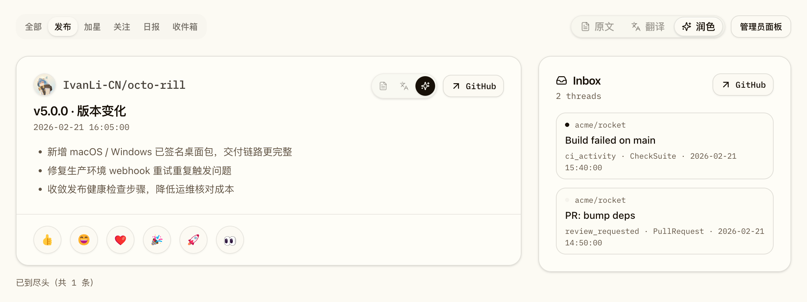
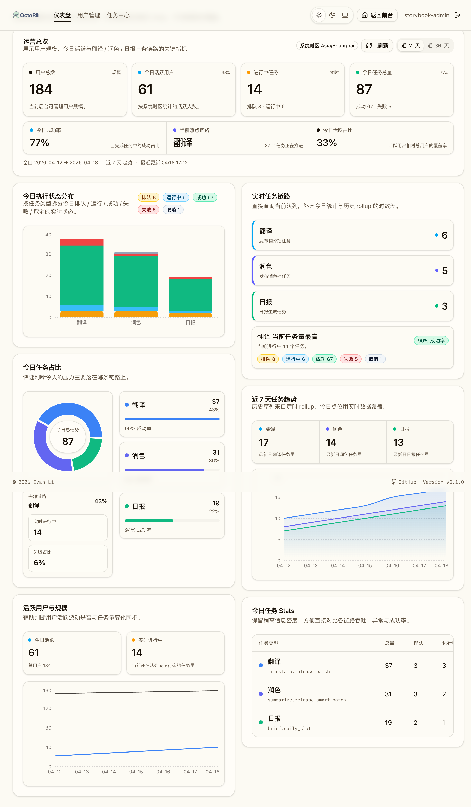

# Release「润色」术语统一（#etd3f）

## 状态

- Status: 部分完成（3/4）
- Created: 2026-04-22
- Last: 2026-04-22

## 背景 / 问题陈述

- 当前 Release 相关能力在前台、管理端、Storybook、自动化测试与产品文档中同时混用 `智能`、`智能摘要`、`智能总结`、`智能整理` 等多套口径，用户感知不稳定。
- 这些文案实际都指向同一条 release-smart 阅读与生成能力，但在不同位置看起来像多种不同功能，不利于记忆与传播。
- 项目内已经存在日报“润色”语义；本次需要把 release-smart 的 owner-facing 术语也统一收口到 `润色`，同时保持内部 `smart` 标识与既有 transport / schema 兼容。

## 目标 / 非目标

### Goals

- 将 Release feed、Release detail、Settings、Admin Dashboard、Admin Jobs 中的 release-smart owner-facing 文案统一成 `润色` 系列口径。
- 将相关 Storybook、Playwright、脚本提示、产品文档与仍描述现行界面的 spec 文案同步到同一术语。
- 保持内部 `smart` 枚举、任务类型、数据库字段、JSON 数值字段与目录 slug/id 不变。
- 为本次 UI-affecting 改动补齐 Storybook 覆盖、视觉证据，并推进到 PR merge-ready。

### Non-goals

- 不重命名 `smart` lane、`release_smart`、`summaries_total` 等内部实现标识。
- 不扩展或重构日报链路本身的“润色”行为语义。
- 不修改数据库 schema、API 字段名或任务调度语义。
- 不在本次 flow 内执行 PR merge / cleanup。

## 范围（Scope）

### In scope

- Release feed 三 lane 标签、空态、失败态、重试按钮、预热/触发提示。
- Release detail 相关标题与正文 mock / 测试断言。
- 管理后台仪表盘与任务中心里的 release-smart 任务 label 与说明文案。
- Settings 页面中对 release-smart 能力的说明文案。
- `docs/product.md`、`docs-site/docs/product.md` 与关联 spec 正文/标题。
- Storybook stories/docs/play、Playwright 与脚本可见提示。

### Out of scope

- Rust / TypeScript 内部 symbol rename。
- `release_smart` 请求 kind、smart cache、DB 列名与 API 数值字段。
- 非 release-smart 范围的其它 AI 能力术语重写。

## 文案契约（Copy Contract）

### 核心标签

- `智能` → `润色`
- `智能摘要` → `润色`
- `智能总结` → `润色`

### 状态 / 动作文案

- `智能整理失败` → `润色失败`
- `重试智能整理` → `重试润色`
- `智能整理不可用` → `润色不可用`
- `批量智能整理 Release` → `批量润色 Release`

### 复合说明文案

- `生成智能版` → `生成润色版`
- `智能版本摘要` → `润色版本摘要`
- `后台智能预热` → `后台润色预热`
- `AI 智能总结能力` → `AI 润色能力`
- `原文 / 翻译 / 智能` → `原文 / 翻译 / 润色`

### 兼容约束

- 后端仅修改 owner-facing label，不修改 transport / schema 字段。
- 前端若以中文展示名作为图表本地 key，可改为 `润色`，但仍继续从原始数值字段读取数据。
- 现有 story/export/file slug 可保留 `smart` 命名，只要 owner-facing 展示文案已经统一。

## 验收标准（Acceptance Criteria）

- Given 用户查看 Release feed / detail / settings / admin 页面
  When 页面渲染完成
  Then 所有 release-smart owner-facing 文案都展示为 `润色` 系口径，不再出现 `智能` 旧词。

- Given 用户进入 Release feed 的 lane 切换、失败态和重试态
  When 查看标签、空态、错误态与按钮
  Then 可见文案分别显示为 `润色`、`润色不可用`、`润色失败`、`重试润色`。

- Given 管理员进入 `/admin`
  When 查看任务卡片、趋势图 legend、占比与任务详情说明
  Then release-smart 对应标签统一显示为 `润色`。

- Given 运行 Storybook、Playwright、docs-site build 与 targeted grep
  When 验证完成
  Then 与 release-smart 展示文案相关的 checks 全部通过，且 owner-facing 旧词残留为 0。

- Given 当前分支进入 PR 阶段
  When latest PR 收敛到 merge-ready
  Then 视觉证据已回传并落盘到本 spec，Spec 与实现无漂移。

## 非功能性要求 / 质量门槛（Quality Gates）

- `cd web && bun run lint`
- `cd web && bun run build`
- `cd web && bun run storybook:build`
- `cd web && bun run e2e -- release-detail.spec.ts`
- `cd web && bun run e2e -- dashboard-access-sync.spec.ts`
- `cd web && node ./scripts/verify-mobile-header-drag.mjs`
- `cd docs-site && bun run build`
- targeted grep 不再命中 owner-facing `智能` 旧词

## 文档更新（Docs to Update）

- `docs/specs/README.md`
- `docs/specs/etd3f-polish-terminology-unification/SPEC.md`
- `docs/specs/7f2b9-release-feed-smart-tabs/SPEC.md`
- `docs/specs/m2k8d-admin-dashboard-rollups/SPEC.md`
- `docs/specs/w5gaz-owned-release-opt-in/SPEC.md`
- `docs/specs/7yr2m-dashboard-mobile-release-card-action-polish/SPEC.md`
- `docs/specs/p82d7-dashboard-admin-mobile-shell-polish/SPEC.md`
- `docs/specs/vgqp9-dashboard-social-activity/SPEC.md`
- `docs/product.md`
- `docs-site/docs/product.md`

## 计划资产（Plan assets）

- Directory: `docs/specs/etd3f-polish-terminology-unification/assets/`
- Visual evidence source: Storybook

## Visual Evidence

- source_type: `storybook_canvas`
  story_id_or_title: `pages-dashboard--smart-ready-body`
  state: `release-polish-lane`
  evidence_note: 验证 Release feed 的页面级默认显示模式与单卡阅读模式都已收口为 `润色`，并保留稳定的 Storybook 阅读面。
  PR: include
  image:
  

- source_type: `storybook_canvas`
  story_id_or_title: `admin-admin-dashboard--evidence-overview`
  state: `admin-dashboard-polish`
  evidence_note: 验证 Admin Dashboard 的链路概览、实时任务链路、趋势摘要与今日任务表都已统一显示 `润色` 文案，同时保留内部任务类型标识不变。
  PR: include
  image:
  

## 实现里程碑（Milestones / Delivery checklist）

- [x] M1: 新 spec、README 索引与 copy contract 冻结。
- [x] M2: Release / Admin / Settings owner-facing 文案完成统一。
- [x] M3: Storybook / Playwright / docs / spec 文案与验证同步完成。
- [ ] M4: 视觉证据、提交、推送、PR、review-loop 与 spec sync 收敛到 merge-ready。

## Change log

- 2026-04-22：创建术语统一 spec，冻结 release-smart → `润色` 的 copy contract 与验收口径。
- 2026-04-22：完成前台 / 管理端 / Storybook / 文档 / 回归断言中的 `润色` 文案统一，并通过 lint、build、e2e、移动端 header drag 与 docs-site build。
- 2026-04-22：写入 Storybook 视觉证据，当前状态更新为 `部分完成（3/4）`；push / PR 仍等待主人确认截图可提交到远端。
