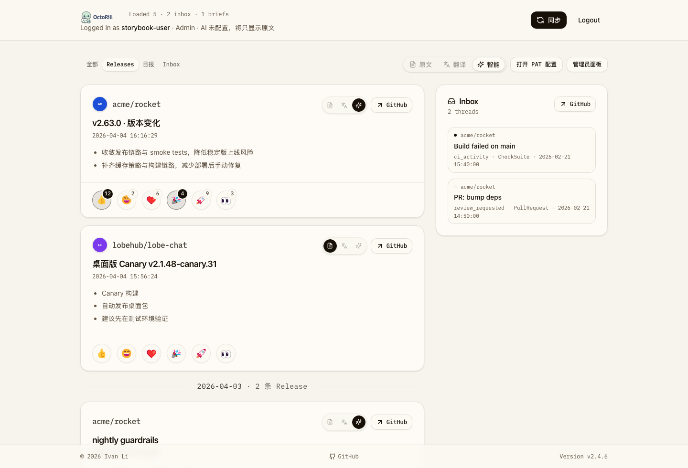
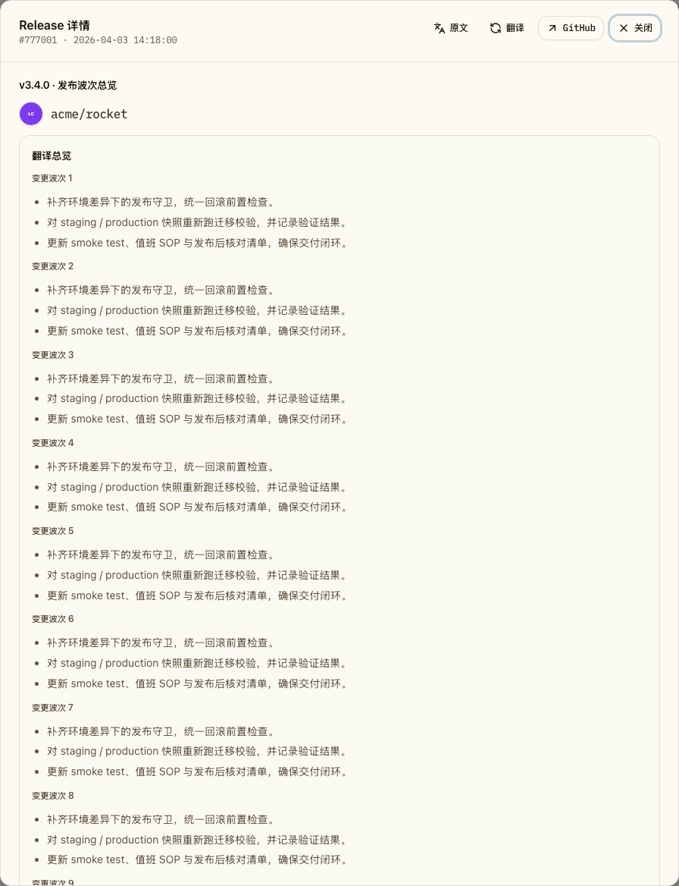

# Release 视图固定 owner/org avatar（#g63t8）

## 背景 / 问题陈述

PR #58 把 Release Feed 与 Release 详情的仓库视觉识别做成了 `custom social preview -> owner/org avatar -> text-only`。实际阅读体验里，social preview 横图在小尺寸下噪音偏高，也会让仓库来源锚点不够稳定。

这轮 follow-up 需要把 Release 图标固定回用户或组织头像，让 Feed 卡片与详情弹窗都使用同一套更稳定的 repo identity。

## 目标 / 非目标

### Goals

- Release Feed 卡片与 Release 详情弹窗统一固定显示 owner/org avatar。
- 当 `repo_visual` 同时含有 avatar 与 social preview 元数据时，前端只消费 avatar。
- 保持后端落库、API 响应与 `repo_visual` 类型兼容，不回滚已有 metadata 链路。
- 补齐 Storybook、Playwright 与视觉证据，确认 avatar-only 行为稳定可复核。

### Non-goals

- 不删除 `open_graph_image_url`、`uses_custom_open_graph_image` 或相关数据库字段。
- 不回滚 starred repo sync 的 GitHub social preview 抓取逻辑。
- 不把 avatar-only 规则扩展到 Inbox、日报 Markdown 或其他非 Release 展示面。

## 范围（Scope）

### In scope

- `/Users/ivan/.codex/worktrees/460a/octo-rill/web/src/lib/repoVisual.ts` 的前端候选图解析。
- Release Feed 与 Release 详情共用的 `RepoIdentity` 展示收口。
- `/Users/ivan/.codex/worktrees/460a/octo-rill/web/src/stories/Dashboard.stories.tsx` 的状态说明与 play 断言。
- `/Users/ivan/.codex/worktrees/460a/octo-rill/web/e2e/release-detail.spec.ts` 的回归断言。
- 本 spec 的 `## Visual Evidence` 与 specs index。

### Out of scope

- 任何 Rust API、数据库 schema、sync 查询或返回字段的改动。
- 重新设计 Release 头部排版或 repo identity 的尺寸体系。
- PR body 自动带图策略调整。

## 接口契约（Interfaces & Contracts）

- `repo_visual` 响应结构保持不变：
  - `owner_avatar_url: string | null`
  - `open_graph_image_url: string | null`
  - `uses_custom_open_graph_image: boolean`
- 前端展示契约调整为：
  - 仅 `owner_avatar_url` 参与 Release 图标渲染；
  - avatar 缺失或加载失败时退回 `text-only`；
  - `open_graph_image_url` 与 `uses_custom_open_graph_image` 只保留兼容语义，不再进入候选图列表。

## 功能与行为规格（Functional/Behavior Spec）

### Feed 卡片

- 仓库图标固定渲染为圆形 owner/org avatar。
- 即使 feed item 附带 custom social preview，也不显示横图缩略图。
- avatar 缺失或加载失败时保留仓库名文本，不渲染 broken image。

### Release 详情弹窗

- 标题下方 repo identity 与 Feed 卡片保持相同 avatar-only 规则。
- 若只有仓库名、没有 avatar metadata，则继续显示 text-only fallback。

### Storybook / 回归

- `pages-dashboard--release-repo-visuals` 继续承担多态画廊，但预期改成 avatar-only + text-only。
- `pages-dashboard--briefs-long-content-with-detail` 继续验证从 brief 打开的 Release 详情弹窗。
- Playwright 至少覆盖“同时有 avatar + social preview metadata 时仍显示 avatar”。

## 验收标准（Acceptance Criteria）

- Given `repo_visual` 同时包含 `owner_avatar_url` 与 `open_graph_image_url`
  When Release Feed 或 Release 详情渲染 repo identity
  Then UI 显示 owner/org avatar，不显示 social preview。

- Given `owner_avatar_url` 缺失或图片加载失败
  When UI 渲染 repo identity
  Then 退回纯文本仓库名，不出现 broken image。

- Given Storybook 与 Playwright 回归通过
  When 复核对应 stories / e2e
  Then 可以稳定证明 avatar-only 行为已经覆盖 Feed 与详情。

## 非功能性验收 / 质量门槛（Quality Gates）

- `cd /Users/ivan/.codex/worktrees/460a/octo-rill/web && bun run lint`
- `cd /Users/ivan/.codex/worktrees/460a/octo-rill/web && bun run build`
- `cd /Users/ivan/.codex/worktrees/460a/octo-rill/web && bun run storybook:build`
- `cd /Users/ivan/.codex/worktrees/460a/octo-rill/web && bunx playwright test e2e/release-detail.spec.ts`

## Visual Evidence

- Storybook canvas：`pages-dashboard--release-repo-visuals`
  - 验证 Release Feed 在存在 social preview metadata 时仍固定显示 owner/org avatar，并保留 text-only fallback。

- Storybook canvas：`pages-dashboard--briefs-long-content-with-detail`
  - 验证 Release 详情弹窗沿用相同 avatar-only repo identity。

## 风险 / 假设

- 风险：非 Release 面若后续复用同一个 helper，可能也会继承 avatar-only 规则；本轮只接受该 helper 仍主要服务 Release 视图的前提。
- 假设：头像 URL 的稳定性仍高于 social preview，足以作为长期默认视觉锚点。
