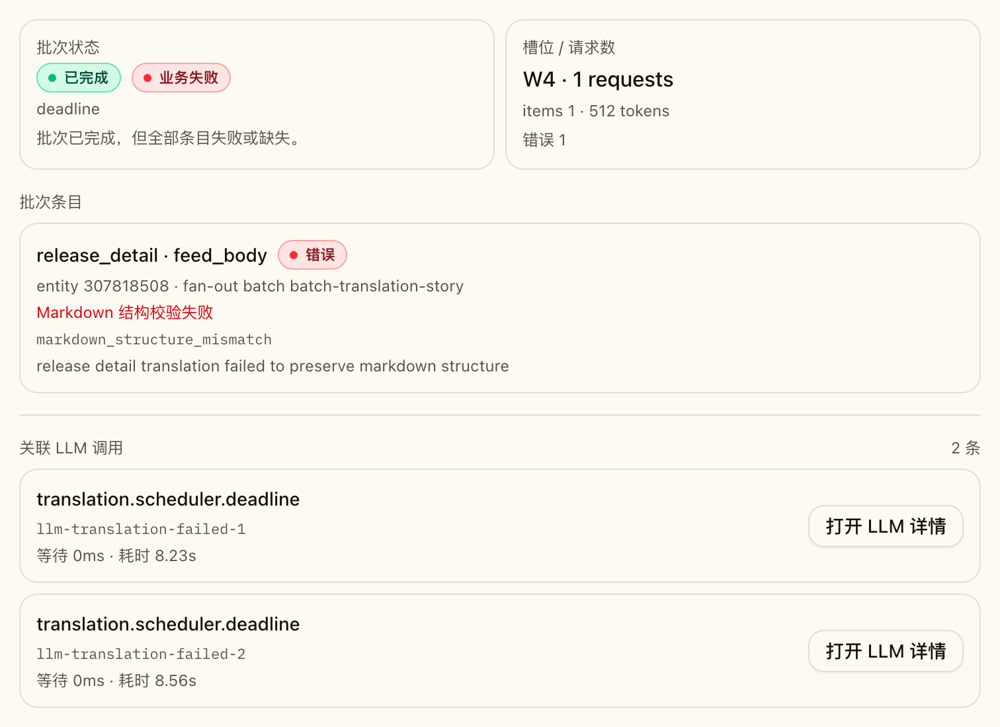

# 管理员任务中心（二期）+ 用户管理字段补齐（#gd6zm）

## 背景 / 问题陈述

管理员面板一期仅覆盖用户管理，缺少任务可观测与调度治理能力；同时用户表新增日报相关字段后，用户管理界面缺少对应可见性。

随着翻译 / 润色链路接入批处理与后台运行时，管理员任务中心还需要准确表达“raw 状态完成，但业务结果仍带错误”的场景。否则批次历史与状态卡会出现 `completed=成功`，但实际内部 item 仍然 `error / missing` 的观测失真。

## 目标 / 非目标

### Goals

- 新增独立管理员路由 `/admin/jobs`，提供任务总览与任务管理。
- 管理端页面使用独立页头，并提供固定管理员导航（用户管理 / 任务中心）。
- 引入通用异步任务引擎（任务主表 + 事件表 + 运行时 worker）。
- 落地 24 个 UTC 小时槽定时日报任务（命中槽位后按用户串行生成，失败不中断）。
- 扩展触发类接口支持 `return_mode=sync|task_id|sse`。
- 在用户管理中补齐新增字段可视化：`last_active_at` 列表展示、`daily_brief_utc_time` 详情抽屉展示（只读）。
- 任务详情按 `task_type` 提供专属详情页，并在 Storybook 为各类任务提供独立示例。
- 翻译任务中心必须额外展示 `clean completed / completed with issues / failed`，并在批次历史与详情中同时展示 raw 状态、`business_outcome` 与 `result_summary`。

### Non-goals

- 不做任务类型可视化创建器。
- 不做小时槽数量动态扩缩（固定 24）。
- 不在用户管理页提供新增字段编辑能力。
- 不改变 `translation_batches.status` 的持久化枚举，也不在本 spec 内引入 429/403 自动重试策略。

## 范围（Scope）

### In scope

- DB migration：`users.daily_brief_utc_time`、`users.last_active_at`、`job_tasks`、`job_task_events`、`daily_brief_hour_slots`。
- 后端任务运行时：队列消费、任务状态流转、重试/取消、SSE 事件流。
- 后端任务运行时 lease：`job_tasks.running` 持有 `runtime_owner_id + lease_heartbeat_at`，启动恢复与周期 sweep 会把孤儿运行态统一收口为失败。
- 调度器改造：每小时轮询，命中 `hour_utc` 槽位后入队日报任务。
- 管理员 API：任务总览、实时任务列表/详情、重试、取消、定时槽位查询与启停。
- 管理员翻译 API：runtime status、request 列表 / 详情、batch 列表 / 详情，以及带 `business_outcome` / `result_summary` 的状态聚合。
- 前端 `/admin/jobs` 页面与用户管理字段展示补齐；任务详情区按 `task_type` 渲染专属信息卡片与说明。
- 翻译任务中心状态卡拆分“干净完成 / 带问题完成 / 失败”，批次历史与详情抽屉显示 raw 状态 + `business_outcome` + item 结果汇总。
- 管理端统一页头组件：账号信息、管理员导航、返回仪表盘与登出操作。
- Storybook 覆盖任务详情页：为每类任务提供单独故事条目，便于视觉回归与需求对齐。
- 自动化测试补充（Rust + Playwright / Storybook smoke）。

### Out of scope

- 用户时区个性化调度策略。
- 任务模板管理、任务参数 DSL。
- Translation runtime scheduler 的 worker 拓扑重构。

## 接口契约（Interfaces & Contracts）

### 接口清单（Inventory）

| 接口（Name） | 类型（Kind） | 范围（Scope） | 变更（Change） | 契约文档（Contract Doc） | 负责人（Owner） | 使用方（Consumers） |
| --- | --- | --- | --- | --- | --- | --- |
| `GET /api/admin/users/{user_id}/profile` | HTTP API | external | New | `./contracts/http-apis.md` | backend | web-admin |
| `GET /api/admin/jobs/overview` | HTTP API | external | New | `./contracts/http-apis.md` | backend | web-admin |
| `GET /api/admin/jobs/realtime` | HTTP API | external | New | `./contracts/http-apis.md` | backend | web-admin |
| `GET /api/admin/jobs/realtime/{task_id}` | HTTP API | external | New | `./contracts/http-apis.md` | backend | web-admin |
| `POST /api/admin/jobs/realtime/{task_id}/retry` | HTTP API | external | New | `./contracts/http-apis.md` | backend | web-admin |
| `POST /api/admin/jobs/realtime/{task_id}/cancel` | HTTP API | external | New | `./contracts/http-apis.md` | backend | web-admin |
| `GET /api/admin/jobs/scheduled` | HTTP API | external | New | `./contracts/http-apis.md` | backend | web-admin |
| `PATCH /api/admin/jobs/scheduled/{hour_utc}` | HTTP API | external | New | `./contracts/http-apis.md` | backend | web-admin |
| `GET /api/admin/jobs/translations/status` | HTTP API | external | Modify | `./contracts/http-apis.md` | backend | web-admin |
| `PATCH /api/admin/jobs/translations/runtime-config` | HTTP API | external | Existing | `./contracts/http-apis.md` | backend | web-admin |
| `GET /api/admin/jobs/translations/requests` | HTTP API | external | Existing | `./contracts/http-apis.md` | backend | web-admin |
| `GET /api/admin/jobs/translations/requests/{request_id}` | HTTP API | external | Existing | `./contracts/http-apis.md` | backend | web-admin |
| `GET /api/admin/jobs/translations/batches` | HTTP API | external | Modify | `./contracts/http-apis.md` | backend | web-admin |
| `GET /api/admin/jobs/translations/batches/{batch_id}` | HTTP API | external | Modify | `./contracts/http-apis.md` | backend | web-admin |
| `POST /api/sync/*` + `POST /api/briefs/generate` + `POST /api/translate/*` | HTTP API | external | Modify | `./contracts/http-apis.md` | backend | web |
| `users` / `job_tasks` / `job_task_events` / `daily_brief_hour_slots` | DB schema | internal | Modify/New | `./contracts/db.md` | backend | backend |

### 契约文档（按 Kind 拆分）

- [contracts/http-apis.md](./contracts/http-apis.md)
- [contracts/db.md](./contracts/db.md)

## 验收标准（Acceptance Criteria）

- Given 管理员访问 `/admin/jobs`
  When 页面加载完成
  Then 可见“任务总览 + tabs（实时异步任务/定时任务）”。

- Given 管理员访问 `/admin` 或 `/admin/jobs`
  When 页面渲染
  Then 顶部显示独立“管理后台”页头，并可通过管理员导航在“用户管理/任务中心”间切换且高亮当前页。

- Given 定时任务页
  When 查询槽位
  Then 固定返回 24 个 UTC 小时槽，并支持启停。

- Given 每小时调度轮询
  When 命中当前 UTC 小时槽
  Then 入队对应日报任务，并按 `last_active_at DESC, user_id ASC` 串行生成日报。

- Given 串行执行中某用户生成失败
  When 继续执行
  Then 任务记录失败用户并继续后续用户，不中断整槽任务。

- Given 触发类接口请求 `return_mode=task_id`
  When 请求成功
  Then 立即返回 `task_id`。

- Given 触发类接口请求 `return_mode=sse`
  When 建立连接
  Then 首条及后续事件都包含 `task_id`。

- Given 用户管理列表
  When 查看用户行
  Then 显示 `last_active_at`（浏览器时区 `HH:mm`）。

- Given 用户详情抽屉
  When 打开用户详情
  Then 按浏览器当前日期与浏览器当前时区显示 `daily_brief_utc_time` 对应的本地 `HH:mm`，并同时展示 UTC 原值（只读）。

- Given 管理员在任务中心点击任意任务“详情”
  When 任务详情抽屉打开
  Then 根据该任务 `task_type` 展示对应专属详情页（包含业务字段与语义化说明），不使用单一通用模板替代。

- Given Storybook 打开 `Admin/TaskTypeDetailPage`
  When 查看故事列表
  Then 各任务类型均有独立 story，覆盖任务详情页的专属展示分支。

- Given 管理员任务中心数据库中残留孤儿 `job_tasks.running`
  When 服务重启并完成启动前 recovery pass
  Then 这些任务会自动转为 `failed(runtime_lease_expired)` 并追加 recovery event，避免管理页长期显示假运行态。

- Given 某个 `translation_batches.status='completed'`，但 item 内含 `error + missing`
  When 管理员查看翻译状态卡与批次详情
  Then 状态卡显示 `completed_with_issues_batches_24h > 0`，批次列表 / 详情保留 raw `completed`，同时展示 `business_outcome.code='partial'` 与 `result_summary.error / missing`。

## 非功能性验收 / 质量门槛（Quality Gates）

### Testing

- Rust tests: `cargo test admin_translation_status_ -- --nocapture`
- Rust tests: `cargo test admin_translation_status_counts_completed_batches_with_item_issues -- --nocapture`
- Web checks: `cd web && bun x tsc -b`、`cd web && bun x vite build`
- Storybook: `cd web && bun run storybook:build`

## Visual Evidence

## 参考（References）

- `src/api.rs`
- `src/server.rs`
- `src/translations.rs`
- `web/src/admin/JobManagement.tsx`
- `web/src/stories/AdminJobs.stories.tsx`
