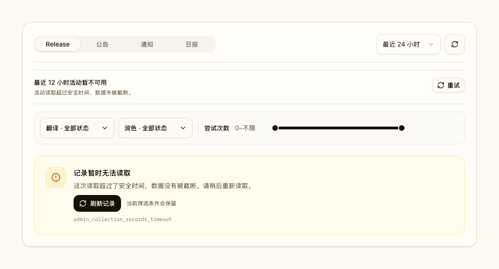
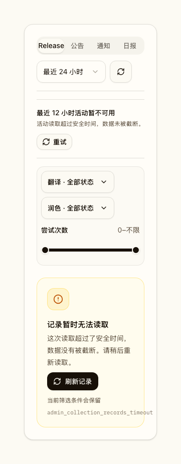
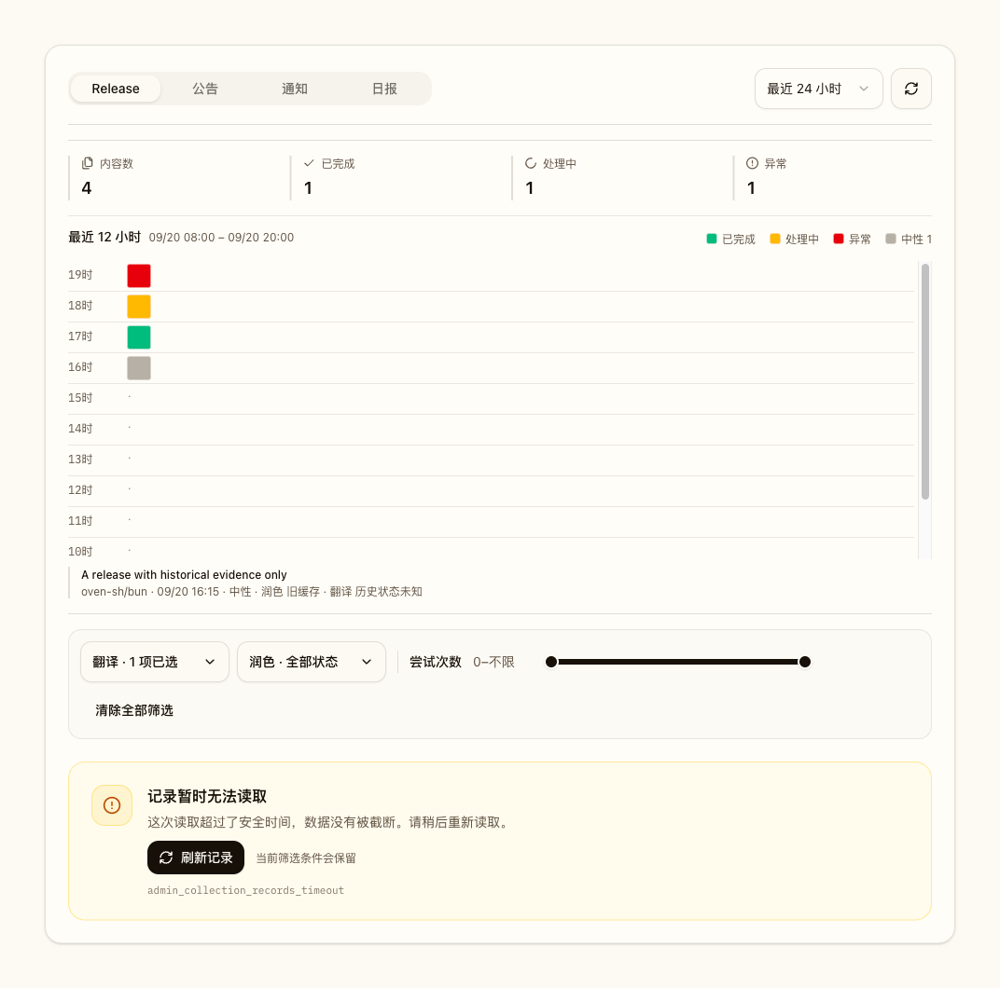
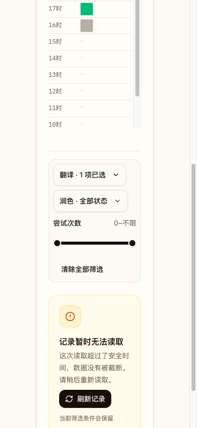
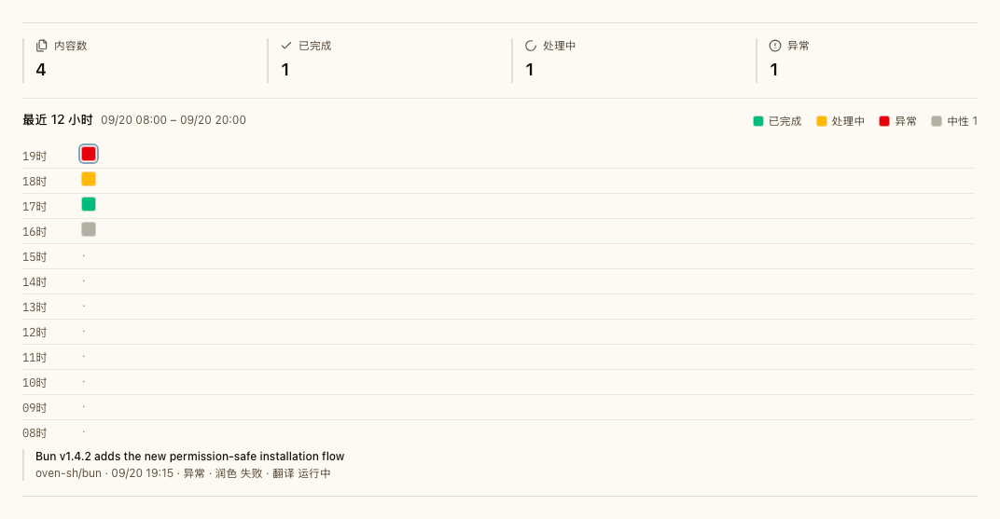
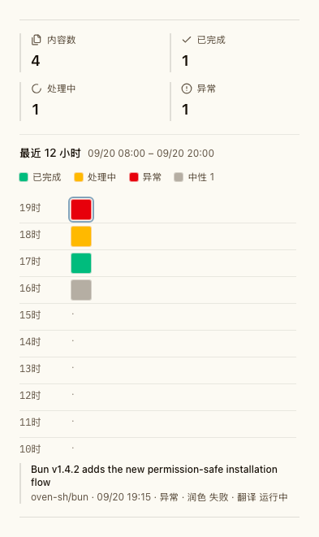
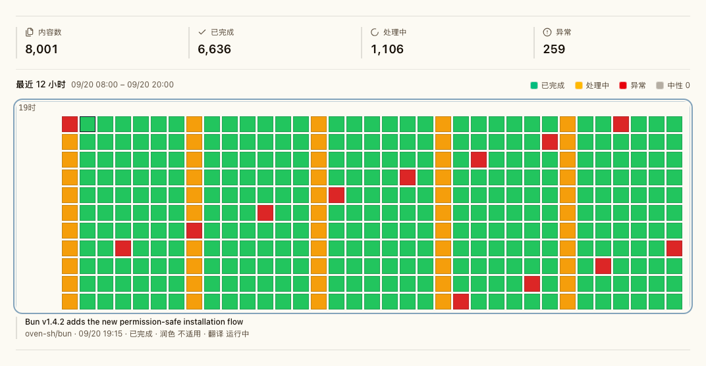

# 全局翻译与润色工作模型

## Context and Scope

管理端曾仅以 `translation_work_items` 推断当前状态，而 Release 明细翻译可以直接写入 `ai_translations`。这使存在结果缓存但没有工作项的记录显示为“未开始”。同时，现有翻译与润色工作项以 `scope_user_id` 隔离，重复执行相同规范资源，并把全局内容处理错误建模成用户局部状态。

本主题将 Release、公告和通知的翻译与润色统一为全局工作与结果模型。它复用既有调度器的批处理、租约、恢复和诊断能力，但拥有全局身份、请求关联、结果投影、旧事实保留、切换和回滚合同。日报生成和日报内容处理不在范围内。

## Requirements

- REQ-GTP-IDENTITY: Release、公告和通知的翻译与润色必须按 `(canonical_resource_type, canonical_resource_id, pipeline, variant, target_lang, source_hash, protocol_version)` 形成唯一全局工作身份。模型路由、模型档案和配置指纹不属于工作或结果身份；`scope_user_id`、请求者、请求模式、来源和重试触发者也不得参与去重。首个目标语言为 `zh-CN`；每用户模型、提示词、语言或密钥配置不属于本主题。
- REQ-GTP-NOTIFICATION-SOURCE: 同一通知线程的规范来源必须选择更新时间最新的来源行，并以稳定来源标识打破相同更新时间的平局。该选择同时决定来源时间、显示内容和后续源快照，且不得依赖请求者或任一用户副本。
- REQ-GTP-OWNERSHIP: 调度器拥有全局持久化边界：授权后的请求只能通过调度器 admission/retry command 在同一 SQLite writer 事务中创建或重新排队工作项；调度 worker 是尝试事件、模型调用和结果投影的唯一写入者。所有既有翻译或润色入口必须成为调度请求适配器，保留 `async`、`wait`、`stream` 交付语义；遗留 `sync` 入口映射为有界 `wait`，到期返回可轮询的 pending 快照。全局 worker 只能消费冻结源快照，不得使用任一请求者的 OAuth 身份或可变用户上下文；任何直接模型调用或直接终态缓存写入都不得绕过调度器。
- REQ-GTP-AUTHORIZATION: 请求者关联必须记录调用者或系统生产者、授权时刻、请求来源和关联的全局工作项。资源访问控制始终在请求、轮询、读取结果和重试时检查；全局共享不得向未获授权者暴露私有资源、输出、请求关联或诊断信息。
- REQ-GTP-RESULTS: 只有通过输出契约和业务校验的内容可以发布为结果投影。工作与结果投影都按 `(canonical_resource_type, canonical_resource_id, pipeline, variant, target_lang, source_hash, protocol_version)` 保持唯一身份，且不区分模型；结果投影的发布源哈希必须与身份中的 `source_hash` 一致。来源更新创建新工作项并在六十秒去抖后提交；旧的已发布结果在刷新期间保持可读，直到新投影原子替换。删除的来源必须取消或抑制未完成工作，且不得发布结果。
- REQ-GTP-OUTPUT: 全局内容处理的规范模型响应是一个 JSON 对象，声明的 `target_slots` 必须直接位于顶层，并通过既有非空字段与 Markdown 结构校验后才能发布。未声明的标量元数据会被忽略且不持久化；未知对象/数组包装、重复 JSON key、多层、歧义、缺字段和非法 JSON 必须记录为 `output_contract_invalid`。运行时最多归一化一层 Markdown JSON 代码围栏或一层 `output` 对象包装。首次 `finish_reason=length` 只在同一尝试内使用同一路由与配置快照追加一次 `max_tokens=6000` 的 `length_recovery` 调用；再次截断记录 `output_truncated`，不在本次尝试内追加调用。provider 成功不等于业务输出成功，API wire shape 不变。
- REQ-GTP-CACHE-HIT: 命中源哈希与全局工作身份一致的当前有效结果投影时，不论其由哪个模型生成，若没有保留的当前工作项，调度器必须创建状态为 `ready`、`cache_hit=true`、尝试次数为零的全局工作项并关联请求者。该工作项只记录真实缓存命中，不得由旧事实或无效输出创建。
- REQ-GTP-LIFECYCLE: 工作项状态限定为 `queued`、`running`、`ready`、`failed`、`not_applicable`、`deferred_provider`、`blocked_config`、`cancelled` 或 `superseded`，并且每个状态转换必须符合数据库合同。`blocked_config` 是可恢复的等待状态，不是永久失败；配置更新后由调度器重新验证并在有效时排队。客户端将其显示为 pending，继续轮询原请求并显示“等待模型配置恢复，恢复后会自动继续”；不得将其作为终态错误提供手动重试入口，API wire shape 不变。手动重试复用原工作项、追加新尝试并受五分钟冷却限制；结构化瞬态失败、`output_contract_invalid` 和 `output_truncated` 在 retry window 内按既有一、五、十五、六十、二百四十分钟间隔自动恢复，最长二十四小时；每次尝试最多执行一次截断恢复。调度器维持既有租约和并发边界，手动重试优先级为三，同时至少保留一个后台执行名额。
- REQ-GTP-CONFIGURATION: 每次内容处理尝试开始时，必须按当时有效的全局模型路由与运行配置建立尝试级快照，并在该尝试期间固定使用它；持久化模型路由必须在 claim 与 `attempt_started` 共用的 SQLite 写事务内读取，使配置更新与尝试开始有单一先后顺序，不允许其他运行实例仅因本地 runtime 尚未 heartbeat 而快照旧路由。新 admission 与手动重试也必须在创建或重新排队工作的同一 SQLite 写事务内读取持久化模型路由，并据此判定配置有效性；配置更新先提交时，新工作采用更新后的路由，配置更新后提交时，其恢复扫描必须能看到本事务留下的 `blocked_config` 工作。快照记录安全配置指纹和有序路由，不得保存密钥原文，实际调用模型记录在调用归因中。工作项不冻结模型配置；后续尝试使用其开始时的当前配置。若尝试开始前当前配置无效，工作项进入 `blocked_config`，不调用 provider，也不按计时器反复重试。相关全局配置更新或运行时配置重载触发重新验证；配置有效时由调度器自动排队，随后尝试采用新快照。配置变更本身不得重跑已有有效结果；同源内容没有显式强制重生成入口，只有源版本变化创建新工作。
- REQ-GTP-RETRY-COORDINATION: 对终态失败的授权重试必须由数据库唯一约束和事务串行化。工作项已在执行、排队或恢复时，服务端仍创建请求者关联，但返回 `409`、稳定错误码、当前工作项标识、当前状态、最近尝试状态和轮询地址；前端以该事实同步状态，而不将其显示为新的独立失败。
- REQ-GTP-PROVIDER-GUARD: 持久化的提供方熔断与路由健康状态优先于人工重试。熔断打开时，授权请求仍创建请求者关联，但工作项保持或转入 `deferred_provider`；只有调度器拥有的受控探测可以恢复提供方调用，人工请求不得绕过熔断。
- REQ-GTP-ADMIN-READS: 管理页和详情读取必须是纯读取，不得补覆盖范围、创建工作项、重试或写入缓存。它必须分别展示当前全局工作状态、当前结果投影和旧事实来源；只有旧缓存且没有全局工作或结果时显示 `legacy_cached`，旧工作与缓存无法一致解释时显示 `legacy_conflict`。不得以缓存回退伪造“已完成”“未开始”或尝试次数。
- REQ-GTP-ADMIN-READ-BUDGET: 管理采集记录列表的查询窗最长三十一天，必须先按规范来源时间和窗口边界限界来源候选，再仅为这些来源 ID 查询处理状态；来源窗口和 canonical selection 必须命中现有来源时间/canonical 索引。数据库必须以完全相同的筛选语义取得精确总数和当前页标识，并且只装载当前页的处理摘要。列表不得使用完成结果缓存或内存全量分页；同一规范化请求窗口键的在途读取必须合并，不同查询键不得因应用内读取闸门互相拒绝。共享读取即使 panic 也必须向等待者发布完整错误并释放查询键，使后续请求能够重试。源站读取预算为五秒；超时返回带 `Retry-After` 的 `503`，不得返回部分数据。
- REQ-GTP-ADMIN-ACTIVITY: 内容处理管理页的 Release、公告、通知、日报各 tab 必须提供独立的只读活动概览。活动窗固定为 UTC 当前整点及其之前连续十一个小时组成的半开区间，含当前未完整小时；以规范采集记录来源时间归桶，与列表筛选、分页无关。每条窗内规范记录必须表示为一个 cell，并提供标题、仓库（日报为空）、来源时间、适用 pipeline 的既有 `display_status` 和综合状态；摘要精确统计窗内内容总数、完成、处理中、异常，并提供中性数量。异常优先于处理中；无异常且至少一个适用 lane 排队或运行时为处理中；所有适用 lane 均为成功或不适用时为完成；其余为中性。活动读取不得补覆盖范围或派生处理事实，必须使用有界来源候选、独立的活动读取合并和五秒预算；超限时完整失败，不得静默截断。
- REQ-GTP-LEGACY: 现有 `translation_work_items`、`translation_requests`、尝试事件和 `ai_translations` 行必须保留为只读历史事实；其中 `release_smart`、`announcement_smart` 等润色记录与翻译记录适用同一保留规则。迁移只能从其读取并记录可追溯的旧事实观察，绝不把旧缓存、旧状态或旧尝试合成为全局工作、全局结果或新的尝试历史。
- REQ-GTP-CUTOVER: 全局模型必须经由单一写入者切换，不得长期双写。切换前必须停止旧写入路径并完成运行中旧批次的受控收口；切换后由全局调度器接收新的覆盖请求。转换期间内容处理请求返回带轮询信息的 `503`，而不是部分落入新旧两个模型。
- REQ-GTP-COMPATIBILITY: 数据库演进必须使用扩展表、索引和控制记录。必须先发布含有该迁移且仍能安全运行旧行为的兼容版本，再发布不含新迁移的全局切换版本。兼容版本在检测到全局模式时禁用旧内容处理写入，允许降级后二进制继续打开数据库；不含该迁移版本的更旧应用不得作为回滚目标。
- REQ-GTP-IDENTITY-MIGRATION: 升级到模型无关身份时，必须保留既有尝试、模型调用和请求者关联的可追溯性。对同一新投影身份存在多个模型专属有效投影的情况，选择最近发布的有效投影作为唯一当前投影，其他投影不得继续参与当前结果读取。对既有 `blocked_config` 工作，只为没有源哈希完全匹配的有效当前投影的身份自动排入一次恢复；已有匹配投影时保留结果且不重跑。恢复使用常规调度器、并发、优先级和 provider 防护，不得合成尝试历史。
- REQ-GTP-IDENTITY-UPGRADE-COMPATIBILITY: 模型无关身份升级先发布只扩展 schema 的兼容版本；它保留现有模型专属身份行为，不回填或改写既有工作、投影和尝试数据。后续身份切换版本使用该 schema，执行可暂停、幂等且可观察的身份与投影回填，不增加新的数据库迁移。升级期间的新 admission 必须在创建工作项的同一事务内注册规范身份和成员映射；全局 worker 在回填完成前不得 claim 工作。回填重新扫描未映射工作，不能仅因已越过 ID 游标就漏掉晚到记录。兼容版本必须能打开切换后的 schema 并作为回退目标；缺少该扩展迁移的更旧版本不受支持。结构变更与历史回填是分开的操作，各自具有完成信号和暂停点。
- REQ-GTP-NAMING: 所有面向用户和管理员的功能名称保持“翻译”和“润色”。本主题不得以“完整翻译”“智能变更摘要”或任何替代名称重命名现有能力。
- REQ-GTP-OBSERVABILITY: 每次尝试审计必须记录尝试级配置指纹与路由快照、提供方调用标识、时长、令牌、成本、稳定错误码与脱敏摘要，并保持尝试到实际模型调用的精确归因。原始密钥、提示词、完整响应和未脱敏上游错误不进入常规管理读取或长期尝试审计。

## Non-goals

- 不引入消息队列、第二调度器、分布式协调器或分布式缓存。
- 不把日报生成或日报内容处理改为全局工作。
- 不以迁移修复、重写或删除历史用户隔离记录。
- 不提供对同一源版本有效结果的强制重生成命令或界面。

## Verification

- VER-GTP-GLOBAL-DEDUP: covers: REQ-GTP-IDENTITY, REQ-GTP-OWNERSHIP, REQ-GTP-AUTHORIZATION。以同一规范资源的多用户并发请求、不同资源、不同来源快照和无权访问者组合验证：只有一个全局工作与结果，worker 不使用请求者身份，且每个请求者关联和访问边界都正确。
- VER-GTP-NOTIFICATION-SOURCE: covers: REQ-GTP-NOTIFICATION-SOURCE。以跨用户同一线程的不同标题、仓库和更新时间组合验证：最新行决定规范来源与源快照；相同更新时间始终由稳定平局规则选出同一来源；访问控制不因来源选择而改变。
- VER-GTP-LIFECYCLE: covers: REQ-GTP-RESULTS, REQ-GTP-CACHE-HIT, REQ-GTP-LIFECYCLE, REQ-GTP-CONFIGURATION, REQ-GTP-RETRY-COORDINATION, REQ-GTP-PROVIDER-GUARD。验证来源变更、删除、有效与无效输出、跨模型当前结果命中生成零次尝试的 `ready` 工作项、持久路由更新先于 claim 时 `attempt_started` 记录新路由且与 claim 同事务排序、路由更新先于 admission 时新工作使用当前配置、运行中尝试固定其配置快照、后续尝试使用新配置、无效配置进入 `blocked_config` 后只由配置更新事件唤醒、已有有效结果不因配置变化重跑、完整批次中存在其他活动工作的 blocked identity 不导致恢复扫描空转、五分钟冷却、并发手动重试 `409`、熔断下的 `deferred_provider`、优先级与至少一个后台名额。
- VER-GTP-OUTPUT: covers: REQ-GTP-OUTPUT, REQ-GTP-RESULTS, REQ-GTP-OBSERVABILITY。以 prompt 审计和真实内容处理执行路径验证顶层声明字段、裸 JSON、单层代码围栏、单层 `output` 包装、未知或多层包装拒绝、缺字段与歧义拒绝、非空字段与 Markdown 校验；以顺序 mock provider 验证首次截断只追加一次 6000-token recovery、两次调用均进入精确审计关联、再次截断记录 `output_truncated` 且不发生第三次调用。
- VER-GTP-ADMIN: covers: REQ-GTP-ADMIN-READS, REQ-GTP-LEGACY, REQ-GTP-NAMING, REQ-GTP-OBSERVABILITY。验证管理 GET 无写入，旧缓存不会被伪造成工作项，`legacy_cached` 与 `legacy_conflict` 有可追溯来源，诊断安全字段正确，界面始终显示“翻译”和“润色”。
- VER-GTP-ADMIN-READ-BUDGET: covers: REQ-GTP-ADMIN-READ-BUDGET, REQ-GTP-NOTIFICATION-SOURCE。以生产形状的通知、遗留工作项和全局工作项夹具验证四类列表：总数与页码精确、状态筛选在分页前完成、跨用户同一通知线程使用规范来源、超过三十一天被拒绝、超时与并发饱和返回可重试 `503`，且释放读取容量。
- VER-GTP-ADMIN-ACTIVITY: covers: REQ-GTP-ADMIN-ACTIVITY, REQ-GTP-ADMIN-READS, REQ-GTP-NOTIFICATION-SOURCE。验证四种来源时间和规范化、UTC 十二小时边界、单格与 summary 数量一致、既有 lane 显示状态及综合状态优先级、无读写副作用，以及生产形状查询计划和读取延迟预算。
- VER-GTP-CUTOVER: covers: REQ-GTP-CUTOVER, REQ-GTP-COMPATIBILITY。以旧事实混合、运行中旧批次、切换冻结、全局写入启用和切换版本降级到兼容版本的数据库副本验证：旧行未改变，转换无双写，兼容版本可启动且旧写入者失效，更旧版本被部署检查拒绝。
- VER-GTP-IDENTITY-MIGRATION: covers: REQ-GTP-IDENTITY, REQ-GTP-RESULTS, REQ-GTP-CONFIGURATION, REQ-GTP-IDENTITY-MIGRATION。以同一新身份下含多个模型专属有效投影、重复工作项、请求关联和历史尝试的数据库副本验证：最近发布的有效投影成为唯一当前结果，历史关联仍可追溯；只有无源哈希匹配有效投影的阻塞身份被自动排队一次，并遵循正常调度边界；存在有效投影的阻塞项不触发模型调用。
- VER-GTP-IDENTITY-UPGRADE-COMPATIBILITY: covers: REQ-GTP-IDENTITY-UPGRADE-COMPATIBILITY。验证兼容迁移只添加 schema 与 pending 控制记录、不回填或改变现有数据；兼容版本重复启动可打开数据库，缺少该迁移的旧二进制被拒绝；后续身份回填可暂停、重入并按阶段报告完成；回填中插入一个排序早于当前游标的工作项仍会被映射；回填未完成时 worker 不启动 provider 调用。

## Interfaces & Contracts

| Interface | Kind | Scope | Change | Contract | Owner | Consumers |
| --- | --- | --- | --- | --- | --- | --- |
| Global content-processing request API | HTTP API | external | Modify | [http-apis.md](./contracts/http-apis.md) | backend | web, existing producers |
| Content-processing status and retry API | HTTP API | external | Modify | [http-apis.md](./contracts/http-apis.md) | backend | web, admin |
| Content identity-upgrade operations | HTTP API | internal | Add | [http-apis.md](./contracts/http-apis.md) | backend | operators |
| AI records and detail API | HTTP API | external | Modify | [http-apis.md](./contracts/http-apis.md) | backend | admin web |
| AI records activity API | HTTP API | external | Add | [http-apis.md](./contracts/http-apis.md) | backend | admin web |
| Global work, result, requester and legacy-evidence tables | DB schema | internal | Modify | [db.md](./contracts/db.md) | backend | scheduler, API, admin read model |
| Admin collection activity indexes | SQLite migration | internal | Add | [db.md](./contracts/db.md) | backend | admin activity read |
| Existing user-scoped scheduler and cache tables | DB schema | internal | Retain read-only | [db.md](./contracts/db.md) | backend | legacy evidence reader |

## Related ADRs

- [ADR 0001: LLM Recovery Boundary](../../adr/0001-llm-recovery-boundary.md)
- [ADR 0004: AI Diagnostics Evidence Boundary](../../adr/0004-ai-diagnostics-evidence-boundary.md)
- [ADR 0007: 全局翻译与润色工作模型](../../adr/0007-global-translation-and-polish-work-model.md)
- [ADR 0008: 规范通知来源选择](../../adr/0008-canonical-notification-source-selection.md)
- [ADR 0009: 管理采集记录读取预算](../../adr/0009-admin-collection-record-read-budget.md)
- [ADR 0012: 模型无关的全局内容工作身份](../../adr/0012-model-independent-content-work.md)
- [ADR 0013: 管理采集记录按查询键合并在途读取](../../adr/0013-admin-collection-read-singleflight.md)
- [ADR 0014: Global Content Output Contract Recovery](../../adr/0014-global-content-output-contract.md)
- [ADR 0015: Content Work Admission and Supersession Boundary](../../adr/0015-content-work-admission-and-supersession.md)

## Visual Evidence

- source_type: storybook_canvas
  story_id_or_title: Admin/AiOperationsRecordsSection/GlobalEvidenceOverview
  state: desktop diagnostic detail
  requested_viewport: 1440x1000
  viewport_strategy: storybook-viewport
  capture_scope: element
  margin_policy: require_margin
  evidence_surface: component
  surface_selector: "[data-visual-evidence-surface]"
  target_selector: "[data-visual-evidence-target]"
  sensitive_exclusion: N/A (mock-only Storybook fixture)
  submission_gate: pending-owner-approval
  evidence_note: 管理记录保留“翻译”和“润色”名称，并展示可追溯的尝试与模型调用诊断。
  image: 

- source_type: storybook_canvas
  story_id_or_title: Admin/AiOperationsRecordsSection/GlobalEvidenceOverview
  state: mobile diagnostic detail
  requested_viewport: 393x852
  viewport_strategy: storybook-viewport
  capture_scope: element
  margin_policy: require_margin
  evidence_surface: component
  surface_selector: "[data-visual-evidence-surface]"
  target_selector: "[data-visual-evidence-target]"
  sensitive_exclusion: N/A (mock-only Storybook fixture)
  submission_gate: pending-owner-approval
  evidence_note: 移动宽度下详情内容不横向溢出，长模型标识可断行。
  image: 

- source_type: storybook_canvas
  story_id_or_title: Content Projection Retention/RetainedPolishProjectionRelease
  state: release retained smart projection
  requested_viewport: 1440x1000
  viewport_strategy: storybook-viewport
  capture_scope: browser-viewport
  margin_policy: trim_only
  evidence_surface: page
  sensitive_exclusion: N/A (mock-only Storybook fixture)
  submission_gate: pending-owner-approval
  evidence_note: Release 详情在全局接口以 ready + auto_translate 形状返回时，保留已有润色投影并继续显示“润色”入口。
  image: 

- source_type: storybook_canvas
  story_id_or_title: Content Projection Retention/RetainedPolishProjectionAnnouncement
  state: announcement retained smart projection
  requested_viewport: 393x852
  viewport_strategy: storybook-viewport
  capture_scope: browser-viewport
  margin_policy: trim_only
  evidence_surface: page
  sensitive_exclusion: N/A (mock-only Storybook fixture)
  submission_gate: pending-owner-approval
  evidence_note: 公告详情与 Release 使用同一全局润色投影合同，移动宽度下保留摘要且不改名“润色”。
  image: 

- source_type: storybook_canvas
  story_id_or_title: Admin/AiOperationsRecordsSection/TimeoutRead
  state: desktop collection read timeout state
  target_program: mock-only
  capture_scope: browser-viewport
  requested_viewport: 1072x488
  viewport_strategy: storybook-viewport
  margin_policy: require_margin
  evidence_surface: component
  sensitive_exclusion: N/A (mock-only Storybook fixture)
  submission_gate: approved
  evidence_note: 读取超时时使用与现有黑色“刷新记录”按钮协调的琥珀色告警块，错误区域不显示多余空白。
  image: 

- source_type: storybook_canvas
  story_id_or_title: Admin/AiOperationsRecordsSection/TimeoutRead
  state: mobile collection read timeout state
  target_program: mock-only
  capture_scope: browser-viewport
  requested_viewport: 361x792
  viewport_strategy: storybook-viewport
  margin_policy: require_margin
  evidence_surface: component
  sensitive_exclusion: N/A (mock-only Storybook fixture)
  submission_gate: approved
  evidence_note: 移动宽度下告警内容、原有刷新按钮和保留筛选提示自然换行，无重叠或横向溢出。
  image: 

- source_type: storybook_canvas
  story_id_or_title: Admin/AiOperationsRecordsSection/FilterChangeReadFailure
  state: desktop filter-change read failure
  target_program: mock-only
  capture_scope: element
  requested_viewport: 1280x1200
  viewport_strategy: storybook-viewport
  margin_policy: require_margin
  evidence_surface: component
  surface_selector: "[data-visual-evidence-surface]"
  target_selector: "[data-visual-evidence-target]"
  sensitive_exclusion: N/A (mock-only Storybook fixture)
  submission_gate: approved
  evidence_note: 切换翻译失败筛选后，旧查询记录不再显示，读取错误和人工刷新操作完整可见。
  image: 

- source_type: storybook_canvas
  story_id_or_title: Admin/AiOperationsRecordsSection/FilterChangeReadFailure
  state: mobile filter-change read failure
  target_program: mock-only
  capture_scope: browser-viewport
  requested_viewport: 393x852
  viewport_strategy: storybook-viewport
  margin_policy: require_margin
  evidence_surface: component
  surface_selector: "[data-visual-evidence-surface]"
  target_selector: "[data-visual-evidence-target]"
  sensitive_exclusion: N/A (mock-only Storybook fixture)
  submission_gate: approved
  evidence_note: 移动宽度下已选筛选、错误提示和刷新操作保持可读，无横向溢出或遮挡。
  image: 

- source_type: storybook_canvas
  target_program: mock-only
  story_id_or_title: Admin/AdminCollectionActivity/Current Window Overview
  state: desktop current-window overview with selected record details
  requested_viewport: 1440x1000
  viewport_strategy: storybook-viewport
  capture_scope: element
  margin_policy: require_margin
  evidence_surface: component
  surface_selector: "[data-visual-evidence-surface]"
  target_selector: "[data-visual-evidence-target]"
  sensitive_exclusion: N/A (synthetic Storybook fixture)
  submission_gate: approved
  evidence_note: 桌面活动图展示四项统计、中性状态图例、完整的 12 小时纵轴及选中记录详情。
  image: 

- source_type: storybook_canvas
  target_program: mock-only
  story_id_or_title: Admin/AdminCollectionActivity/Mobile Overview
  state: 393px mobile overview
  requested_viewport: 393x852
  viewport_strategy: storybook-viewport
  capture_scope: element
  margin_policy: require_margin
  evidence_surface: component
  surface_selector: "[data-visual-evidence-surface]"
  target_selector: "[data-visual-evidence-target]"
  sensitive_exclusion: N/A (synthetic Storybook fixture)
  submission_gate: approved
  evidence_note: 393px 移动宽度下统计项自然折行，状态图例与最近 12 小时纵轴完整可读且无横向溢出。
  image: 

- source_type: storybook_canvas
  target_program: mock-only
  story_id_or_title: Admin/AdminCollectionActivity/Dense Canvas
  state: 8001-cell virtual Canvas
  requested_viewport: 1440x1000
  viewport_strategy: storybook-viewport
  capture_scope: element
  margin_policy: require_margin
  evidence_surface: component
  surface_selector: "[data-visual-evidence-surface]"
  target_selector: "[data-visual-evidence-target]"
  sensitive_exclusion: N/A (synthetic Storybook fixture)
  submission_gate: approved
  evidence_note: 超过 8000 格时使用可滚动 Canvas 展示逐条状态格与多行小时布局，未聚合或截断。
  image: 
