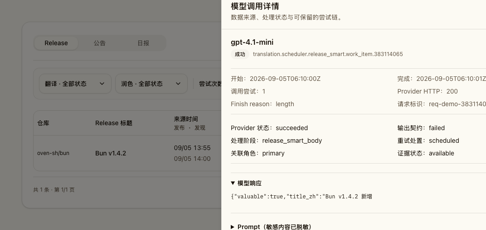
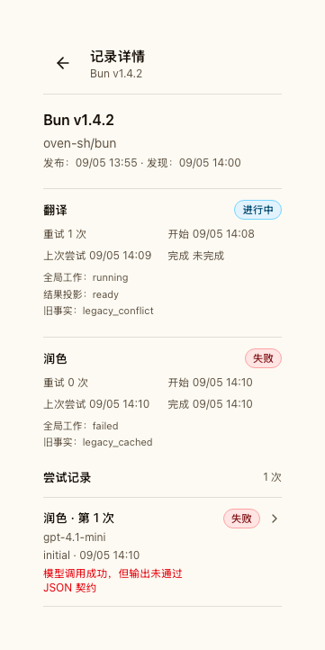
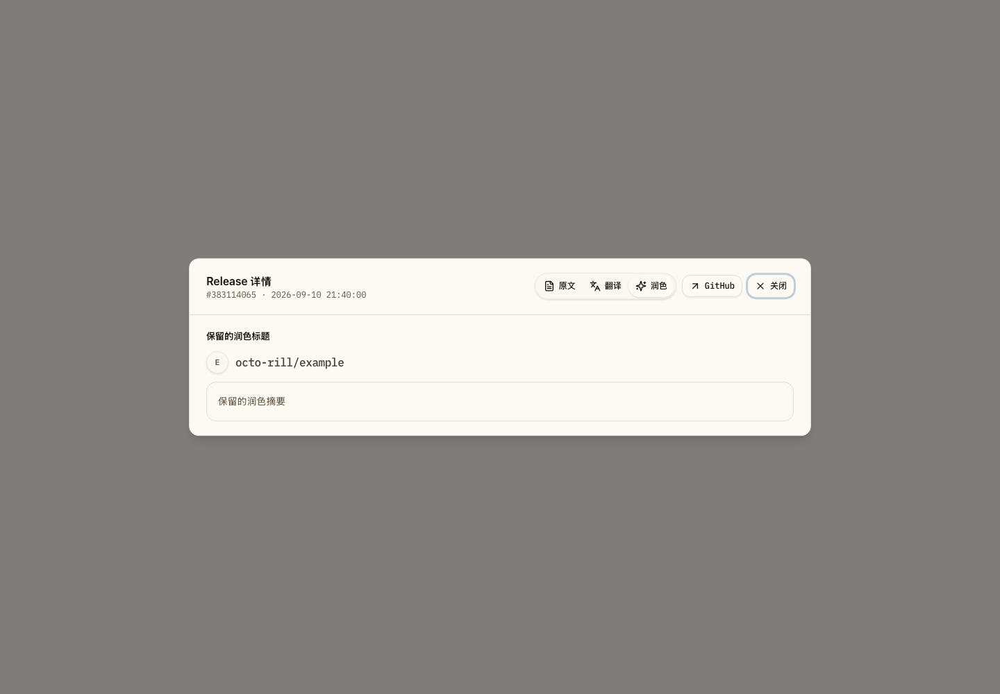
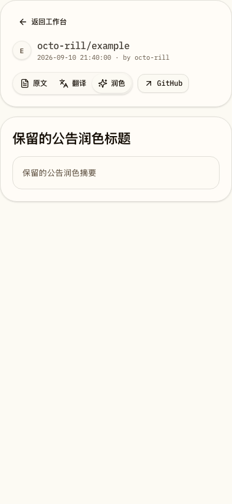

# 全局翻译与润色工作模型

## Context and Scope

管理端曾仅以 `translation_work_items` 推断当前状态，而 Release 明细翻译可以直接写入 `ai_translations`。这使存在结果缓存但没有工作项的记录显示为“未开始”。同时，现有翻译与润色工作项以 `scope_user_id` 隔离，重复执行相同规范资源，并把全局内容处理错误建模成用户局部状态。

本主题将 Release、公告和通知的翻译与润色统一为全局工作与结果模型。它复用既有调度器的批处理、租约、恢复和诊断能力，但拥有全局身份、请求关联、结果投影、旧事实保留、切换和回滚合同。日报生成和日报内容处理不在范围内。

## Requirements

- REQ-GTP-IDENTITY: Release、公告和通知的翻译与润色必须按 `(canonical_resource_type, canonical_resource_id, pipeline, variant, target_lang, source_hash, protocol_version, model_profile)` 形成唯一全局工作身份。`scope_user_id`、请求者、请求模式、来源和重试触发者不得参与工作去重或结果身份。首个目标语言为 `zh-CN`；每用户模型、提示词、语言或密钥配置不属于本主题。
- REQ-GTP-NOTIFICATION-SOURCE: 同一通知线程的规范来源必须选择更新时间最新的来源行，并以稳定来源标识打破相同更新时间的平局。该选择同时决定来源时间、显示内容和后续源快照，且不得依赖请求者或任一用户副本。
- REQ-GTP-OWNERSHIP: 调度器拥有全局持久化边界：授权后的请求只能通过调度器 admission/retry command 在同一 SQLite writer 事务中创建或重新排队工作项；调度 worker 是尝试事件、模型调用和结果投影的唯一写入者。所有既有翻译或润色入口必须成为调度请求适配器，保留 `async`、`wait`、`stream` 交付语义；遗留 `sync` 入口映射为有界 `wait`，到期返回可轮询的 pending 快照。全局 worker 只能消费冻结源快照，不得使用任一请求者的 OAuth 身份或可变用户上下文；任何直接模型调用或直接终态缓存写入都不得绕过调度器。
- REQ-GTP-AUTHORIZATION: 请求者关联必须记录调用者或系统生产者、授权时刻、请求来源和关联的全局工作项。资源访问控制始终在请求、轮询、读取结果和重试时检查；全局共享不得向未获授权者暴露私有资源、输出、请求关联或诊断信息。
- REQ-GTP-RESULTS: 只有通过输出契约和业务校验的内容可以发布为结果投影。来源更新创建新工作项并在六十秒去抖后提交；旧的已发布结果在刷新期间保持可读，直到新投影原子替换。删除的来源必须取消或抑制未完成工作，且不得发布结果。
- REQ-GTP-CACHE-HIT: 命中与全局工作身份完全一致的当前有效结果投影时，若没有保留的当前工作项，调度器必须创建状态为 `ready`、`cache_hit=true`、尝试次数为零的全局工作项并关联请求者。该工作项只记录真实缓存命中，不得由旧事实或无效输出创建。
- REQ-GTP-LIFECYCLE: 工作项状态限定为 `queued`、`running`、`ready`、`failed`、`not_applicable`、`deferred_provider`、`blocked_config`、`cancelled` 或 `superseded`，并且每个状态转换必须符合数据库合同。手动重试复用原工作项、追加新尝试并受五分钟冷却限制；仅结构化瞬态失败按一、五、十五、六十、二百四十分钟间隔自动恢复，最长二十四小时。调度器维持既有租约和并发边界，手动重试优先级为三，同时至少保留一个后台执行名额。
- REQ-GTP-CONFIGURATION: 每个工作项在创建时冻结全局配置指纹；活动工作直到终态都使用该快照。冻结配置不可用时，工作项进入 `blocked_config`，不得悄悄改用其他配置。模型档案变更不会自动重跑已发布结果，只能由来源变化或明确的管理员刷新创建新工作。
- REQ-GTP-RETRY-COORDINATION: 对终态失败的授权重试必须由数据库唯一约束和事务串行化。工作项已在执行、排队或恢复时，服务端仍创建请求者关联，但返回 `409`、稳定错误码、当前工作项标识、当前状态、最近尝试状态和轮询地址；前端以该事实同步状态，而不将其显示为新的独立失败。
- REQ-GTP-PROVIDER-GUARD: 持久化的提供方熔断与路由健康状态优先于人工重试。熔断打开时，授权请求仍创建请求者关联，但工作项保持或转入 `deferred_provider`；只有调度器拥有的受控探测可以恢复提供方调用，人工请求不得绕过熔断。
- REQ-GTP-ADMIN-READS: 管理页和详情读取必须是纯读取，不得补覆盖范围、创建工作项、重试或写入缓存。它必须分别展示当前全局工作状态、当前结果投影和旧事实来源；只有旧缓存且没有全局工作或结果时显示 `legacy_cached`，旧工作与缓存无法一致解释时显示 `legacy_conflict`。不得以缓存回退伪造“已完成”“未开始”或尝试次数。
- REQ-GTP-ADMIN-READ-BUDGET: 管理采集记录列表的查询窗最长三十一天，必须在数据库中以完全相同的筛选语义分别取得精确总数和当前页标识，并且只装载当前页的处理摘要。列表不得使用结果缓存、请求合并或内存全量分页；源站读取预算为五秒，同类并发读取容量耗尽时返回带 `Retry-After` 的 `503`。
- REQ-GTP-LEGACY: 现有 `translation_work_items`、`translation_requests`、尝试事件和 `ai_translations` 行必须保留为只读历史事实；其中 `release_smart`、`announcement_smart` 等润色记录与翻译记录适用同一保留规则。迁移只能从其读取并记录可追溯的旧事实观察，绝不把旧缓存、旧状态或旧尝试合成为全局工作、全局结果或新的尝试历史。
- REQ-GTP-CUTOVER: 全局模型必须经由单一写入者切换，不得长期双写。切换前必须停止旧写入路径并完成运行中旧批次的受控收口；切换后由全局调度器接收新的覆盖请求。转换期间内容处理请求返回带轮询信息的 `503`，而不是部分落入新旧两个模型。
- REQ-GTP-COMPATIBILITY: 数据库演进必须使用扩展表、索引和控制记录。必须先发布含有该迁移且仍能安全运行旧行为的兼容版本，再发布不含新迁移的全局切换版本。兼容版本在检测到全局模式时禁用旧内容处理写入，允许降级后二进制继续打开数据库；不含该迁移版本的更旧应用不得作为回滚目标。
- REQ-GTP-NAMING: 所有面向用户和管理员的功能名称保持“翻译”和“润色”。本主题不得以“完整翻译”“智能变更摘要”或任何替代名称重命名现有能力。
- REQ-GTP-OBSERVABILITY: 尝试审计必须记录配置指纹、提供方调用标识、时长、令牌、成本、稳定错误码与脱敏摘要，并保持尝试到模型调用的精确归因。原始提示词、完整响应和未脱敏上游错误不进入常规管理读取或长期尝试审计。

## Non-goals

- 不引入消息队列、第二调度器、分布式协调器或分布式缓存。
- 不把日报生成或日报内容处理改为全局工作。
- 不以迁移修复、重写或删除历史用户隔离记录。

## Verification

- VER-GTP-GLOBAL-DEDUP: covers: REQ-GTP-IDENTITY, REQ-GTP-OWNERSHIP, REQ-GTP-AUTHORIZATION。以同一规范资源的多用户并发请求、不同资源、不同来源快照和无权访问者组合验证：只有一个全局工作与结果，worker 不使用请求者身份，且每个请求者关联和访问边界都正确。
- VER-GTP-NOTIFICATION-SOURCE: covers: REQ-GTP-NOTIFICATION-SOURCE。以跨用户同一线程的不同标题、仓库和更新时间组合验证：最新行决定规范来源与源快照；相同更新时间始终由稳定平局规则选出同一来源；访问控制不因来源选择而改变。
- VER-GTP-LIFECYCLE: covers: REQ-GTP-RESULTS, REQ-GTP-CACHE-HIT, REQ-GTP-LIFECYCLE, REQ-GTP-CONFIGURATION, REQ-GTP-RETRY-COORDINATION, REQ-GTP-PROVIDER-GUARD。验证来源变更、删除、有效与无效输出、当前结果命中生成零次尝试的 `ready` 工作项、配置不可用、自动恢复、五分钟冷却、并发手动重试 `409`、熔断下的 `deferred_provider`、优先级与至少一个后台名额。
- VER-GTP-ADMIN: covers: REQ-GTP-ADMIN-READS, REQ-GTP-LEGACY, REQ-GTP-NAMING, REQ-GTP-OBSERVABILITY。验证管理 GET 无写入，旧缓存不会被伪造成工作项，`legacy_cached` 与 `legacy_conflict` 有可追溯来源，诊断安全字段正确，界面始终显示“翻译”和“润色”。
- VER-GTP-ADMIN-READ-BUDGET: covers: REQ-GTP-ADMIN-READ-BUDGET, REQ-GTP-NOTIFICATION-SOURCE。以生产形状的通知、遗留工作项和全局工作项夹具验证四类列表：总数与页码精确、状态筛选在分页前完成、跨用户同一通知线程使用规范来源、超过三十一天被拒绝、超时与并发饱和返回可重试 `503`，且释放读取容量。
- VER-GTP-CUTOVER: covers: REQ-GTP-CUTOVER, REQ-GTP-COMPATIBILITY。以旧事实混合、运行中旧批次、切换冻结、全局写入启用和切换版本降级到兼容版本的数据库副本验证：旧行未改变，转换无双写，兼容版本可启动且旧写入者失效，更旧版本被部署检查拒绝。

## Interfaces & Contracts

| Interface | Kind | Scope | Change | Contract | Owner | Consumers |
| --- | --- | --- | --- | --- | --- | --- |
| Global content-processing request API | HTTP API | external | Modify | [http-apis.md](./contracts/http-apis.md) | backend | web, existing producers |
| Content-processing status and retry API | HTTP API | external | Modify | [http-apis.md](./contracts/http-apis.md) | backend | web, admin |
| AI records and detail API | HTTP API | external | Modify | [http-apis.md](./contracts/http-apis.md) | backend | admin web |
| Global work, result, requester and legacy-evidence tables | DB schema | internal | New | [db.md](./contracts/db.md) | backend | scheduler, API, admin read model |
| Existing user-scoped scheduler and cache tables | DB schema | internal | Retain read-only | [db.md](./contracts/db.md) | backend | legacy evidence reader |

## Related ADRs

- [ADR 0001: LLM Recovery Boundary](../../adr/0001-llm-recovery-boundary.md)
- [ADR 0004: AI Diagnostics Evidence Boundary](../../adr/0004-ai-diagnostics-evidence-boundary.md)
- [ADR 0007: 全局翻译与润色工作模型](../../adr/0007-global-translation-and-polish-work-model.md)
- [ADR 0008: 规范通知来源选择](../../adr/0008-canonical-notification-source-selection.md)
- [ADR 0009: 管理采集记录读取预算](../../adr/0009-admin-collection-record-read-budget.md)

## Visual Evidence

- source_type: storybook_canvas
  story_id_or_title: Admin/AiOperationsRecordsSection/GlobalEvidenceOverview
  state: desktop diagnostic detail
  requested_viewport: 1440x1000
  viewport_strategy: storybook-viewport
  capture_scope: element
  margin_policy: require_margin
  evidence_surface: component
  surface_selector: "[data-visual-evidence-surface]"
  target_selector: "[data-visual-evidence-target]"
  sensitive_exclusion: N/A (mock-only Storybook fixture)
  submission_gate: pending-owner-approval
  evidence_note: 管理记录保留“翻译”和“润色”名称，并展示可追溯的尝试与模型调用诊断。
  image: 

- source_type: storybook_canvas
  story_id_or_title: Admin/AiOperationsRecordsSection/GlobalEvidenceOverview
  state: mobile diagnostic detail
  requested_viewport: 393x852
  viewport_strategy: storybook-viewport
  capture_scope: element
  margin_policy: require_margin
  evidence_surface: component
  surface_selector: "[data-visual-evidence-surface]"
  target_selector: "[data-visual-evidence-target]"
  sensitive_exclusion: N/A (mock-only Storybook fixture)
  submission_gate: pending-owner-approval
  evidence_note: 移动宽度下详情内容不横向溢出，长模型标识可断行。
  image: 

- source_type: storybook_canvas
  story_id_or_title: Content Projection Retention/RetainedPolishProjectionRelease
  state: release retained smart projection
  requested_viewport: 1440x1000
  viewport_strategy: storybook-viewport
  capture_scope: browser-viewport
  margin_policy: trim_only
  evidence_surface: page
  sensitive_exclusion: N/A (mock-only Storybook fixture)
  submission_gate: pending-owner-approval
  evidence_note: Release 详情在全局接口以 ready + auto_translate 形状返回时，保留已有润色投影并继续显示“润色”入口。
  image: 

- source_type: storybook_canvas
  story_id_or_title: Content Projection Retention/RetainedPolishProjectionAnnouncement
  state: announcement retained smart projection
  requested_viewport: 393x852
  viewport_strategy: storybook-viewport
  capture_scope: browser-viewport
  margin_policy: trim_only
  evidence_surface: page
  sensitive_exclusion: N/A (mock-only Storybook fixture)
  submission_gate: pending-owner-approval
  evidence_note: 公告详情与 Release 使用同一全局润色投影合同，移动宽度下保留摘要且不改名“润色”。
  image: 
