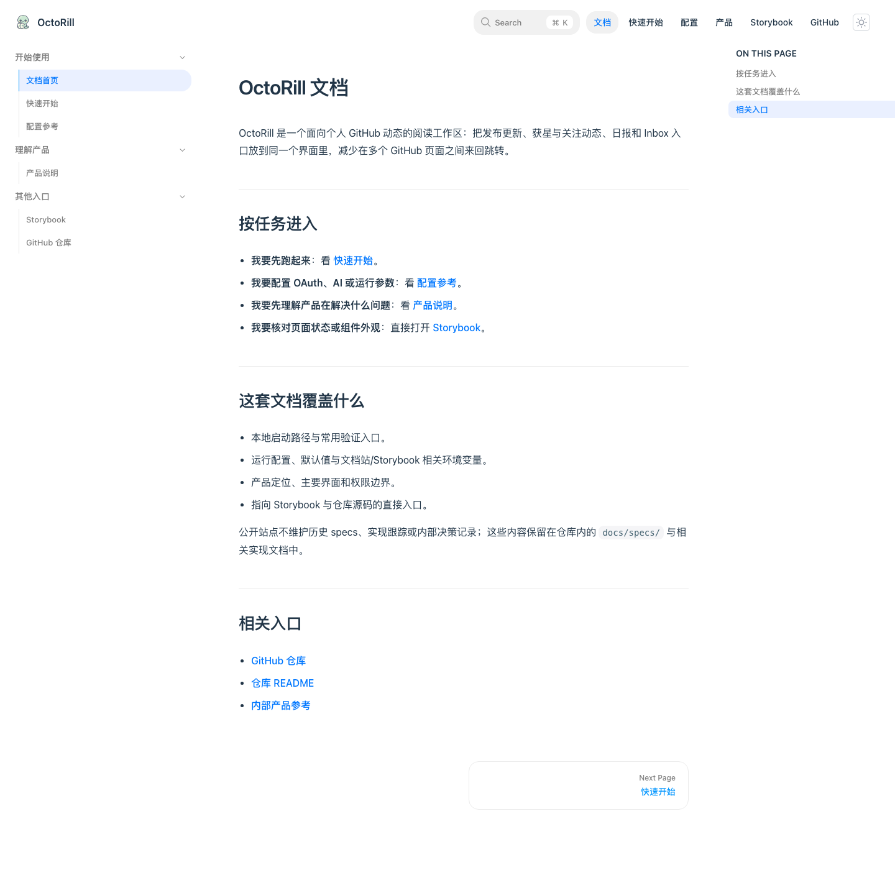

# 移除公开文档中的 Storybook 导览页（#gms6p）

## 背景 / 问题陈述

- `docs-site/docs/storybook-guide.mdx` 把“打开 Storybook”包装成单独文档页，增加了一层没有必要的跳转。
- 首页、快速开始和侧边栏都把用户先引到导览页，再引到 `storybook.html`，让入口变得拖沓。
- 旧版本公开站点已经发布过 `/storybook-guide.html`；如果直接删掉这个 URL，会让既有书签和外部链接变成 404。

## 目标 / 非目标

### Goals

- 从公开文档站移除 `Storybook 导览` 作为可见文档页面与导航入口。
- 保留直接跳转到 `storybook.html` 的能力，不改变 Storybook 静态站点本身。
- 让 `/storybook.html` 自己承担本地 docs-only 场景下的最小提示，不再依赖额外导览页。
- 为既有 `/storybook-guide.html` 链接保留兼容重定向，而不是继续保留导览正文。
- 清理仓库文档里的相关死链，让公开入口收敛成“直接打开 Storybook”。

### Non-goals

- 不移除 Storybook 本身，也不调整 `web/` 下的 stories、docs 或构建脚本。
- 不改变 GitHub Pages 的 Storybook 组装路径。
- 不重写其他产品文档职责。

## 范围（Scope）

### In scope

- 移除 `Storybook 导览` 在 docs-site 导航、首页与快速开始中的公开入口。
- 调整 `docs-site/rspress.config.ts`、`docs-site/docs/index.md`、`docs-site/docs/quick-start.md`、`docs-site/docs/storybook.mdx` 中对导览页的引用。
- 把 `docs-site/docs/storybook-guide.mdx` 改成旧链接兼容重定向，不再保留导览正文。
- 清理 `web/README.md` 中对 `Storybook 导览` 的文档引用。
- 调整 Pages 组装与 smoke check，使发布链路不再要求 `storybook-guide.html`。
- 通过 docs-site build、Storybook build、assembled Pages smoke check 验证没有引入死链或组装回归。

### Out of scope

- `web/src/stories/**` 内部故事内容调整。
- 任何运行时代码、路由、API 或数据库改动。

## 验收标准（Acceptance Criteria）

- Given 读者打开 docs-site 首页
  When 查看任务入口与侧边栏
  Then 不再出现 `Storybook 导览` 页面链接，只保留直接打开 Storybook 的入口。

- Given 读者从快速开始进入可选本地入口
  When 阅读 Storybook 小节
  Then 能直接启动并打开 Storybook，而不是先跳到额外导览页。

- Given 读者打开 `/storybook.html`
  When 自动跳转失败或在本地单独运行 docs-site
  Then 页面只提示直接打开 Storybook 或启动本地 dev server，不再引用已删除的导览页。

- Given 旧链接访问 `/storybook-guide.html`
  When 页面加载
  Then 旧 URL 会自动跳转到 `/storybook.html`，而不是继续展示导览正文或返回 404。

- Given 维护者执行 docs 验证链路
  When 运行 docs-site build、Storybook build、assembled Pages smoke check
  Then 三项都通过，且组装后的 docs-site 不再把 `storybook-guide.html` 当作必需正文页。

## 非功能性验收 / 质量门槛（Quality Gates）

### Testing

- Docs build: `cd docs-site && bun run build`
- Storybook build: `cd web && bun run storybook:build`
- Assembled site smoke: `bash ./.github/scripts/assemble-pages-site.sh docs-site/doc_build web/storybook-static .tmp/pages-site`

### UI / Storybook (if applicable)

- 本次只改 docs-site 内容与链接，不新增 stories。
- owner-facing 视觉验收以 docs-site 首页与导航为准。

## Visual Evidence

## 风险 / 假设

- 风险：若某些文档仍保留对 `storybook-guide.html` 的硬编码引用，会在组装后留下死链。
- 假设：公开文档仍然保留 `storybook.html` 直达入口。

## 验证摘要

- docs-site build：通过
- Storybook build：通过
- assembled Pages smoke check：通过
- 组装结果确认：`storybook-guide.html` 仅保留旧链接兼容重定向，不再作为导航中的导览页
- 视觉证据：公开文档首页导航与侧边栏只保留直接 `Storybook` 入口
