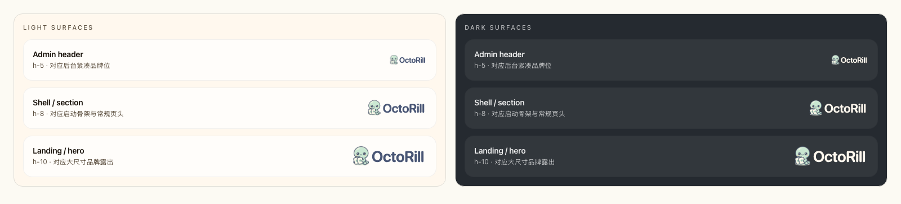
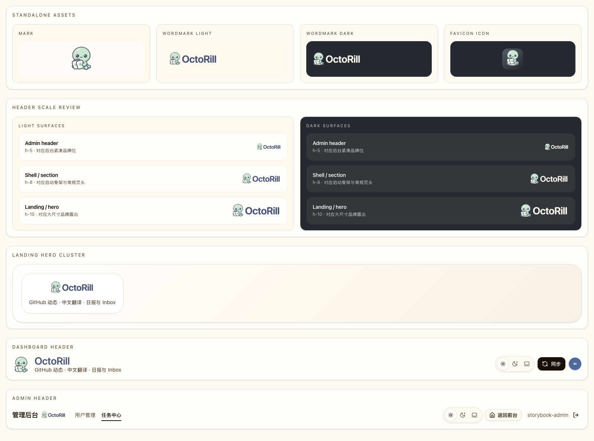

# OctoRill 全局字标路径化与对齐修复（#gzyja）

## 背景 / 问题陈述

- 当前 `wordmark-light.svg` / `wordmark-dark.svg` 仍用运行时 `<text>` 渲染 `OctoRill`，实际显示依赖本机字体回退。
- 在管理后台这类小高度品牌位里，字标会出现“偏小、基线发沉、图文不像一个整体”的观感；同一问题也会波及 Landing、AppBoot、README 等所有直接消费这两份字标资产的地方。
- 若继续只做页面级 CSS 补偿，每次重新导出品牌资产仍会把问题带回来，无法形成稳定的品牌真相源。

## 目标 / 非目标

### Goals

- 把带字版 `wordmark` 改成“动态 mascot + checked-in 静态路径轮廓字标”的导出链路。
- 修正字标的视觉权重、图文间距和纵向对齐，让 AdminHeader 尺寸下也能稳定成立。
- 保持 light / dark 两套字标几何完全一致，只允许填充色不同。
- 补齐 Storybook 品牌验收面与本 spec 的视觉证据，支撑后续 PR 审阅。

### Non-goals

- 不重做吉祥物 `mark`、favicon、app icon。
- 不改 docs-site navbar 的 `logo + logoText` 组合。
- 不改 Dashboard 主页头当前“图标 + 文本标题”品牌结构，不借机更换产品命名或文案。

## 范围（Scope）

### In scope

- `brand/source/wordmark-lettering.svg` 这类 checked-in 字标轮廓源。
- `scripts/render_brand_assets.py` 的 wordmark 导出逻辑。
- `brand/exports/*` 与 `web/public/brand/*` 的 wordmark 副本。
- 直接消费 `wordmark-light/dark` 的 Web 露出面、README 顶部双字标、BrandLogo Storybook gallery。
- 本 spec 的 `## Visual Evidence`。

### Out of scope

- mascot 主图、favicon / app icon、docs-site navbar 图标接入。
- 页面级魔法偏移、单点 override、或为后台单独维护第二套字标资产。
- 新增 API、数据结构、权限或业务逻辑改动。

## 需求（Requirements）

### MUST

- 导出的 `wordmark-light.svg` 与 `wordmark-dark.svg` 不得再包含 `<text>`。
- 字标轮廓必须由仓库内已提交的静态 SVG 片段驱动，重新执行导出脚本时不得回退到系统字体文本。
- 小尺寸 AdminHeader 品牌位必须达到“肉眼不再显小、字与图中心线稳定、左右组合像一个整体”的效果。
- Storybook 必须补齐 header-scale 预览，至少覆盖后台小尺寸和常规大尺寸两档。
- 最终 owner-facing 效果图必须写回本 spec 的 `## Visual Evidence`。

### SHOULD

- 保留现有圆润、亲和的品牌气质，不引入另一套完全不同的字形风格。
- README 顶部双字标在 GitHub light/dark 场景下继续保持不裁切、不失真。

## 功能与行为规格（Functional/Behavior Spec）

### Core flows

- 品牌导出脚本从 `brand/source/reference/generated-brand-refresh-reference.png` 继续提取 mascot 位图数据，但 `OctoRill` 字样改由仓库内固定的路径轮廓 SVG 注入。
- `wordmark-light.svg` 与 `wordmark-dark.svg` 继续沿用同一套布局与 path geometry，只在填充色上区分浅色 / 深色版本。
- Web 端所有直接消费 `BrandLogo variant="wordmark"` 的界面继续走原有资源路径，无需新增页面级特殊对齐代码。
- Storybook 品牌 gallery 新增 header-scale 预览，作为本轮最稳定的视觉证据来源。

### Edge cases / errors

- 若导出源缺失 `wordmark-lettering.svg`，品牌导出脚本必须直接失败，而不是静默回退到 `<text>`。
- 若更新后的字标在大尺寸露出面出现裁切、挤压或长宽异常，本轮视为未通过验收。

## 接口契约（Interfaces & Contracts）

### 接口清单（Inventory）

None

## 验收标准（Acceptance Criteria）

- Given 执行 `python3 scripts/render_brand_assets.py`，When 检查 `brand/exports/wordmark-light.svg` 与 `brand/exports/wordmark-dark.svg`，Then 两者都使用固定路径轮廓，且不再包含 `<text>`。
- Given 打开 AdminHeader 与 BrandLogo Storybook 品牌页，When 查看后台小尺寸品牌位，Then `OctoRill` 文字不再显小下沉，图标与文字组合像统一 logo。
- Given 查看 Landing / AppBoot / README 的字标露出，When 切换浅色和深色环境，Then 字标不会出现裁切、失真或 light/dark 几何不一致。
- Given 本轮完成实现，When 检查本 spec，Then `## Visual Evidence` 已落盘最终 owner-facing 效果图，且这些效果图与聊天回图一致。

## 实现前置条件（Definition of Ready / Preconditions）

- 受影响范围已锁定为全局 `wordmark` 资产链路，而非后台单点补丁。
- 品牌方向已锁定为“保留现风格，只修路径化与几何对齐”。
- Storybook 仍是本仓库可用的 Web UI 首选视觉证据来源。

## 非功能性验收 / 质量门槛（Quality Gates）

### Testing

- `python3 scripts/render_brand_assets.py`
- `cd web && bun run build`
- `cd web && bun run storybook:build`

### UI / Storybook (if applicable)

- Stories to add/update: `web/src/stories/BrandLogo.stories.tsx`
- Docs pages / state galleries to add/update: `Brand/Logo` 下的 docs-first gallery
- `play` / interaction coverage to add/update: None（静态品牌资产，不额外新增 play）

### Quality checks

- Smoke check: `rg -n \"<text\" brand/exports/wordmark-*.svg web/public/brand/wordmark-*.svg`

## Visual Evidence

- Header-scale review：后台紧凑品牌位、常规页头与大尺寸露出共用同一套路径版字标，重点验证 `h-5` 的 AdminHeader 尺寸不再显小下沉。
  
- Surface gallery：独立字标、Landing hero、Dashboard header 与 Admin header 复用同一导出资产，确认 light / dark 仅填充色不同、几何保持一致。
  

## 方案概述（Approach, high-level）

- 使用仓库内固定 SVG path 作为 `OctoRill` 字标真相源，让 light/dark 版本共享同一几何。
- 通过导出链路统一调整 mascot 尺寸、图文间距与字标高度，而不是为具体页面写临时 offset。
- 用 Storybook 先验证 header-scale，再把同一组图写入 spec 作为长期视觉证据。

## 风险 / 开放问题 / 假设（Risks, Open Questions, Assumptions）

- 风险：若路径字标权重放大过头，README / AppBoot 等大尺寸露出可能显得过满，需要回调几何。
- 风险：若导出脚本对 path source 的读取约束不够严格，后续维护时可能误改格式导致导出失败。
- 假设：rounded system font 生成出的路径风格足够贴近当前品牌气质，可作为本轮静态字标源。

## 参考（References）

- `docs/specs/tvujt-brand-generated-icon-refresh/SPEC.md`
- `docs/specs/76bxs-dashboard-header-brand-layout/SPEC.md`
