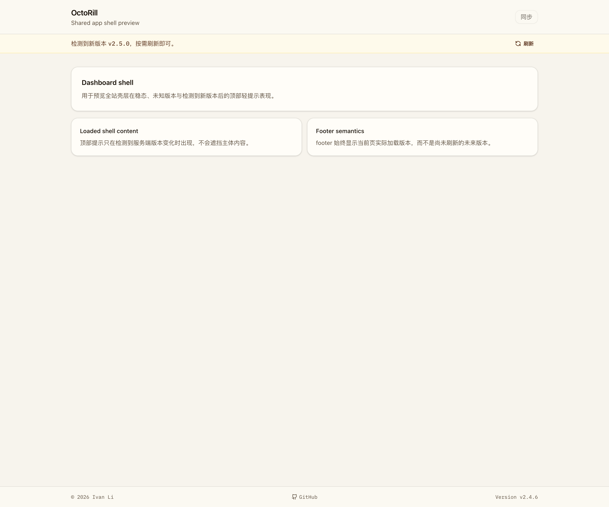

# 服务器版本变更后的 Web 轻提示（#h4yvc）

## 状态

- Status: 已完成
- Created: 2026-04-10
- Last: 2026-04-10

## 背景 / 问题陈述

- 现有 Web 端只在 footer 显示当前版本；服务端部署新版本后，已打开页面的用户没有任何温和反馈。
- 当前前台/管理页没有长期在线的版本 SSE 通道，不适合为这个单点能力额外维护一条持续连接。
- 若仍然只显示旧 footer 版本，用户会误以为页面已经是最新内容，也缺少一个明确但低打扰的“现在可以刷新”的入口。

## 目标 / 非目标

### Goals

- 在统一 Web 壳层增加一个低打扰的顶部轻提示：当服务端版本变化时提示“有新版本可用”。
- 使用前端轮询而不是长期 SSE；默认只在页面可见时轮询，发现新版本后停止继续轮询。
- 明确区分“当前页已加载版本”和“服务端最新版本”，避免 footer 直接跳成尚未刷新的未来版本。
- 复用现有 `GET /api/version`，失败时回退 `GET /api/health`，并补齐请求/响应两侧的防缓存保护。
- 为 Landing、Dashboard、Admin 三类共享壳层页面统一生效。

### Non-goals

- 不引入 SSE / WebSocket / Service Worker 更新推送。
- 不做自动整页刷新或强制弹窗提醒。
- 不为不同页面定制不同的更新提示样式。
- 不修改版本号来源解析逻辑本身。

## 范围（Scope）

### In scope

- `web/src/version/**`：新增单实例版本监视与共享状态。
- `web/src/layout/AppShell.tsx`：增加可选 notice 槽位。
- `web/src/layout/AppMetaFooter.tsx`：改为消费共享版本状态，只显示当前页实际加载版本。
- `web/src/pages/*`：接入统一版本更新轻提示。
- `src/server.rs`：为 `/api/version` 与 `/api/health` 加上 no-store 响应头。
- Storybook、Playwright、spec 视觉证据与相关文档同步。

### Out of scope

- 新增后端版本推送接口。
- 页面内部局部热替换。
- 移动端/桌面端独立提示策略。

## 需求（Requirements）

### MUST

- 当首次加载页面成功拿到版本后，footer 持续展示该“已加载版本”，直到用户主动刷新整页。
- 轮询间隔固定为 60 秒；页面不可见时暂停常规轮询，重新可见时可立即补一次检查。
- 检测到新版本后必须显示顶部轻提示，并停止后续版本轮询。
- 轻提示必须提供低打扰“刷新”动作，并触发整页 reload。
- `/api/version` 请求失败时必须自动回退 `/api/health`。
- 版本检查请求与响应都必须显式禁用缓存，避免部署后读到旧值。

### SHOULD

- 轻提示视觉上与现有壳层风格一致，弱于 destructive/warning 级别提醒。
- Storybook 需要提供稳定的 app-shell 状态覆盖与交互校验。
- Playwright 需要覆盖“无提示 / 检出更新 / health fallback / 刷新后稳态”四类行为。

### COULD

- 在 Storybook docs 中额外提供状态总览，便于后续复用为 PR/owner 视觉验收入口。

## 功能与行为规格（Functional/Behavior Spec）

### Core flows

- 首次进入任一共享壳层页面时，前端先解析当前服务端版本并记录为 `loadedVersion`；footer 只展示这个值。
- 前端在后台按 60 秒节奏检查最新版本；页面隐藏时不继续常规轮询，页面重新可见后补一次版本检查。
- 当新检查结果与 `loadedVersion` 不一致时，页面显示一条细窄顶部轻提示，文案包含新版本号，并提供“刷新”按钮。
- 用户点击“刷新”后触发整页 reload；页面重新初始化后，footer 改为展示最新加载到的版本，轻提示消失。

### Edge cases / errors

- 若首次版本请求失败，则 footer 显示 `unknown`；后续一旦第一次成功拿到版本，直接把该值作为新的 `loadedVersion` 基线，不补弹更新提示。
- 若 `/api/version` 失败但 `/api/health` 成功，仍按成功版本结果参与基线记录或更新检测。
- 若两个端点都失败，则保持静默，不展示误报提示，也不清空已有 `loadedVersion`。
- 一旦更新提示已经出现，后续不再继续轮询，避免重复请求与提示闪烁。

## 接口契约（Interfaces & Contracts）

### 接口清单（Inventory）

| 接口（Name） | 类型（Kind） | 范围（Scope） | 变更（Change） | 契约文档（Contract Doc） | 负责人（Owner） | 使用方（Consumers） | 备注（Notes） |
| --- | --- | --- | --- | --- | --- | --- | --- |
| `GET /api/version` | HTTP API | external | Modify | None | backend | web-shell | 响应体不变，补充 no-store 响应头 |
| `GET /api/health` | HTTP API | external | Modify | None | backend | web-shell | 响应体不变，补充 no-store 响应头 |
| `AppShell.notice` | React prop | internal | New | None | web-shell | landing/dashboard/admin | 壳层顶部轻提示槽位 |

### 契约文档（按 Kind 拆分）

- None

## 验收标准（Acceptance Criteria）

- Given 用户打开任一共享壳层页面
  When 当前服务端版本尚未变化
  Then footer 只显示当前页已加载版本，顶部不出现更新提示。

- Given 页面已记录 `loadedVersion=v1.2.3`
  When 后续轮询读到服务端版本 `v1.2.4`
  Then 页面显示细窄顶部轻提示“检测到新版本 v1.2.4”，footer 仍保持 `Version v1.2.3`。

- Given `/api/version` 返回失败
  When `/api/health` 返回 `v1.2.4`
  Then 页面仍能正确识别更新并显示轻提示。

- Given 页面已经显示新版本轻提示
  When 用户点击“刷新”
  Then 页面执行整页 reload，重新加载后 footer 显示最新版本，且轻提示消失。

- Given 部署切换后存在代理/浏览器缓存
  When 前端轮询版本接口
  Then 版本检查不会因为缓存命中而长期停留在旧版本。

## 实现前置条件（Definition of Ready / Preconditions）

- 目标、范围、非目标与轻提示样式已冻结。
- 统一采用轮询方案，不再要求新建 SSE 通道。
- 共享壳层页面列表（Landing / Dashboard / Admin）已确认。
- 版本接口继续复用 `/api/version` + `/api/health`，不新增新端点。

## 非功能性验收 / 质量门槛（Quality Gates）

### Testing

- Unit tests: Rust 端补充 no-store header helper 覆盖。
- Integration tests: None。
- E2E tests (if applicable): 更新 `web/e2e/app-meta-footer-version.spec.ts` 覆盖更新提示与刷新路径。

### UI / Storybook (if applicable)

- Stories to add/update: `web/src/stories/AppShell.stories.tsx`、`web/src/stories/AppMetaFooter.stories.tsx`、必要的 `Dashboard.stories.tsx` provider 接线。
- Docs pages / state galleries to add/update: Storybook autodocs for app shell version notice states。
- `play` / interaction coverage to add/update: App shell 更新提示的显隐与刷新动作。
- Visual regression baseline changes (if any): 在本 spec 的 `## Visual Evidence` 中记录稳定截图。

### Quality checks

- Lint / typecheck / formatting: `cd web && bun run build`
- Storybook: `cd web && bun run storybook:build`
- E2E: `cd web && bun run e2e -- app-meta-footer-version.spec.ts`
- Backend: `cargo test`

## 文档更新（Docs to Update）

- `docs/specs/README.md`: 新增本 spec 索引并在实现结束后更新状态/备注。
- `docs/specs/h4yvc-version-update-polling-notice/SPEC.md`: 同步最终里程碑、视觉证据与交付结论。

## 计划资产（Plan assets）

- Directory: `docs/specs/h4yvc-version-update-polling-notice/assets/`
- In-plan references: ``
- Visual evidence source: maintain `## Visual Evidence` in this spec when owner-facing or PR-facing screenshots are needed.

## Visual Evidence

- 共享壳层在检测到服务端新版本后，会显示低打扰顶部轻提示；footer 仍保持当前页已加载版本。

## 资产晋升（Asset promotion）

- None

## 实现里程碑（Milestones / Delivery checklist）

- [x] M1: 前端共享版本监视、AppShell notice 槽位与顶部轻提示完成。
- [x] M2: footer 共享版本语义、后端 no-store 保护与 Storybook 覆盖完成。
- [x] M3: Playwright / build / visual evidence / review-loop 收敛完成。

## 方案概述（Approach, high-level）

- 用一个单实例 React provider 承载版本基线、轮询与更新检测，避免多个页面片段各自重复拉取版本接口。
- `AppShell` 只负责提供轻提示槽位，不绑定业务来源；具体版本更新提示由共享 notice 组件渲染。
- `AppMetaFooter` 改为完全消费共享状态，只展示当前页实际加载版本，不参与新版本检测。
- 后端通过统一 no-store 响应头确保版本端点不被缓存链路污染。

## 风险 / 开放问题 / 假设（Risks, Open Questions, Assumptions）

- 风险：若部署链路存在更强的 CDN 级缓存策略，单纯 no-store 仍可能需要额外平台配置兜底。
- 需要决策的问题：None。
- 假设（需主人确认）：共享壳层页面都应统一展示相同风格的更新提示。

## 变更记录（Change log）

- 2026-04-10: 新建规格，冻结“顶部轻提示 + 轮询 + no-store + 手动刷新”的交付口径。
- 2026-04-10: 实现完成；已补齐 Storybook、视觉证据、Playwright 覆盖与 review-loop 收敛。

## 参考（References）

- `docs/specs/x4k7m-effective-version-surfacing/SPEC.md`
- `web/src/layout/AppMetaFooter.tsx`
