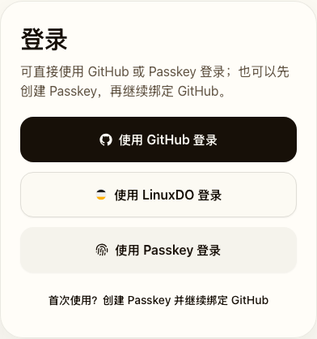
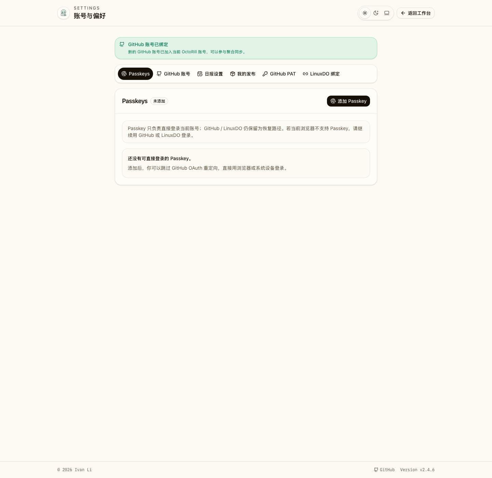
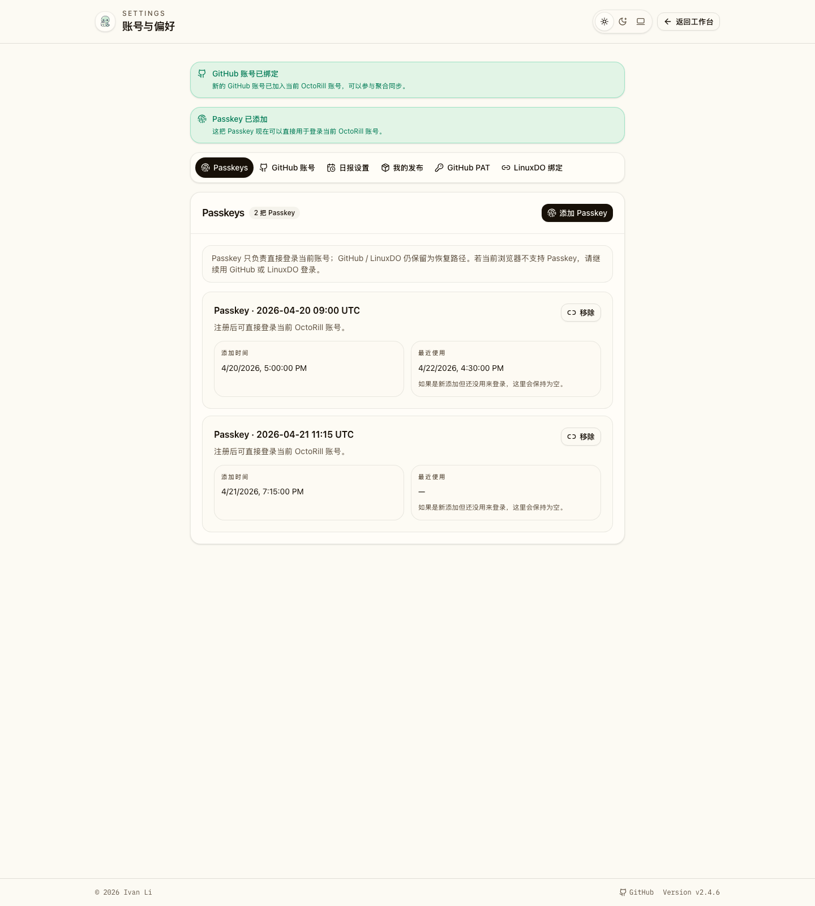
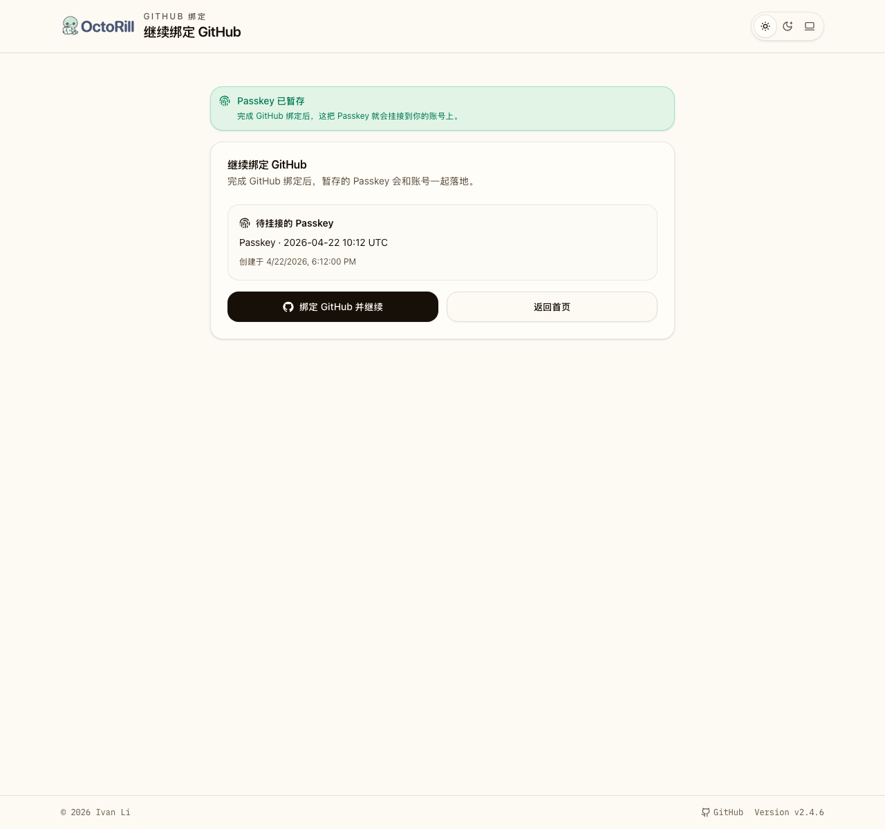

# Passkey 登录与 GitHub 绑定 Onboarding（#hgsxb）

## 背景 / 问题陈述

- 当前 OctoRill 登录入口只覆盖 GitHub / LinuxDO OAuth，返回用户每次都要经过 OAuth 重定向，缺少更短的回访登录路径。
- 现有账号体系已经收敛为“OctoRill 账号 + 至少一条 GitHub connection”，因此新增 Passkey 不能破坏“进入主产品前必须先有 GitHub connection”的不变量。
- 匿名用户若先想创建 Passkey，再继续补 GitHub 绑定，现有流程没有服务端真相源去承接这段临时状态。
- 设置页也缺少一个统一的 Passkey 管理区，用户无法查看、追加或撤销已绑定设备。

## 目标 / 非目标

### Goals

- 在现有 GitHub / LinuxDO OAuth 体系上新增 Passkey 作为补充登录方式，不替换原有 OAuth。
- 支持两条主链路：已挂接 Passkey 的返回用户可直接登录；匿名用户可先完成 Passkey ceremony，再继续绑定 GitHub 完成首登落地。
- 在设置页提供 `section=passkeys`，支持多设备注册、列表展示与撤销。
- pending Passkey 全部使用服务端 session-backed 状态承接，不引入新的长期 pending 表。
- 保持现有 `/api/me` 与账号模型约束：Passkey 只是账号的额外登录因子，正式可用账号仍然要求至少一条 GitHub connection。

### Non-goals

- 不移除 GitHub / LinuxDO 登录入口。
- 不提供“只有 Passkey、没有 GitHub connection”的正式账号形态。
- 不做 Passkey rename UI，也不引入额外 RP override 配置。
- 不覆盖 native app 或非 Web 端 Passkey 体验。

## 范围

### In scope

- `migrations/0040_user_passkeys.sql`
- Rust WebAuthn 配置、session、auth callback 与 Passkey API
- Landing / Settings / `/bind/github` 的 Passkey 入口与承接
- Storybook、Playwright、产品文档与公开文档同步

### Out of scope

- 账号自动合并
- 无 GitHub 的壳账号
- Passkey 命名管理
- 非浏览器端 Passkey 能力

## 数据模型与状态契约

### 数据模型

- `users.passkey_user_handle_uuid`
  - nullable + unique
  - 仅在用户第一次正式挂接 Passkey 时写入
- `user_passkeys`
  - `id`
  - `user_id`
  - `credential_id`
  - `label`
  - `passkey_json`
  - `created_at`
  - `last_used_at`

### Session-backed pending state

- `pending_passkey_registration`
  - 保存 begin registration 的 server-side challenge state
  - 区分 `attach_existing_account` 与 `onboarding`
- `pending_passkey_credential`
  - 保存匿名用户刚创建完成、尚未挂接账号的 Passkey 与展示 label
  - 由 GitHub callback 消费并决定 attach / retry-required
  - attach 正式账号时，若首次写入 `users.passkey_user_handle_uuid` 的条件更新没有成功落库，必须重新读取最新 handle，再决定 attach 还是 `passkey_retry_required`，避免并发首绑留下不可登录的孤儿凭据
- `pending_passkey_authentication`
  - 保存 discoverable authentication challenge state
  - 本地 loopback (`localhost` / `127.0.0.1`) 运行时的注册 challenge 也必须要求 discoverable / resident credential，确保后续 username-less discoverable authentication 能稳定取回 user handle

## HTTP / Route 契约

### API

- `POST /api/auth/passkeys/register/options`
- `POST /api/auth/passkeys/register/verify`
- `POST /api/auth/passkeys/authenticate/options`
- `POST /api/auth/passkeys/authenticate/verify`
- `GET /api/me/passkeys`
- `DELETE /api/me/passkeys/{passkey_id}`
- `GET /api/auth/bind-context` 扩展返回 `pending_passkey`

### Route / search

- Landing 增加两类 Passkey CTA：
  - `使用 Passkey 登录`（左侧带 Passkey 图标，和其他登录入口保持一致）
  - `首次使用？创建 Passkey 并继续绑定 GitHub`
- `/settings` 支持 `section=passkeys` 与 `passkey=<status>`
  - 仅 `section=passkeys` 保留 `passkey=<status>` flash；切到其他设置分区时必须清掉该 query，避免成功/错误 banner 泄漏到无关页面
  - 若 GitHub callback 同时带回 LinuxDO `connected` 与 Passkey 恢复类状态（如 `passkey_retry_required` / `passkey_already_bound` / `expired`），落点仍必须优先打开 `section=passkeys`，避免把 Passkey remediation 引导到其他分区
- `/bind/github` 支持 `passkey=<status>` 并展示 pending Passkey 卡片

## 功能与行为规格

### 返回用户：直接使用 Passkey 登录

- 用户在 Landing 点击 `使用 Passkey 登录`。
- 前端向后端请求 discoverable challenge，浏览器完成 WebAuthn `get()`。
- 后端通过 discoverable user handle 找到既有账号，并验证该账号仍有至少一条 GitHub connection。
- 验证成功后写入 session，更新对应 Passkey 的 `last_used_at`，返回 `/`。

### 匿名用户：先创建 Passkey，再继续绑定 GitHub

- 用户在 Landing 点击 `首次使用？创建 Passkey 并继续绑定 GitHub`。
- 后端生成临时 user handle 与 registration state；浏览器完成 WebAuthn `create()`。
- verify 成功后，服务端把 Passkey 与展示标签放进 `pending_passkey_credential`，并跳转 `/bind/github?passkey=created`。
- `/bind/github` 展示待挂接 Passkey，要求用户完成 GitHub 绑定。
- GitHub callback 成功后：
  - 若命中新账号或可安全认领的账号，则一次性完成 GitHub connection + Passkey attach；
  - 若命中不同 `passkey_user_handle_uuid` 的已有账号，则返回 `passkey_retry_required`，不做静默合并。

### 已登录用户：在设置页管理 Passkeys

- `/settings?section=passkeys` 展示当前账号全部 Passkeys。
- 用户可继续添加新的 Passkey；后端沿用正式账号的 `passkey_user_handle_uuid`。
- 用户可撤销任意一把 Passkey；撤销不会影响 GitHub / LinuxDO 登录。
- 列表标签由服务端自动生成，展示添加时间与最近使用时间。

### 浏览器不支持与过期态

- 若浏览器不支持 WebAuthn，Landing 和 Settings 均展示明确 fallback，不进入坏状态。
- registration/authentication/pending-bind 任一 session 状态过期时，后端返回显式错误码，前端映射为可理解文案。

## 验收标准

- Given 匿名用户访问 `/`
  When 页面加载完成
  Then GitHub / LinuxDO / Passkey 入口同时可见，且不支持 WebAuthn 的浏览器会显示 fallback 提示。

- Given 已绑定 Passkey 的返回用户访问 `/`
  When 完成 Passkey 验证
  Then 用户无需 GitHub OAuth 重定向即可登录，并继续满足既有 GitHub connection guard。

- Given 匿名用户先创建 Passkey
  When 继续完成 GitHub 绑定
  Then 系统会在 callback 中一次性落 GitHub connection 与 pending Passkey，并进入主界面。

- Given 已登录用户访问 `/settings?section=passkeys`
  When 页面加载完成
  Then 用户可以看到全部 Passkeys、添加新 Passkey，并撤销任意一把已有 Passkey。

- Given GitHub callback 命中一个已存在且 `passkey_user_handle_uuid` 不一致的账号
  When callback 尝试消费 pending Passkey
  Then 系统返回 `passkey_retry_required`，不自动合并账号。

## 质量门槛

- `cargo fmt --all -- --check`
- `cargo test`
- `cd web && bun run lint`
- `cd web && bun run build`
- `cd web && bun run storybook:build`
- `cd web && bun run e2e -- landing-login.spec.ts bind-github.spec.ts settings.spec.ts passkey-login.spec.ts`

## 文档更新

- `docs/specs/README.md`
- `docs/product.md`
- `docs-site/docs/product.md`
- `docs-site/docs/config.md`
- `docs-site/docs/quick-start.md`

## Visual Evidence

Landing Passkey 入口（storybook: `Pages/AppLanding / Default`）

Settings Passkeys 空态（storybook: `Pages/Settings / Passkeys Empty`）

Settings Passkeys 多设备态（storybook: `Pages/Settings / Passkeys Multiple Devices`）

Bind GitHub 待挂接 Passkey（storybook: `Pages/BindGitHub / Pending Passkey`）

