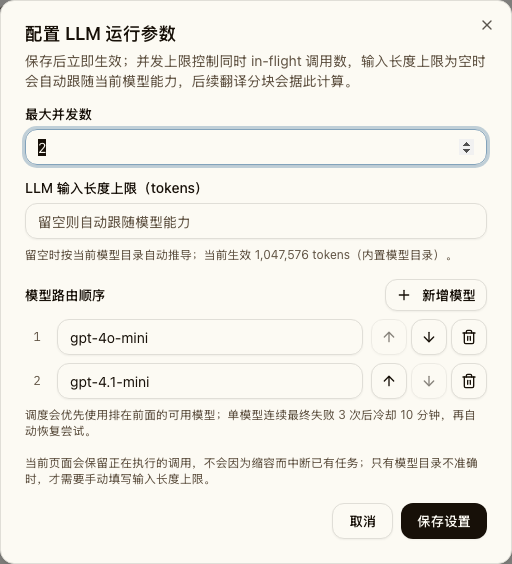
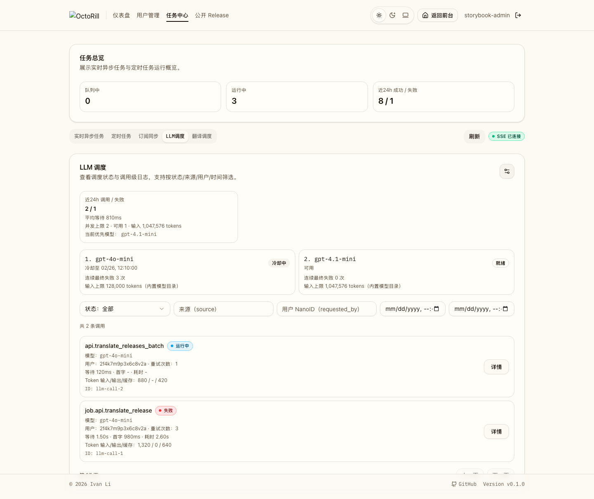

# 管理员 LLM 多模型路由与故障切换（#hp2um）

## 背景 / 问题陈述

- 当前运行时只接受单个 `AI_MODEL`，管理员后台只能配置 `max_concurrency` 与可选的 `ai_model_context_limit`。
- 管理员无法在控制台维护多个候选模型，也无法调整优先顺序。
- 当首选模型持续失败时，系统只能在同一模型内部重试，无法自动切走后备模型。
- 现有 `effective_model_input_limit` 与翻译批处理预算默认按单模型口径计算；如果直接引入多模型而不改预算来源，会出现“按模型 A 计算预算、实际却使用模型 B”的错配。

## 目标 / 非目标

### Goals

- 在 `/admin/jobs/llm` 的设置弹窗中支持维护**同一 provider / key** 下的多个模型 ID。
- 模型列表支持排序，调度对新请求始终优先选择排在前面且未处于冷却中的模型。
- 保留现有单模型内部重试语义；某模型在一次调用内跑完现有重试预算后仍失败，才记为一次模型级最终失败。
- 同一模型连续 3 次最终失败后进入 10 分钟冷却，后续新请求优先改用后续模型；冷却到期后自动恢复优先尝试。
- 输入预算、管理员状态接口、调用日志与翻译批次画像一起收敛到多模型语义。

### Non-goals

- 不支持每个模型独立的 `base_url`、`api_key`、provider 或加密密钥存储。
- 不在同一次 `chat_completion` 请求内做跨模型接力重试。
- 不引入权重路由、随机打散、按任务类型定向模型、按模型独立上下文上限覆盖。
- 不把模型冷却状态持久化到数据库；冷却与连续失败计数仅是进程内 runtime state。

## 范围（Scope）

### In scope

- `admin_runtime_settings` 新增持久化模型列表真相源。
- 启动 seed / 旧实例 backfill：无模型列表时使用当前 `AI_MODEL` 生成单元素列表。
- 后端 LLM 运行时：选模、冷却、连续失败计数、状态接口扩展、输入预算按实际选中模型计算。
- 管理端 LLM 调度设置弹窗、状态摘要与逐模型状态展示。
- Storybook、Rust tests、Playwright / build checks、相关 docs/config 口径同步。

### Out of scope

- 多 provider failover。
- 历史 `llm_calls` / `translation_batches` 数据回填为新路由画像。
- 新增按模型分桶的 24h 统计图或独立健康面板。

## 需求（Requirements）

### MUST

- `PATCH /api/admin/jobs/llm/runtime-config` 必须支持提交有序 `llm_models` 数组，数组元素为 trim 后的非空模型 ID。
- 管理端模型列表必须至少保留 1 个模型，且 trim / normalize 后不得重复。
- 新请求选模顺序固定为管理员排序后的第一个可用模型；若全部处于冷却，则选择 `cooldown_until` 最早到期的模型继续探测，不得直接返回“无模型可用”。
- 模型级最终失败的定义必须是：一次 `chat_completion` 已用完该模型的现有内部重试预算后仍失败。
- 某模型连续 3 次最终失败后进入 10 分钟冷却；成功一次则该模型的连续失败计数清零。
- `effective_model_input_limit` 必须与“下一次新请求将会选中的模型”一致；所有批处理预算也必须按该实际候选模型计算。

### SHOULD

- 管理台状态接口暴露逐模型状态：模型名、排序位置、冷却状态、连续失败次数、冷却截止时间、该模型的有效输入上限及来源。
- 翻译批次 / work item 的 `model_profile` 改为记录稳定的“有序模型路由画像”，避免 failover 把缓存键打散。

### COULD

- 后续再补按模型维度的 24h 健康聚合与管理端筛选项。

## 功能与行为规格（Functional / Behavior Spec）

### 1. 管理端模型列表设置

- `LLM 调度` 卡片右上角设置弹窗升级为三段：
  - 最大并发数
  - `LLM 输入长度上限（tokens）`
  - 模型路由列表
- 模型路由列表默认回填持久化顺序。
- 每个条目支持新增、删除、上移、下移。
- 模型列表至少保留 1 项；空白项、纯空格项、重复项提交时前端阻止，后端也必须返回 `400 bad_request`。

### 2. 运行时选模与冷却

- 每次新 LLM 请求在进入 upstream 调用前，先依据当前持久化模型列表与 runtime 健康态解析“本次选中的模型”。
- 该次请求在整个内部重试周期中都固定使用同一个模型，不在 attempt 之间切换模型。
- 若该次请求最终成功：
  - 记录实际模型到 `llm_calls.model`
  - 清零该模型的 `consecutive_final_failures`
- 若该次请求最终失败：
  - 对该模型的 `consecutive_final_failures += 1`
  - 若累计达到 3，则写入 `cooldown_until = now + 10m`

### 3. 预算与模型画像

- 全局手动覆盖值 `ai_model_context_limit` 继续存在；若不为空，对所有模型都生效。
- 若覆盖值为空，则按“本次实际选中的模型”解析 `effective_model_input_limit` 与 source。
- release detail chunk budget、release batch budget、notification batch budget、日报批处理预算都必须改为依赖该选模结果。
- `translation_work_items.model_profile` / `translation_batches.model_profile` 改为稳定记录有序模型列表画像，而不是单次实际命中的模型。

### 4. 管理端状态接口

- `GET /api/admin/jobs/llm/status` 顶层继续返回 `ai_model_context_limit`、`effective_model_input_limit`、`effective_model_input_limit_source`，但语义改为“下一次新请求会使用的模型”。
- 新增：
  - `llm_models: string[]`
  - `selected_model_for_new_calls: string`
  - `model_statuses: [...]`
- `model_statuses` 每项至少包含：
  - `model`
  - `priority`
  - `status = ready | cooldown`
  - `consecutive_final_failures`
  - `cooldown_until`
  - `effective_input_limit`
  - `effective_input_limit_source`

## 接口契约（Interfaces & Contracts）

### 接口清单（Inventory）

| 接口（Name） | 类型（Kind） | 范围（Scope） | 变更（Change） | 契约文档（Contract Doc） | 负责人（Owner） | 使用方（Consumers） |
| --- | --- | --- | --- | --- | --- | --- |
| `GET /api/admin/jobs/llm/status` | HTTP API | external | Modify | `./contracts/http-apis.md` | backend | web-admin |
| `PATCH /api/admin/jobs/llm/runtime-config` | HTTP API | external | Modify | `./contracts/http-apis.md` | backend | web-admin |
| `admin_runtime_settings.llm_models_json` | DB schema | internal | New | `./contracts/db.md` | backend | backend |
| LLM runtime model health state | Runtime contract | internal | New | `./contracts/db.md` | backend | backend |
| translation `model_profile` semantics | Runtime contract | internal | Modify | `./contracts/db.md` | backend | backend |

### 契约文档（按 Kind 拆分）

- [contracts/http-apis.md](./contracts/http-apis.md)
- [contracts/db.md](./contracts/db.md)

## 验收标准（Acceptance Criteria）

- Given 管理员打开 `/admin/jobs/llm` 设置弹窗
  When 查看模型配置区域
  Then 可以看到按顺序回填的模型列表，并支持新增、删除、上移、下移。

- Given 管理员提交空模型、重复模型或空数组
  When 保存设置
  Then 前端阻止提交，后端也返回 `400 bad_request`。

- Given 模型列表为 `[A, B, C]` 且 `A` 未冷却
  When 发起新的 LLM 请求
  Then 该请求使用 `A`，并在整次内部重试周期中保持使用 `A`。

- Given `A` 连续 3 次“最终失败”
  When 发起新的 LLM 请求
  Then 新请求优先改用 `B`，且 `GET /api/admin/jobs/llm/status` 中 `A.status = cooldown`、`cooldown_until` 非空。

- Given `A` 的冷却时间已过
  When 再发起新的 LLM 请求
  Then 系统重新优先尝试 `A`。

- Given `ai_model_context_limit = null` 且模型列表第一项为小上下文模型
  When 读取 `GET /api/admin/jobs/llm/status`
  Then `effective_model_input_limit` 与 `selected_model_for_new_calls` 对应模型一致。

## 非功能性验收 / 质量门槛（Quality Gates）

- Rust tests: `cargo test`
- Rust lint: `cargo clippy --all-targets -- -D warnings`
- Web checks: `cd web && bun run lint`、`cd web && bun run build`
- Storybook / UI checks: `cd web && bun run storybook:build`
- E2E: `cd web && bun run e2e -- admin-jobs.spec.ts`

## Visual Evidence

### Storybook canvas

- 多模型设置弹窗（排序 / 新增 / 删除 / 输入长度上限）

- 冷却切换状态卡（首选模型冷却，次选模型接管）

- 管理端 `LLM 调度` 多模型设置弹窗（含排序按钮）Storybook canvas。
- 管理端 `LLM 调度` 状态卡展示首选模型冷却、次选模型接管的 Storybook canvas。

## 风险 / 开放问题 / 假设（Risks, Open Questions, Assumptions）

- 假设：多模型 v1 只运行在同一 provider/base URL/api key 下；这轮不做多密钥与 provider 抽象。
- 假设：模型冷却状态进程内持有即可接受；服务重启后允许恢复为 clean state。
- 风险：若模型目录缺失某模型的上下文窗口，系统会回落到 builtin / unknown fallback，可能让小上下文模型在估算上偏乐观或偏保守。
