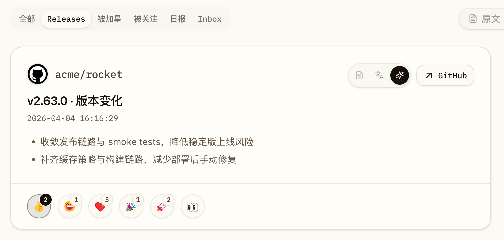

# Release reaction 反馈图标轻量收敛（#jfkcf）

## 背景 / 问题陈述

`#zcp33` 已经把 Dashboard release card 的 reaction footer 收敛为本地 SVG、圆形按钮与外置 badge，但当前按钮本体、图标和 badge 仍然偏大，在正文区下方的视觉存在感过强，容易抢走 release 内容本身的注意力。

本 follow-up 只处理“轻微缩小”，不改 reaction 的语义、结构和交互口径。

## 目标 / 非目标

### Goals

- 将 release card 底部的 reaction trigger 从 `40px` 收到 `36px`。
- 将按钮内 SVG 图标收敛到约 `18px`。
- 将 badge 的最小尺寸同步收敛到约 `18px`，并略微收回外偏移。
- 保持真圆按钮、外置 badge、PAT fallback、toggle 行为、无障碍语义与现有 SVG 资产不变。
- 补一组稳定的 Storybook reaction-focused 证据入口与回归断言。

### Non-goals

- 不修改后端 reaction API、数据库、PAT 校验或 OAuth 流程。
- 不调整 reaction 种类、图标资产来源或社交动态卡片样式。
- 不扩展 release detail 弹窗或其他页面的 reaction 表现层。

## 范围（Scope）

### In scope

- `web/src/feed/FeedItemCard.tsx`
- `web/src/stories/Dashboard.stories.tsx`
- `web/e2e/release-detail.spec.ts`
- `docs/specs/README.md`
- `docs/specs/jfkcf-release-reaction-compact-size/SPEC.md`

### Out of scope

- Rust 后端与 `/api/release/reactions/toggle`
- 社交动态 feed 卡片
- 反应图标 SVG 资源本体

## 需求（Requirements）

### MUST

- 按钮尺寸必须稳定落在 `36px` 口径，不能因 badge 或计数再次退化成更大的胶囊感圆泡。
- 图标尺寸必须同步下调，避免出现“按钮缩了但图标仍撑满”的失衡状态。
- badge 仍必须位于按钮外侧，且单数字场景下的高度收敛到约 `18px`。
- `count=0` 时继续不显示 badge。
- `aria-label`、`title`、`aria-pressed`、PAT fallback 与 toggle 行为不得回退。
- Storybook 必须提供稳定的 reaction-focused story，并通过 `play` 锁定紧凑尺寸意图。

### SHOULD

- footer 的横向间距应同步轻微收紧，但不能影响按钮易点按性。
- Playwright 回归应验证按钮、图标和 badge 的紧凑尺寸范围，而不仅仅是“仍为圆形”。

## 功能与行为规格（Functional/Behavior Spec）

### Reaction footer compact sizing

- 每个 reaction 仍由“圆形按钮 + 可选外置 badge”组成。
- 圆形按钮的宽高固定为 `36px`。
- 图标渲染目标约为 `18px`。
- badge 的目标最小尺寸约为 `18px`，对双位数计数允许按内容自然放宽宽度，但整体视觉层级必须比当前版本更轻。
- badge 仍定位在按钮右上方偏外位置，但偏移量比 `#zcp33` 版本更保守。

### Storybook / evidence

- 增加一个 reaction-focused 的 Dashboard story，使用稳定 mock feed 渲染 release tab。
- story 中至少覆盖：有 badge 的反应按钮、无 badge 的零计数按钮，以及按钮 / 图标 / badge 的紧凑尺寸断言。
- 视觉证据使用 Storybook canvas 捕获，不使用真实页面截图。

## 验收标准（Acceptance Criteria）

- Given release card 渲染带 reaction 的 footer
  When UI 显示完成
  Then 反馈按钮肉眼可见比 `#zcp33` 版本更紧凑，但仍保持清晰可点按。

- Given 单数字计数的 reaction
  When footer 渲染
  Then 圆形按钮尺寸保持 `36px` 口径，badge 仍在按钮外侧，且 badge 高度约为 `18px`。

- Given 零计数 reaction
  When footer 渲染
  Then 按钮仍为同尺寸圆形，且不显示 badge。

- Given 用户点击 reaction 且 PAT 未配置
  When 触发 toggle
  Then 仍打开现有 PAT 对话框。

- Given Storybook reaction-focused story 与 Playwright 回归
  When 检查 DOM 几何尺寸
  Then 能验证按钮、图标与 badge 已按新的轻量口径收敛。

## 非功能性验收 / 质量门槛（Quality Gates）

### Testing

- `cd web && bun run build`
- `cd web && bun run storybook:build`
- `cd web && bun run e2e -- release-detail.spec.ts`

### Visual verification

- 使用 Storybook canvas 生成至少一张 owner-facing 视觉证据。
- 视觉证据需写入本 spec 的 `## Visual Evidence`，并标记可复用于 PR。

## 参考

- `docs/specs/zcp33-release-reaction-bubble-polish/SPEC.md`
- `web/src/feed/FeedItemCard.tsx`
- `web/src/stories/Dashboard.stories.tsx`
- `web/e2e/release-detail.spec.ts`

## Visual Evidence

- source_type: storybook_canvas
  story_id_or_title: Pages/Dashboard · Evidence / Reaction Compact
  state: compact reaction footer
  evidence_note: 验证 release card 底部反馈按钮已轻微缩小到 36px 口径，图标约 18px，外置 badge 同步收紧且未回退为胶囊布局。

PR: include

