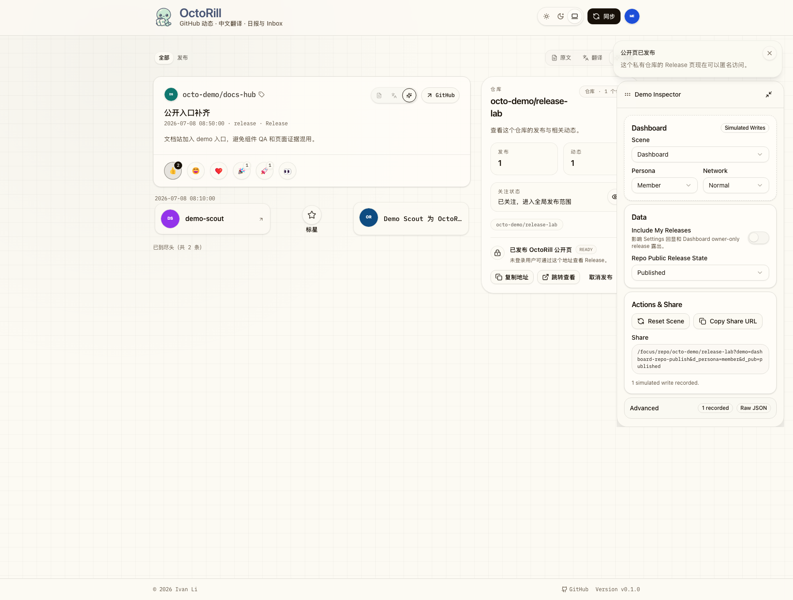

# OctoRill Web Demo 与悬浮 Inspector Contract（#k8d4m）

## 背景 / 问题陈述

- 当前仓库把组件级 QA、页面级视觉证据和临时 mock 入口混杂在 Storybook、Playwright patch 与零散 `ui_demo` 证据里，缺少一个稳定、公开、可深链复现的页面级 demo surface。
- 页面验收需要 mock-only、无登录、无真实 `/api/**` 泄漏的运行面，同时又要尽量复用正式页面组件、正式 route suffix 与真实 UI 组合。
- 现有 pages build 只装配 docs-site 与 Storybook，没有把页面级 demo 作为 GitHub Pages 的一级入口正式发布。

## 目标 / 非目标

### Goals

- 冻结 `/demo/` 为公开 `web demo` 子应用前缀，使用 `demo=<scene-id>` 作为 scene 入口，`d_*` 作为分享态命名空间。
- 让 demo runtime 在 `AuthBootstrap` 之前完成模式识别与 MSW worker 启动，确保 mock-only 模式不会命中真实 `/api/**`、真实登录或真实后端写路径。
- 首版覆盖 `Landing / Dashboard / Settings / Public Release / Admin Panel / Admin Jobs` 六个页面级 surface。
- 交付可悬浮、可吸边、可收起的结构化 inspector：支持 scene、persona、network、关键 data toggles、share link 与 recent simulated writes。
- 把 GitHub Pages 装配扩展为 `docs-site + /storybook/ + /demo/`，并在根 `404.html` 上只对 `/demo/**` 开启 deep-link recovery。

### Non-goals

- 不移除 Storybook，也不把所有组件级故事迁出 Storybook。
- 不把真实 GitHub OAuth、真实 SQLite、真实 Rust 后端或 production 写路径接进 demo。
- 不改变 docs-site 的公开根路径，也不改变正式 live app 的部署方式。

## 范围（Scope）

### In scope

- `web/src/demo/**`：scene registry、mock data、MSW/SSE transport、inspector、share state、simulated writes。
- `web` demo build target、`mockServiceWorker.js`、router basepath `/demo`、app bootstrap 顺序。
- `.github/workflows/docs-pages.yml` 与 `.github/scripts/assemble-pages-site.sh` 的 demo 产物装配。
- `docs-site/docs/web-demo.md`、`docs-site/docs/index.md`、`docs-site/docs/quick-start.md`、README / `web/README.md` / 产品文档中的 demo 入口与说明。

### Out of scope

- 所有历史 page stories 的一次性全量迁移。
- 真实后端集成测试替代 demo runtime。
- 非页面级组件的额外 demo surface。

## 功能与行为规格（Functional / Behavior Spec）

### Demo runtime

- demo mode 在以下任一条件下激活：
  - demo build (`/demo/` 子应用)
  - 常规 build 下 URL 含 `demo=<scene-id>`
- demo mode 激活后必须先清空 warm startup caches，再启动 MSW worker，再渲染 React app。
- demo build 的 router basepath 固定为 `/demo`；公开资产 base 固定为 `/demo/`。
- `mockServiceWorker.js` 必须随 demo build 一起产出，并从 demo base 注册。

### Scene registry

- 首版 scene ids：
  - `landing-welcome`
  - `dashboard-repo-publish`
  - `settings-my-releases`
  - `public-release-ready`
  - `admin-panel-users`
  - `admin-jobs-running`
- scene 需要绑定正式 route suffix，并允许通过 `d_persona`、`d_net`、`d_own`、`d_pub` 复现关键状态。
- demo 中的写操作只更新内存态，并在 inspector 中记录为 simulated write。

### Inspector

- 桌面端：
  - 可拖拽
  - 拖拽结束后吸附到左右边缘
  - 可收起为气泡
  - 布局位置持久化到 localStorage
- 移动端：
  - 默认只显示 bubble
  - 点击 bubble 后打开 drawer
- inspector 默认提供结构化 sections：
  - Scene
  - Persona / 权限
  - Network
  - Data
  - Actions
  - Share
- raw JSON 仅作为折叠式调试入口。

### Pages 装配

- GitHub Pages 根路径继续由 docs-site 占用。
- Storybook 继续装配到 `/storybook/`。
- demo build 装配到 `/demo/`。
- 根 `404.html` 必须注入 demo recovery shim：只对 `/demo/**` 深链做恢复，不影响 docs-site 的正常 404 文案。

## 接口契约（Interfaces & Contracts）

### Public URLs

- `/demo/`
- `/demo/<route-suffix>?demo=<scene-id>&d_*`
- `/storybook/`
- `/storybook.html`

### Demo share-state query contract

- `demo=<scene-id>`
- `d_persona=guest|member|admin`
- `d_net=normal|slow|faulty`
- `d_own=1`
- `d_pub=published`
- `d_restore=<encoded-path>`：仅供 404 recovery 内部回跳使用

## 验收标准（Acceptance Criteria）

1. Given Pages 站点已构建，When 打开 `/demo/` 与六个目标 route 的 scene deep link，Then 页面都进入 mock-only runtime，且不依赖真实认证或真实 `/api/**`。
2. Given demo 处于桌面端，When 拖拽 inspector 并释放，Then 面板会吸附左右边缘且位置被记住；When 收起后，Then 会变成可点击恢复的气泡。
3. Given demo 处于移动端，When 点击 bubble，Then inspector 以 drawer 打开。
4. Given Settings / Dashboard / Admin 页面触发保存、发布、取消、重试等动作，When 操作完成，Then UI 立即回显 mock-only 结果，且 recent mutations 中留下 simulated 记录。
5. Given GitHub Pages 直接访问 `/demo/**` 深链，When GitHub Pages 回落到根 `404.html`，Then 404 shim 会恢复到对应 demo route，而 docs-site 其它 404 路径保持普通文档站行为。

## 非功能性验收 / 质量门槛（Quality Gates）

- `cd web && bun run lint`
- `cd web && bun run build`
- `cd web && bun run build:demo`
- `cd web && bun run storybook:build`
- `cd web && bun run e2e`
- `cd docs-site && bun run build`
- `bash ./.github/scripts/assemble-pages-site.sh <docs_build> <storybook_build> <demo_build> <output_dir>`

## Visual Evidence

- source_type: `ui_demo`
  target_program: `mock-only`
  capture_scope: `browser-viewport`
  submission_gate: `captured`
  PR: include
  captured_at: `2026-07-09`
  route: `/demo/focus/repo/octo-demo/release-lab?demo=dashboard-repo-publish`
  state: `dashboard-repo-publish`
  evidence_note: 桌面态 deep-link 恢复后，模拟“发布公开页”写操作会同步更新 Published share state，并在 inspector 的 Advanced badge 中暴露 simulated write 计数。owner-facing 截图使用更高的桌面视口完整展示 inspector；`1440x1024` 的 toast 避让与视口内钳制由 Playwright 回归测试覆盖。

- source_type: `ui_demo`
  target_program: `mock-only`
  capture_scope: `drawer-surface`
  submission_gate: `captured`
  PR: include
  captured_at: `2026-07-09`
  route: `/demo/settings?section=my-releases&demo=settings-my-releases`
  state: `settings-my-releases`
  evidence_note: 移动端默认 bubble 展开为 drawer；drawer surface 中可直接编辑 scene / persona / network / data 分享态，并复制当前 share deep link。

## 风险 / 开放问题 / 假设（Risks, Open Questions, Assumptions）

- 风险：Admin Jobs 页面请求面较宽，若后续新增 tab 初始加载逻辑，demo handler 需要同步补齐。
- 风险：`/demo/` build 目前仍共享正式页面 chunk，若继续扩展 scene data，可能需要额外的 manual chunk 策略。
- 假设：页面级最终视觉证据优先来自 `/demo/`，Storybook 仅补 reusable inspector / fragment / play 覆盖。
