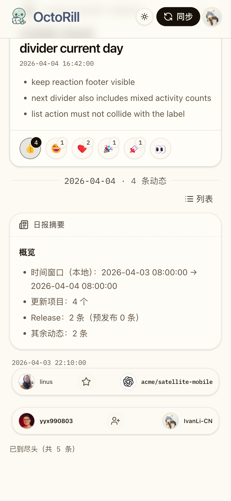

# Dashboard「全部」tab 移动端页头意外上滑修复（#kgepw）

## 背景 / 问题陈述

- Dashboard 移动端壳层已经具备 compact header / footer auto-hide，但主人反馈在 `全部` tab 下，页头会意外继续上滑，表现像是页面高度链失真。
- 该问题在真实移动浏览器里更容易出现，尤其是 `全部` tab 内容更长、地址栏和底栏频繁伸缩时，`100vh` 风格的最小高度容易和实时 viewport 不一致。
- 现有回归主要覆盖 header drag / sticky rail / tab 切换，还缺少“`全部` tab + 实时 viewport 高度变化”的专门 contract。

## 目标 / 非目标

### Goals

- 让 Dashboard 移动端壳层改为跟踪实时 viewport 高度，避免 `全部` tab 因高度链失真产生额外上滑空间。
- 保持既有 compact header、sticky header 与 footer auto-hide 语义，不回退到“永不收起”。
- 为 `全部` tab 补齐稳定的 Storybook 审阅入口、移动端回归测试与视觉证据。

### Non-goals

- 不修改 Rust 后端、API、数据库、Feed/Brief 业务语义或 tab 信息架构。
- 不重做 `全部` tab 的分组展示逻辑；本轮只修壳层与 viewport 高度链。
- 不扩大到 Landing、Admin 或非 Dashboard 页面。

## 范围（Scope）

### In scope

- `web/src/layout/AppShell.tsx`
- `web/src/index.css`
- `web/src/stories/Dashboard.stories.tsx`
- `web/scripts/verify-mobile-header-drag.mjs`
- `web/e2e/dashboard-access-sync.spec.ts`
- `docs/specs/kgepw-dashboard-all-tab-mobile-header-scroll/SPEC.md`
- `docs/specs/README.md`

### Out of scope

- `src/**` Rust backend
- Dashboard 以外页面
- Feed / Brief / Inbox 数据 contract

## 需求（Requirements）

### MUST

- Dashboard 移动端壳层必须绑定当前实时 viewport 高度，而不是只依赖静态 `100vh` 口径。
- 在移动端 `全部` tab 长内容场景下，sticky header 必须始终吸附在 viewport 顶部，不得因高度链失真整段滑出可视区。
- viewport 高度变化后，compact header 与 footer auto-hide 仍保持既有行为，不出现跳变或抖动。
- Storybook 必须提供稳定的 `全部` tab 移动端验证入口。
- Playwright 必须补齐 `全部` tab + viewport 变化的回归。
- `verify:mobile-header-drag` 必须覆盖新的 all-tab shell contract。

### SHOULD

- 只新增内部 `data-*` 调试/验证钩子，不扩展公开 props 或 API。
- 桌面端和其他 Dashboard tabs 保持现有视觉与交互语义。
- 若排查必须借助线上真实数据，真实响应只允许作为临时本地回放基线；最终进入仓库的 Storybook 场景必须改写为脱敏后的稳定 mock。

## 功能与行为规格（Functional/Behavior Spec）

### Core flows

1. **移动端 `全部` tab 首屏**
   - `AppShell` 用实时 viewport 高度作为最小高度基准。
   - 页头默认展开，sticky header 保持吸顶。

2. **移动端滚动与地址栏伸缩**
   - 当内容滚动触发 compact header 时，sticky header 仍固定在 viewport 顶部。
   - 当浏览器地址栏/底栏导致 viewport 高度变化时，壳层高度绑定同步更新，不产生额外 phantom scroll。

3. **回到顶部**
   - 用户回拉到顶部后，header 恢复展开态，viewport 高度绑定仍与当前窗口一致。

### Edge cases / errors

- 只有 `全部` tab 长内容、带历史分组和 reaction footer 的场景也必须稳定。
- 允许先用线上真实响应做临时复现，但正式回归验证不能依赖真实后端数据，必须收敛到稳定 mock / Storybook 场景。

## 验收标准（Acceptance Criteria）

- Given 移动端 `390px`（兼顾 `375px`）宽度打开 Dashboard `全部` tab
  When 页面完成渲染并开始滚动
  Then sticky header 始终贴顶，不出现整段上滑离屏的异常。

- Given 移动端 Dashboard 已离开顶部
  When 实时 viewport 高度发生变化
  Then 壳层绑定高度与当前 viewport 同步，且 header 继续贴顶。

- Given 当前修复已落地
  When 运行 Storybook、`verify:mobile-header-drag` 与 `dashboard-access-sync.spec.ts`
  Then 新增的 all-tab shell contract 必须通过，且既有移动端 header 手势行为不回退。

## 非功能性验收 / 质量门槛（Quality Gates）

### Testing

- `cd web && bun run lint`
- `cd web && bun run build`
- `cd web && bun run storybook:build`
- `cd web && bun run verify:mobile-header-drag`
- `cd web && bun run e2e -- dashboard-access-sync.spec.ts`

### UI / Storybook

- Storybook 覆盖：`通过`
- 视觉证据目标源：`storybook_canvas`
- 新增 Storybook 入口：`Mobile Runtime Parity All`
- 新增 Storybook 入口：`Mobile Runtime Parity Releases`
- 新增 Verification 入口：`Verification / Mobile all tab sticky shell`

## Visual Evidence

- source_type: storybook_canvas
  target_program: mock-only
  capture_scope: element
  requested_viewport: dashboardMobile390
  viewport_strategy: storybook-viewport
  sensitive_exclusion: N/A
  submission_gate: owner-approved
  story_id_or_title: `Pages/Dashboard / Mobile Runtime Parity All`
  state: sanitized runtime-parity all-tab shell
  evidence_note: 主人已在 IAB 中确认脱敏后的 `Mobile Runtime Parity All` 审阅面“看起来没问题了”。该正式 Story 保留线上 `全部` tab 的长滚动密度与 `release + repo_star_received` 混合结构，但不再携带原始线上响应；原始线上响应只作为临时复现基线保留在本地 scratch，不进入正式仓库资产。
  image:
  

## 风险 / 开放问题 / 假设（Risks, Open Questions, Assumptions）

- 风险：真实移动浏览器对 `visualViewport` 的事件节奏存在差异，因此回归主要锁定“高度绑定 + sticky 顶部不漂移”的 contract，而不是绑定某一款浏览器的动画细节。
- 开放问题：无。
- 假设：当前问题根因在壳层高度链，而不是 `全部` tab 自身的 feed 布局语义。
