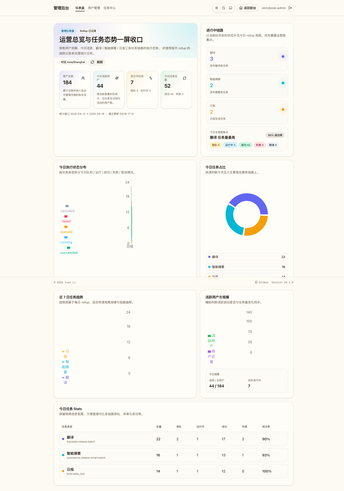

# 管理后台仪表盘与 rollup 统计（#m2k8d）

## 状态

- Status: 已完成
- Created: 2026-04-18
- Last: 2026-04-18

## 背景 / 问题陈述

- 现有管理后台已经具备用户管理与任务中心，但缺少一个面向运营的总览页，无法在一屏内快速判断用户规模、今日活跃度与任务运行态势。
- 翻译、智能摘要、日报三条链路的任务数据分散在实时任务列表中，不利于按天观察吞吐、失败趋势与负载重心。
- 管理员需要一个信息密度更高、但仍保持清晰层次的仪表盘，以支撑日常巡检与问题定位。

## 目标 / 非目标

### Goals

- 在管理后台新增仪表盘首页，统一展示用户总数、今日活跃用户、进行中任务总数与今日任务总量。
- 使用第三方图表库增强可视化表达，覆盖今日状态分布、任务占比、近 7 日趋势、活跃用户与规模对比。
- 以“按天 + 按任务类型”的粒度持久化 rollup 记录，保证趋势统计有稳定数据源。
- 将原管理员用户管理页面迁移到独立路由，同时保留管理后台的清晰导航结构。

### Non-goals

- 不实现更长周期（按周、按月）的聚合报表。
- 不新增导出 CSV / Excel、筛选器组合查询或自定义日期区间。
- 不把全部后台任务都纳入本期仪表盘；仅覆盖翻译、智能摘要、日报三类核心链路。

## 范围（Scope）

### In scope

- SQLite 新增 `admin_dashboard_daily_rollups` 表与索引。
- 后端新增管理员仪表盘接口，并在读取时回填最近 7 天 rollup。
- 仪表盘展示以下指标：
  - 用户总数
  - 今日活跃用户数
  - 进行中的任务数
  - 今日翻译 / 智能摘要 / 日报执行情况
- 前端管理路由调整：`/admin` 作为仪表盘首页，用户管理迁移到 `/admin/users`。
- Storybook 新增稳定的 dashboard story，用于视觉验收与截图来源。

### Out of scope

- 不新增权限模型变化。
- 不修改任务调度逻辑本身。
- 不增加自动刷新轮询或推送式实时图表。

## 需求（Requirements）

### MUST

- 仪表盘必须可供管理员在 `/admin` 直接访问。
- 仪表盘必须展示用户总数、今日活跃用户数、进行中任务数。
- 仪表盘必须展示翻译、智能摘要、日报三类任务的今日 Stats 与图表统计。
- 图表必须使用第三方库实现，并支持稳定渲染用于视觉证据。
- 后端必须把最近 7 天、按时区切分的每日统计写入 rollup 表，并在重复访问时执行 upsert。
- 统计口径必须区分 `queued / running / succeeded / failed / canceled`。

### SHOULD

- 视觉层次保持美观大方，并允许略高的信息密度以提升后台巡检效率。
- 仪表盘同时保留“今日快照”和“近 7 日趋势”，方便识别当天异常与短期趋势偏移。
- 页面应明确显示当前统计时区与统计窗口范围。

### COULD

- 后续扩展更多任务类型或更长时间窗口时，复用当前 rollup 结构与图表布局。

## 功能与行为规格（Functional/Behavior Spec）

### Core flows

1. **管理员进入仪表盘**
   - 管理员访问 `/admin`。
   - 页面显示仪表盘 Hero 区、KPI 卡片、今日链路概览、图表区域与 Stats 表格。

2. **后端生成统计快照**
   - 前端调用 `GET /api/admin/dashboard?time_zone=<browser_tz>`。
   - 后端按请求时区计算最近 7 天每日边界。
   - 对翻译、智能摘要、日报三类任务逐日执行 rollup upsert。

3. **今日态势分析**
   - 页面展示今日任务状态堆叠柱状图。
   - 页面展示今日任务占比环形图。
   - 页面展示各任务类型的成功率与失败量对比表格。

4. **趋势观察**
   - 页面展示近 7 日任务趋势面积图。
   - 页面展示活跃用户与总用户规模对比柱状图。

### Edge cases / errors

- 非管理员访问接口时，继续沿用现有管理员权限拦截。
- 若图表接口加载失败，页面应展示错误提示与手动重试入口。
- 若某任务类型在今日无数据，也必须返回零值行，避免图表与表格缺列。

## 接口契约（Interfaces & Contracts）

### 接口清单（Inventory）

| 接口（Name） | 类型（Kind） | 范围（Scope） | 变更（Change） | 契约文档（Contract Doc） | 负责人（Owner） | 使用方（Consumers） | 备注（Notes） |
| --- | --- | --- | --- | --- | --- | --- | --- |
| `GET /api/admin/dashboard` | HTTP API | external | New | `./contracts/http-apis.md` | backend | web-admin | 返回 KPI、今日快照、近 7 日趋势 |
| `admin_dashboard_daily_rollups` | DB schema | internal | New | `./contracts/db.md` | backend | backend | 每日按任务类型聚合统计真相源 |
| `/admin` | Web route | external | Modify | n/a | web | admin users | 从用户管理首页调整为仪表盘首页 |
| `/admin/users` | Web route | external | New | n/a | web | admin users | 承接原用户管理页面 |

### 契约文档（按 Kind 拆分）

- [contracts/README.md](./contracts/README.md)
- [contracts/http-apis.md](./contracts/http-apis.md)
- [contracts/db.md](./contracts/db.md)

## 验收标准（Acceptance Criteria）

- Given 管理员进入 `/admin`
  When 页面完成加载
  Then 可见用户总数、今日活跃用户、进行中任务、今日任务总量四个核心 KPI。

- Given 仪表盘页面
  When 查看可视化区域
  Then 至少包含今日执行状态分布、今日任务占比、近 7 日任务趋势、活跃用户与规模四组图表。

- Given 任意一天存在翻译、智能摘要、日报任务
  When 后端生成 rollup
  Then `admin_dashboard_daily_rollups` 中对应 `rollup_date + time_zone + task_type` 组合仅保留一条最新记录，并写入各状态计数。

- Given 浏览器传入时区参数
  When 请求 `GET /api/admin/dashboard`
  Then 返回结果中的 `time_zone`、`window_start`、`window_end` 与该时区边界一致。

- Given 用户管理仍需可用
  When 管理员访问 `/admin/users`
  Then 原用户管理页面功能保持不变。

## 实现前置条件（Definition of Ready / Preconditions）

- 管理后台管理员门禁已存在并可复用。
- 任务中心已有统一任务表，可按任务类型与状态聚合。
- Storybook 可用于构建稳定视觉证据。

## 非功能性验收 / 质量门槛（Quality Gates）

### Testing

- Rust tests: `cargo test admin_dashboard_rolls_up_today_metrics_and_persists_rows -- --nocapture`
- Web checks: `cd web && npm run lint`、`cd web && npm run build`
- Storybook: `cd web && npm run storybook:build`

### UI / Storybook (if applicable)

- Stories to add/update: `web/src/stories/AdminDashboard.stories.tsx`
- Visual evidence: 使用 Storybook canvas 产出仪表盘总览图
- 图表库：`recharts`

### Quality checks

- `cargo fmt`
- `cargo test admin_dashboard_rolls_up_today_metrics_and_persists_rows -- --nocapture`
- `cd web && npm run lint`
- `cd web && npm run build`
- `cd web && npm run storybook:build`

## 文档更新（Docs to Update）

- `docs/specs/README.md`: 新增规格索引。
- `docs/specs/m2k8d-admin-dashboard-rollups/SPEC.md`: 记录实现范围、质量门槛与视觉证据。

## 计划资产（Plan assets）

- Directory: `docs/specs/m2k8d-admin-dashboard-rollups/assets/`
- In-plan references: ``
- Visual evidence source: Storybook canvas

## Visual Evidence

## 资产晋升（Asset promotion）

None

## 实现里程碑（Milestones / Delivery checklist）

- [x] M1: 新增 dashboard rollup 表、聚合逻辑与管理员接口
- [x] M2: 完成管理后台仪表盘页面、管理导航重构与用户管理路由迁移
- [x] M3: 接入第三方图表库、补齐 Storybook 视觉证据与基础验证

## 方案概述（Approach, high-level）

- 后端在读取仪表盘时顺带回填最近 7 天 rollup，以较低复杂度保证趋势数据存在且可重复刷新。
- 前端使用 `recharts` 提供柱状图、环形图、面积图与趋势图组合，形成“总览 + 诊断 + 趋势”的信息布局。
- 页面首屏强化 KPI 与当前链路状态，下半区承载图表和高密度 Stats 表，兼顾观感与运营效率。

## 风险 / 开放问题 / 假设（Risks, Open Questions, Assumptions）

- 风险：当前 rollup 在请求时执行 upsert，若未来数据量显著增长，可能需要独立定时任务或异步预聚合。
- 风险：今日活跃用户依赖 `users.last_active_at`，若未来活跃定义变化，需要同步调整统计口径。
- 需要决策的问题：无。
- 假设（需主人确认）：本期仪表盘仅覆盖翻译、智能摘要、日报三类核心任务即可满足运营观察需求。

## 变更记录（Change log）

- 2026-04-18: 新增管理后台仪表盘、每日 rollup 聚合、Recharts 图表与视觉证据。

## 参考（References）

- `src/api.rs`
- `src/server.rs`
- `migrations/0036_admin_dashboard_rollups.sql`
- `web/src/admin/AdminDashboard.tsx`
- `web/src/stories/AdminDashboard.stories.tsx`
