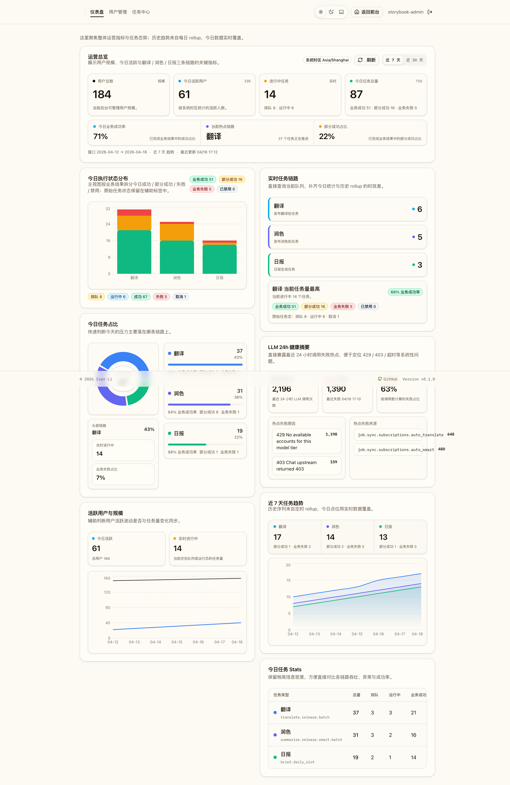

# 管理后台仪表盘与统计预聚合（#m2k8d）

## 背景 / 问题陈述

- 管理后台已有用户管理与任务中心，但缺少面向运营巡检的总览页，无法在一屏内判断用户规模、今日活跃、任务压力与失败态势。
- 翻译、润色、日报三条链路的数据分散在实时任务列表里，不适合做按天趋势观察与异常定位。
- 原始 `job_tasks.status` 与业务结果并不总是等价：批任务可能 `succeeded`，但内部 item 仍包含 `error / missing`，导致后台曾出现“前台失败、后台零失败”的误导表达。
- 仪表盘既要信息密度更高，也要保持清晰层次，确保管理员能快速完成“扫一眼识别状态”的日常巡检。

## 目标 / 非目标

### Goals

- 在 `/admin` 提供高信息密度的管理仪表盘，展示用户总数、今日活跃用户、进行中任务、今日任务总量。
- 使用第三方图表库展示翻译、润色、日报三类任务的今日执行情况与 7 天 / 30 天趋势。
- 将历史统计固化到按日 rollup 表中，并由定时任务持续幂等刷新最近 30 天数据。
- 采用“系统统一时区 + 今日实时覆盖”的统计策略，避免浏览器时区差异与今日数据延迟。
- 仪表盘必须同时暴露 raw task status 与 business outcome，确保 `partial / business failed / disabled` 能被直接观测到。
- 仪表盘必须展示最近 24 小时 LLM 健康摘要，直接暴露失败量、热点失败原因与热点失败来源。

### Non-goals

- 不支持自定义日期范围、导出 CSV / Excel 或下钻到二级分析页。
- 不扩展到翻译、润色、日报之外的更多任务类型。
- 不引入独立 BI 服务、Redis、ClickHouse 或新的外部调度基础设施。
- 不修改 `job_tasks.status` 的持久化枚举，也不把 429/403 自动重试策略纳入本 spec。

## 范围（Scope）

### In scope

- SQLite 新增 `admin_dashboard_daily_rollups` 作为每日聚合真相源，并补充 business outcome 计数字段。
- 后端新增 / 扩展 `GET /api/admin/dashboard?window=7d|30d`，返回 KPI、今日实时快照、状态分布、任务占比、趋势点位、LLM 健康摘要与窗口元数据。
- 服务内 scheduler 每 15 分钟幂等刷新最近 30 天 rollup。
- 前端管理路由调整：`/admin` 为仪表盘首页，`/admin/users` 为用户管理，`/admin/jobs` 保持任务中心。
- Storybook 提供稳定 dashboard stories，用于视觉验收与截图来源。
- 以统一 helper 为 `translate.release.batch`、`summarize.release.smart.batch`、`brief.daily.slot` 派生 `ok | partial | failed | disabled`。

### Out of scope

- 不新增权限模型变化。
- 不改变任务调度器本身的执行语义。
- 不实现自动刷新、推送式图表更新或复杂筛选器。
- 不重定义跨日归属（仍沿用系统时区与既有按日窗口策略）。

## 需求（Requirements）

### MUST

- 仪表盘必须在 `/admin` 对管理员可见。
- 首屏必须可读到用户总数、今日活跃用户、进行中任务、今日任务总量四个核心 KPI。
- 必须展示翻译、润色、日报三类任务的今日 Stats、今日占比与趋势图表。
- 图表必须使用第三方库实现，并可在 Storybook 中稳定渲染。
- 历史趋势必须来自每日 rollup；今日卡片和进行中任务必须由实时查询覆盖，不依赖 rollup 刷新完成。
- 统计口径必须同时覆盖 raw `queued / running / succeeded / failed / canceled` 与 business `ok / partial / failed / disabled`。
- 当 raw `status=succeeded` 但业务结果包含 `error / missing` 时，仪表盘必须把这类任务计入 `partial` 或 `business failed`，不得继续显示为“失败 0 / 成功率 100%”。
- 仪表盘必须暴露最近 24 小时 LLM 调用失败热点，至少包含总调用数、失败数、最近失败时间、Top 失败原因与 Top 失败来源。

### SHOULD

- 页面整体应延续现有后台壳层，保持低饱和中性色背景、清晰层级与略高信息密度。
- 页面应显式展示系统统计时区与当前窗口范围。
- 7 天 / 30 天窗口切换应只改变接口窗口参数，不改变路由。
- raw status 与 business outcome 应同时可见，便于管理员区分“调度状态正常”与“业务结果异常”。

## 功能与行为规格（Functional/Behavior Spec）

### Core flows

1. **管理员进入仪表盘**
   - 管理员访问 `/admin`。
   - 页面展示 Hero 区、4 个 KPI 卡片、业务结果摘要、LLM 健康摘要、进行中链路摘要、图表区与高密度 Stats 表。

2. **历史 rollup 预聚合**
   - 后台 scheduler 以系统统一时区为基准，每 15 分钟幂等刷新最近 30 天 rollup。
   - 每个 `rollup_date + time_zone + task_type` 只保留一条最新聚合记录，通过 upsert 覆盖旧值。
   - rollup 同时写入 raw 状态计数与 business outcome 计数，确保 7 天 / 30 天趋势无需回放明细行即可展示 partial/business failed。

3. **今日实时覆盖**
   - 仪表盘请求实时查询今日用户活跃、今日任务状态、今日任务占比、LLM 健康摘要与进行中任务。
   - 趋势序列中的“今天”点由实时统计覆盖，避免 rollup 尚未刷新时出现延迟。

4. **业务结果派生**
   - `translate.release.batch` / `summarize.release.smart.batch` / `brief.daily.slot` 的 business outcome 由 payload/result/error 派生，不依赖 raw status 名称本身。
   - 允许 `succeeded + partial`、`completed + partial` 这类表达同时成立，以保留调度层事实与业务层事实。

5. **窗口切换**
   - 前端切换 `7d / 30d` 时仅重拉同一个接口。
   - 图表、表格、tooltip 与窗口文案同步切换，结构保持稳定。

### Edge cases / errors

- 非管理员访问接口时，沿用现有管理员权限拦截。
- 当某任务类型在窗口内无数据时，接口必须返回零值点位与零值 Stats，保证图表不缺列。
- 当接口加载失败时，页面必须展示错误提示与手动重试入口。
- 当某类任务全部被禁用时，应在 business outcome 中归类为 `disabled`，而不是误算成成功或失败。

## 接口契约（Interfaces & Contracts）

### 接口清单（Inventory）

| 接口（Name） | 类型（Kind） | 范围（Scope） | 变更（Change） | 契约文档（Contract Doc） | 负责人（Owner） | 使用方（Consumers） | 备注（Notes） |
| --- | --- | --- | --- | --- | --- | --- | --- |
| `GET /api/admin/dashboard` | HTTP API | external | Modify | `./contracts/http-apis.md` | backend | web-admin | 返回窗口化 KPI、今日实时快照、raw + business 状态分布、LLM 健康摘要与趋势点位 |
| `admin_dashboard_daily_rollups` | DB schema | internal | Modify | `./contracts/db.md` | backend | backend | 每日按任务类型聚合 raw 状态与 business outcome 统计 |
| `/admin` | Web route | external | Modify | n/a | web | admin users | 管理后台首页调整为仪表盘 |
| `/admin/users` | Web route | external | New | n/a | web | admin users | 承接原用户管理页面 |
| `/admin/jobs` | Web route | external | Existing | n/a | web | admin users | 保持任务中心入口 |

### 契约文档（按 Kind 拆分）

- [contracts/README.md](./contracts/README.md)
- [contracts/http-apis.md](./contracts/http-apis.md)
- [contracts/db.md](./contracts/db.md)

## 验收标准（Acceptance Criteria）

- Given 管理员进入 `/admin`
  When 页面完成加载
  Then 首屏能看到用户总数、今日活跃用户、进行中任务、今日任务总量四个 KPI。

- Given 仪表盘页面
  When 查看可视化区域
  Then 至少包含今日业务结果分布、今日任务占比、趋势图、LLM 健康摘要与活跃用户/规模对比图。

- Given 管理员切换窗口到 `7d` 或 `30d`
  When 页面完成刷新
  Then 路由保持不变，仅接口窗口参数变化，图表与表格同步更新。

- Given scheduler 重复刷新最近 30 天 rollup
  When 多次执行 upsert
  Then `admin_dashboard_daily_rollups` 中相同 `rollup_date + time_zone + task_type` 仍只有一条最新记录，且 business outcome 计数会被同步刷新。

- Given 今日 rollup 尚未刷新完成
  When 请求 `GET /api/admin/dashboard`
  Then 今日 KPI、进行中任务、LLM 健康摘要与今日趋势点仍返回实时值。

- Given 某个 `summarize.release.smart.batch` raw `status=succeeded`，且 `result_json` 只带 `items[]`，其 item-level 结果为 `2 ready + 1 error`
  When 请求 `GET /api/admin/dashboard`
  Then 返回 `status_breakdown.business_counts.partial > 0`，且 `trend_points` 中当天 `summaries_partial + summaries_business_failed > 0`。

- Given 最近 24 小时上游模型出现 429/403 集中失败
  When 管理员查看仪表盘
  Then 页面能直接读到失败量、最近失败时间、热点失败原因与热点失败来源，不需要切去任务中心逐条排查。

## 非功能性验收 / 质量门槛（Quality Gates）

### Testing

- Rust tests: `cargo test admin_dashboard -- --nocapture`
- Rust tests: `cargo test admin_dashboard_surfaces_partial_business_results_and_llm_hotspots -- --nocapture`
- Rust lint: `cargo clippy --all-targets -- -D warnings`
- Web checks: `cd web && bun x tsc -b`、`cd web && bun x vite build`
- Storybook: `cd web && bun run storybook:build`

### UI / Storybook

- Stories: `web/src/stories/AdminDashboard.stories.tsx`
- Visual evidence: 使用 Storybook 产出 dashboard 总览图
- Charting library: `recharts`

### Quality checks

- `cargo fmt`
- `cargo test admin_dashboard -- --nocapture`
- `cargo clippy --all-targets -- -D warnings`
- `cd web && bun x tsc -b`
- `cd web && bun x vite build`
- `cd web && bun run storybook:build`

## Visual Evidence

## 方案概述（Approach, high-level）

- 历史统计使用按日 rollup 作为稳定数据源，由服务内 scheduler 持续刷新最近 30 天。
- 今日数据使用实时查询覆盖，包括今日活跃、进行中任务、今日状态分布、LLM 健康摘要与趋势中的“今天”点。
- 前端使用 `recharts` 组织 KPI 卡片、堆叠柱图、环图、面积图与对比图，形成“总览 + 诊断 + 趋势”的后台布局。
- business outcome 由后端统一 helper 派生，前端只消费同一套 `ok | partial | failed | disabled` 语义，不再自行猜测 partial/failed。

## 风险 / 假设（Risks, Assumptions）

- 风险：若未来任务量显著增加，最近 30 天 rollup 刷新频率与 SQL 聚合成本需要重新评估。
- 风险：今日活跃用户仍依赖 `users.last_active_at`，若活跃定义调整，需同步修改聚合口径。
- 假设：本期只覆盖翻译、润色、日报三类核心任务，已满足 v1 运营总览需求。
- 假设：429/403 的自动 backoff / 自动重试策略由后续专项处理，本 spec 只解决观测失真。

## 参考（References）

- `src/api.rs`
- `src/jobs.rs`
- `src/server.rs`
- `src/translations.rs`
- `migrations/0037_admin_dashboard_rollups.sql`
- `migrations/0041_admin_dashboard_business_rollups.sql`
- `web/src/admin/AdminDashboard.tsx`
- `web/src/stories/AdminDashboard.stories.tsx`
