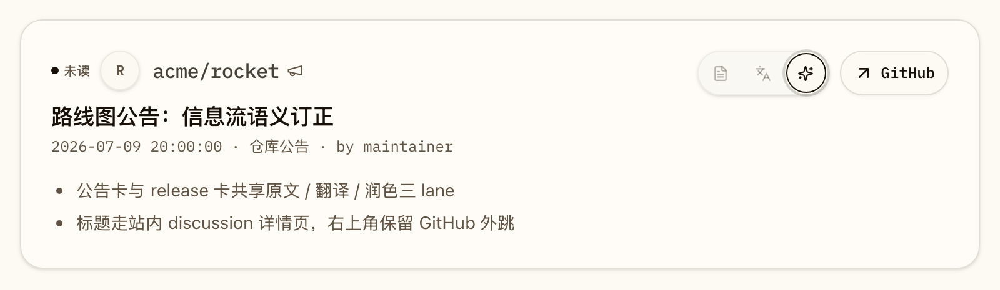
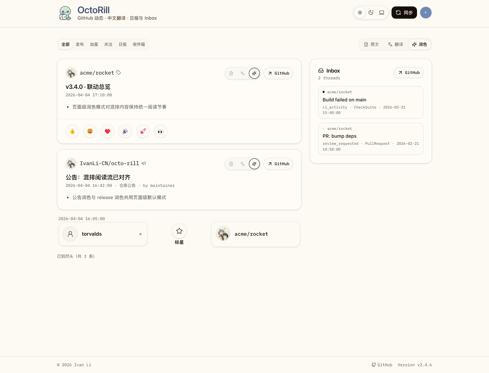
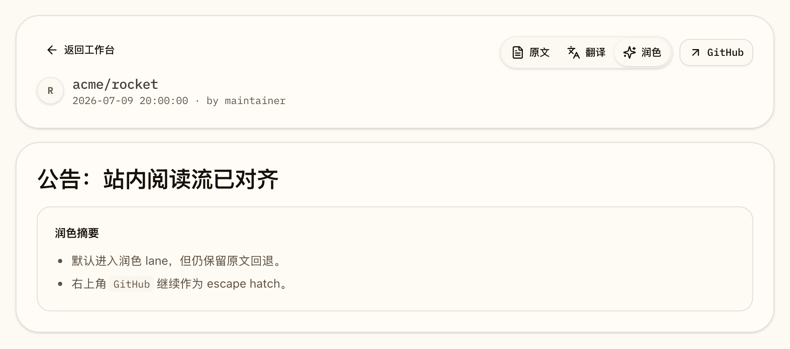

# 公告翻译/润色与 Discussion 详情页对齐（#m8f2q）

## 状态

- Status: active
- Created: 2026-07-09
- Last: 2026-07-09

## 背景 / 问题陈述

- `#vgqp9` 已把公告作为 ambient feed 事件接入 `全部` tab，但当前公告仍停留在“只读内容卡 + GitHub 外链”阶段，没有对齐 release 卡片的 `原文 / 翻译 / 润色` 阅读模型。
- `#7f2b9` 已冻结 lane selector、自动触发、错误重试与原文回退语义，但这套 contract 目前只覆盖 release，没有扩展到 announcement。
- `#2x7av` 已冻结 release canonical deep link 与 `from` 返回语义，但 discussion 公告仍缺少站内 canonical path、detail API 与 scope-aware round-trip。
- 结果是：公告正文在 feed 中容易被截断，标题一跳离站，登录态用户无法在 Dashboard 壳层内持续阅读完整正文，也无法复用现有翻译/润色能力。

## 目标 / 非目标

### Goals

- 把 announcement 从“只读内容卡”升级为“支持 `原文 / 翻译 / 润色` 三 lane 的内容卡”，并复用 release 既有的 page-level / card-level lane 语义。
- 新增登录态 canonical detail path：`/<owner>/<repo>/discussions/<number>`，在 Dashboard 壳层内阅读 announcement 详情，不新增公开 announcement 页面。
- 后端补齐 announcement detail 真相源、feed read model、translation kind 与 detail API，让 feed 与详情页共享同一套稳定事实来源。
- 保持 `repo_star_received` / `follower_received` / `repo_forked` 继续作为轻量社交卡，不把它们误升级为 lane-capable 内容卡。

### Non-goals

- 不做匿名可访问的 announcement public page，也不新增 public announcement API 文档。
- 不把产品扩成通用 GitHub Discussions 阅读器；本轮只覆盖 GitHub Discussions Announcements。
- 不新增 announcement reactions、独立顶层 tab、或新的 brief 折叠策略。
- 不重写 release detail 的信息架构；release 继续保留既有 modal / deep link / scheduler contract。

## 范围（Scope）

### In scope

- `src/api.rs`
- `src/server.rs`
- `src/sync.rs`
- `src/translations.rs`
- `migrations/0059_social_activity_announcement_discussions.sql`
- `web/src/api.ts`
- `web/src/auth/startupCache.ts`
- `web/src/dashboard/AnnouncementDetailPage.tsx`
- `web/src/dashboard/routeState.ts`
- `web/src/feed/**`
- `web/src/pages/Dashboard.tsx`
- `web/src/routes/$owner/$repo/discussions/**`
- `web/src/stories/**`
- `web/e2e/**`
- `docs/product.md`
- `docs/specs/README.md`
- `docs/specs/vgqp9-dashboard-social-activity/IMPLEMENTATION.md`
- `docs/specs/7f2b9-release-feed-smart-tabs/IMPLEMENTATION.md`
- `docs/specs/2x7av-dashboard-tab-path-release-deep-link/IMPLEMENTATION.md`

### Out of scope

- public release 页面
- GitHub Inbox / brief 数据结构
- organization-wide discussions browsing
- 历史一次性全量 backfill 任务

## 路由与阅读契约

### Feed card contract

- `announcement` 进入 `FeedItem` 判别联合中的 lane-capable 分支，与 `release` 共用内容卡阅读语汇。
- Dashboard `全部` tab 中的公告卡支持 `原文 / 翻译 / 润色`，并复用：
  - page-level 默认 lane
  - 单卡 lane 覆盖
  - `missing` 自动触发
  - `error` 重试
  - 原文回退
- 公告标题进入站内详情页；右上角 `GitHub` 继续作为外跳 escape hatch。
- `repo_star_received` / `follower_received` / `repo_forked` 固定为轻量社交卡，不渲染 lane UI。

### Announcement detail canonical path

- canonical path：`/<owner>/<repo>/discussions/<number>`
- query 继续承载返回上下文：
  - `from=<tab>`
  - `scope=<repo|repos|org|mine|following>`
  - `items=<repo list>`（需要时）
  - `org=<org>`（需要时）
- 登录态命中时，页面进入 Dashboard 壳层内的 announcement 阅读页。
- 未登录命中时，不得落到 public announcement page；必须回到 landing/login surface。
- 详情页默认 `润色` lane；当 `translated` 或 `smart` 缺数据时继续回退显示原文正文。

### Round-trip contract

- 从全局 `/` 打开 announcement title 时，detail link 只能写 canonical discussion path + `from=all`，不得伪造 repo scope。
- 从 scoped route 打开 announcement title 时，detail link 必须完整保留当前 scope query。
- 详情页点击“返回工作台”后，必须恢复到原 tab / scope，而不是一律回退全局或 repo scope。

## 后端与数据契约

### Feed read model

- `/api/feed` 的 `announcement` 项新增：
  - `discussion_number`
  - `discussion_key`
  - `translated`
  - `smart`
- `translated` / `smart` 只对 `release` 与 `announcement` 可用；其它社交类型固定返回 `null`。

### Announcement detail truth source

- `social_activity_events` 为 announcement 记录稳定持久化：
  - `discussion_number`
  - 完整正文真相源 `body`
  - GitHub discussion URL
- 对历史缺字段记录，detail API 必须支持按 route params 现拉 / 回填 fallback，而不是依赖一次性历史 backfill 才能工作。

### Detail API

- 新增登录态读取接口：
  - `GET /api/repos/:owner/:repo/discussions/:number/detail`
- 返回：
  - `repo_full_name`
  - `discussion_number`
  - `discussion_key`
  - `repo_visual`
  - `title`
  - `body`
  - `html_url`
  - `occurred_at`
  - `actor`
  - `translated`
  - `smart`

### Translation request kinds

- allowlist 新增：
  - `announcement_summary`
  - `announcement_detail`
  - `announcement_smart`
- `announcement_summary` 用于 feed 翻译 lane。
- `announcement_smart` 用于 feed 与 detail 的润色 lane。
- `announcement_detail` 用于完整正文译文。
- source-hash、variant 与结果映射必须对 `discussion_key` 稳定 canonicalize，避免 feed/detail 间重复落库或串结果。

## 验收标准（Acceptance Criteria）

- Given `GET /api/feed`
  When 返回 `announcement` 项
  Then 该项必须暴露可用的 `translated` / `smart` 状态；其它社交类型仍固定为 `null`，不出现 lane UI。

- Given Dashboard `全部` tab 中存在公告卡
  When 页面渲染完成
  Then 公告卡必须支持 `原文 / 翻译 / 润色`、自动触发、失败重试、标题站内跳转与 GitHub 外跳；移动端不得挤占 repo identity 与 CTA 布局。

- Given 用户访问 `/<owner>/<repo>/discussions/<number>?from=<tab>&scope=...`
  When 用户已登录
  Then 页面进入 Dashboard 壳层内的 announcement 阅读页，返回时恢复正确 tab / scope。

- Given 公告 feed 正文已截断
  When 用户打开详情页
  Then 详情页仍能读取完整正文，并对完整正文提供对应翻译 / 润色结果。

- Given 用户未登录访问 `/<owner>/<repo>/discussions/<number>`
  When 路由完成首载
  Then 页面落到 landing/login surface，而不是公开公告页。

## 非功能性验收 / 质量门槛（Quality Gates）

### Testing

- `cargo test`
- `cd web && bun run build`
- `cd web && bun run storybook:build`
- `cd web && bunx playwright test e2e/announcement-detail.spec.ts e2e/dashboard-scoped-focus.spec.ts`

### Storybook / Visual

- 至少覆盖：
  - 桌面公告卡
  - 移动端公告卡
  - 公告 lane `missing / error / pending`
  - 公告 title deep link
  - 公告详情页 `ready / error`
  - 页面级 lane 对 `announcement + release` 混排的共同作用

## 文档更新（Docs to Update）

- `docs/specs/README.md`
- `docs/specs/m8f2q-announcement-discussion-reading/SPEC.md`
- `docs/specs/m8f2q-announcement-discussion-reading/IMPLEMENTATION.md`
- `docs/specs/m8f2q-announcement-discussion-reading/HISTORY.md`
- `docs/specs/vgqp9-dashboard-social-activity/IMPLEMENTATION.md`
- `docs/specs/7f2b9-release-feed-smart-tabs/IMPLEMENTATION.md`
- `docs/specs/2x7av-dashboard-tab-path-release-deep-link/IMPLEMENTATION.md`
- `docs/product.md`

## 计划资产（Plan assets）

- Directory: `docs/specs/m8f2q-announcement-discussion-reading/assets/`
- Visual evidence source: Storybook 稳定故事

## Visual Evidence

PR: include

PR: include

PR: include

## 参考（References）

- `docs/specs/vgqp9-dashboard-social-activity/SPEC.md`
- `docs/specs/7f2b9-release-feed-smart-tabs/SPEC.md`
- `docs/specs/2x7av-dashboard-tab-path-release-deep-link/SPEC.md`
- `docs/specs/u1f6v-authenticated-scoped-focus-feed/SPEC.md`
- `docs/product.md`
