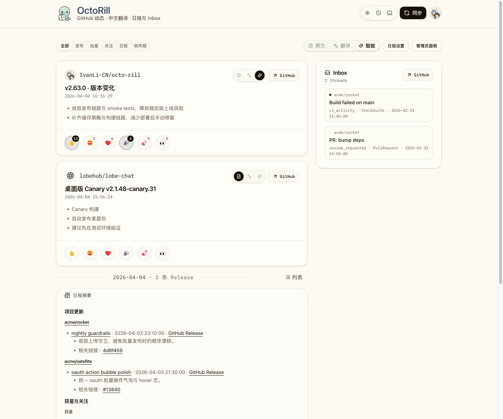
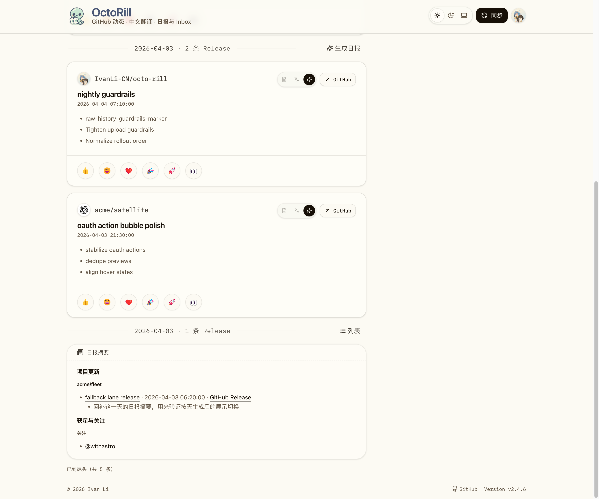
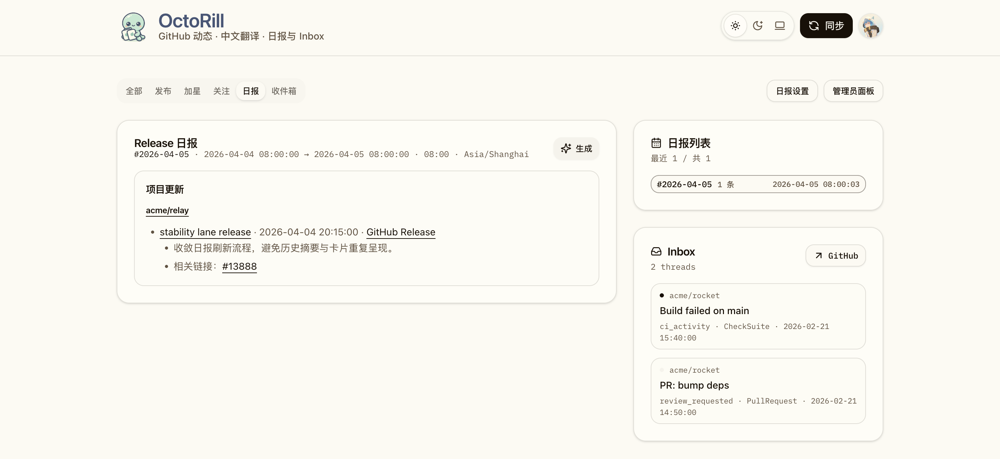

# Dashboard 历史日报折叠补齐与社交空态裁剪（#n4x7e）

## 状态

- Status: 部分完成（3/4）
- Created: 2026-04-19
- Last: 2026-04-19

## 背景 / 问题陈述

- `全部` tab 的历史日组已经支持用 brief 折叠同一窗口内的 Release，但获星 / 关注卡片仍会在 brief 前后残留，导致“日报视图”与“原始列表视图”混杂。
- `qvfxq` 引入的 brief V2 正文把获星 / 关注纳入摘要后，空窗口仍会输出“没有新的获星动态 / 关注动态”占位，正文显得冗余，也让历史快照刷新后的内容不够稳定。
- 现有历史 brief 需要通过既有 `brief.refresh_content` 链路原位修复，否则只有新生成日报才会符合新的折叠与正文契约。

## 目标 / 非目标

### Goals

- 让 `全部` tab 的历史日组在 brief 视图下隐藏已被日报覆盖的获星 / 关注卡片，只在切回“列表”时恢复原始混排活动流。
- 收敛 brief markdown canonical contract：`## 项目更新` 始终存在；社交章节按需渲染；只有 Release 为空时保留显式空态。
- 让 `brief.refresh_content` 把旧的“空社交占位”快照识别为待刷新，并在原 `brief_id` 上完成内容修复。
- 补齐 Storybook、产品文档和视觉证据，冻结本轮 follow-up contract，而不回写已完成 spec 的正文规则。

### Non-goals

- 不改 `加星` / `关注` tab 的独立列表样式与卡片布局。
- 不改 feed 分组算法、Release 详情弹窗、翻译或 reaction 逻辑。
- 不新增 HTTP / API 字段，也不新增新的后台任务类型。

## 范围（Scope）

### In scope

- `src/ai.rs`
- `src/jobs.rs`
- `web/src/feed/FeedGroupedList.tsx`
- `web/src/stories/Dashboard.stories.tsx`
- `docs/product.md`
- `docs/specs/README.md`

### Out of scope

- `web/src/feed/FeedItemCard.tsx`
- `src/api.rs`
- `web/src/pages/Dashboard.tsx`
- 非 Dashboard / brief 相关页面

## 需求（Requirements）

### MUST

- brief canonical markdown 必须始终保留 `## 项目更新`，且无 Release 时继续输出 `- 本时间窗口内没有新的 Release。`。
- `## 获星与关注` 仅在窗口内至少存在一种社交事件时出现；`### 获星` / `### 关注` 只允许渲染有数据的小节。
- canonical validator、润色保护与 refresh 判定必须接受“无社交章节”与“单侧社交小节”两种合法结构，同时继续严格校验 Release 链接与顺序。
- `brief.refresh_content` 必须把旧的空社交占位正文识别为待刷新，并原位重写既有 brief。
- `全部` tab 的历史组在 brief 视图下，若 brief 已覆盖获星或关注，则对应社交卡片不得继续作为独立卡片出现在 brief 前后。
- 若 brief snapshot 未覆盖某条 Release，则未匹配的 Release 卡片仍可留在 brief 前后，避免历史快照不完整时丢信息。
- “列表”视图必须继续恢复当天原始混排列表，不丢失 Release / 获星 / 关注卡片。

### SHOULD

- Storybook mock brief 应覆盖“无社交”“仅关注”“发布 + 双社交”三种正文结构。
- 历史组折叠逻辑优先基于 brief markdown 的 canonical heading 判断是否覆盖对应社交类型，而不是新增接口字段。

### COULD

- 无。

## 功能与行为规格（Functional / Behavior Spec）

### Core flows

- 用户在 `全部` tab 浏览历史日组时，默认看到 brief 卡片；如果 brief 正文包含 `### 获星` / `### 关注`，同组对应社交卡片会在 brief 视图中被折叠隐藏。
- 用户点击历史日组的“列表”后，该组恢复日期分界 + 原始混排活动列表，之前被折叠的社交卡片重新出现。
- 用户查看独立 `日报` tab 或历史日组内嵌 brief 时，若窗口内没有任何社交活动，正文只剩 `## 项目更新`；若只有一种社交事件，只渲染对应小节。
- 后台 refresh 扫描命中旧的空社交占位 brief 时，会重建 canonical markdown，并更新同一条 brief 记录与 memberships。

### Edge cases / errors

- 当窗口内没有 Release、但存在社交活动时，正文仍要保留 Release 空态，并继续展示非空社交小节。
- 当窗口内没有社交活动时，不得输出 `## 获星与关注`、`### 获星`、`### 关注`，也不得输出对应空态提示。
- 当 brief 没有 `### 获星` 或 `### 关注` 小节时，历史组不得隐藏对应社交卡片，避免旧 / 非 canonical snapshot 误伤原始列表。

## 验收标准（Acceptance Criteria）

- Given 历史日组同时包含 Release、获星、关注，且命中真实 brief
  When `全部` tab 默认以 brief 视图渲染
  Then 该组只显示日报卡片，不再在日报前后残留对应社交卡片。

- Given 历史日组命中真实 brief
  When 用户点击“列表”
  Then 该组恢复同一天原始混排记录，获星 / 关注卡片重新可见。

- Given brief 窗口内仅有 Release
  When 正文渲染完成
  Then 正文只保留 `## 项目更新`，且不会出现任何社交章节或空态占位。

- Given brief 窗口内只有关注、没有获星
  When 正文渲染完成
  Then `## 获星与关注` 下只出现 `### 关注` 小节，`### 获星` 不出现。

- Given 已生成的历史 brief 正文仍包含空社交占位
  When `brief.refresh_content` 执行完成
  Then 该条 brief 会以原 `brief_id` 被原位刷新成新的 canonical 结构。

## 实现前置条件（Definition of Ready / Preconditions）

- [x] 已确认 follow-up spec 需要落在 `docs/specs/n4x7e-dashboard-brief-social-folding/`。
- [x] 已确认当前任务属于 UI-affecting，必须补 Storybook 和视觉证据。
- [x] 已确认本轮不修改公开 API 契约。

## 非功能性验收 / 质量门槛（Quality Gates）

### Testing

- `cargo test`
- `cd web && bun run lint`
- `cd web && bun run build`
- `cd web && bun run storybook:build`

### Visual verification

- Storybook 必须覆盖：
  - `全部` tab 历史日报折叠后不再残留社交卡片
  - 历史 fallback brief 生成后只渲染非空社交小节
  - 独立 `日报` tab 的 project-only brief 不显示社交空态
- 最终视觉证据写回本 spec 的 `## Visual Evidence`。

## 文档更新（Docs to Update）

- `docs/product.md`
- `docs/specs/README.md`
- `web/src/stories/Dashboard.stories.tsx`

## 计划资产（Plan assets）

- Directory: `docs/specs/n4x7e-dashboard-brief-social-folding/assets/`

## Visual Evidence

- source_type: `storybook_canvas`
  story_id_or_title: `Pages/Dashboard / Evidence / All History Collapsed To Briefs`
  state: `historical_brief_social_folded`
  evidence_note: 证明 `全部` tab 的历史日报视图只保留日报卡片，获星 / 关注不再以独立社交卡片残留在 brief 前后。
  PR: include
  image:
  

- source_type: `storybook_canvas`
  story_id_or_title: `Pages/Dashboard / All History Fallback To Release Cards`
  state: `generated_brief_one_sided_social`
  evidence_note: 证明历史 fallback 日组生成 brief 后，仅渲染有数据的 `### 关注` 小节，不再补空的 `### 获星`。
  PR: include
  image:
  

- source_type: `storybook_canvas`
  story_id_or_title: `Pages/Dashboard / Evidence / Briefs Project Only`
  state: `briefs_tab_project_only`
  evidence_note: 证明独立 `日报` tab 在窗口内只有 Release 时，只保留 `## 项目更新`，没有社交空态占位。
  PR: include
  image:
  

## 实现里程碑（Milestones / Delivery checklist）

- [x] M1: 新建 follow-up spec 并冻结历史 brief 折叠 / 社交空态 contract。
- [x] M2: 后端 brief 生成、validator 与 refresh 判定支持可选社交章节。
- [x] M3: Dashboard 历史组折叠 + Storybook mock / play 收敛。
- [ ] M4: 视觉证据、快车道交付与文档收口完成。

## 方案概述（Approach, high-level）

- 延续 `qvfxq` 的 V2 brief 结构，但把社交章节从“固定双小节 + 空态占位”收紧为“按需渲染”。
- 历史组折叠不依赖新增接口字段，而是复用现有 brief markdown heading 作为“该类社交已被摘要覆盖”的信号。
- 既有快照修复继续走 `brief.refresh_content`，只扩展候选判定与 canonical validator，不新增新的后台任务入口。

## 风险 / 开放问题 / 假设（Risks, Open Questions, Assumptions）

- 风险：若历史 brief 不是 canonical markdown，但恰好缺少社交小节，前端会保守地保留原始社交卡片，这是有意的防误伤策略。
- 风险：若 Storybook mock 与后端 canonical contract 不同步，视觉证据会掩盖真实运行时回归。
- 开放问题：无。
- 假设：brief markdown 中 `### 获星` / `### 关注` heading 足以作为前端折叠对应社交卡片的稳定信号。

## 参考（References）

- `docs/specs/xaycu-dashboard-day-grouping/SPEC.md`
- `docs/specs/qvfxq-release-daily-brief-v2/SPEC.md`
- `src/ai.rs`
- `src/jobs.rs`
- `web/src/feed/FeedGroupedList.tsx`
