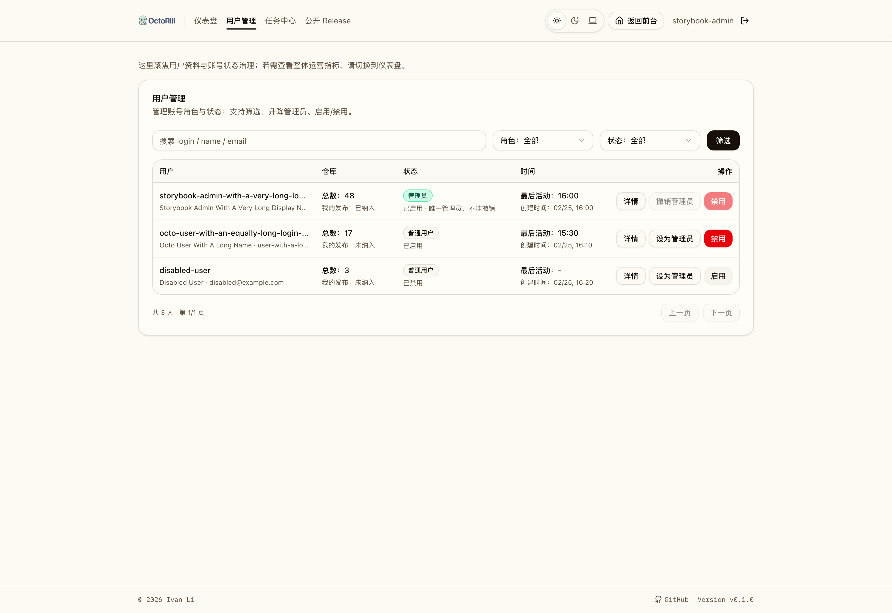
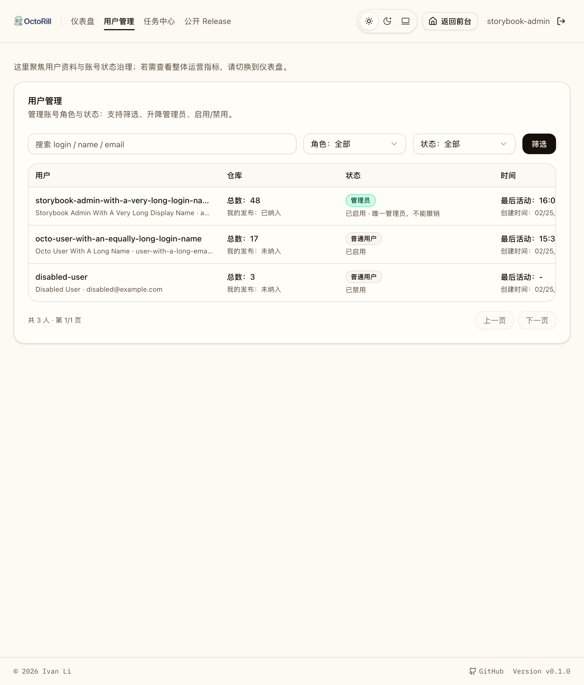

# 管理员面板一期（首登管理员 + 用户管理）（#n6zd8）

## 背景 / 问题陈述

当前系统只有“已登录用户”概念，没有管理员能力，也无法对站内账号做权限控制与状态控制。为支持后续运营与安全治理，需要先建立最小可用的管理员体系。

## 目标 / 非目标

### Goals

- 落地“首个登录用户自动成为管理员”。
- 提供管理员面板一期：用户列表、搜索筛选、升降管理员、启用/禁用。
- 增加后端权限门禁：仅管理员可调用管理接口；禁用用户不可访问受保护 API。
- 兼容已有数据库：迁移后自动回填管理员。
- 用户管理列表展示“项目处理仓库总数”，并切换为紧凑双层列表页。

### Non-goals

- 不做用户删除（软删除/硬删除）。
- 不做多级角色与细粒度权限。
- 不做审计日志与操作历史回放。

## 范围（Scope）

### In scope

- SQLite schema 变更：`users.is_admin`、`users.is_disabled`。
- 旧数据回填：当无管理员时把最早创建用户设为管理员。
- 认证流程更新：登录时保证首位管理员规则；禁用用户登录被拒绝。
- 新增管理员 API：查询用户、更新用户角色/状态。
- 前端管理员入口与用户管理页面。
- 用户管理列表合同扩展：`repo_total`、`include_own_releases`、双层单行字段布局。
- Rust + Playwright 测试覆盖关键场景。

### Out of scope

- 删除用户。
- 邀请制或手动创建账号。
- 跨组织/多租户权限模型。

## 需求（Requirements）

### MUST

- 首个登录用户自动 `is_admin=true`。
- 非管理员访问 `/api/admin/*` 返回 403 `forbidden_admin_only`。
- 禁用用户访问受保护 API 返回 403 `account_disabled` 并使会话失效。
- 用户管理支持列表、搜索筛选、升降管理员、启用/禁用。
- `GET /api/admin/users` 的列表项必须返回 `repo_total` 与 `include_own_releases`。
- `repo_total` 必须表示 `starred_repos ∪ owned_repo_star_baselines` 以 `repo_id` 去重后的“项目处理仓库总数”。
- `/admin/users` 必须以紧凑列表页呈现 4 个双层信息列：用户、仓库、状态、时间；主/次字段都只能单行展示。
- 保护规则：
  - 不能把系统降为 0 管理员。
  - 不能禁用最后一名有效管理员（`is_admin=1` 且 `is_disabled=0`）。
  - 管理员不能禁用自己。

### SHOULD

- 管理员列表支持分页参数，默认 page=1, page_size=20。
- 管理操作成功后前端列表即时刷新。

### COULD

- 后续扩展审计日志时复用现有 admin API 结构。

## 功能与行为规格（Functional/Behavior Spec）

### Core flows

1. **首登管理员**
   - 用户通过 GitHub OAuth 首次登录。
   - 系统写入用户后检查是否已存在管理员。
   - 若不存在，当前用户自动升级管理员。

2. **管理员查看用户列表**
   - 管理员进入 Dashboard 的“管理员”Tab。
   - 可按 query/role/status 筛选，查看分页结果。
   - 列表按“用户 / 仓库 / 状态 / 时间 / 操作”紧凑展示；仓库列主值为项目处理仓库总数，次值为“我的发布已纳入/未纳入”。

3. **管理员修改用户**
   - 管理员可切换目标用户的管理员状态。
   - 管理员可启用/禁用目标用户。
   - 操作完成后展示最新状态。

4. **禁用拦截**
   - 被禁用用户再次访问受保护 API。
   - 后端返回 `account_disabled`，并清理会话。

### Edge cases / errors

- 非管理员调用管理接口：403 `forbidden_admin_only`。
- 目标用户不存在：404 `not_found`。
- 尝试撤销最后一名管理员：409 `last_admin_guard`。
- 尝试禁用最后一名有效管理员：409 `last_admin_guard`。
- 管理员尝试禁用自己：409 `cannot_disable_self`。

## 接口契约（Interfaces & Contracts）

### 接口清单（Inventory）

| 接口（Name） | 类型（Kind） | 范围（Scope） | 变更（Change） | 契约文档（Contract Doc） | 负责人（Owner） | 使用方（Consumers） | 备注（Notes） |
| --- | --- | --- | --- | --- | --- | --- | --- |
| `GET /api/me` | HTTP API | external | Modify | `./contracts/http-apis.md` | backend | web | 增加 `is_admin` |
| `GET /api/admin/users` | HTTP API | external | New | `./contracts/http-apis.md` | backend | web-admin | 管理员列表查询 |
| `PATCH /api/admin/users/{user_id}` | HTTP API | external | New | `./contracts/http-apis.md` | backend | web-admin | 角色与状态更新 |
| `users` table | DB schema | internal | Modify | `./contracts/db.md` | backend | backend | 新增 admin/disabled 字段 |

### 契约文档（按 Kind 拆分）

- [contracts/README.md](./contracts/README.md)
- [contracts/http-apis.md](./contracts/http-apis.md)
- [contracts/db.md](./contracts/db.md)

## 验收标准（Acceptance Criteria）

- Given 空数据库
  When 第一个用户完成 OAuth 登录
  Then `users.is_admin=1` 且该用户可见“管理员”Tab。

- Given 旧数据库（无 `is_admin` 列历史）
  When 执行迁移
  Then 最早创建用户（并列按最小 id）自动成为管理员。

- Given 普通用户
  When 调用 `/api/admin/users`
  Then 返回 403 且错误码为 `forbidden_admin_only`。

- Given 禁用用户已有会话
  When 调用任一受保护 API
  Then 返回 403 `account_disabled` 且后续 `/api/me` 返回未登录。

- Given 管理员用户列表
  When 试图撤销最后一名管理员或禁用最后一名有效管理员
  Then 返回 409 `last_admin_guard`。

- Given 管理员
  When 试图禁用自己
  Then 返回 409 `cannot_disable_self`。

- Given 管理员查看 `/admin/users`
  When 某用户同时拥有 watched repo 与 owned repo baseline，且其中某个 repo 同时出现在两种来源
  Then `repo_total` 只按唯一 `repo_id` 计数一次。

- Given 管理员查看 `/admin/users`
  When 用户名、姓名或邮箱很长
  Then 双层字段保持单行截断，不换行撑高记录行。

## 实现前置条件（Definition of Ready / Preconditions）

- 需求范围与验收标准已冻结。
- 接口字段、错误码、管理规则已确认。
- 普通流程已锁定（本地验证 + 本地提交，不 push）。

## 非功能性验收 / 质量门槛（Quality Gates）

### Testing

- Unit tests: Rust 单测覆盖回填、last-admin guard、禁用拦截。
- E2E tests: Playwright 覆盖管理员入口、管理操作链路、非管理员拦截、紧凑列表页与单行截断/横向滚动。

### Quality checks

- `cargo fmt --check`
- `cargo clippy --all-targets --all-features -- -D warnings`
- `cargo test --locked --all-features`
- `cd web && bun run lint && bun run build && bun run storybook:build && bun run e2e -- admin-users.spec.ts app-auth-boot.spec.ts`

## 方案概述（Approach, high-level）

- 后端先落地身份状态模型，再提供管理接口，最后前端接入。
- 以最小可用原则构建一期功能，避免提前引入复杂角色体系。
- 通过数据库与服务层双重约束保障“至少一名管理员”和“至少一名有效管理员”。
- 列表中的“项目处理仓库总数”只读取本地已同步仓库快照，不在管理员列表请求里引入新的 GitHub 在线刷新副作用。

## Visual Evidence

- source_type: `storybook_canvas`
  story_id_or_title: `admin-admin-panel--evidence-compact-list`
  state: `desktop compact list`
  evidence_note: 证明 `/admin/users` 已切换为 4 信息列 + 1 操作列的紧凑双层列表页，并展示“项目处理仓库总数 / 我的发布纳入状态”。
  PR: include
  

- source_type: `storybook_canvas`
  story_id_or_title: `admin-admin-panel--evidence-compact-list`
  state: `tablet horizontal scroll`
  evidence_note: 证明窄屏下仍保持双层单行字段与横向滚动，不退化回卡片或多行换行。
  

## 风险 / 开放问题 / 假设（Risks, Open Questions, Assumptions）

- 风险：历史数据可能存在异常时间字段，回填逻辑需有 id 兜底排序。
- 需要决策的问题：无（本期规则已冻结）。
- 假设（需主人确认）：管理员不需要删除用户能力（本期不做）。

## 参考（References）

- `docs/product.md`
- 本会话确认的执行计划（normal flow）
