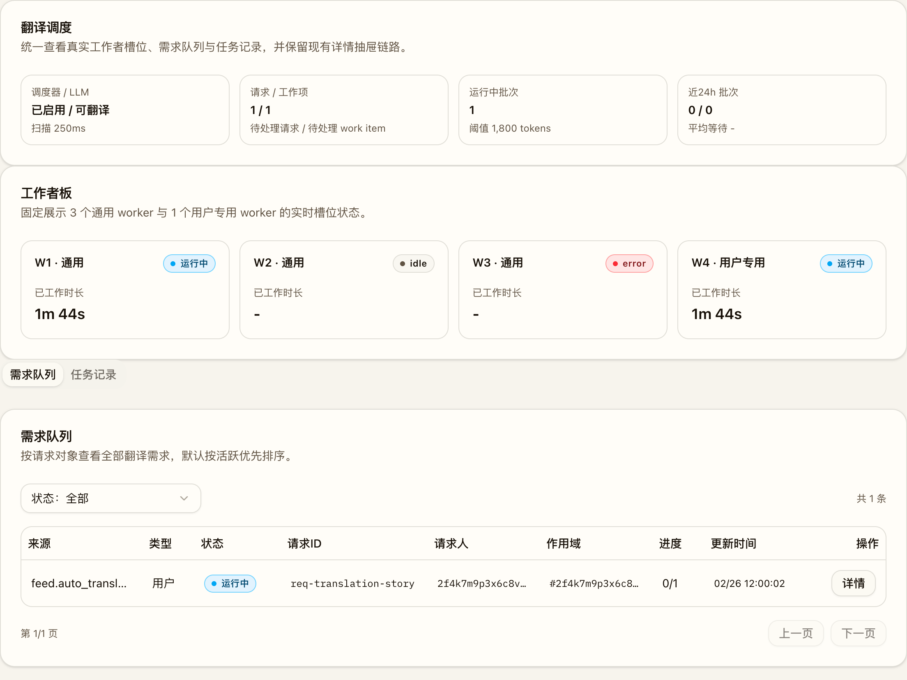
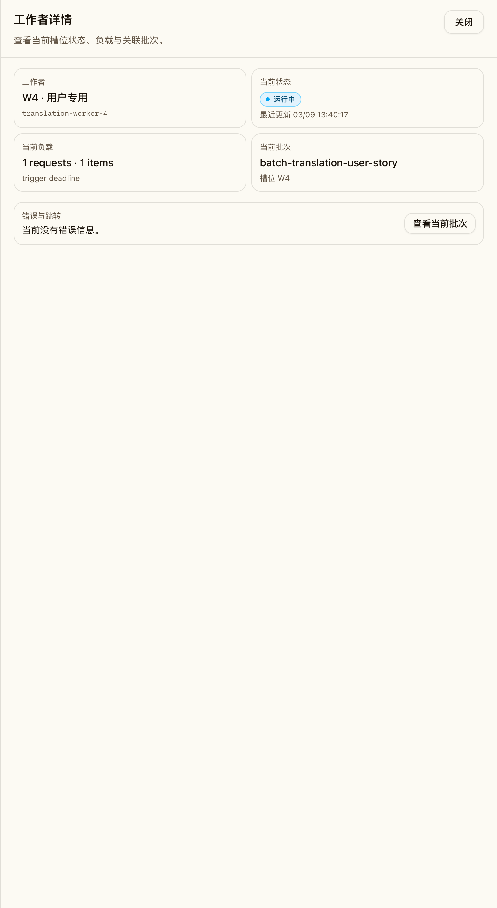
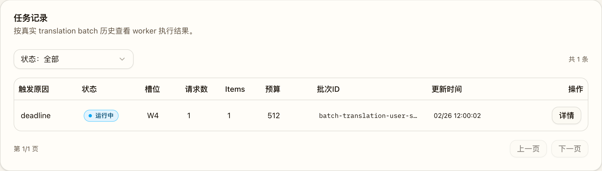
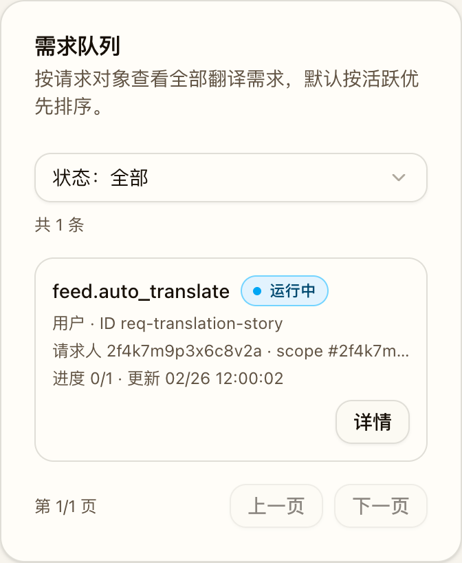

# Translation Worker Board Follow-up (#nbz5z)

## 背景 / 问题陈述

当前 `/admin/jobs` 的“翻译调度”仍以“请求卡片 + 批次卡片”双列表展示，无法稳定表达“真实工作者槽位、谁在执行、队列与历史如何分层”这三类信息：

- 管理端缺少常驻工作者面板，无法直接看到当前有哪些 translation workers、哪个槽位正在执行哪个批次。
- 请求列表与批次列表都用卡片流展示，桌面端无法高密度浏览，小屏端也缺少清晰的一行式字段退化策略。
- 当前 translation scheduler 仍是单 worker 轮询模型，无法支撑“3 个通用 worker + 1 个用户专用 worker”的固定并发语义。
- 现有请求模型没有稳定的“用户发起 / 系统发起”持久化字段，无法可靠分流到不同 worker 槽位。

需要把该页重构为“工作者板 + 需求队列/任务记录”三块结构，并把后端执行模型升级为固定四槽位 worker runtime，以便管理端看到真实运行态，并为后续系统翻译入口接入预留稳定分流语义。

## 目标 / 非目标

### Goals

- 将 `/admin/jobs` 中的翻译调度页重构为顶部常驻工作者板、下方 `需求队列` / `任务记录` 双 tabs 的三块布局。
- 固定 translation worker runtime 为 `3 general + 1 user_dedicated` 共 4 个槽位，并在状态接口中暴露实时运行态。
- 为 `translation_requests` 增加显式 `request_origin = user|system`，稳定表达请求来源并驱动 worker 分流。
- 为 `translation_batches` 持久化 `worker_slot` 与 `request_count`，让历史页能回溯“哪个 worker 执行过该批次、聚合了多少请求”。
- 扩展管理端接口、SSE、TypeScript API types、Storybook 与 Playwright，使 request / batch / worker 三类刷新链路一致。

### Non-goals

- 不修改公开生产者接口 `/api/translate/requests*` 的外部行为或请求结构。
- 不引入跨实例分布式抢占，不做多进程协调。
- 不让用户专用 worker 在用户队列为空时回补系统请求。
- 不把非翻译类任务并入 translation worker runtime。

## 接口契约（Interfaces & Contracts）

### 接口清单（Inventory）

| 接口（Name） | 类型（Kind） | 范围（Scope） | 变更（Change） | 契约文档（Contract Doc） | 负责人（Owner） | 使用方（Consumers） |
| --- | --- | --- | --- | --- | --- | --- |
| `GET /api/admin/jobs/translations/status` | HTTP API | external | Modify | `./contracts/http-apis.md` | backend | web-admin |
| `GET /api/admin/jobs/translations/requests` | HTTP API | external | Modify | `./contracts/http-apis.md` | backend | web-admin |
| `GET /api/admin/jobs/translations/batches` | HTTP API | external | Modify | `./contracts/http-apis.md` | backend | web-admin |
| `GET /api/admin/jobs/translations/batches/{batch_id}` | HTTP API | external | Modify | `./contracts/http-apis.md` | backend | web-admin |
| `GET /api/admin/jobs/events` (`translation.event`) | SSE | external | Modify | `./contracts/http-apis.md` | backend | web-admin |
| `translation_requests` / `translation_batches` | DB schema | internal | Modify | `./contracts/db.md` | backend | backend |
| translation worker runtime snapshot | Runtime contract | internal | New | `./contracts/http-apis.md` | backend | backend / web-admin |

### 契约文档（按 Kind 拆分）

- [contracts/http-apis.md](./contracts/http-apis.md)
- [contracts/db.md](./contracts/db.md)

## 验收标准（Acceptance Criteria）

- Given 翻译页已加载
  When 管理员切换 `需求队列` 与 `任务记录` tabs
  Then 顶部工作者板始终可见，不因 tab 切换而消失。

- Given translation runtime 同时存在系统请求与用户请求
  When 4 个 worker 并发运行
  Then 仅 `slots 1-3` 可 claim `system` 请求，而 `slot 4` 只能 claim `user` 请求；若没有用户请求，`slot 4` 保持 idle。

- Given 多个 worker 并发扫描同一批 queued work items
  When claim 发生竞争
  Then 同一组 work items 只能形成一个 batch，不会重复建批，也不会产生空批次。

- Given 管理员查看 `任务记录`
  When 查看任一批次行或批次详情
  Then 能看到 `worker_slot` 与 `request_count`，并继续通过现有详情抽屉访问关联 LLM 调用。

- Given 管理员查看 `需求队列`
  When 页面载入默认排序
  Then `queued/running` 请求排在前面，其余请求按 `updated_at` 倒序展示，且仍支持状态筛选与请求详情抽屉。

- Given 浏览器收到 `translation.event`
  When `resource_type` 为 `worker` / `request` / `batch`
  Then 前端能刷新对应数据并保持工作者板、请求列表、批次列表一致。

- Given 某个 worker 持有的 batch 失去 owner 或心跳超过 90 秒
  When runtime recovery sweep 触发
  Then 该 batch、其 work items、关联 requests 与 linked llm calls 都会被标记为 `failed(runtime_lease_expired)`，工作者板不再长期显示虚假的运行中批次。

## 非功能性验收 / 质量门槛（Quality Gates）

### Testing

- Rust tests：并发 claim、worker 分流、`request_origin`/`worker_slot`/`request_count` 持久化、worker runtime snapshot、请求排序。
- Storybook：默认翻译调度页、工作者忙闲混合、小屏列表态。
- Playwright：工作者板常驻、tabs 结构、worker 实时刷新、请求详情跳批次详情、批次详情跳 LLM 详情、小屏列表回退。

### Quality checks

- [x] `cargo test`
- [x] `cd web && bun run build`
- [x] `cd web && bun run e2e -- admin-jobs.spec.ts`

## Visual Evidence

### 桌面端总览（工作者板 + 需求队列）

- source_type: `storybook_canvas`
- target_program: `mock-only`
- capture_scope: `element`
- sensitive_exclusion: `N/A`
- submission_gate: `pending-owner-approval`
- story_id_or_title: `pages-adminjobs--translation-worker-board-busy`
- state: `desktop-overview`
- evidence_note: 验证桌面端翻译调度页采用紧凑工作者板，并且需求队列表格右侧操作列完整显示、无横向裁切。

### 工作者详情抽屉

- source_type: `storybook_canvas`
- target_program: `mock-only`
- capture_scope: `element`
- sensitive_exclusion: `N/A`
- submission_gate: `pending-owner-approval`
- story_id_or_title: `pages-adminjobs--translation-worker-board-busy`
- state: `worker-detail-drawer`
- evidence_note: 验证工作者卡片可点击进入抽屉，并展示当前状态、负载、批次与批次跳转入口。

### 任务记录 Tab

- source_type: `storybook_canvas`
- target_program: `mock-only`
- capture_scope: `element`
- sensitive_exclusion: `N/A`
- submission_gate: `pending-owner-approval`
- story_id_or_title: `pages-adminjobs--translation-worker-board-busy`
- state: `history-tab`
- evidence_note: 验证任务记录以单行表格展示批次历史，并保留槽位、请求数与详情入口。

### 小屏需求队列列表态

- source_type: `storybook_canvas`
- target_program: `mock-only`
- capture_scope: `element`
- sensitive_exclusion: `N/A`
- submission_gate: `pending-owner-approval`
- story_id_or_title: `pages-adminjobs--translation-worker-board-mobile`
- state: `mobile-queue-list`
- evidence_note: 验证小屏宽度下需求队列退化为单条列表项，并保持单行字段与详情入口。

