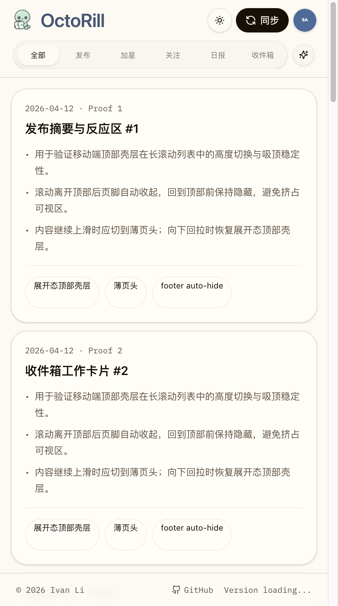
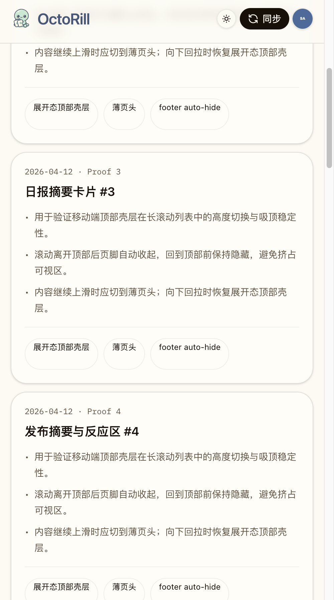
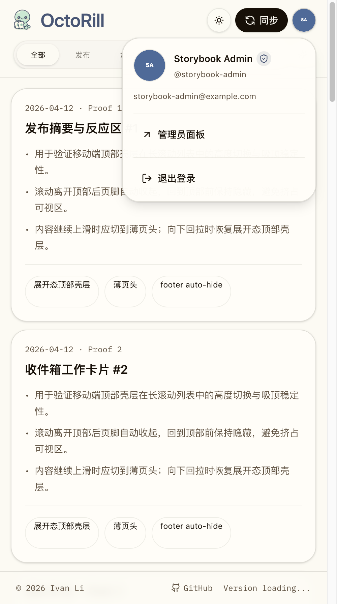
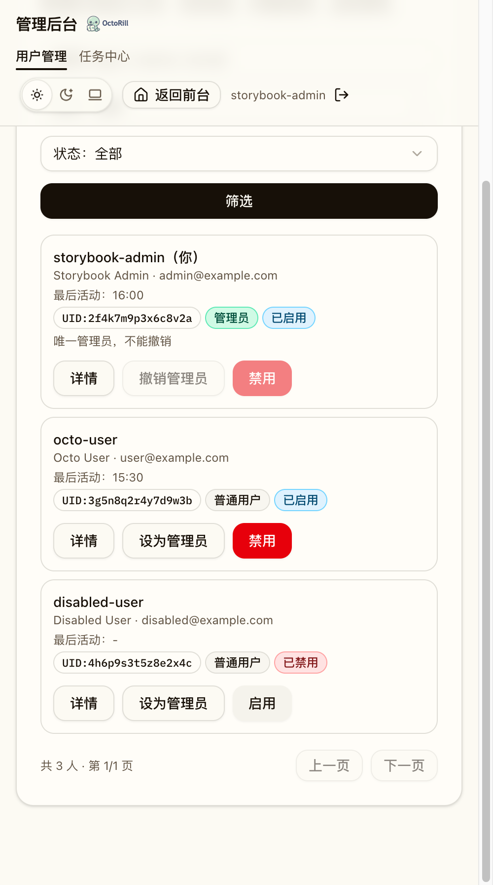
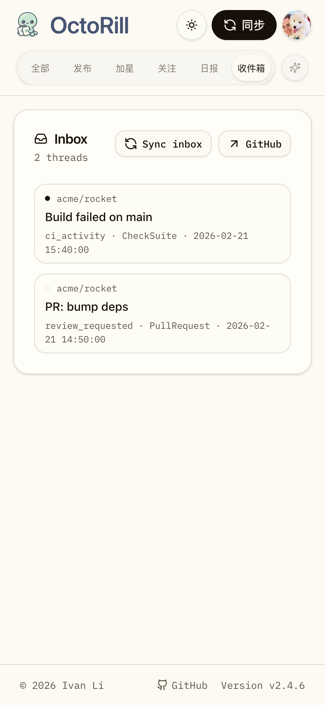
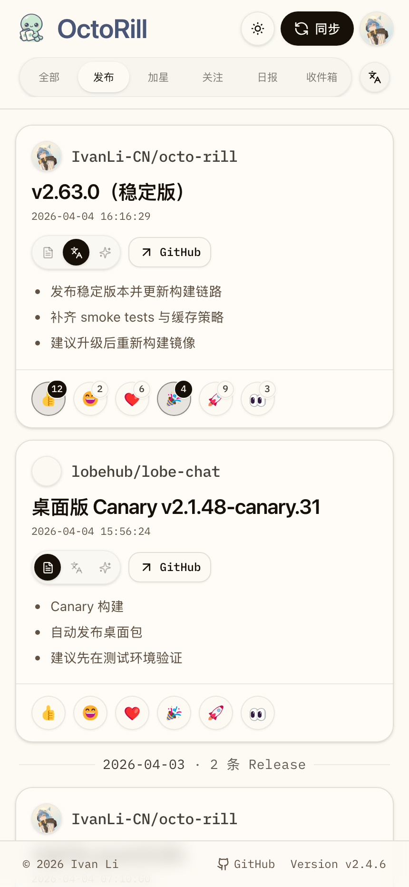

# Dashboard / Admin 移动端壳层与顶栏收敛优化（#p82d7）

## 状态

- Status: 部分完成（4/4）
- Created: 2026-04-12
- Last: 2026-04-20

## 背景 / 问题陈述

- Dashboard 当前移动端页头比预期更高，品牌、副标题、主题胶囊、同步按钮和头像入口叠加后，首屏可读内容被明显压缩。
- Dashboard 顶部一级 tabs 与 `原文 / 翻译 / 智能` 控件在小屏下会分裂成两行，切换成本高，也浪费纵向空间。
- AppShell footer 始终固定显示，移动端一旦进入内容滚动就会持续占据底部可视区域。
- Admin 页虽然与 Dashboard 共享壳层语义，但移动端尚未获得同样的 header / footer 收敛行为。

## 目标 / 非目标

### Goals

- 为 Dashboard / Admin 引入 opt-in 的移动端壳层状态：顶部 compact header、sticky subheader 与滚动时 footer 自动收起。
- 把 Dashboard 移动端页头收敛成“无副标题的基准版 + 内容上滑后更薄的 compact 版”。
- 把 Dashboard 移动端顶部控制区重做为单行 sticky rail，并把管理员入口迁移进用户信息浮层。
- 收紧 Dashboard 小屏内容与卡片内外间距，提升同一视口里的信息密度。
- 补齐 Storybook / Playwright 移动端覆盖与视觉证据。

### Non-goals

- 不改动 Landing 页移动交互。
- 不改动 Rust 后端、API、数据库或权限规则。
- 不重做 Admin Jobs / User Management 的信息架构；本轮仅覆盖共享壳层与页头响应式表现。
- 不额外引入新的全局导航或品牌资产改造。

## 范围（Scope）

### In scope

- `web/src/layout/AppShell.tsx`
- `web/src/layout/AppMetaFooter.tsx`
- `web/src/layout/AdminHeader.tsx`
- `web/src/pages/Dashboard.tsx`
- `web/src/pages/DashboardHeader.tsx`
- `web/src/pages/AdminPanel.tsx`
- `web/src/pages/AdminJobs.tsx`
- `web/src/feed/FeedItemCard.tsx`
- `web/src/feed/FeedGroupedList.tsx`
- `web/src/feed/FeedList.tsx`
- `web/src/feed/FeedPageLaneSelector.tsx`
- `web/src/sidebar/ReleaseDailyCard.tsx`
- `web/src/sidebar/BriefListCard.tsx`
- `web/src/sidebar/InboxQuickList.tsx`
- `web/src/stories/Dashboard.stories.tsx`
- `web/src/stories/DashboardHeader.stories.tsx`
- `web/src/stories/AppShell.stories.tsx`
- `web/src/stories/AdminPanel.stories.tsx`
- `web/e2e/dashboard-access-sync.spec.ts`
- `web/e2e/admin-users.spec.ts`
- `web/e2e/admin-jobs.spec.ts`

### Out of scope

- `src/**` Rust backend
- Landing 页面
- Admin 业务数据结构与路由契约
- Release detail modal 的独立交互重做

## 需求（Requirements）

### MUST

- Dashboard 移动端基准页头不显示副标题。
- Dashboard 在小屏内容上滑时切换到 compact header，向下回拉后恢复到基准页头。
- Dashboard 顶部一级 tabs 在移动端必须保持单行，并在滚动中 sticky 到页头下方。
- `原文 / 翻译 / 智能` 必须在 `全部 / 发布` 视图中并入同一条移动端 sticky rail，而不是形成第二行。
- Dashboard 移动端不再在次级控制区显示“管理员面板”按钮；管理员入口改放进用户信息浮层。
- Dashboard / Admin 的移动端 footer 在页面离开顶部后自动收起，回到顶部再恢复。
- Dashboard 小屏内容区、卡片边距、卡片内 padding 和 reaction 区 spacing 都要比当前版本更紧凑。
- Dashboard 右侧 `Inbox` quick list 仅在桌面侧栏显示；移动端不得在主内容下方重复渲染。
- 当右侧 `Inbox` quick list 不显示时，不得为了该卡片在启动期预取 `/api/notifications`；移动端只在进入 `收件箱` tab 后再加载通知数据。
- Dashboard 移动端 `收件箱` tab 头部的 `Sync inbox` / `GitHub` 次级操作应收敛为 icon-only 按钮，避免和标题抢横向空间。
- Storybook 与 Playwright 必须补齐移动端回归与视觉证据。

### SHOULD

- Desktop 现有文案与布局语义保持稳定，只做响应式必要联动。
- AdminHeader 在移动端保持导航可达，不因 compact 状态丢失入口。
- 所有移动壳层行为只对 Dashboard / Admin opt-in 生效，不波及 Landing。

### COULD

- 允许在移动端把一级 tabs 的可见文案收敛为更短中文标签，只要桌面端仍保持现有语义。

## 功能与行为规格（Functional/Behavior Spec）

### Core flows

1. **Dashboard 移动端首屏**
   - 页头默认隐藏副标题，保留品牌、主题切换、同步与头像入口。
   - 一级 tabs 与阅读模式控件合并为单行 sticky rail。
   - 主内容与卡片 padding 按移动端收紧。
   - `Inbox` quick list 不再出现在主内容下方。

2. **Dashboard 移动端滚动**
   - 用户向下滚动浏览内容时，footer 收起；sticky rail 贴在当前页头下方。
   - 内容继续上滑时，页头切换到 compact 版，为正文腾出更多高度。
   - 用户向下回拉内容时，compact 版退出，恢复到整改后的基准页头。

3. **管理员入口迁移**
   - 桌面端仍保留 Dashboard 次级控制区里的“管理员面板”入口。
   - 移动端移除该入口，改为在用户信息浮层中提供管理员入口。

4. **Admin 共享壳层**
   - Admin Users / Admin Jobs 启用与 Dashboard 相同的移动端 footer auto-hide 与 compact header 状态。
   - Admin 导航保持可访问，不要求新增 sticky 子导航。

### Edge cases / errors

- 不在顶部时 footer 一律保持隐藏，不因滚动停止自动弹回。
- Compact header 仅在移动端、且页面已离开顶部并继续向下滚动浏览内容时生效。
- Dashboard sticky rail 只在移动端启用；桌面端继续使用原有顶部控制区布局。
- 移动端默认首屏与非 `收件箱` tab 不得主动请求 `/api/notifications`；只有右侧桌面侧栏可见或用户切进 `收件箱` tab 时才允许加载。
- Landing 不启用移动壳层状态，也不继承 footer auto-hide。

## 接口契约（Interfaces & Contracts）

### 接口清单（Inventory）

| 接口（Name） | 类型（Kind） | 范围（Scope） | 变更（Change） | 契约文档（Contract Doc） | 负责人（Owner） | 使用方（Consumers） | 备注（Notes） |
| --- | --- | --- | --- | --- | --- | --- | --- |
| `AppShellProps` | React props | internal | Modify | None | web | Dashboard / Admin / Storybook | 新增移动端壳层 opt-in 与 sticky subheader slot |
| `useAppShellChrome()` | React hook | internal | New | None | web | DashboardHeader / AdminHeader / AppMetaFooter | 暴露移动端壳层状态 |
| `DashboardHeaderProps` | React props | internal | Modify | None | web | Dashboard / Storybook | 管理员入口迁移到用户浮层，消费 mobile chrome 状态 |
| `AdminHeader` layout contract | React component | internal | Modify | None | web | AdminPanel / AdminJobs / Storybook | 收紧移动端布局并消费 mobile chrome 状态 |

### 契约文档（按 Kind 拆分）

- None

## 验收标准（Acceptance Criteria）

- Given 390–430px 宽度下打开 Dashboard
  When 页面完成首屏渲染
  Then 页头不显示副标题，顶部 sticky rail 保持单行，且“管理员面板”不再出现在次级控制区。

- Given 移动端 Dashboard 已经向下滚动离开顶部
  When 用户继续浏览内容
  Then footer 自动收起，sticky rail 仍贴在页头下方，且不遮挡正文。

- Given 移动端 Dashboard 已经离开顶部
  When 用户继续向下滚动浏览内容
  Then 页头切换到 compact 版；When 用户向下回拉内容 Then 页头恢复到基准版。

- Given 用户是管理员并处于移动端 Dashboard
  When 打开头像浮层
  Then 可在浮层内看到“管理员面板”入口与“退出登录”动作。

- Given 用户在移动端打开 Dashboard 的默认 `全部` tab
  When 页面完成首屏渲染
  Then 页面下方不存在右侧 `Inbox` quick list，且在用户点击 `收件箱` tab 前不会请求 `/api/notifications`。

- Given 用户在小屏幕进入 Dashboard 的 `收件箱` tab
  When 收件箱列表头部出现 `Sync inbox` 与 `GitHub` 次级操作
  Then 两个操作都应展示为仅图标按钮，不再显示文字标签。

- Given 移动端 Admin Users 或 Admin Jobs 页面
  When 页面离开顶部后继续向下滚动浏览内容
  Then 共享 footer auto-hide 与 compact header 生效，同时管理员导航仍可见。

## 实现前置条件（Definition of Ready / Preconditions）

- Dashboard / Admin 继续共用 `AppShell`，允许以 opt-in 方式注入移动端壳层能力。
- Storybook 已存在，可作为移动端视觉证据的主来源。
- 本轮不涉及 API / DB / route contract 变更。

## 非功能性验收 / 质量门槛（Quality Gates）

### Testing

- `cd web && bun run build`
- `cd web && bun run storybook:build`
- `cd web && bun run e2e -- dashboard-access-sync.spec.ts admin-users.spec.ts admin-jobs.spec.ts`

### UI / Storybook (if applicable)

- Stories to add/update: `web/src/stories/Dashboard.stories.tsx`、`web/src/stories/DashboardHeader.stories.tsx`、`web/src/stories/AppShell.stories.tsx`、`web/src/stories/AdminPanel.stories.tsx`
- Visual evidence source: Storybook + browser mobile viewport capture
- Visual evidence sink: `## Visual Evidence`

## 文档更新（Docs to Update）

- `docs/specs/README.md`
- `docs/specs/p82d7-dashboard-admin-mobile-shell-polish/SPEC.md`

## 计划资产（Plan assets）

- Directory: `docs/specs/p82d7-dashboard-admin-mobile-shell-polish/assets/`
- Visual evidence source: maintain `## Visual Evidence` in this spec

## Visual Evidence

- source_type: storybook_canvas
  story_id_or_title: `pages-dashboard-header--evidence-mobile-shell`
  state: expanded mobile shell
  evidence_note: 验证 Dashboard 移动端展开态顶部壳层保留品牌操作条与工作台切换带两行布局，右侧阅读模式入口折叠为 icon 按钮且首屏 spacing 已收紧。
  PR: include
  image:
  

- source_type: storybook_canvas
  story_id_or_title: `pages-dashboard-header--evidence-mobile-shell`
  state: compact mobile shell after wheel scroll
  evidence_note: 验证 Dashboard 在滚轮滚动收起后进入薄页头，工作台切换带隐藏、footer 自动收起，页头状态保持离散收口。
  PR: include
  image:
  

- source_type: storybook_canvas
  story_id_or_title: `pages-dashboard-header--evidence-mobile-shell`
  state: account popover with admin entry
  evidence_note: 验证移动端管理员入口已经从分类带迁移到头像浮层，并与退出登录动作共置。
  PR: include
  image:
  

- source_type: storybook_canvas
  story_id_or_title: `admin-admin-panel--evidence-mobile-shell`
  state: compact mobile admin shell after scroll
  evidence_note: 验证 Admin 页面复用了移动端壳层行为，薄页头、内容密度与 footer auto-hide 的共享语义已经接通。
  PR: include
  image:
  

- source_type: storybook_canvas
  story_id_or_title: `pages-dashboard--mobile-inbox-tab-without-sidebar-quick-list`
  state: inbox tab only on mobile
  evidence_note: 验证移动端进入 `收件箱` tab 时只保留主内容里的 Inbox 列表，同时 `Sync inbox` / `GitHub` 次级操作都已收敛为 icon-only 按钮，不再占用额外横向空间。
  image:
  

- source_type: storybook_canvas
  story_id_or_title: `pages-dashboard--page-default-lane-switching-mobile`
  state: mobile lane menu switches to translated lane
  evidence_note: 验证移动端右上阅读模式按钮在触摸后不会再被 header gesture 抢占，菜单可正常展开并切到翻译态。
  PR: include
  image:
  

## 资产晋升（Asset promotion）

- None

## 实现里程碑（Milestones / Delivery checklist）

- [x] M1: `AppShell` / footer / header 接通 opt-in mobile chrome 状态。
- [x] M2: Dashboard 移动端页头、sticky rail、管理员入口迁移与小屏密度优化完成。
- [x] M3: Admin 共享移动壳层接通，并补齐 Storybook / Playwright 移动回归。
- [x] M4: 视觉证据落盘，快车道收敛到 latest PR merge-ready。

## 方案概述（Approach, high-level）

- 把移动端滚动状态集中收敛到 `AppShell`，避免 Dashboard / Admin 分别维护 header / footer 行为。
- Dashboard 使用 sticky subheader slot 承载移动端 rail；桌面端维持现有主控区布局。
- 通过组件级响应式覆写收紧 Dashboard 卡片与内容区 spacing，不修改全局 `Card` primitive 默认值。
- 使用 Storybook + Playwright 移动视口证明页头 compact / footer auto-hide / 管理员入口迁移没有回归。

## 风险 / 开放问题 / 假设（Risks, Open Questions, Assumptions）

- 风险：移动端 sticky rail 与 header 高度联动若计算不稳，会出现吸顶跳动或遮挡。
- 风险：Storybook 默认桌面视口下无法直接代表移动端，需要借助浏览器真实移动视口进行截图验证。
- 假设（需主人确认）：桌面端仍保留 Dashboard 次级控制区里的“管理员面板”入口。

## 变更记录（Change log）

- 2026-04-12: 新建规格，冻结 Dashboard / Admin 移动端壳层、sticky rail 与视觉证据交付口径。
- 2026-04-12: 完成移动端壳层实现、Storybook/Playwright 回归与视觉证据落盘，等待 push / PR 收口。

## 参考（References）

- `docs/specs/76bxs-dashboard-header-brand-layout/SPEC.md`
- `docs/specs/n6zd8-admin-panel-user-management/SPEC.md`
- `docs/specs/7f2b9-release-feed-smart-tabs/SPEC.md`
