# 公开仓库 Release 外链与 API（#p8r3l）

## 背景 / 问题陈述

第三方应用需要直接链接到 OctoRill 页面查看公开仓库更新记录，也需要通过 REST API 获取指定公开仓库的 Release 列表、详情、翻译与润色内容。

## 目标 / 非目标

### Goals

- 提供未登录可访问的公开 Release 列表页与详情页。
- 提供未登录 REST API：公开仓库 Release 列表与 tag 详情。
- GitHub public repo 默认可通过 `/:owner/:repo/releases` 访问，不需要用户发布。
- 当前 GitHub viewer-owned personal private repo 可由拥有者登录后显式发布，发布后复用同一个公开 Release 落地页 `/:owner/:repo/releases`；取消发布后匿名访问不得继续暴露该私有仓库内容。
- `/public/:owner/:repo/releases` 作为旧列表路径兼容入口，必须 replace 跳转到 `/:owner/:repo/releases`。
- 公开 Release 页面页脚展示当前 OctoRill 前端加载版本，并链接到 OctoRill 自身 public-only Release 详情页，登录态不得把该链接切到 Dashboard。
- 首次访问先登记仓库 usage；若本地已有近期刷新且带真实 privacy proof 的公开仓库 metadata 与非草稿 Release 缓存，则直接复用共享缓存返回 ready；若只有近期公开 metadata 但尚无 Release 缓存，则回填 `repo_id` 并返回可重试 pending 响应；若本地无法确认近期公开 metadata，则返回 metadata pending。
- 公开端点与登录用户视图复用同一份仓库级 `repo_releases` 主数据。
- 公开列表页支持 URL 高亮深链：离散模式使用重复的 `highlight=tag:<tag_name>|id:<release_id>`，范围模式使用 `highlight_start` 与 `highlight_end` typed selector 表示当前时间倒序列表中的闭区间；两种模式互斥，端点允许反写，重复目标按同一 Release 去重。
- 单个 URL 最多包含 20 个离散目标。后端一次解析 tag / ID 并返回最多 30 条推荐数据，包含全部已解析目标、连续 segment、内部 gap、双向 cursor、精确命中数与当前 active 序号；前端不得从第一页逐页探测目标。
- `highlight_active` 表示当前导航目标。页面默认聚焦时间线上较新的目标，通过 replace 更新 active URL；显式导航后刷新或详情返回仍定位同一目标。
- 公开列表统一使用动态高度 window virtualization。内部 gap 接近视口时按方向自动请求并逐步填满，prepend、gap 合并及内容 lane 高度变化必须保持当前阅读锚点。
- 公开列表与公开详情默认展示润色；首屏同时携带原文回退，翻译内容在用户切换后按当前可见 Release 批量读取。
- 公开列表页顶栏使用移动端 28px、桌面端 32px 的 OctoRill 品牌字标。页面级仓库身份使用 owner/avatar 加仓库名，并与 lane selector 置于同一弹性标题带内：宽度足够时同行，无法同时容纳时 selector 整块换至下一行。列表卡片不重复展示仓库身份、card-level lane 或 GitHub 操作，阅读模式仅由页面级 selector 控制。
- 公开 Release 列表仅在页面具有已认证用户会话、该用户 PAT 已配置并校验有效、且反应刷新接口确认该 Release 对当前用户可操作时显示表情反应。匿名访问不得请求 PAT 状态或反应数据；缺失、失效或切换失败的 PAT，以及不在当前用户 release 可见范围内的公开记录，都不得显示可操作的反应按钮。
- 管理后台展示公开端点登记仓库、访问统计、同步状态、共享缓存数据量，并允许删除登记记录。

### Non-goals

- 不为首次访问做请求内 GitHub 拉取。
- 不开放未由拥有者显式发布的私有仓库或用户私有 viewer 状态。
- 不开放组织私有仓库发布。
- 不新增 `/repo/:owner/:repo`。
- 不复制 Release 主数据到 public-only 表。
- 删除公开登记记录时不清理仍被登录用户视图或其他公开登记使用的共享缓存。
- 不新增除 `zh-CN` 以外的翻译语言。

## 接口契约

- `GET /api/public/repos/{owner}/{repo}/releases`
  - Query: `content=original|translated|polished|all`, `include_original=true|false`, `lang=zh-CN`, optional `source=page`, `limit`, `cursor`, `until_cursor`, `direction=older|newer`。
  - 离散高亮使用重复的 `highlight=tag:<tag_name>|id:<release_id>`；范围使用 `highlight_start=<selector>&highlight_end=<selector>`；可选 `highlight_active=<selector>`。
  - typed selector 的 `tag:` 值按仓库内精确 tag 匹配，`id:` 值必须为正整数。离散与范围冲突、格式错误、超过 20 个目标或范围端点缺失时不返回 400，而是返回普通最新列表与 `highlight.status=invalid`。
  - `200`: 返回共享缓存列表；高亮响应额外包含 `highlight`、`segments`、`gaps`、`previous_cursor`，列表项包含 `is_highlighted` / `is_active_highlight`。首屏完整项目最多 30 条。
  - 离散目标部分缺失时 `highlight.status=partial`，仍返回已解析目标；范围任一端点缺失时退回普通列表。`highlight.total` 与 `highlight.active_index` 使用页面时间顺序。
  - `202`: 返回 `status=pending_sync`、`reason`、`retry_after_seconds`，并设置 `Retry-After`。
  - `400 unsupported_language`: 非 `zh-CN` 语言。

- `GET /api/public/repos/{owner}/{repo}/releases/tag/{tag}`
  - Query 同列表接口。
  - `200`: 返回共享缓存详情。
  - `202`: 仓库登记或同步尚未完成。
  - `404 release_not_found_or_not_cached`: 仓库已有同步结果但指定 tag 未命中。

- `GET /api/public/repos/{owner}/{repo}/releases/content`
  - Query: `release_ids=<comma-separated ids>`，最多 30 个；`content=translated|polished`，`lang=zh-CN`。
  - 只读取当前公开访问上下文中的本地共享缓存，用于虚拟视口 lane hydration；不得触发 GitHub 或 LLM 请求。

- 已认证的公开 Release 列表可调用既有反应接口：
  - 先读取 `GET /api/reaction-token/status`，仅 `configured=true` 且 `check.state=valid` 时启用表情反应。
  - 启用后调用 `POST /api/feed/reactions/refresh` 批量读取当前列表反应，每批最多 100 个 `release_id`；只有响应中返回的 Release 才显示按钮，并通过 `POST /api/release/reactions/toggle` 更新单条记录。列表分页、补 gap 或高亮窗口在请求途中改变时，已发出的有效响应仍按 `release_id` 合并，不能因列表更新而永久丢失控件；非 PAT 的瞬态批次失败独立重试至多三次，且不丢弃同轮已成功的批次。请求必须绑定当前认证会话，用户切换后不得合并旧会话的刷新或切换响应。
  - 以上接口不属于匿名公开页面加载路径；`pat_required`、`pat_invalid` 或 `not_found` 必须隐藏对应反应控件。

- `GET /api/repos/{owner}/{repo}/public-release`
  - 登录会话 required。
  - 返回当前仓库公开 Release 页状态、canonical `public_path`、是否可发布/取消发布。
  - GitHub public repo 返回 `publication_state=github_public`；viewer-owned private repo 未发布返回 `private_owner_unpublished`。

- `POST /api/repos/{owner}/{repo}/public-release`
  - 登录会话 required。
  - 仅允许当前 viewer-owned personal private repo。
  - 创建或更新 `private_owner_published` usage，并按需触发 Release 同步。

- `DELETE /api/repos/{owner}/{repo}/public-release`
  - 登录会话 required。
  - 仅允许当前 viewer-owned personal private repo。
  - 删除 `private_owner_published` usage；共享缓存只在无其他公开 usage、登录用户可见性或 brief 引用时清理。

- `GET /api/admin/public-release-repos`
  - 管理员会话 required。
  - 返回登记仓库、访问计数、同步状态、release 数量、翻译/润色 ready/missing 数量。

- `DELETE /api/admin/public-release-repos/{usage_id}`
  - 管理员会话 required。
  - 删除登记记录与统计。
  - 若该 `repo_id` 不再被其他公开登记或登录用户 release 可见性使用，同步清理对应 `repo_releases` 与 release AI 缓存，并在响应中返回 `cache_cleanup`。

## 数据契约

- `public_repo_release_usage` 只保存登记、统计、`repo_id` 映射、同步状态和错误，并通过 `access_kind` 区分 `github_public` 与 `private_owner_published`。
- `private_owner_published` usage 必须记录发布者与发布时间；匿名公开 API 只有在该 usage 存在且未撤销时才可读取私有 repo 的共享 `repo_releases`。
- Release 主数据只写入并读取 `repo_releases`。
- `release_id` 直接复用 `repo_releases.release_id`；selector 解析结果包含原 selector、解析后的 `release_id` / `tag_name` 与时间线 ordinal。
- 普通列表保持既有首载与 cursor 兼容。高亮首载返回按时间顺序扁平化的 `items`，并用 `segments` 描述连续片段、用 `gaps` 描述片段间边界 cursor 与剩余记录数；`until_cursor` 限制内部 gap 请求不得越过相邻 segment。
- 全局 `sync.subscriptions` 将已登记公开仓库纳入现有 repo release queue；没有用户 token 候选时可对公开仓库使用匿名 GitHub REST fallback。

## 验收标准

- Given 未登录用户首次访问公开列表页
  When 仓库尚未缓存
  Then 页面展示等待同步状态并自动重试。

- Given 未登录用户访问 GitHub public repo 的 `/:owner/:repo/releases`
  When 该 repo 尚未由任何用户手动发布
  Then 仍按公开仓库默认流程登记 usage，并返回 ready 或可重试 pending。

- Given 未登录用户访问未发布的 private owner repo `/:owner/:repo/releases`
  When 服务端无法找到有效 `private_owner_published` usage
  Then 不得返回该私有仓库 Release 内容。

- Given private owner repo 已发布
  When 未登录用户访问 `/:owner/:repo/releases`
  Then 可读取同一份共享 `repo_releases` 列表或 pending sync 状态。

- Given private owner repo 取消发布
  When 未登录用户再次访问 `/:owner/:repo/releases`
  Then 不再暴露该私有仓库内容。

- Given 用户访问 `/public/:owner/:repo/releases`
  When 前端路由加载
  Then replace 跳转到 `/:owner/:repo/releases`；`/public/:owner/:repo/releases/tag/:tag` 详情路径不被该跳转拦截。

- Given 未登录用户在移动端访问公开 Release 列表或详情页
  When 页脚可见
  Then 页脚展示 `Version <loadedVersion>`，有效版本号链接到 `/public/IvanLi-CN/octo-rill/releases/tag/<loadedVersion>`，且页面无横向溢出。

- Given 已登录用户点击页脚版本号
  When 跳转到 OctoRill 自身 Release 详情
  Then 页面必须使用 public-only URL 与公开 REST API，不进入 Dashboard release detail。

- Given 第三方调用公开 API 且仓库尚未缓存
  When 请求到达服务端
  Then 响应为 `202 Accepted`，包含 `Retry-After` 与 pending JSON。

- Given 第三方首次调用公开 API 且本地已有近期可信公开仓库 metadata 与共享 Release 缓存
  When 请求到达服务端
  Then 响应为 `200 OK`，并将公开 usage 回填到已知 `repo_id`。

- Given 公开仓库同步完成
  When 未登录页面/API 与登录用户视图读取同一 Release
  Then 内容来自同一条 `repo_releases.release_id` 记录。

- Given 用户打开带重复 typed `highlight` 的公开 Release URL
  When tag 与 ID 目标部分存在、重复或部分缺失
  Then 后端一次解析并按时间排序去重，返回已解析目标、未解析 selector、推荐 segments 与高亮标记，前端不得遍历普通分页寻找目标。

- Given 用户打开带 typed `highlight_start` 与 `highlight_end` 的公开 Release URL
  When 两端存在且书写顺序相反或范围超过窗口上限
  Then 后端按当前时间倒序归一化为含首尾闭区间，返回精确总数与最多 30 条窗口；后续 cursor 请求继续返回连续数据并保持高亮。

- Given 高亮窗口已经渲染
  When active 目标高度不超过可用视口
  Then 页面完整展示 active 卡片，并在不牺牲 active 完整性的前提下尽量容纳更多相邻高亮卡；超高卡片按顶部对齐。

- Given 虚拟列表发生 older/newer 追加、内部 gap 填充或 lane 高度变化
  When 数据与测量结果合并
  Then 高亮上下文不丢失，当前锚点无明显跳动，虚拟 DOM 只保留视口与 overscan 行，移动端没有横向溢出。

- Given 公开 Release 列表已加载
  When 宽度足以容纳仓库标题与页面级 lane selector
  Then 标题带展示 owner/avatar 与仓库名，两者和 selector 位于同一行，桌面端顶栏 OctoRill 字标高度为 32px。

- Given 公开 Release 列表在 390px 移动视口渲染
  When 标题与 selector 无法同时容纳
  Then selector 整块显示在标题下方，字标高度为 28px，页面没有横向溢出。

- Given 公开 Release 列表已加载多条记录
  When 用户阅读页面级标题带与任一 Release 卡片
  Then 仓库身份、lane selector 与 GitHub 外链只在标题带或顶栏出现；卡片仅呈现 Release 标题、时间与对应内容。

- Given 用户在公开 Release 列表切换页面级 lane
  When 列表卡片在虚拟视口内重渲染
  Then 所有卡片同步使用该 lane，卡片自身不提供局部 lane 覆盖。

- Given 未登录用户，或已登录但未配置/未通过校验的 PAT，访问公开 Release 列表
  When 列表渲染完成
  Then 页面不显示表情反应；未登录路径不得请求 PAT 状态或反应刷新接口。

- Given 已登录用户且其 PAT 已配置并校验有效，访问公开 Release 列表
  When PAT 状态确认后
  Then 仅对反应刷新接口确认可操作的卡片显示表情反应，批量刷新按至多 100 个 Release 分段，并可独立提交反应切换。

- Given 已登录用户打开一个不在其 release 可见范围内的公开仓库链接
  When PAT 有效但反应刷新接口不返回该 Release
  Then 页面不得显示该记录的表情反应，避免提供会返回 `not_found` 的操作。

- Given 管理员删除公开登记记录
  When 下一轮全局同步运行
  Then 该仓库不再因公开 usage 被纳入同步；若无其他公开登记或登录用户视图使用，则共享 Release 与 AI 缓存被清理，否则缓存保留。

## Visual Evidence

本功能的视觉证据只覆盖用户和管理员能看见的界面状态：首次访问等待、公开列表桌面端、公开列表移动端、公开详情移动端极端文本、管理后台登记与删除确认。REST API 的状态码、`Retry-After`、缓存复用和清理策略由自动化测试覆盖，不纳入截图证据。

- source_type: `ui_demo`
  target_program: `mock-only`
  capture_scope: `browser-viewport`
  requested_viewport: `1440x1000`
  captured_viewport: `1440x1000`
  viewport_strategy: `browser-viewport-override`
  sensitive_exclusion: `N/A`
  submission_gate: `pending-owner-approval`
  story_id_or_title: `public-release-highlight-discrete`
  state: `public-release-header-layout-desktop`
  evidence_note: 验证 32px 顶栏 OctoRill 字标与右侧 GitHub 按钮保持平衡，owner/avatar 加仓库名和页面级原文/翻译/润色 selector 在同一标题行；列表卡片不重复展示仓库身份、lane 或 GitHub 操作。
  image:
  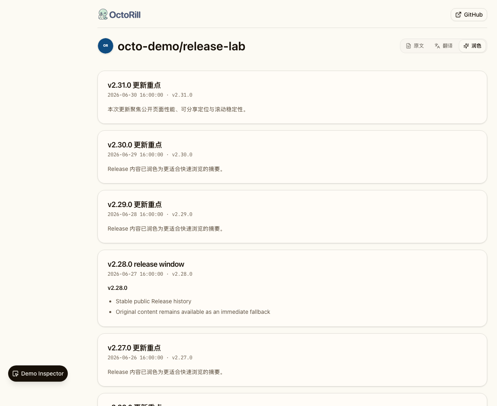

- source_type: `ui_demo`
  target_program: `mock-only`
  capture_scope: `browser-viewport`
  requested_viewport: `390x844`
  captured_viewport: `390x844`
  viewport_strategy: `browser-viewport-override`
  sensitive_exclusion: `N/A`
  submission_gate: `pending-owner-approval`
  story_id_or_title: `public-release-highlight-range`
  state: `public-release-header-layout-mobile`
  evidence_note: 验证 28px 顶栏字标、owner/avatar 加仓库名和标题下方整块换行的页面级 lane selector 与内容简化后的 Release 卡片能在移动端共存，且无横向溢出。
  image:
  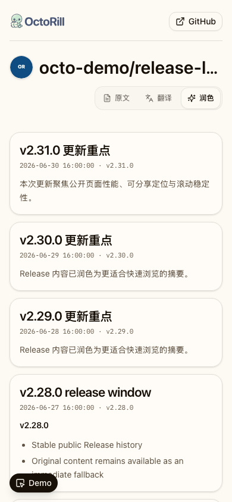

- source_type: `ui_demo`
  target_program: `mock-only`
  capture_scope: `browser-viewport`
  requested_viewport: `1440x1000`
  captured_viewport: `1440x1000`
  viewport_strategy: `browser-viewport-override`
  sensitive_exclusion: `N/A`
  submission_gate: `pending-owner-approval`
  story_id_or_title: `public-release-highlight-discrete` with `d_persona=member`
  state: `public-release-reactions-enabled-desktop`
  evidence_note: 验证已认证且 PAT 有效的 member 场景会在每张 Release 卡片底部显示 6 个表情反应；标题带仍保持唯一仓库身份和页面级 lane，桌面端无横向溢出。
  image:
  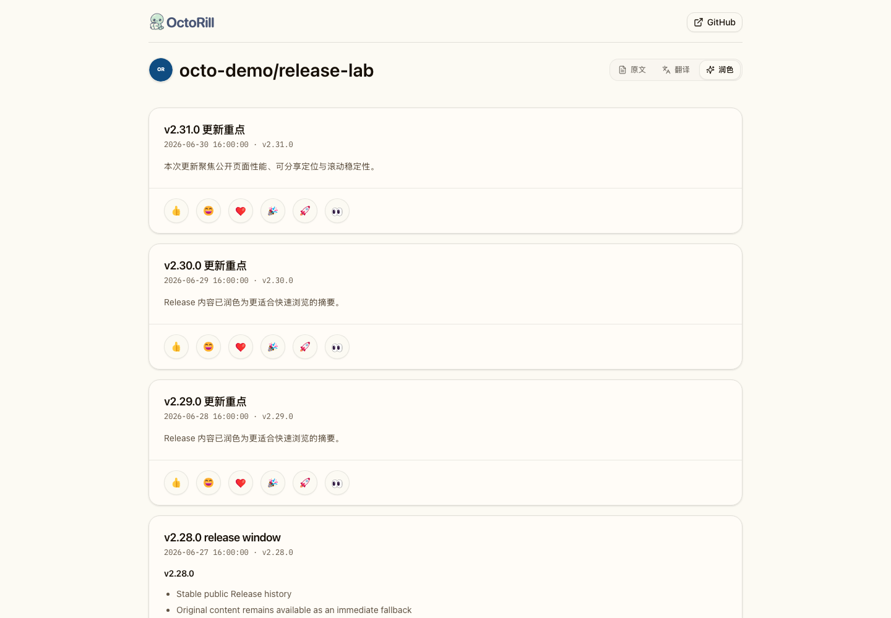

- source_type: `ui_demo`
  target_program: `mock-only`
  capture_scope: `browser-viewport`
  requested_viewport: `390x844`
  captured_viewport: `390x844`
  viewport_strategy: `browser-viewport-override`
  sensitive_exclusion: `N/A`
  submission_gate: `pending-owner-approval`
  story_id_or_title: `public-release-highlight-discrete` with `d_persona=member`
  state: `public-release-reactions-enabled-mobile`
  evidence_note: 验证 member 有效 PAT 场景在移动端持续显示反应，28px 字标、标题下方页面级 lane 与卡片内容无横向溢出。
  image:
  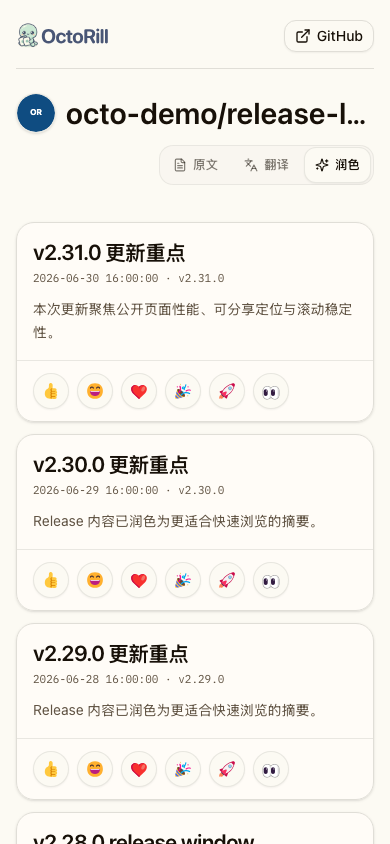

- source_type: `storybook_canvas`
  target_program: `mock-only`
  capture_scope: `browser-viewport`
  requested_viewport: `1750x1216`
  viewport_strategy: `storybook-default`
  sensitive_exclusion: `N/A`
  submission_gate: `pending-owner-approval`
  story_id_or_title: `public-publicreleasepage--release-list`
  state: `release-list-desktop`
  evidence_note: 验证无高亮参数时普通 Release 卡片保持原有页面样式，首屏按时间倒序展示多条记录，没有额外的高亮包装样式。
  image:
  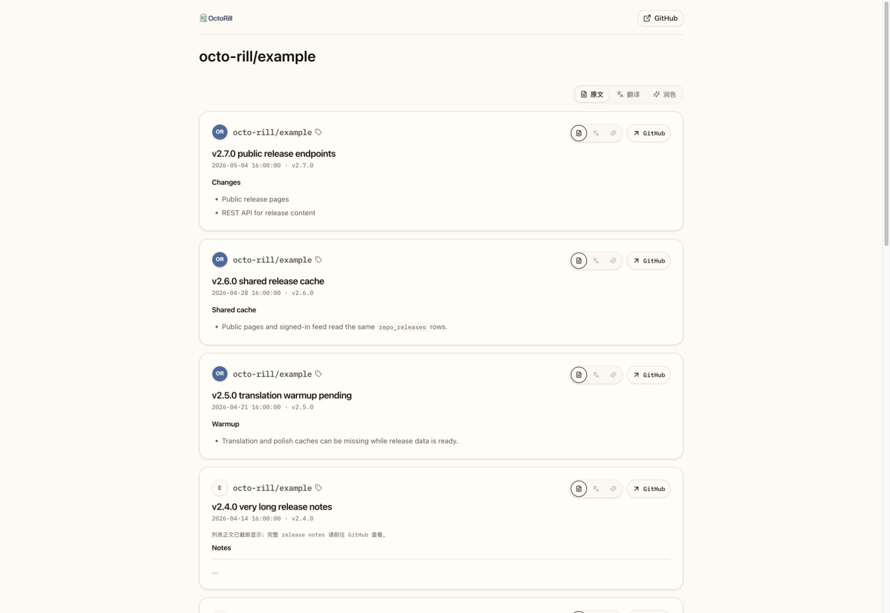

- source_type: `storybook_canvas`
  target_program: `mock-only`
  capture_scope: `browser-viewport`
  requested_viewport: `1440x1000`
  viewport_strategy: `browser-resize-fallback`
  sensitive_exclusion: `N/A`
  submission_gate: `approved`
  story_id_or_title: `public-publicreleasepage--discrete-highlight`
  state: `discrete-highlight-desktop`
  evidence_note: 验证 URL 中三个 tag/ID 混合离散目标由同一个列表请求返回并同时进入视口；active 目标使用最强的轮廓与阴影，高亮组保持次一级描边，其余卡片通过更弱文字层级退后，右下导航精确显示 `2 / 3`。
  image:
  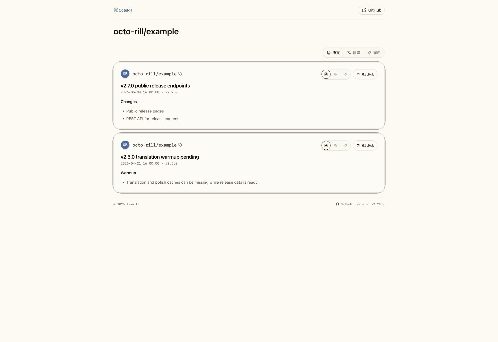

- source_type: `storybook_canvas`
  target_program: `mock-only`
  capture_scope: `browser-viewport`
  requested_viewport: `390x844`
  viewport_strategy: `browser-resize-fallback`
  sensitive_exclusion: `N/A`
  submission_gate: `approved`
  story_id_or_title: `public-publicreleasepage--small-range-highlight`
  state: `small-range-highlight-mobile`
  evidence_note: 验证短连续范围会在同一移动视口内保留多张高亮卡片；active 目标使用最强轮廓与阴影，相邻高亮卡保持次级描边，非高亮卡片文字与边界明显弱化，右下导航精确显示 `3 / 4`。
  image:
  

- source_type: `storybook_canvas`
  target_program: `mock-only`
  capture_scope: `browser-viewport`
  requested_viewport: `390x844`
  viewport_strategy: `browser-resize-fallback`
  sensitive_exclusion: `N/A`
  submission_gate: `approved`
  story_id_or_title: `public-publicreleasepage--large-range-highlight`
  state: `large-range-highlight-mobile`
  evidence_note: 验证较长连续范围保留时间线滚动上下文，active 目标按显式 selector 锁定为 `8 / 12`；当前卡片使用最强轮廓与阴影，其余非高亮记录在同一视口内仍明显降权，移动端继续保持导航和无横向溢出。
  image:
  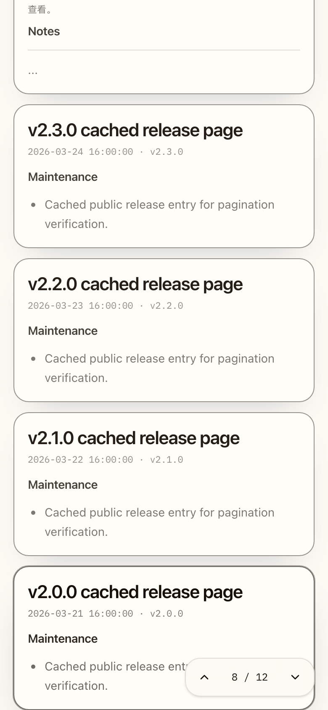

- source_type: `storybook_canvas`
  target_program: `mock-only`
  capture_scope: `browser-viewport`
  requested_viewport: `1600x1400`
  viewport_strategy: `browser-resize-fallback`
  sensitive_exclusion: `N/A`
  submission_gate: `approved`
  story_id_or_title: `public-publicreleasepage--highlight-state-gallery`
  state: `highlight-state-gallery-desktop`
  evidence_note: 作为这轮唯一新增视觉证据，直接并排展示普通态、非高亮弱化态、高亮态与当前高亮态，用同一张卡片内容校对层级是否一眼可分。
  image:
  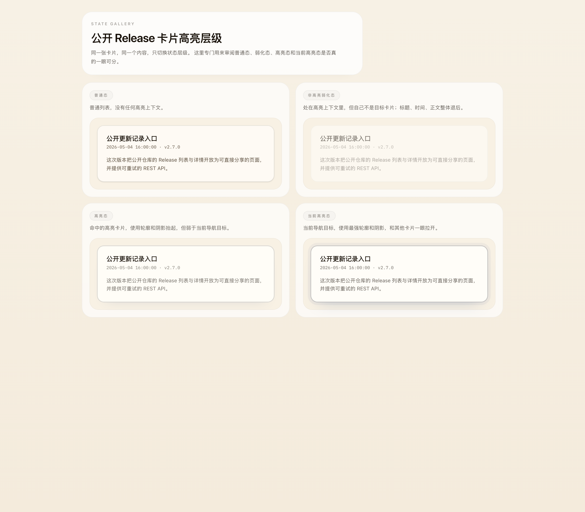

- source_type: `storybook_canvas`
  target_program: `mock-only`
  capture_scope: `browser-viewport`
  requested_viewport: `390x844`
  viewport_strategy: `browser-resize-fallback`
  sensitive_exclusion: `N/A`
  submission_gate: `approved`
  story_id_or_title: `public-publicreleasepage--partial-range-highlight`
  state: `partial-range-highlight-mobile`
  evidence_note: 验证范围端点部分解析时页面退回普通最新列表，并以状态文案明确提示未找到的目标；移动端页头、lane 与首屏列表布局保持完整。
  image:
  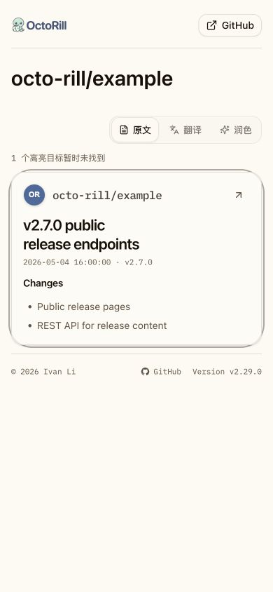

- source_type: `storybook_canvas`
  story_id_or_title: `public-publicreleasepage--pending-sync`
  state: `public-page-pending-sync-mobile`
  evidence_note: 验证 390px 移动端首次访问公开 Release 页面且仓库尚未缓存时，页面使用面向用户的中文等待文案，不暴露 API message 或 reason code；状态胶囊展示“同步排队中 · 约 60s 后重试”，并提供手动重试入口；页头 GitHub 入口使用外链图标并指向当前仓库 Releases 页面，页脚 GitHub 入口使用 GitHub 图标并指向当前仓库根路径，页脚贴在短内容页面底部。
  image:
  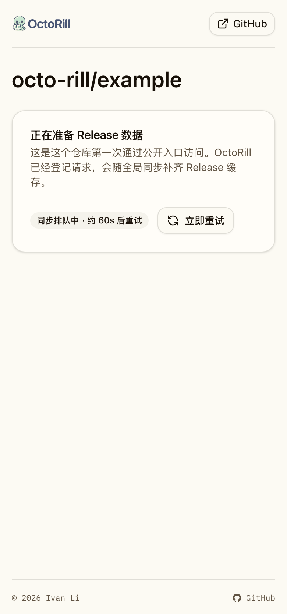

- source_type: `storybook_canvas`
  story_id_or_title: `public-publicreleasepage--owned-public-cache-ready`
  state: `public-owned-repo-cache-ready`
  evidence_note: 验证 public owned repo 在本地已具备可信公开 metadata 且共享 `repo_releases` 已缓存时，canonical `/:owner/:repo/releases` 首访直接展示 ready 列表；页面标题、卡片 repo identity 与 GitHub 跳转都指向 `IvanLi-CN/tuckmark`，且不会误落入“Release 数据同步中”等待卡。
  image:
  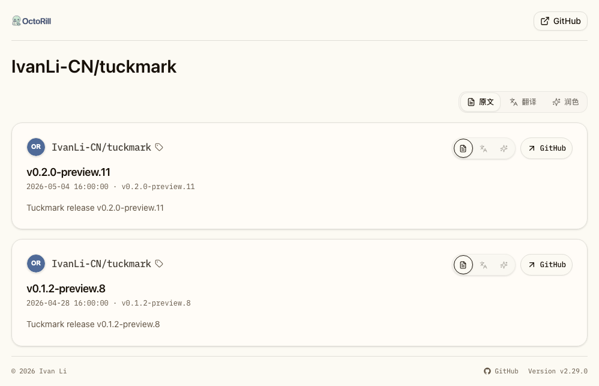

- source_type: `storybook_canvas`
  story_id_or_title: `public-publicreleasepage--release-list`
  state: `public-release-list-desktop`
  evidence_note: 验证桌面端公开列表页在标题带展示 owner/avatar、仓库名和页面级原文/翻译/润色切换器；卡片仅保留版本标题、发布时间/tag 与内容，不重复显示 repo identity、card-level lane 或 GitHub 操作。
  image:
  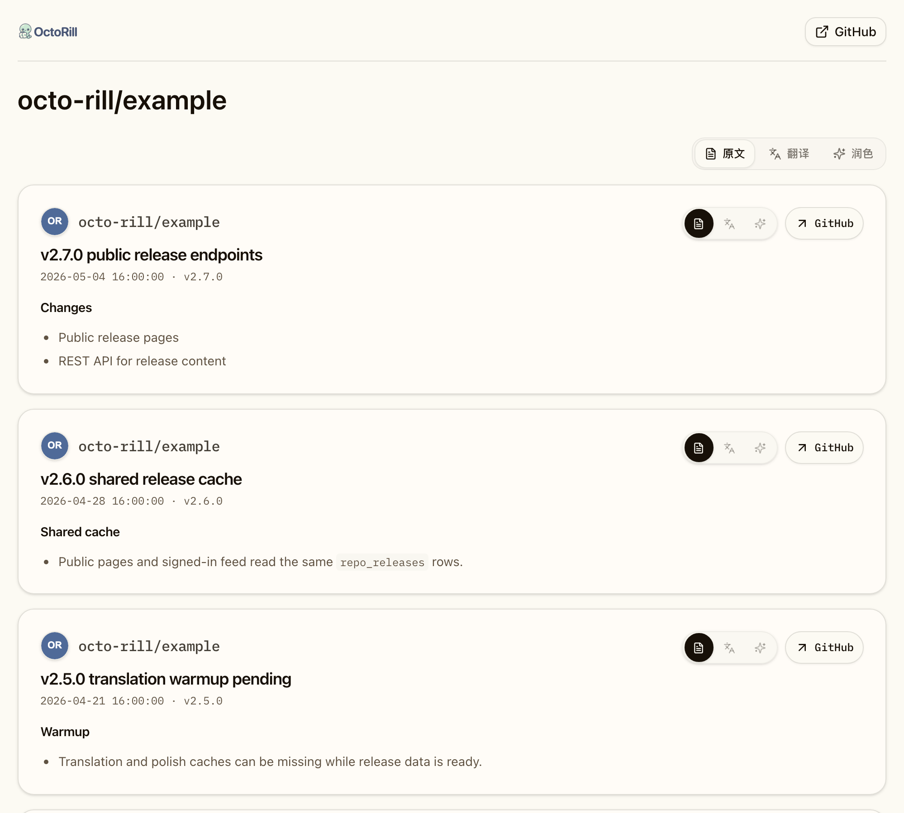

- source_type: `storybook_canvas`
  story_id_or_title: `public-publicreleasepage--release-list`
  state: `public-release-list-mobile`
  evidence_note: 验证 390px 移动端公开列表页中页面级 lane 切换器、内容简化后的 Release 卡片、正文展示和长内容继续滚动能在窄屏共存，且无横向溢出。
  image:
  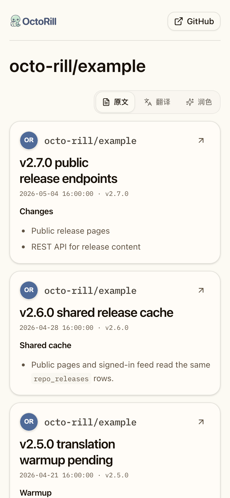

- source_type: `storybook_canvas`
  story_id_or_title: `public-publicreleasepage--long-repo-and-tag-detail`
  state: `public-release-detail-mobile-edge`
  evidence_note: 验证 390px 移动端公开详情页的最终布局：页头 LOGO 高度为 28px，右上角 GitHub 按钮使用外链图标打开仓库 Releases 页面；正文区把头像、项目名、时间/tag 作为仓库信息组，超长 repo full name 与超长 tag 单行省略，仓库名与日期行无额外垂直空隙；右侧小尺寸原文/翻译/润色选择器固定尺寸且右端对齐，短内容时页脚贴底并保留指向仓库根路径的 GitHub 入口，全页无横向溢出。
  image:
  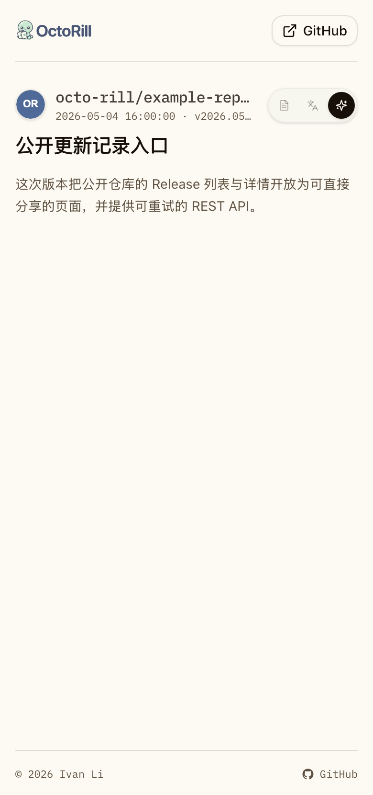

- source_type: `storybook_canvas`
  story_id_or_title: `public-publicreleasepage--long-repo-and-tag-detail`
  state: `public-release-footer-version-link-mobile`
  evidence_note: 验证 390px 移动端公开详情页的页脚在超长 repo/tag 场景下仍展示 GitHub 入口与 `Version v2.29.0`，版本号链接到 OctoRill 自身 public-only Release 详情页，且全页无横向溢出。
  image:
  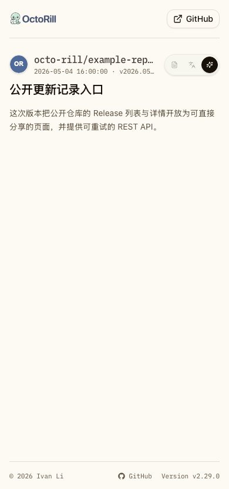

- source_type: `storybook_canvas`
  story_id_or_title: `admin-publicreleaserepomanagement--default`
  state: `admin-public-release-repos-delete-confirmation`
  evidence_note: 验证管理后台展示 ready/pending 登记仓库、API/页面访问统计、Release/翻译/润色数据量，并在删除前说明若无其他使用方会清理共享 Release 与 AI 缓存。
  image:
  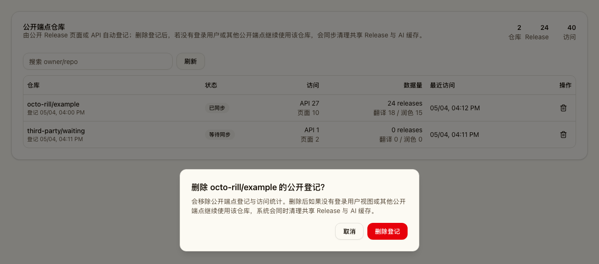

- source_type: `ui_demo`
  target_program: `mock-only`
  capture_scope: `browser-viewport`
  sensitive_exclusion: `N/A`
  submission_gate: `approved`
  route: `/public/IvanLi-CN/octo-rill/releases`
  final_url: `/IvanLi-CN/octo-rill/releases`
  viewport: `1440x1000`
  state: `legacy-public-release-route-redirect`
  evidence_note: 验证旧 `/public/:owner/:repo/releases` 列表路径不再进入前端 404，而是 replace 到 canonical `/:owner/:repo/releases` 并展示公开 Release 落地页；public-only tag 详情路由语义不受此截图覆盖，由路由测试覆盖。
  image:
  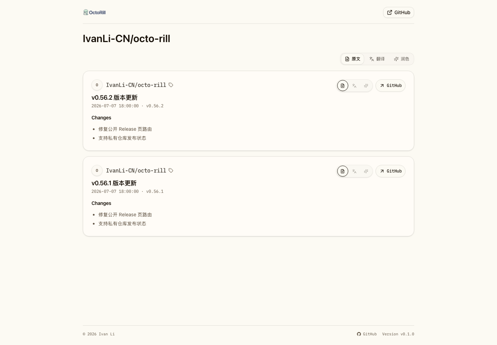
