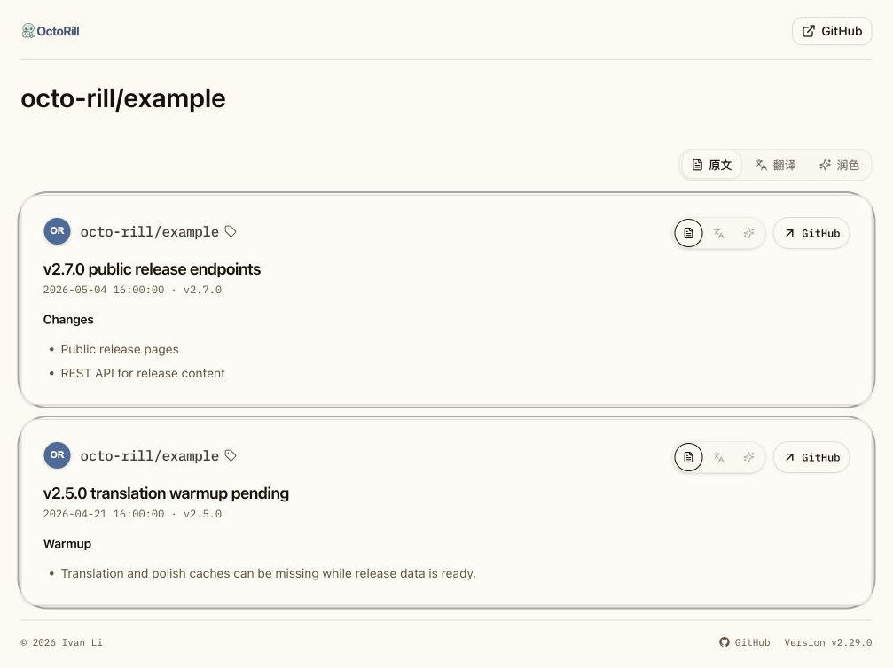
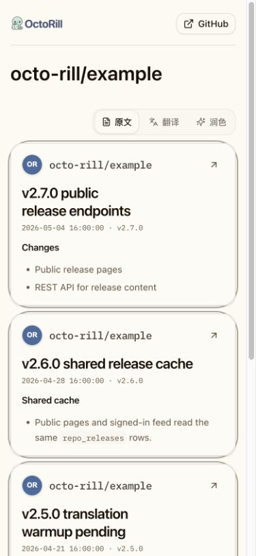
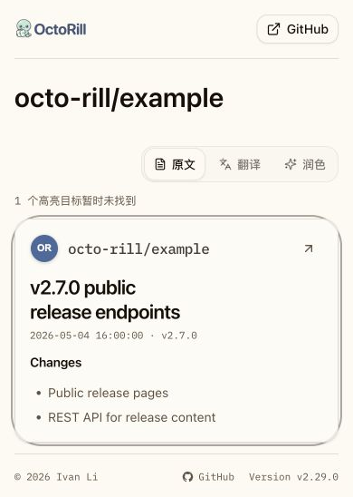

# 公开仓库 Release 外链与 API（#p8r3l）

## 背景 / 问题陈述

第三方应用需要直接链接到 OctoRill 页面查看公开仓库更新记录，也需要通过 REST API 获取指定公开仓库的 Release 列表、详情、翻译与润色内容。

## 目标 / 非目标

### Goals

- 提供未登录可访问的公开 Release 列表页与详情页。
- 提供未登录 REST API：公开仓库 Release 列表与 tag 详情。
- GitHub public repo 默认可通过 `/:owner/:repo/releases` 访问，不需要用户发布。
- 当前 GitHub viewer-owned personal private repo 可由拥有者登录后显式发布，发布后复用同一个公开 Release 落地页 `/:owner/:repo/releases`；取消发布后匿名访问不得继续暴露该私有仓库内容。
- `/public/:owner/:repo/releases` 作为旧列表路径兼容入口，必须 replace 跳转到 `/:owner/:repo/releases`。
- 公开 Release 页面页脚展示当前 OctoRill 前端加载版本，并链接到 OctoRill 自身 public-only Release 详情页，登录态不得把该链接切到 Dashboard。
- 首次访问先登记仓库 usage；若本地已有近期刷新且带真实 privacy proof 的公开仓库 metadata 与非草稿 Release 缓存，则直接复用共享缓存返回 ready；若只有近期公开 metadata 但尚无 Release 缓存，则回填 `repo_id` 并返回可重试 pending 响应；若本地无法确认近期公开 metadata，则返回 metadata pending。
- 公开端点与登录用户视图复用同一份仓库级 `repo_releases` 主数据。
- 公开列表页支持以 GitHub Release 全局 `release_id` 构造深链高亮：`highlight_ids` 用于离散记录，`highlight_start` 与 `highlight_end` 用于当前时间倒序列表中的闭区间；两种模式互斥，解析、去重、长度上限和缺失目标由后端负责。
- 高亮请求由后端直接返回目标数据窗口：离散目标最多 32 个，范围首载最多 12 条；范围窗口使用 `repo_releases` 排序索引 seek，并通过 opaque `next_cursor` / `previous_cursor` 支持 older/newer 方向，前端不得从第一页逐页探测目标。
- 页面收到高亮窗口后自动定位：目标整体可放入视口时居中；否则在范围第一条顶部对齐和最后一条底部对齐之间选择滚动距离较近的一侧；后续追加或前置数据继续沿用同一高亮上下文，并维持锚点位置。
- 管理后台展示公开端点登记仓库、访问统计、同步状态、共享缓存数据量，并允许删除登记记录。

### Non-goals

- 不为首次访问做请求内 GitHub 拉取。
- 不开放未由拥有者显式发布的私有仓库或用户私有 viewer 状态。
- 不开放组织私有仓库发布。
- 不新增 `/repo/:owner/:repo`。
- 不复制 Release 主数据到 public-only 表。
- 删除公开登记记录时不清理仍被登录用户视图或其他公开登记使用的共享缓存。
- 不新增除 `zh-CN` 以外的翻译语言。

## 接口契约

- `GET /api/public/repos/{owner}/{repo}/releases`
  - Query: `content=original|translated|polished|all`, `lang=zh-CN`, optional `source=page`, `limit`, `cursor`, `direction=older|newer`
  - 高亮 Query 二选一：`highlight_ids=<id1>,<id2>`，或 `highlight_start=<id>&highlight_end=<id>`；`release_id` 是 GitHub Release 全局 ID。
  - `highlight_ids` 与范围参数互斥；离散 ID 去重后最多 32 个，范围窗口最多返回 12 条。非法组合、非正整数和超限请求由后端返回 `400`。
  - `200`: 返回共享缓存列表；带高亮时响应包含 `highlight` 解析元数据，且每个列表项包含 `is_highlighted`。
  - `202`: 返回 `status=pending_sync`、`reason`、`retry_after_seconds`，并设置 `Retry-After`。
  - `400 unsupported_language`: 非 `zh-CN` 语言。

- `GET /api/public/repos/{owner}/{repo}/releases/tag/{tag}`
  - Query 同列表接口。
  - `200`: 返回共享缓存详情。
  - `202`: 仓库登记或同步尚未完成。
  - `404 release_not_found_or_not_cached`: 仓库已有同步结果但指定 tag 未命中。

- `GET /api/repos/{owner}/{repo}/public-release`
  - 登录会话 required。
  - 返回当前仓库公开 Release 页状态、canonical `public_path`、是否可发布/取消发布。
  - GitHub public repo 返回 `publication_state=github_public`；viewer-owned private repo 未发布返回 `private_owner_unpublished`。

- `POST /api/repos/{owner}/{repo}/public-release`
  - 登录会话 required。
  - 仅允许当前 viewer-owned personal private repo。
  - 创建或更新 `private_owner_published` usage，并按需触发 Release 同步。

- `DELETE /api/repos/{owner}/{repo}/public-release`
  - 登录会话 required。
  - 仅允许当前 viewer-owned personal private repo。
  - 删除 `private_owner_published` usage；共享缓存只在无其他公开 usage、登录用户可见性或 brief 引用时清理。

- `GET /api/admin/public-release-repos`
  - 管理员会话 required。
  - 返回登记仓库、访问计数、同步状态、release 数量、翻译/润色 ready/missing 数量。

- `DELETE /api/admin/public-release-repos/{usage_id}`
  - 管理员会话 required。
  - 删除登记记录与统计。
  - 若该 `repo_id` 不再被其他公开登记或登录用户 release 可见性使用，同步清理对应 `repo_releases` 与 release AI 缓存，并在响应中返回 `cache_cleanup`。

## 数据契约

- `public_repo_release_usage` 只保存登记、统计、`repo_id` 映射、同步状态和错误，并通过 `access_kind` 区分 `github_public` 与 `private_owner_published`。
- `private_owner_published` usage 必须记录发布者与发布时间；匿名公开 API 只有在该 usage 存在且未撤销时才可读取私有 repo 的共享 `repo_releases`。
- Release 主数据只写入并读取 `repo_releases`。
- `release_id` 直接复用 `repo_releases.release_id`，高亮响应包含 `requested_ids`、`resolved_ids`、`unresolved_ids`；范围响应额外包含 `start_id` 与 `end_id`。
- 普通列表响应保持首载 6 条和既有 older cursor 语义；高亮范围响应可用 `next_cursor` 加载更旧窗口、用 `previous_cursor` 加载更新窗口，且每次响应继续返回同一高亮元数据与项目标记。
- 全局 `sync.subscriptions` 将已登记公开仓库纳入现有 repo release queue；没有用户 token 候选时可对公开仓库使用匿名 GitHub REST fallback。

## 验收标准

- Given 未登录用户首次访问公开列表页
  When 仓库尚未缓存
  Then 页面展示等待同步状态并自动重试。

- Given 未登录用户访问 GitHub public repo 的 `/:owner/:repo/releases`
  When 该 repo 尚未由任何用户手动发布
  Then 仍按公开仓库默认流程登记 usage，并返回 ready 或可重试 pending。

- Given 未登录用户访问未发布的 private owner repo `/:owner/:repo/releases`
  When 服务端无法找到有效 `private_owner_published` usage
  Then 不得返回该私有仓库 Release 内容。

- Given private owner repo 已发布
  When 未登录用户访问 `/:owner/:repo/releases`
  Then 可读取同一份共享 `repo_releases` 列表或 pending sync 状态。

- Given private owner repo 取消发布
  When 未登录用户再次访问 `/:owner/:repo/releases`
  Then 不再暴露该私有仓库内容。

- Given 用户访问 `/public/:owner/:repo/releases`
  When 前端路由加载
  Then replace 跳转到 `/:owner/:repo/releases`；`/public/:owner/:repo/releases/tag/:tag` 详情路径不被该跳转拦截。

- Given 未登录用户在移动端访问公开 Release 列表或详情页
  When 页脚可见
  Then 页脚展示 `Version <loadedVersion>`，有效版本号链接到 `/public/IvanLi-CN/octo-rill/releases/tag/<loadedVersion>`，且页面无横向溢出。

- Given 已登录用户点击页脚版本号
  When 跳转到 OctoRill 自身 Release 详情
  Then 页面必须使用 public-only URL 与公开 REST API，不进入 Dashboard release detail。

- Given 第三方调用公开 API 且仓库尚未缓存
  When 请求到达服务端
  Then 响应为 `202 Accepted`，包含 `Retry-After` 与 pending JSON。

- Given 第三方首次调用公开 API 且本地已有近期可信公开仓库 metadata 与共享 Release 缓存
  When 请求到达服务端
  Then 响应为 `200 OK`，并将公开 usage 回填到已知 `repo_id`。

- Given 公开仓库同步完成
  When 未登录页面/API 与登录用户视图读取同一 Release
  Then 内容来自同一条 `repo_releases.release_id` 记录。

- Given 用户打开带 `highlight_ids` 的公开 Release URL
  When 目标记录部分存在或部分缺失
  Then 后端一次返回已解析目标、`unresolved_ids` 与 `is_highlighted` 标记，前端不得继续遍历普通分页寻找目标。

- Given 用户打开带 `highlight_start` 与 `highlight_end` 的公开 Release URL
  When 两端存在且范围超过窗口上限
  Then 返回按当前时间倒序排列的连续窗口，包含首端；后续 cursor 请求继续在同一闭区间内返回连续数据并保持高亮。

- Given 高亮窗口已经渲染
  When 目标整体能放入视口
  Then 页面尽量居中展示目标；否则比较范围第一条顶部对齐与最后一条底部对齐的滚动距离，选择较近的一侧。

- Given 高亮窗口发生 older 追加或 newer 前置
  When DOM 增量更新完成
  Then 高亮上下文不丢失，前置数据通过锚点补偿避免当前视口跳动，移动端没有横向溢出。

- Given 管理员删除公开登记记录
  When 下一轮全局同步运行
  Then 该仓库不再因公开 usage 被纳入同步；若无其他公开登记或登录用户视图使用，则共享 Release 与 AI 缓存被清理，否则缓存保留。

## Visual Evidence

本功能的视觉证据只覆盖用户和管理员能看见的界面状态：首次访问等待、公开列表桌面端、公开列表移动端、公开详情移动端极端文本、管理后台登记与删除确认。REST API 的状态码、`Retry-After`、缓存复用和清理策略由自动化测试覆盖，不纳入截图证据。

- source_type: `storybook_canvas`
  target_program: `mock-only`
  capture_scope: `browser-viewport`
  requested_viewport: `1765x1216`
  viewport_strategy: `storybook-viewport`
  sensitive_exclusion: `N/A`
  submission_gate: `pending-owner-approval`
  story_id_or_title: `public-publicreleasepage--discrete-highlight`
  state: `discrete-highlight-desktop`
  evidence_note: 验证服务端返回的两个离散目标在公开 Release 列表中同时高亮，并在首次载入后处于同一视口范围内；页面仍保留仓库头部、内容 lane、Release 卡片和页脚。
  image:
  

- source_type: `storybook_canvas`
  target_program: `mock-only`
  capture_scope: `browser-viewport`
  requested_viewport: `390x844`
  viewport_strategy: `devtools-emulate`
  sensitive_exclusion: `N/A`
  submission_gate: `pending-owner-approval`
  story_id_or_title: `public-publicreleasepage--small-range-highlight`
  state: `small-range-highlight-mobile`
  evidence_note: 验证 390px 移动端连续范围的多条 Release 保持倒序排列并持续高亮，页面级 lane 切换器与卡片内容共存且没有横向溢出。
  image:
  

- source_type: `storybook_canvas`
  target_program: `mock-only`
  capture_scope: `browser-viewport`
  requested_viewport: `390x844`
  viewport_strategy: `devtools-emulate`
  sensitive_exclusion: `N/A`
  submission_gate: `pending-owner-approval`
  story_id_or_title: `public-publicreleasepage--partial-range-highlight`
  state: `partial-range-highlight-mobile`
  evidence_note: 验证范围端点部分解析时页面显示已找到的 Release、保留高亮边框，并以状态文案明确提示未找到的目标；页脚与窄屏布局仍完整可见。
  image:
  

- source_type: `storybook_canvas`
  story_id_or_title: `public-publicreleasepage--pending-sync`
  state: `public-page-pending-sync-mobile`
  evidence_note: 验证 390px 移动端首次访问公开 Release 页面且仓库尚未缓存时，页面使用面向用户的中文等待文案，不暴露 API message 或 reason code；状态胶囊展示“同步排队中 · 约 60s 后重试”，并提供手动重试入口；页头 GitHub 入口使用外链图标并指向当前仓库 Releases 页面，页脚 GitHub 入口使用 GitHub 图标并指向当前仓库根路径，页脚贴在短内容页面底部。
  PR: include
  image:
  

- source_type: `storybook_canvas`
  story_id_or_title: `public-publicreleasepage--owned-public-cache-ready`
  state: `public-owned-repo-cache-ready`
  evidence_note: 验证 public owned repo 在本地已具备可信公开 metadata 且共享 `repo_releases` 已缓存时，canonical `/:owner/:repo/releases` 首访直接展示 ready 列表；页面标题、卡片 repo identity 与 GitHub 跳转都指向 `IvanLi-CN/tuckmark`，且不会误落入“Release 数据同步中”等待卡。
  image:
  

- source_type: `storybook_canvas`
  story_id_or_title: `public-publicreleasepage--release-list`
  state: `public-release-list-desktop`
  evidence_note: 验证桌面端公开列表页展示仓库名、页面级原文/翻译/润色切换器和复用普通 Release 卡片的列表内容；卡片保留 repo identity、标题、发布时间/tag、卡片内部内容 lane 与 GitHub Release 链接，不显示不可靠 release 总数或解释性噪音。
  PR: include
  image:
  

- source_type: `storybook_canvas`
  story_id_or_title: `public-publicreleasepage--release-list`
  state: `public-release-list-mobile`
  evidence_note: 验证 390px 移动端公开列表页中页面级 lane 切换器、普通 Release 卡片、移动端 GitHub icon 链接、正文展示和长内容继续滚动能在窄屏共存，且无横向溢出。
  image:
  

- source_type: `storybook_canvas`
  story_id_or_title: `public-publicreleasepage--long-repo-and-tag-detail`
  state: `public-release-detail-mobile-edge`
  evidence_note: 验证 390px 移动端公开详情页的最终布局：页头 LOGO 高度为 24px，右上角 GitHub 按钮使用外链图标打开仓库 Releases 页面；正文区把头像、项目名、时间/tag 作为仓库信息组，超长 repo full name 与超长 tag 单行省略，仓库名与日期行无额外垂直空隙；右侧小尺寸原文/翻译/润色选择器固定尺寸且右端对齐，短内容时页脚贴底并保留指向仓库根路径的 GitHub 入口，全页无横向溢出。
  image:
  

- source_type: `storybook_canvas`
  story_id_or_title: `public-publicreleasepage--long-repo-and-tag-detail`
  state: `public-release-footer-version-link-mobile`
  evidence_note: 验证 390px 移动端公开详情页的页脚在超长 repo/tag 场景下仍展示 GitHub 入口与 `Version v2.29.0`，版本号链接到 OctoRill 自身 public-only Release 详情页，且全页无横向溢出。
  image:
  

- source_type: `storybook_canvas`
  story_id_or_title: `admin-publicreleaserepomanagement--default`
  state: `admin-public-release-repos-delete-confirmation`
  evidence_note: 验证管理后台展示 ready/pending 登记仓库、API/页面访问统计、Release/翻译/润色数据量，并在删除前说明若无其他使用方会清理共享 Release 与 AI 缓存。
  PR: include
  image:
  

- source_type: `ui_demo`
  target_program: `mock-only`
  capture_scope: `browser-viewport`
  sensitive_exclusion: `N/A`
  submission_gate: `approved`
  route: `/public/IvanLi-CN/octo-rill/releases`
  final_url: `/IvanLi-CN/octo-rill/releases`
  viewport: `1440x1000`
  state: `legacy-public-release-route-redirect`
  evidence_note: 验证旧 `/public/:owner/:repo/releases` 列表路径不再进入前端 404，而是 replace 到 canonical `/:owner/:repo/releases` 并展示公开 Release 落地页；public-only tag 详情路由语义不受此截图覆盖，由路由测试覆盖。
  PR: include
  image:
  
