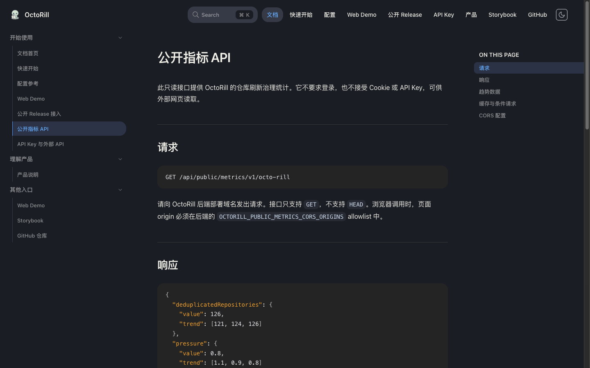
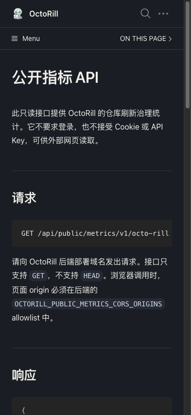

# 公开指标 API

## 背景 / 问题陈述

外部客户端需要读取 OctoRill 中可公开展示的仓库刷新治理指标。现有管理 API 需要登录，且会携带更宽的内部管理读模型，不适合作为匿名数据源。趋势历史会在服务上线后逐步形成，因此冷启动不能等待完整历史。

## 目标 / 非目标

### Goals

- 提供独立、无登录、只读的 `GET /api/public/metrics/v1/octo-rill`。
- 响应顶层字段严格限制为 `deduplicatedRepositories`、`pressure`、`freshness`。
- 当前值必须从真实治理快照和 runtime budget 计算；新部署第一次成功聚合即可提供数据。
- 趋势按真实 UTC 小时样本累积；历史不足时返回已有点，不补零、不插值、不阻止当前值返回。
- 将匿名接口的 CORS origin 与既有 credential CORS 隔离，并支持显式 allowlist 配置。
- 为请求限流、重复刷新合并、缓存、条件请求和刷新失败时的 last-known-good 回退提供确定合同。

### Non-goals

- 不公开仓库名称、仓库 ID、用户信息、token、任务信息或管理明细。
- 不请求 GitHub，也不触发 repo refresh 治理重建。
- 不提供写操作、登录态能力或可配置任意查询维度。
- 不承诺首发即有 12 个趋势点；不合成缺失时间桶。

## Requirements

- REQ-PUBLIC-METRICS-001: 未登录 `GET /api/public/metrics/v1/octo-rill` 必须返回只包含 `deduplicatedRepositories`、`pressure`、`freshness` 的 JSON。其他顶层字段不得出现在响应中。
- REQ-PUBLIC-METRICS-002: `deduplicatedRepositories.value` 必须等于 `repo_refresh_governance_snapshots` 当前行数。`pressure.value` 必须沿用治理页口径 `sum(max(0, min(urgency_score, 4) - 1)) / repo_refresh_system_budget_per_window`。预算不可用或源数据无效时不得伪造成功值。
- REQ-PUBLIC-METRICS-003: `freshness` 必须按 `priority_rank ASC, repo_id ASC` 排列；每项仅为 0 到 4 的 JSON 整数，分别表示不超过 4 小时、不超过 12 小时、不超过 24 小时、超过 24 小时和无成功记录。
- REQ-PUBLIC-METRICS-004: 第一次成功实时聚合必须立即返回当前值并写入一个真实趋势点。每个 UTC 小时最多保留一个最新观测值；趋势最多返回 12 点，按时间升序排列。历史不足 12 点时必须返回当前真实点及已有历史点，点数可以少于 12；不得补零、插值或阻塞响应等待样本增长。样本表最多保留 24 小时。
- REQ-PUBLIC-METRICS-005: 5 分钟缓存内复用序列化响应和 ETag；同一进程的并发过期请求只执行一次刷新。刷新预算最多 3 秒。刷新失败时返回过期 last-known-good 数据；首次刷新失败时返回 HTTP 503、`{"error":"metrics_unavailable"}`、`Retry-After: 5` 与 `Cache-Control: no-store`。
- REQ-PUBLIC-METRICS-006: 支持强 ETag 与 `If-None-Match` 的 304 响应。正常响应的 HTTP 缓存策略允许 60 秒新鲜缓存与 300 秒 stale-while-revalidate。
- REQ-PUBLIC-METRICS-007: 路由只接受 GET；HEAD 显式返回 405。匿名路由不得经过 session cookie middleware 或返回凭据，并按源 IP 限制每分钟 120 次。
- REQ-PUBLIC-METRICS-008: 新接口 CORS 只允许 `GET` 与 `If-None-Match`，不允许 credentials；origin 来自 `OCTORILL_PUBLIC_METRICS_CORS_ORIGINS`，默认 `https://ivanli.cc,http://127.0.0.1:12620`。该策略不得放宽既有登录接口 CORS。

## Verification

- VER-PUBLIC-METRICS-PAYLOAD: covers: REQ-PUBLIC-METRICS-001, REQ-PUBLIC-METRICS-002, REQ-PUBLIC-METRICS-003. 验证允许字段、当前值、压力计算、优先级顺序及 freshness 数值合同。
- VER-PUBLIC-METRICS-PARTIAL-TREND: covers: REQ-PUBLIC-METRICS-004. 验证冷启动立即产生一个真实点、已有 12 点按时间升序返回、少量历史时返回已有点而不填充缺失小时，且未来样本不进入窗口。
- VER-PUBLIC-METRICS-CACHE: covers: REQ-PUBLIC-METRICS-005, REQ-PUBLIC-METRICS-006. 验证缓存复用、last-known-good 回退、ETag/304 和刷新失败无缓存响应。
- VER-PUBLIC-METRICS-ROUTE: covers: REQ-PUBLIC-METRICS-007, REQ-PUBLIC-METRICS-008. 验证 GET-only、限流、CORS allowlist、无 credentials 及配置默认值。

## Interfaces & Contracts

| Interface | Kind | Scope | Change | Contract | Owner | Consumers |
| --- | --- | --- | --- | --- | --- | --- |
| `/api/public/metrics/v1/octo-rill` | HTTP API | external | Add | 无登录 JSON 汇总；仅返回三个字段；趋势接受不完整历史 | backend | 外部网页 |
| `OCTORILL_PUBLIC_METRICS_CORS_ORIGINS` | environment variable | deployment | Add | 逗号分隔的裸 HTTP(S) origin；独立匿名 API CORS allowlist | backend ops | deployment |
| `public_metrics_hourly_snapshots` | SQLite table | internal | Add | 仅保留汇总样本，按 UTC 小时 upsert，保留 24 小时 | backend | public runtime API |

## Related ADRs

None

## Acceptance Criteria

- Given 全新数据库在首次启动后完成一次统计读取
  When 外部客户端立即调用接口
  Then 接口返回真实当前 `value` 和一个真实趋势点，无须等待 12 小时。
- Given 最近只有 3 个实际小时样本
  When 外部客户端读取接口
  Then `trend` 只包含当前真实点与实际历史点并按时间升序排列，不含合成数据。
- Given 一小时内发生多次聚合
  When 外部客户端读取趋势
  Then 当前小时仅保留最近成功观测值。
- Given 刷新源暂时失败且已有 last-known-good 响应
  When 外部客户端读取接口
  Then 服务返回旧的完整快照，不将字段重置成零值。
- Given 请求未携带登录 cookie
  When 命中公开指标接口
  Then 返回公开汇总；允许 origin 收到无 credential CORS 响应，未允许 origin 不获得 CORS 授权头。

## Visual Evidence

- Source: Rspress local preview at `/public-metrics-api.html`, captured in Ego Browser.
- Desktop (`1440x900`): public metrics page and endpoint are visible without page-level horizontal overflow.
- Mobile (`393x852`): content wraps within the viewport; the long code sample scrolls within its code block.

