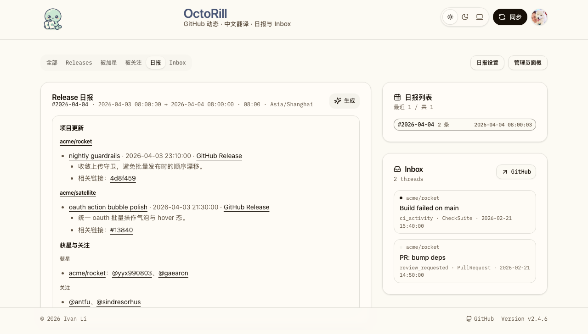
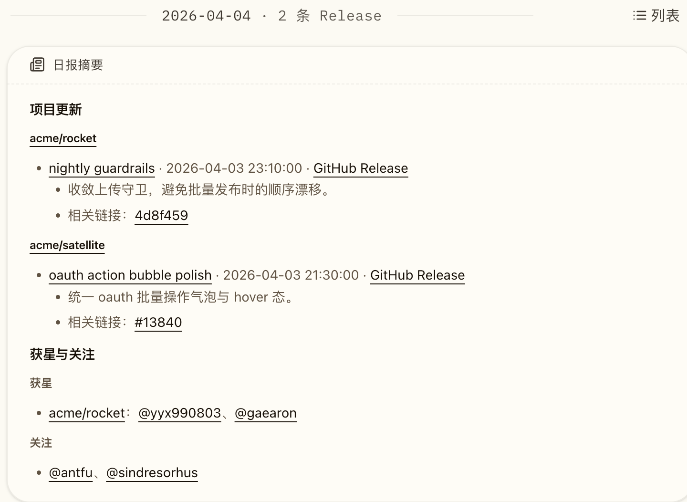
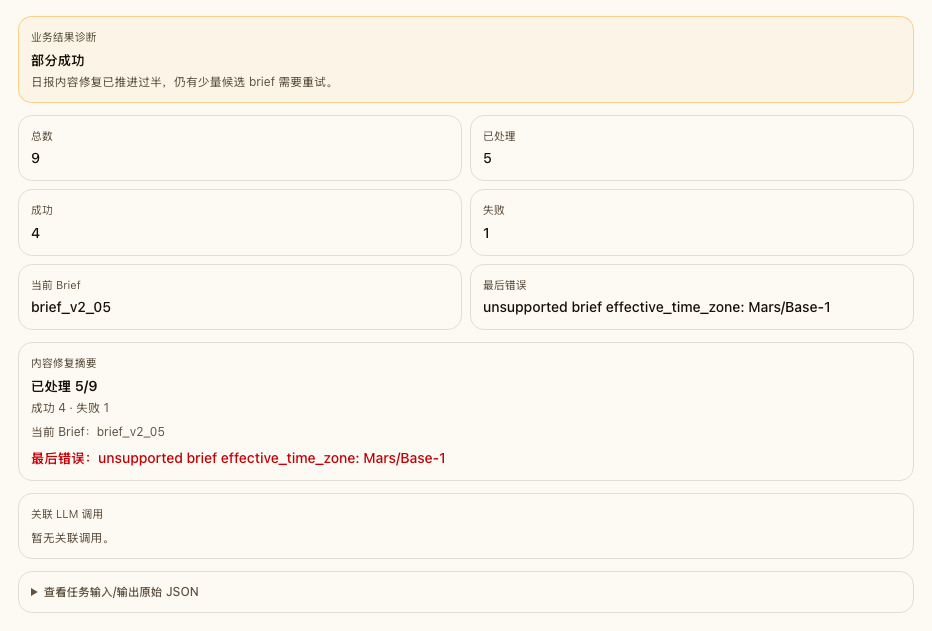

# Release 日报内容格式 V2 与历史快照修复（#qvfxq）

## 状态

- Status: 已完成
- Created: 2026-04-16
- Last: 2026-04-19

## 背景 / 问题陈述

- 当前 Release 日报正文仍以 `## 概览` 开头，并把时间窗口、项目数、预发布数等元数据直接堆进正文，导致内容主体被稀释。
- 部分已生成日报被整篇 ` ```markdown ` 代码块包裹，前台会把整段正文渲染成错误的代码块样式。
- 相关链接目前直接展示完整 GitHub URL，正文过长且可读性差。
- 现有日报只覆盖 Release，没有把同一时间窗口内的“仓库获星”和“账号被关注”纳入日报摘要。
- 现有快照去重逻辑在命中同一窗口的已标准化 brief 时直接复用旧行，导致旧格式快照无法原位刷新。

## 目标 / 非目标

### Goals

- 把日报正文收敛为内容本体：移除 `## 概览` 与正文中的时间窗口，只保留 `## 项目更新` 与 `## 获星与关注` 两个稳定章节。
- 在同一窗口内同时汇总 Release、仓库获星与账号被关注，并采用紧凑摘要而不是完整社交卡片复刻。
- 彻底消灭整篇日报被单层 markdown fence 包裹的落库结果，同时保留合法嵌套代码块。
- 将 related links 收敛成 GitHub-aware 最短标签：PR / Issue 用 `#123`，commit 用短 SHA，其它 GitHub 链接用紧凑 fallback。
- 为已存在的标准化 brief 提供原位刷新路径，并补一条历史内容修复任务，批量更新旧格式 / fenced-format 快照。
- 同步更新 Storybook、测试、产品文档与视觉证据。

### Non-goals

- 不改 Brief 卡头已经展示的日期、窗口、边界与时区文案。
- 不改 Dashboard 布局、Release 详情弹窗或 Feed 社交卡片视觉样式。
- 不把日报扩展成完整时间线流水账；社交信息只输出紧凑摘要。
- 不在本轮引入新的人工编辑后台或额外的运营 UI。

## 范围（Scope）

### In scope

- `src/ai.rs`
- `src/jobs.rs`
- `src/api.rs`
- `docs/product.md`
- `web/src/stories/Dashboard.stories.tsx`
- `web/e2e/release-detail.spec.ts`
- `web/src/admin/TaskTypeDetailSection.tsx`
- `web/src/stories/TaskTypeDetailSection.stories.tsx`
- `docs/specs/README.md`

### Out of scope

- Dashboard `日报` tab 卡头与右侧列表布局
- Feed 社交卡片组件与 Dashboard 信息架构
- 非日报用途的 Markdown 渲染规则

## 需求（Requirements）

### MUST

- 新生成 brief 正文不得再包含 `## 概览`、`时间窗口（本地）` 或等价概览文案。
- brief 正文必须稳定包含 `## 项目更新` 与 `## 获星与关注` 两个章节；任一类数据为空时也要输出对应空态。
- `## 项目更新` 继续按仓库分组，保留 release 主链接 `/?tab=briefs&release=<release_id>` 与 GitHub Release 外链。
- `## 项目更新` 中的仓库标题必须保持 `### [owner/repo](...)`；每条 release 必须保持顶层 `- [title](/?tab=briefs&release=...)`；release 详情只能由连续的 `  - ...` 子 bullet 组成。
- `## 获星与关注` 必须覆盖同一窗口内的 `repo_star_received` 与 `follower_received` 事件，并按最新事件倒序展示紧凑摘要。
- related links 不得再直出完整 GitHub URL；PR / Issue 显示 `#编号`，commit 显示短 SHA。
- 润色后的日报若被单层 markdown fence 包裹，落库前必须剥离该外层 fence。
- 润色结果若把 release 子 bullet 改写成段落、硬换行文本、双空行或其它非 canonical 结构，必须拒绝并回退到 deterministic markdown。
- 已存在的标准化 brief 命中同一窗口时，重新生成必须更新原有行，而不是直接 no-op 复用旧内容。
- 历史修复任务必须能够扫描并刷新命中旧格式签名的可重建 brief。

### SHOULD

- 社交摘要中的 actor 文本默认使用 `@login`，并尽量以内联链接方式保持篇幅紧凑。
- 获星摘要优先按仓库聚合，避免同一仓库在同一日报中出现多段冗余文案。
- 历史修复任务应与既有 legacy 重算语义并存，避免重复处理无法重建窗口的旧 brief。

### COULD

- 当同一仓库获星用户较多时，用“等 N 人”方式压缩尾部展示。

## 功能与行为规格（Functional/Behavior Spec）

### Core flows

- 用户手动生成日报或定时任务生成日报时，服务端会按同一窗口查询 Release 与 social activity，并输出 V2 markdown 结构。
- 若同一窗口已经存在标准化 brief，新的生成结果会原位更新该行的 markdown、memberships 与 `updated_at`，同时保留原 `brief_id` 与 `created_at`。
- 服务端启动后，既有 legacy history recompute 继续只处理 `generation_source=legacy/history_recompute_failed` 的快照；新增的内容刷新任务只处理已有窗口信息的过期 brief。
- 历史内容刷新任务命中旧签名（例如含 `## 概览`、缺少 `## 获星与关注`、正文被整篇 markdown fence 包裹、或 V2 章节齐全但 release 正文层级漂移）时，会按存量窗口重建 V2 内容并原位覆盖。
- `build_brief_markdown()` 生成的 canonical markdown 是唯一结构基线；LLM 润色只能改写既有 bullet 文案，不能改变 repo / release / 子 bullet 层级或主动新增空行。
- 前台 Storybook / E2E 读取新的 brief markdown 后，只看到 `## 项目更新` 与 `## 获星与关注`，不再在正文里出现时间窗口行。

### Edge cases / errors

- 当窗口内没有任何 Release 时，`## 项目更新` 仍需输出“本时间窗口内没有新的 Release。”。
- 当窗口内没有任何获星 / 关注时，`## 获星与关注` 仍需输出“本时间窗口内没有新的获星或关注动态。”。
- 当 LLM 润色结果缺少必需章节、丢失内部 release 链接、打乱 release 顺序、把子 bullet 改成段落/硬换行文本，或产出空白内容时，必须回退到 deterministic markdown。
- legacy brief 若既没有存储窗口也无法从正文解析窗口，仍由原有 history recompute 失败语义处理，不进入内容刷新任务。

## 接口契约（Interfaces & Contracts）

### 接口清单（Inventory）

| 接口（Name） | 类型（Kind） | 范围（Scope） | 变更（Change） | 契约文档（Contract Doc） | 负责人（Owner） | 使用方（Consumers） | 备注（Notes） |
| --- | --- | --- | --- | --- | --- | --- | --- |
| `brief.generate` / `brief.daily_slot` snapshot content | Runtime contract | internal | Modify | None | backend | backend / web | 正文结构升级为 V2 |
| `brief.history_recompute` | Task contract | internal | Keep | None | backend | admin diagnostics | 继续负责 legacy 正规化 |
| `brief.refresh_content` | Task contract | internal | New | None | backend | admin diagnostics | 扫描并刷新已标准化但过时的 brief |

### 契约文档（按 Kind 拆分）

None

## 验收标准（Acceptance Criteria）

- Given 用户查看新生成的日报
  When 正文渲染完成
  Then 正文中不再出现 `## 概览`、时间窗口或项目数统计，只保留 `## 项目更新` 与 `## 获星与关注`。

- Given 某个 release body 中提取到了 PR、Issue 或 commit 链接
  When 日报正文渲染相关链接
  Then 显示文本分别为 `#编号`、`#编号`、短 SHA，而不是完整 GitHub URL。

- Given LLM 返回的润色结果是整篇 ` ```markdown ` fenced 文本
  When brief 内容落库
  Then 前台不会把整篇正文渲染成代码块。

- Given 某个窗口已经存在标准化 brief，但内容仍是旧格式
  When 手动重新生成该窗口日报或历史刷新任务命中该行
  Then 原 `brief_id` 被原位刷新为 V2 正文，不会再返回旧内容。

- Given 后台存在可重建窗口的历史旧格式 brief
  When 内容刷新任务执行完成
  Then 命中旧签名的快照会被更新成 V2 正文，未命中的标准化快照保持不变。

- Given LLM 返回的润色结果仍保留两个章节，但把 release 子 bullet 改写成段落、硬换行文本或额外空白块
  When 服务端校验润色结果
  Then 该结果会被拒绝，并回退到 canonical nested-bullet markdown。

## 实现前置条件（Definition of Ready / Preconditions）

- [x] 已确认 Storybook 与 Dashboard briefs UI 已存在稳定的 mock 入口。
- [x] 已确认当前仓库使用 `docs/specs/` 作为规格根目录。
- [x] 已确认本次改动属于 UI-affecting，需要补视觉证据。

## 非功能性验收 / 质量门槛（Quality Gates）

### Testing

- Rust tests: `cargo test`
- Rust lint: `cargo clippy --all-targets -- -D warnings`
- Web checks: `cd web && bun run lint`、`cd web && bun run build`
- Storybook: `cd web && bun run storybook:build`
- E2E: `cd web && bun run e2e -- release-detail.spec.ts`

### UI / Storybook (if applicable)

- Stories to add/update: `web/src/stories/Dashboard.stories.tsx`, `web/src/stories/TaskTypeDetailSection.stories.tsx`
- Docs pages / state galleries to add/update: 复用现有 Dashboard / admin task detail stories
- `play` / interaction coverage to add/update: brief V2 正文可见性、历史日组展开收起、任务详情 diagnostics 展示
- Visual regression baseline changes (if any): Storybook 截图更新为 V2 正文与历史刷新任务详情

### Quality checks

- `cargo fmt`
- `cargo clippy --all-targets -- -D warnings`
- `cargo test`
- `cd web && bun run lint`
- `cd web && bun run build`
- `cd web && bun run storybook:build`

### Verification results

- `cargo fmt --check`
- `cargo clippy --all-targets -- -D warnings`
- `cargo test` → `386 passed`
- `cd web && bun run lint`
- `cd web && bun run build`
- `cd web && bun run storybook:build`
- `cd web && bun run e2e -- e2e/release-detail.spec.ts` → `21 passed`

## 文档更新（Docs to Update）

- `docs/product.md`: 日报内容结构改为 `项目更新 + 获星与关注`
- `docs/specs/README.md`: 登记本 spec，收口后写入 PR 号与状态
- `docs/specs/qvfxq-release-daily-brief-v2/SPEC.md`: 同步实现状态、视觉证据与验证结果

## 计划资产（Plan assets）

- Directory: `docs/specs/qvfxq-release-daily-brief-v2/assets/`
- In-plan references: ``
- Visual evidence source: Storybook docs / canvas

## Visual Evidence

- source_type: `storybook_canvas`
  story_id_or_title: `Pages/Dashboard / Briefs Focused`
  state: `briefs_tab_v2_body`
  evidence_note: 证明独立 `日报` tab 中正文只保留 `项目更新 + 获星与关注`，并显示紧凑短链接 `#13840` / `4d8f459`。
  image:
  

- source_type: `storybook_canvas`
  story_id_or_title: `Pages/Dashboard / Evidence / All History Collapsed To Briefs`
  state: `historical_group_embedded_brief`
  evidence_note: 证明 `全部` tab 的历史日组内嵌 brief 已切换为 V2 正文结构，且相关链接文本为短标签。
  image:
  

- source_type: `storybook_canvas`
  story_id_or_title: `Admin/Task Type Detail / BriefRefreshContent`
  state: `admin_refresh_diagnostics`
  evidence_note: 证明新增 `brief.refresh_content` 任务详情已展示内容修复摘要、总量、成功/失败、当前 brief 与最后错误。
  image:
  

## 资产晋升（Asset promotion）

None

## 实现里程碑（Milestones / Delivery checklist）

- [x] M1: 新建 spec 并冻结日报 V2 / 历史修复 contract。
- [x] M2: 后端生成链路升级为 V2 正文，并补齐短链接 / fence 清洗 / 原位刷新。
- [x] M3: 内容刷新任务、admin diagnostics 与相关回归测试落地。
- [x] M4: Storybook、文档、视觉证据与快车道收口完成。

## 方案概述（Approach, high-level）

- 保留现有 brief 卡头作为“窗口元数据”承载面，把正文彻底收敛到可读内容本体。
- Release 继续按仓库分组；社交活动只做紧凑聚合摘要，不把 Feed 卡片复刻进 Markdown。
- 对已经标准化的 brief 采用“同窗口更新同一行”的 upsert 语义，保证重新生成与历史刷新都能落到现有 `brief_id`。
- 历史修复拆成两条链：legacy 重算负责补齐窗口，新任务负责刷新可重建窗口中的旧正文格式。

## 风险 / 开放问题 / 假设（Risks, Open Questions, Assumptions）

- 风险：社交摘要若聚合规则过于激进，可能让多仓库获星的阅读顺序变得不够直观。
- 风险：历史刷新任务若筛选条件过宽，可能对已经满意的标准化快照造成不必要覆写。
- 需要决策的问题：无。
- 假设（需主人确认）：社交摘要以“获星按仓库聚合、关注按 actor 聚合、默认不展示时间”作为稳定文风。

## 变更记录（Change log）

- 2026-04-16: 创建规格，冻结“移除概览/窗口、补社交摘要、支持历史内容刷新”的实现口径。
- 2026-04-19: 收紧 brief canonical Markdown 契约，新增结构校验 / deterministic fallback，并把 V2 正文层级漂移纳入历史刷新。

## 参考（References）

- `docs/specs/xaycu-dashboard-day-grouping/SPEC.md`
- `docs/specs/r8m4k-dashboard-brief-detail-auto-height/SPEC.md`
- `src/ai.rs`
- `web/src/stories/Dashboard.stories.tsx`
