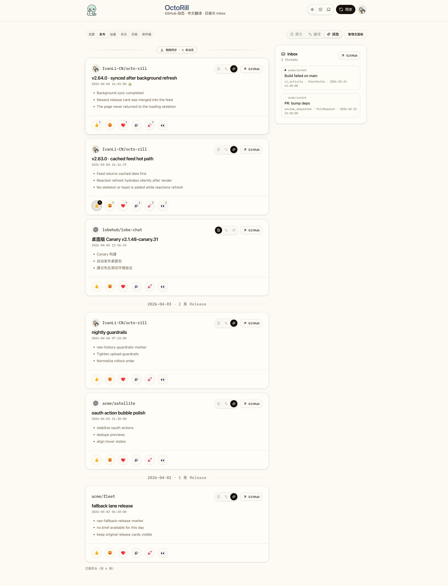
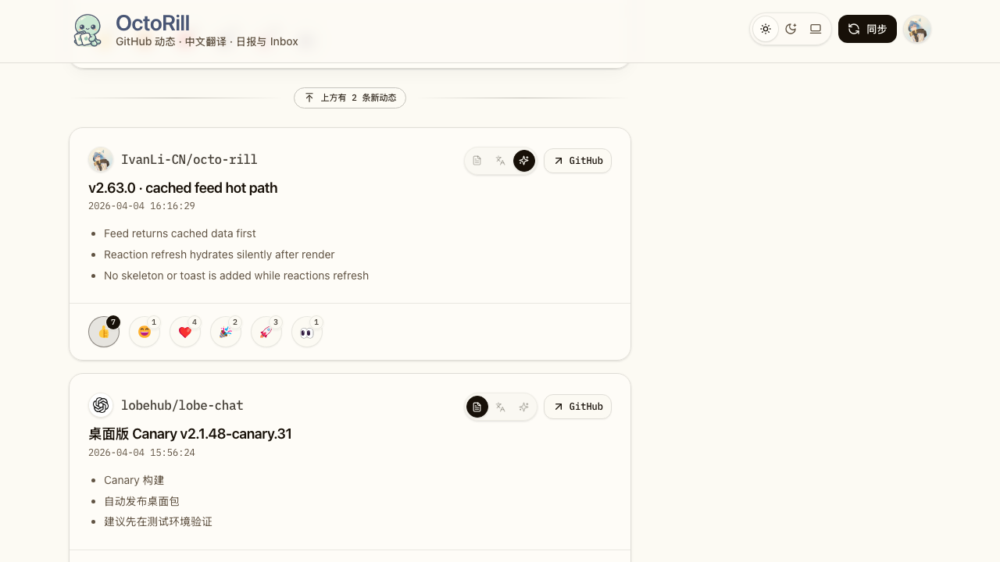

# Dashboard 准实时列表更新（#r7q4d）

## 背景 / 问题陈述

Dashboard 的 Feed、日报和 Inbox 都来自后端定期同步、翻译、润色后的本地缓存。用户需要在页面停留时感知新批次已经可读，但这些内容不是逐条实时产生，不能用聊天式流式插入打断阅读。

## Goals

- Dashboard 阅读面采用混合准实时方案：任务态继续使用既有 task SSE，后台定时同步通过轻量 updates 轮询发现。
- 覆盖主 Feed 各 tab、日报列表和已加载的 Inbox 列表。
- 新内容显示为“有 N 条新内容”的可揭示提示，用户点击后一次性刷新并标记新卡片。
- 更新检查只能读取本地数据库，不访问 GitHub、LLM 或其它外部服务。

## Non-goals

- 不引入全局 SSE、WebSocket 或用户级广播订阅。
- 不扩展 Admin、Settings 或其它非 Dashboard 阅读列表。
- 不把 session-only 新内容提示持久化成未读状态。

## Requirements

- `GET /api/dashboard/updates` 必须返回 opaque token、`generated_at` 和按列表分组的 `changed/new_count/latest_keys`。
- 前端在页面前台约 30 秒检查一次，后台降频，离线暂停，失败指数退避。
- 首次无 token 请求只建立 baseline，不提示 changed。
- 命中新批次后不自动重排用户正在阅读的列表，先显示可点击提示。
- 用户揭示 Feed、日报或 Inbox 更新后，新卡片必须有短暂、克制的视觉标记；动效控制在 150-250ms。
- task SSE 完成并完成显式刷新后，必须立即 silent check 一次，以刷新 baseline，避免刚同步完又提示同一批内容。

## Interface Contract

### `GET /api/dashboard/updates`

Query:

- `token`: 可选 opaque token，由上一次响应返回。
- `feed_type`: `all | releases | stars | followers`，默认 `all`。
- `include`: 逗号分隔的 `feed,briefs,notifications`，默认全量。

Response:

```json
{
  "token": "opaque-next-token",
  "generated_at": "2026-04-30T10:00:00Z",
  "lists": {
    "feed": { "changed": true, "new_count": 3, "latest_keys": ["release:123"] },
    "briefs": { "changed": false, "new_count": 0, "latest_keys": [] },
    "notifications": { "changed": true, "new_count": 1, "latest_keys": ["notification:abc"] }
  }
}
```

`latest_keys` 是 session diff 用的稳定键，不是公开可点击 ID。服务端 token 内部使用列表签名，既能发现新增 item，也能发现同一 item 的翻译、润色或 updated_at 状态变化；token 必须保持 opaque。

## Acceptance Criteria

- Given 用户首次打开 Dashboard，When updates 首次完成，Then 页面不显示新内容提示。
- Given 后台同步写入新的 release/social/brief/notification，When 下一轮 updates 命中，Then 对应列表显示克制的新内容计数提示。
- Given 用户位于 Feed 顶部且新动态已自动插入，When 更新完成，Then 新旧内容之间显示“上方有 N 条新动态”分割线，新卡片位于滚动容器更上方且不会强行进入视野。
- Given 用户点击 Feed 新内容分割线，When 滚动完成，Then 页面定位到新卡片顶部，新卡片在时间元信息旁出现 session-only 圆点暗示，旧卡片不丢失 reaction viewer 状态。
- Given Inbox 在当前视口未加载，When 轮询执行，Then 不主动请求 notifications 更新。
- Given 显式同步任务完成，When 页面刷新成功，Then silent updates check 刷新 baseline，不重复提示刚同步的内容。

## Visual Evidence



- source_type: storybook_canvas
- story_id_or_title: Pages/Dashboard / Evidence / Live updates feed batch
- scenario: Dashboard Feed 发现新批次但尚未自动插入
- evidence_note: 验证列表内“刚刚同步”批次分隔、用户控制的展开动作、新 release 卡片在时间元信息旁保留青蓝同步色、带层次和持续低声量呼吸动效的 session-only 圆点暗示，以及未受影响的 Inbox 侧栏保持稳定。
- requested_viewport: 1773x929 CSS px
- viewport_strategy: storybook-viewport



- source_type: storybook_canvas
- story_id_or_title: Pages/Dashboard / Live updates / Continuous feed push
- scenario: Dashboard Feed 持续发现新动态并把新卡片插入旧内容上方
- evidence_note: 验证新旧内容之间的“上方有 N 条新动态”分割线保持在视野内，新内容卡片留在滚动容器更上方，用户可点击分割线主动滚动到新内容顶部。
- requested_viewport: 1280x720 CSS px
- viewport_strategy: storybook-iframe
- capture_scope: browser-viewport
- sensitive_exclusion: N/A, mock-only Storybook data

## References

- `docs/specs/96dp9-dashboard-sync-unification/SPEC.md`
- `docs/specs/pnzd2-dashboard-startup-request-storm/SPEC.md`
- `docs/specs/vgqp9-dashboard-social-activity/SPEC.md`
