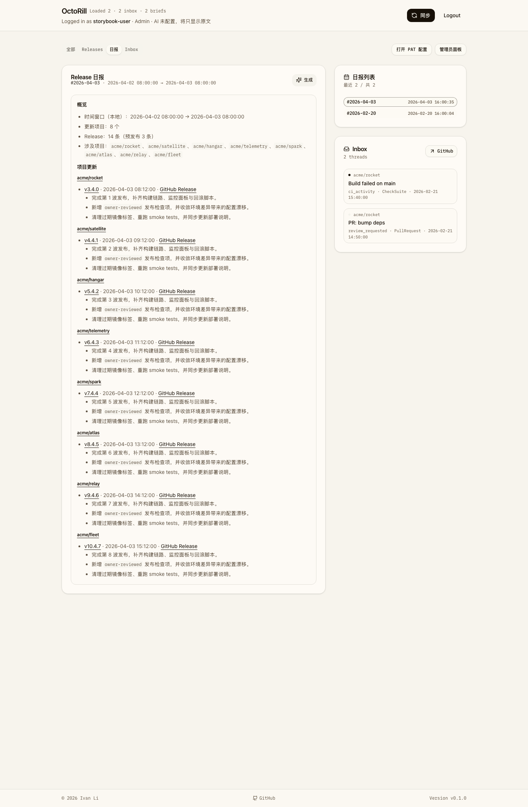
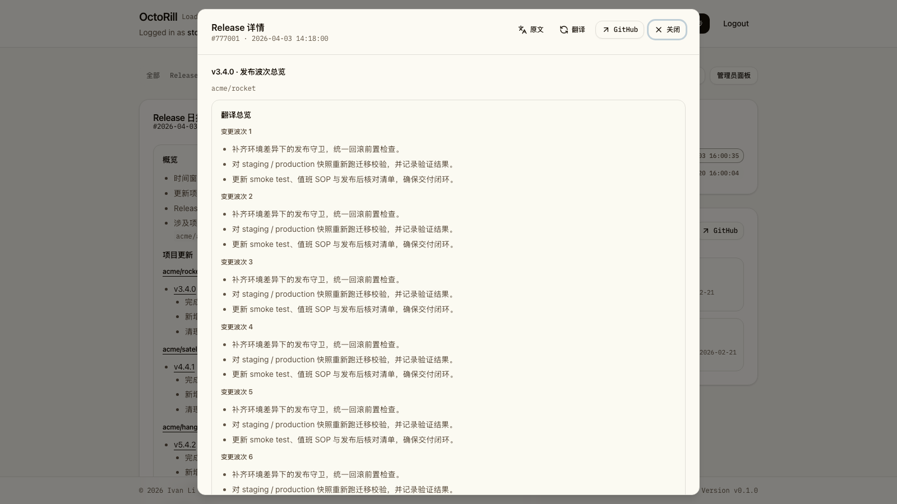

# Dashboard 日报阅读流与详情弹窗修正（#r8m4k）

## 状态

- Status: 已完成
- Created: 2026-04-03
- Last: 2026-04-03

## 背景 / 问题陈述

- Dashboard `日报` tab 中，`Release 日报` 卡片原本把 Markdown 正文包在固定高度容器里，长内容会在卡片内部出现纵向滚动条。
- 从日报内部链接打开 `Release 详情` 后，详情内容直接插入主列文档流，成为日报卡片下方的第二张内容卡片。
- 这种“正文内联详情”的呈现会打断日报阅读流，也让详情语义更像临时查看而不是独立阅读层。

## 目标 / 非目标

### Goals

- 移除日报主卡片内部的固定最大高度与纵向滚动限制，让卡片随内容自然增高。
- 将 `Release 详情` 从 Dashboard 主列文档流中移出，改为模态弹窗显示。
- 保留 `Release 详情` 正文不出现 Markdown 内部纵向滚动区。
- 通过 Storybook 提供稳定的长内容回归入口，并把最终视觉证据落回 spec。

### Non-goals

- 不调整右侧 `日报列表`、`Inbox` 等列表型卡片的布局策略。
- 不修改 Markdown 代码块、表格等横向溢出的既有处理方式。
- 不改动后端 brief / release detail API、数据结构或翻译逻辑。

## 范围（Scope）

### In scope

- `web/src/sidebar/ReleaseDailyCard.tsx`
- `web/src/sidebar/ReleaseDetailCard.tsx`
- `web/src/stories/Dashboard.stories.tsx`
- `docs/specs/README.md`

### Out of scope

- Dashboard 其他 tab 的布局重排
- 右侧摘要列表的截断与滚动策略
- 非 Dashboard 页面

## 需求（Requirements）

### MUST

- `Release 日报` 正文容器不得再设置固定最大高度。
- `Release 日报` 正文容器不得再启用纵向内部滚动。
- `Release 详情` 必须通过模态弹窗显示，不得作为 Dashboard 主列里的第二张卡片参与文档流排版。
- `Release 详情` 正文容器不得再设置固定最大高度或 Markdown 内部纵向滚动区。
- Dashboard 主列长内容阅读继续由页面主滚动承担；详情长内容由弹窗容器承载。
- Storybook 必须提供至少一个长日报场景和一个长详情场景。

### SHOULD

- Storybook 长内容场景应复用 Dashboard 现有页面壳与侧栏结构，避免脱离真实布局。
- 视觉证据应直接来自 Storybook 稳定场景，而不是临时页面或真实数据截图。

### COULD

- 无。

## 功能与行为规格（Functional/Behavior Spec）

### Core flows

- 用户打开 Dashboard `日报` tab，若所选日报正文较长，`Release 日报` 卡片高度随内容增加，浏览器页面出现主滚动条。
- 用户点击日报中的内部 release 链接后，`Release 详情` 以模态弹窗打开；Dashboard 主列仍只保留日报卡片，不再插入第二张详情卡片。
- 详情弹窗中的 Markdown 正文完整显示，不再在 Markdown 容器内形成嵌套纵向滚动区。

### Edge cases / errors

- Markdown 中的代码块和表格继续保留组件级横向滚动能力；本次只移除纵向卡片内滚动。
- 在窄屏下，主列与侧栏堆叠后，长内容卡片仍应完整展开，不出现内容裁切。

## 接口契约（Interfaces & Contracts）

- 无公开 API 或类型契约变更。
- `Dashboard.stories.tsx` 允许新增用于 Storybook 的 mock props 与 fetch 拦截，仅服务于稳定预览，不影响运行时代码路径。

## 验收标准（Acceptance Criteria）

- Given Dashboard `日报` tab 选中一条长日报
  When 页面渲染完成
  Then `Release 日报` 卡片正文区域不再包含 `max-h-96` / `overflow-auto` 风格约束，且页面整体可继续向下滚动。

- Given 用户从日报内部打开一条长 release 详情
  When 详情正文渲染完成
  Then 页面会出现 `Release 详情` 模态弹窗，Dashboard 主列不再插入第二张详情卡片，且详情 Markdown 容器不包含 `max-h-96` / `overflow-auto` 风格约束。

- Given Storybook 长内容场景
  When 进入长日报与长详情 story
  Then 可以稳定复现“日报卡片随内容扩展、详情以弹窗打开”的状态。

## 实现前置条件（Definition of Ready / Preconditions）

- [x] 已定位日报与详情卡片的固定高度实现点。
- [x] 仓库已具备 Storybook 能力，并存在 Dashboard stories。
- [x] 本次范围已锁定为“日报主卡片 + 详情卡片”。

## 非功能性验收 / 质量门槛（Quality Gates）

### Testing

- `cd web && bun run lint`
- `cd web && bun run build`
- `cd web && bun run storybook:build`

### Visual verification

- 使用 Storybook 长内容场景生成至少一张视觉证据。
- 视觉证据需写入本 spec 的 `## Visual Evidence`。

## 文档更新（Docs to Update）

- `docs/specs/README.md`
- `docs/specs/r8m4k-dashboard-brief-detail-auto-height/SPEC.md`

## 计划资产（Plan assets）

- Directory: `docs/specs/r8m4k-dashboard-brief-detail-auto-height/assets/`

## Visual Evidence

## 实现里程碑（Milestones / Delivery checklist）

- [x] M1: 新建 spec 并登记到 `docs/specs/README.md`。
- [x] M2: 去除日报卡片纵向内部滚动限制，并把详情改为模态弹窗。
- [x] M3: 更新 Storybook 长内容场景、完成新的视觉证据与快车道收口。

## 方案概述（Approach, high-level）

- 保留日报卡片的边框、内边距和 Markdown 样式，只移除正文容器的固定高度与纵向滚动限制。
- 详情查看改为 `Dialog` 承载，避免在 Dashboard 主列中插入第二张内容卡片。
- 在 Dashboard Storybook 中加入长日报与长详情场景，用 mock 数据稳定复现“长日报 + 已打开详情弹窗”。
- 用 Storybook 作为视觉证据源，验证页面整体滚动替代卡片内部滚动。

## 风险 / 开放问题 / 假设（Risks, Open Questions, Assumptions）

- 风险：若 Storybook 长详情 mock 未正确拦截详情接口，story 会退回加载失败态，影响弹窗验证。
- 开放问题：无。
- 假设：允许页面整体高度增长，浏览器主滚动条是预期承载方式。

## 变更记录（Change log）

- 2026-04-03: 创建规格，冻结“日报/详情卡片跟随内容高度展开，不再内部滚动”的实现口径。
- 2026-04-03: 去除 `Release 日报` 与 `Release 详情` Markdown 容器的 `max-h-96` / `overflow-auto` 限制，并补齐长内容 Storybook 场景。
- 2026-04-03: 通过 `bun run lint`、`bun run build`、`bun run storybook:build`，并用 Storybook 稳定场景补入视觉证据，状态更新为 `部分完成（2/3）`。
- 2026-04-03: 创建 PR #45，快车道收口到 PR-ready，规格状态更新为 `已完成`。
- 2026-04-03: 根据评审反馈，将 `Release 详情` 从 Dashboard 文档流卡片改为模态弹窗，并重新生成 Storybook 场景与视觉证据。
- 2026-04-03: 重新通过 `bun run lint`、`bun run build`、`bun run storybook:build`，并以 Storybook 长日报/长详情弹窗场景更新视觉证据。

## 参考（References）

- `web/src/sidebar/ReleaseDailyCard.tsx`
- `web/src/sidebar/ReleaseDetailCard.tsx`
- `web/src/stories/Dashboard.stories.tsx`
