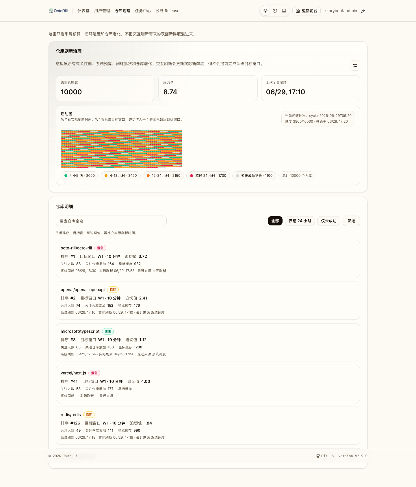
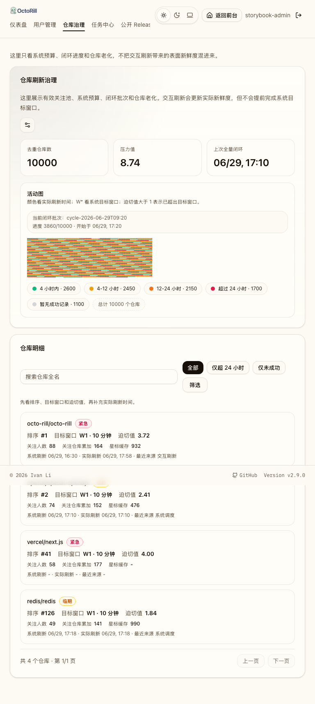
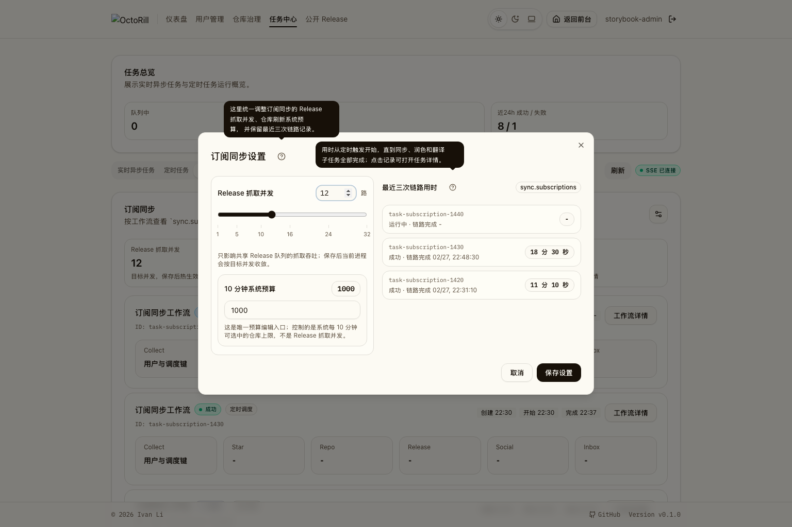

# 仓库刷新治理页与预算调度收敛（#rap6f）

## 背景 / 问题陈述

现有后台把用户“仓库数”展示成宽口径总数，容易把 owned baseline、disabled 用户和有效关注池混在一起，导致运营对实际调度压力与仓库新旧程度产生误判。与此同时，`sync.subscriptions` 的 system release demand 仍以“全池全量挂队列”为主，缺少预算窗口、全量闭环状态与老化治理解释面。

## 目标 / 非目标

### Goals

- 新增后台一级独立页 `/admin/repos`，作为“仓库治理”唯一展示入口，用于展示有效关注池、system budget 调度与仓库老化。
- 固定“有效关注池”语义：
  - `starred_repos` 恒纳入；
  - owned repo 仅当 `users.include_own_releases=1` 时纳入；
  - `users.is_disabled=1` 的用户整池排除。
- system release 调度改为“每 10 分钟预算窗口内挑仓库”，默认预算字段为 `repo_refresh_system_budget_per_window`，并与 Admin Jobs 共用同一 runtime config。
- 排序合同固定为：
  - `watcher_user_count DESC`
  - `watcher_repo_total_sum ASC`
  - `cached_stargazer_count DESC`
- 其中：
  - `watcher_user_count` 按同一用户去重；
  - `watcher_repo_total_sum` 按关系来源不去重，同一用户对同一 repo 的 `starred + owned` 需要累计两次；
  - `cached_stargazer_count` 使用 best-effort 本地缓存，允许过时，未知值落后于已知值。
- 新增 repo 治理物化快照与 system full-cycle 跟踪，页面读取和 scheduler 选仓都只读快照，不在请求链路里临时跨多表重聚合。
- `/api/admin/users` 与用户详情中的 `repo_total` 改为有效关注池口径，并把 owner-facing 文案同步改成“有效关注仓库数”。

### Non-goals

- 不为长尾 repo 追加 24h/72h 的硬保底 SLA；只通过软目标频段和 aging 提升调度优先级。
- 不把交互式 `sync.access_refresh`、手动 sync、公开 release 访问 demand 并入这 10 分钟 system budget。
- 不把仓库老化信息塞回 `/admin` 主仪表盘；治理信息只在新的 `/admin/repos` 独立页展示。
- 不在治理页面读取链路里直接请求 GitHub；页面只读本地快照与共享队列状态。

## 范围（Scope）

### In scope

- DB migration:
  - `admin_runtime_settings.repo_refresh_system_budget_per_window`
  - `starred_repos.repo_stargazer_count(_updated_at)`
  - `owned_repo_star_baselines.repo_stargazer_count(_updated_at)`
  - `repo_refresh_governance_snapshots`
  - `repo_refresh_governance_cycles`
  - `repo_refresh_governance_cycle_members`
- scheduler:
  - 有效关注池聚合
  - repo governance snapshot rebuild
  - fixed-order priority ranking
  - budgeted system repo selection
  - system full-cycle freeze/complete semantics
- admin HTTP APIs:
  - `GET /api/admin/repos/overview`
  - `GET /api/admin/repos`
  - `GET/PATCH /api/admin/jobs/sync/runtime-config` 扩展 budget 字段
  - `GET /api/admin/users` `repo_total` 新口径
- web admin:
  - `/admin/repos` route
  - `AdminHeader` 导航项“仓库治理”
  - summary cards / activity grid / filtered repo list
  - budget 只读展示与入口提示，实际编辑收口到 Admin Jobs 的“订阅同步设置”弹窗
- Storybook fallback / visual evidence for the new admin page

### Out of scope

- 改造公开 release 仓库登记页的职责边界。
- 引入新的 GitHub 在线探测或页面级实时数据拉取。

## 功能与行为规格（Functional / Behavior Spec）

### 有效关注池

- scheduler 与后台展示共享同一口径：
  - `starred_repos`
  - `owned_repo_star_baselines` only when `include_own_releases=1`
  - disabled 用户整池排除
- `/admin/users` 的 `repo_total` 表示该用户当前有效关注池中的去重 repo 数，而不是“历史处理过的所有仓库总数”。

### Budget 调度

- system window 固定为 10 分钟。
- 每次 scheduler window 先用 set-based SQL 重建 active pool 快照，并按固定排序写入 `priority_rank`。
- 软目标频段定义为：
  - `target_window = ceil(priority_rank / budget_per_window)`
  - `target_interval_minutes = target_window * 10`
- system 选仓顺序固定为：
  - 未有 system success 的 repo 优先；
  - 其后按 `system_age / target_interval` 形成的 `urgency_score` 倒序；
  - 再按 `priority_rank ASC`
- 每轮最多挑选 `repo_refresh_system_budget_per_window` 个 repo 挂入 shared repo release queue。
- 交互式/手动 demand 不消费该 budget，也不会提前结算 repo 的 system success。

### 全量 cycle

- system full-cycle 在开始时冻结成员集。
- cycle 完成条件只看冻结成员：
  - 新入池 repo 进入下一轮；
  - 离池 repo 不得永久阻塞当前轮完成；
  - 当前轮完成后写入“上次完成全量更新时间”。

### 治理页

- `/admin/repos` summary 固定包含：
  - 去重仓库数
  - 压力值
  - 上次完成全量更新时间
- 压力值定义为：
  - `sum(max(0, min(overdue_ratio, 4) - 1)) / budget_per_window`
  - 语义是“按当前预算清掉超期积压还需多少个 10 分钟窗口”
- 活动图：
  - 每格代表一个 repo
  - 顺序按治理优先级
  - 颜色按实际最后成功刷新时间（任意来源）分桶
  - 不把交互 demand 的表面新鲜度误当成 system 频段完成
- 明细列表：
  - 按迫切值与优先级排序
  - 支持搜索 repo full name
  - 支持老化筛选
  - 桌面与窄屏均需稳定展示

## 验收标准（Acceptance Criteria）

- Given 同一 repo 同时存在 `starred` 与 `owned` 关系
  When 计算治理排序
  Then `watcher_user_count` 只把同一用户算一次，`watcher_repo_total_sum` 按关系来源重复累加。

- Given `repo_refresh_system_budget_per_window=1000`
  When 任一 10 分钟 system scheduler window 触发
  Then 附着到 shared repo release queue 的 repo 数量不超过 1000。

- Given 某 repo 仅被交互刷新而未被本轮 system 选中
  When 查看治理页
  Then 活动图颜色可显示为新，但其 system `urgency/band/full-cycle` 不提前结算。

- Given active cycle 开始后新增或移除 repo
  When 当前轮继续推进
  Then 新入池 repo 归下一轮，离池 repo 不阻塞本轮闭环完成时间。

- Given `/admin/users` 与用户详情展示 `repo_total`
  When 用户关闭 `include_own_releases` 或账号被 disabled
  Then owned baseline 不再虚增其有效关注仓库数，disabled 用户的有效关注仓库数归零。

## Visual Evidence

- source_type: `storybook_canvas`
  story_id_or_title: `admin-admin-repos--evidence-desktop`
  state: `desktop governance`
  evidence_note: 证明 `/admin/repos` 在桌面视口下同时展示有效关注池 summary、可访问活动图图例、单跳预算 CTA 和按迫切值排序的仓库明细。
  PR: include
  

- source_type: `storybook_canvas`
  story_id_or_title: `admin-admin-repos--evidence-narrow-tablet`
  state: `narrow tablet governance`
  evidence_note: 证明 `/admin/repos` 在窄平板视口下仍能稳定展示 summary、预算 CTA、活动图图例与明细列表，不退化为不可滚动的密集表格。
  

- source_type: `storybook_canvas`
  story_id_or_title: `admin-admin-jobs--subscription-sync-settings-auto-open`
  state: `subscription sync settings dialog auto-open from governance cta`
  evidence_note: 证明仓库刷新 budget 的唯一编辑入口已经收口到任务中心“订阅同步设置”弹窗，并支持从治理页 CTA 单跳自动展开。
  

## 关系 / Supersede

- supersedes:
  - `s8qkn-subscription-sync` 中“**不新增专门的 repo release 管理后台页面**”这一旧非目标
  - `n6zd8-admin-panel-user-management` 中 `repo_total = starred ∪ owned baseline` 的旧宽口径定义
- related:
  - [#s8qkn](../s8qkn-subscription-sync/SPEC.md)
  - [#n6zd8](../n6zd8-admin-panel-user-management/SPEC.md)

## 参考

- `docs/product.md`
- `docs/solutions/backend/sqlite-wal-write-transactions.md`
