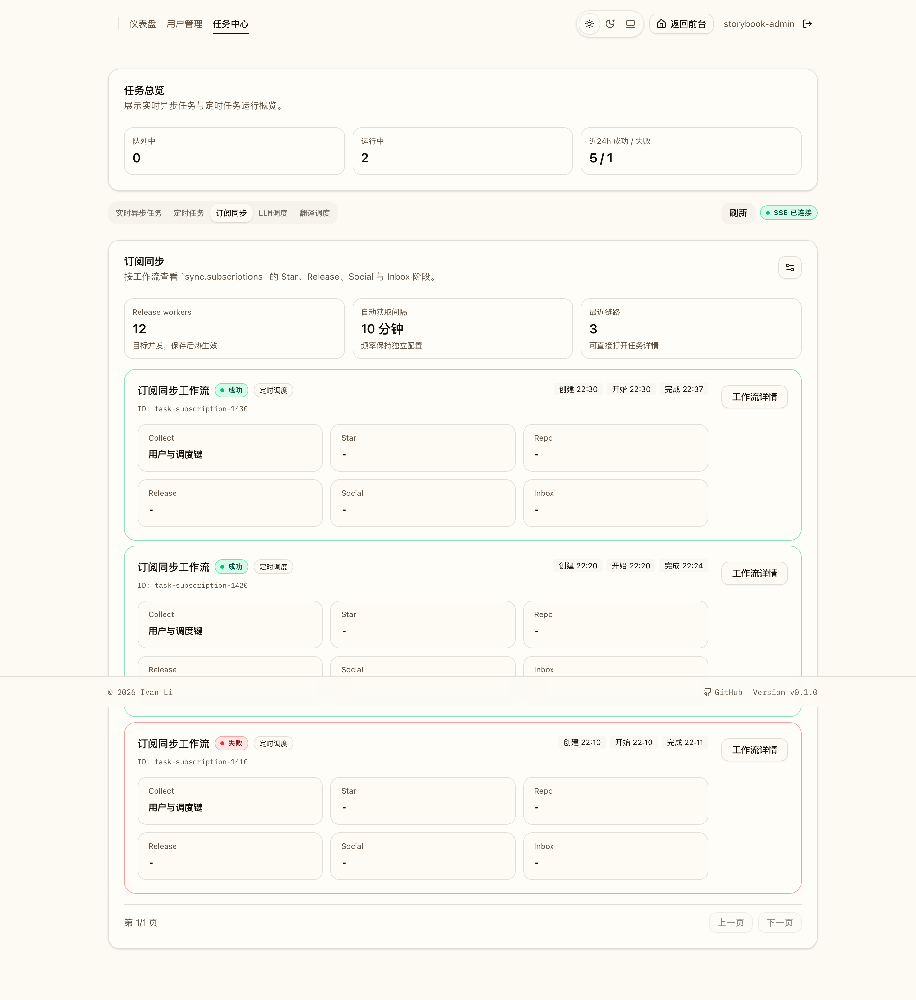
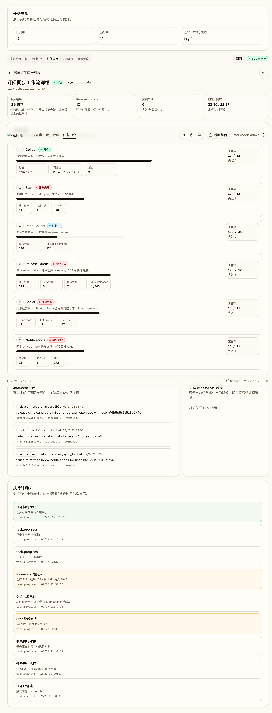
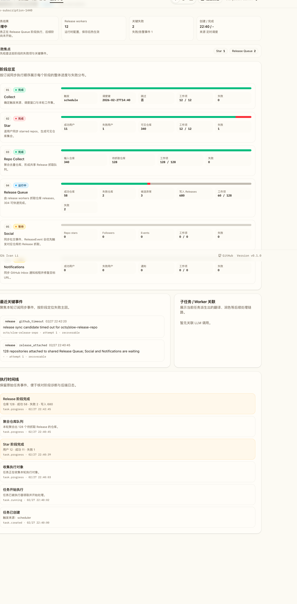
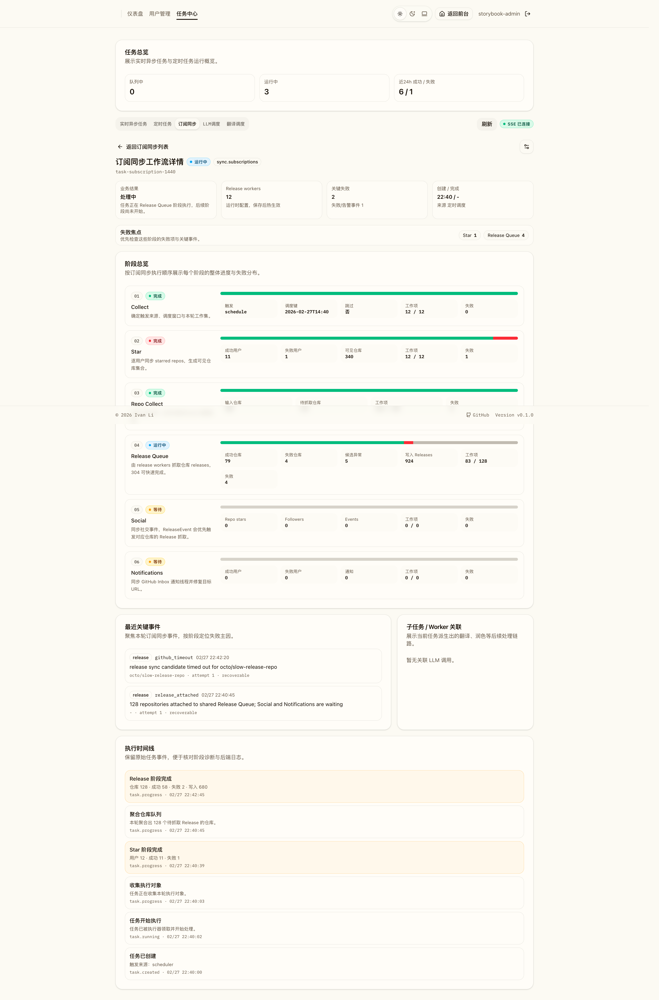
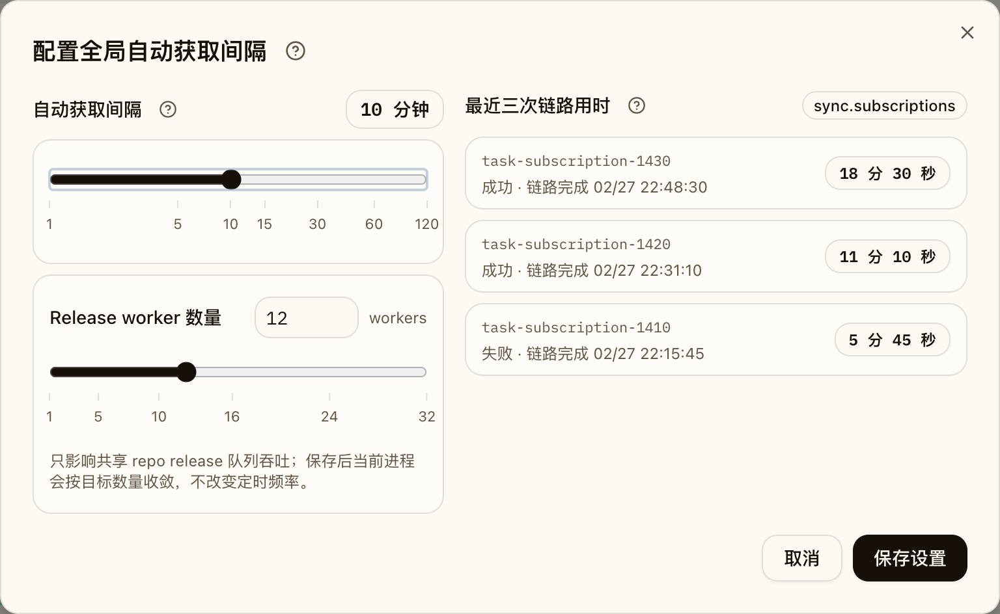
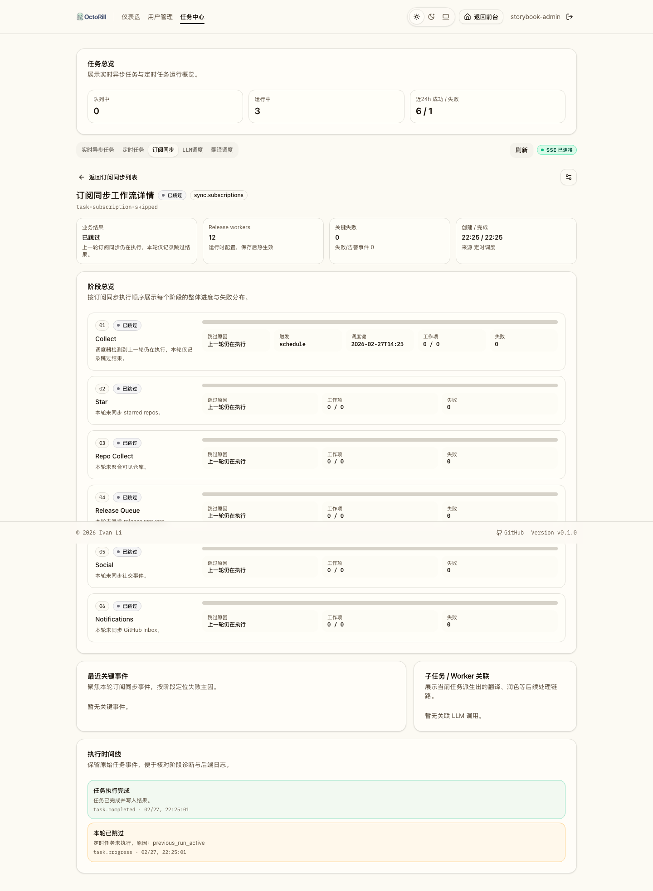
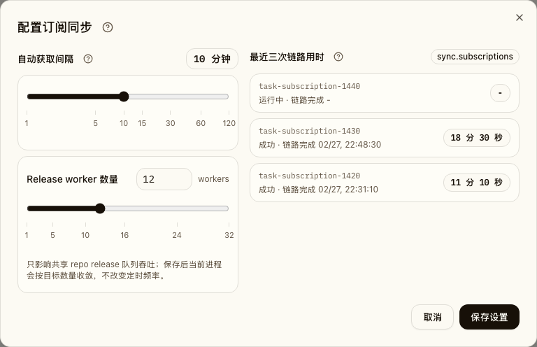
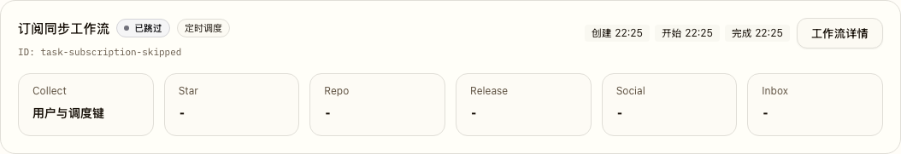

# 全局 Repo Release 复用与访问触发增量同步（#s8qkn）

## 背景 / 问题陈述

旧实现把 Release 同步和存储都绑定在用户维度：

- `sync.releases` 直接按用户当前 `starred_repos` 向 GitHub 抓取并写入用户私有 `releases`
- `sync.subscriptions` 虽然聚合了 repo 抓取，但仍会 fan-out 回写到每个用户的 `releases`
- 新用户或长时间未访问的用户进入站点后，看不到“先展示已有缓存、再补齐最新数据”的 staged refresh
- Dashboard 的 `Sync all` 由多个 sibling tasks 组成，顺序不可控，无法保证 `starred` 先于 `releases`

这一轮把 Release 读写模型、任务编排和访问 bootstrap 一次性收敛到共享仓库模型。

## 目标 / 非目标

### Goals

- 引入共享 `repo_releases` 缓存，所有用户从 `starred_repos + repo_releases` 读取 Release。
- 引入全局 `repo_release_work_items` / `repo_release_watchers`，把访问触发、手动同步、定时订阅同步统一汇聚到 repo 级共享队列。
- 新增 `sync.access_refresh`：
  - 覆盖 `Star + Release + social + Inbox`
  - 首访或超过 1 小时未访问时自动触发
  - `star_refreshed` 后立即让前端刷新可见缓存
  - Release work 完成后再刷新一次，并在 social / Inbox 阶段结束后收口
  - 首次成功拿到 social snapshot 时直接写入可见社交事件
  - social / Inbox 失败保持 best-effort，不把整轮访问刷新降级成硬失败
- `sync.subscriptions` 改成：
  - 刷新用户 Star
  - 聚合 repo demand
  - 挂到共享 repo release queue
  - 等待关联 outcome 并输出 `Release + social + Inbox` 摘要
- `GET /api/me` 返回 `access_sync` 元信息，前端可直接附着到用户自己的 task SSE。
- Admin Jobs 允许管理员配置全局自动获取间隔，并展示最近三次 `sync.subscriptions` 用时。
- Admin Jobs 提供订阅同步专用视图和详情入口，支持查看所有 `sync.subscriptions` 运行，不论来自定时、手动还是重试。
- Release 阶段支持运行时调整共享 repo release worker 数量；该设置只影响吞吐，不降低调度频率。
- Release 抓取使用 GitHub conditional request 复用 `ETag` / `Last-Modified`，未变化仓库可以快速完成 watcher，而不是下载完整 release 列表。
- GitHub `ReleaseEvent` 只作为快速发现信号，用于把命中 repo 提升为高优先级 release demand；可靠性仍由全量可见 repo 校验兜底。

### Non-goals

- 不新增专门的 repo release 管理后台页面。
- 不引入跨实例分布式锁或 leader election。
- 不引入 GitHub webhook / upstream push 模式。
- 不通过降低 `sync.subscriptions` 频率或扩大 freshness window 解决慢同步。
- 不把 10k+ 可见仓库视为异常规模；订阅同步必须按该规模正常运作。

## 范围（Scope）

### In scope

- DB migration:
  - `repo_releases`
  - `repo_release_work_items`
  - `repo_release_watchers`
  - 从旧 `releases` 去重回填到 `repo_releases`
- 后端运行时：
- repo 级共享 release worker
  - runtime lease heartbeat / recovery
  - `sync.access_refresh`
  - `/api/me.access_sync`
  - `/api/admin/jobs/sync/runtime-config`
  - `/api/tasks/{task_id}/events`
- 读模型切换：
  - `/api/releases`
  - `/api/releases/{id}/detail`
  - feed
  - brief
  - release translation
  - release reaction
- Dashboard staged refresh：
  - 读取 `me.access_sync`
  - 订阅 task SSE
  - 在 `star_refreshed` / `task.completed` 两次刷新
  - 空态改成“自动同步中 / 无缓存内容”两态
- Storybook：
  - 新增 `AccessSyncEmptyState` 稳定场景

### Out of scope

- 删除历史 `releases` 表或一次性清理所有遗留测试数据。
- 新增专门的 repo release 管理后台页面。

## 接口契约（Interfaces & Contracts）

### 接口清单（Inventory）

| 接口（Name） | 类型（Kind） | 范围（Scope） | 变更（Change） | 契约文档（Contract Doc） | 负责人（Owner） | 使用方（Consumers） |
| --- | --- | --- | --- | --- | --- | --- |
| `GET /api/me` | HTTP API | external | Modify | `./contracts/http-apis.md` | backend | web |
| `GET /api/tasks/{task_id}/events` | HTTP API / SSE | external | New | `./contracts/http-apis.md` | backend | web |
| `GET /api/admin/jobs/sync/runtime-config` / `PATCH /api/admin/jobs/sync/runtime-config` | HTTP API | external | New | `./contracts/http-apis.md` | backend | admin web |
| `POST /api/sync/all` | HTTP API | external | New | `./contracts/http-apis.md` | backend | web |
| `POST /api/sync/releases` | HTTP API | external | Modify | `./contracts/http-apis.md` | backend | web |
| `sync.access_refresh` | Job task | internal | New | `./contracts/http-apis.md` | backend | api / web |
| `sync.subscriptions` | Job task | internal | Modify | `./contracts/http-apis.md` | backend | scheduler / admin |
| `repo_releases` / `repo_release_work_items` / `repo_release_watchers` | DB schema | internal | New | `./contracts/db.md` | backend | backend |

## 功能与行为规格（Functional / Behavior Spec）

### 访问触发刷新

- `GET /api/me` 必须先读取用户旧 `last_active_at`，再决定是否 stale，最后才 touch 新的 `last_active_at`。
- 触发条件：
  - `last_active_at IS NULL`
  - 或者距当前时间超过 1 小时
- 若当前用户已有 `queued|running` 的 `sync.access_refresh`，则直接复用该 task，`reason=reused_inflight`。
- 否则新建 `sync.access_refresh`，`reason=first_visit|inactive_over_1h`。

### Admin Jobs 全局自动获取控制

- Admin Jobs 的定时任务页展示全局 `sync_auto_fetch_interval_minutes` 控件，允许保存 `1-120` 分钟。
- 该配置保存在 `admin_runtime_settings`，仅影响全局 `sync.subscriptions` 定时拉取，不影响账号访问状态。
- 同一区域展示最近三次全局 `sync.subscriptions` 任务：
  - 来源为 `job_tasks.task_type = sync.subscriptions`
  - 排除 `result_json.skipped = true` 的跳过记录
  - 不按用户过滤
  - 显示任务状态、链路完成时间、链路用时
  - 链路用时从根 `sync.subscriptions` 创建时间开始，到根任务及其直接触发的 `translate.release.batch` / `summarize.release.smart.batch` 子任务全部完成时结束
- 点击任一用时项打开对应的订阅同步详情页面，页面展示该任务详情、阶段摘要和最近事件。
- `GET /api/admin/jobs/sync/runtime-config` / `PATCH /api/admin/jobs/sync/runtime-config` 负责读取和保存该全局设置。
- 同一接口同时返回和保存 `repo_release_worker_concurrency`，合法范围为 `1-32`，默认 `5`。
- `repo_release_worker_concurrency` 保存后当前进程热生效；缩容不取消已领取的 work item，新增 worker 会在后续轮询中参与 claim。

### Admin Jobs 订阅同步视图

- `/admin/jobs/subscriptions` 是订阅同步专用入口。
- 列表只展示 `task_type = sync.subscriptions` 的任务，覆盖定时、手动、重试来源。
- 列表页和详情页共享设置入口，设置项包括：
  - 全局自动获取间隔；
  - Release worker 数量。
- 详情按工作流阶段展示：
  - collect；
  - Star；
  - repo collect；
  - Release queue；
  - social；
  - Inbox；
  - translation / smart preheat child tasks。
- 每个阶段至少展示整体状态、完成/总量、最近关键事件；Release 阶段还应展示 worker 目标并发、成功/失败 repo、candidate failures 与超时/退避线索。
- 当 `sync.subscriptions` 的业务结果为 `skipped=true` 时，详情页展示状态为“已跳过”；各阶段展示“已跳过/未执行”语义和跳过原因，不把 0/0 误判为“等待”。
- 运行中的 `sync.subscriptions` 任务在 `result_json` 尚未写入前，详情 API 必须从当前任务的 `task.progress` 事件派生 `diagnostics.sync_subscriptions`，让阶段总览实时展示已经完成的 Star、repo collect、Release queue、social 和 Inbox 摘要。

### `sync.access_refresh`

- 阶段固定为：
  1. 刷新当前用户 Star 快照
  2. 触发 `task.progress(stage=star_refreshed)`
  3. 将当前可见 repo 挂到共享 repo release queue
  4. 触发 `task.progress(stage=release_attached)`
  5. 等待关联 work item 满足“已有新鲜缓存或本轮完成”
  6. 触发 `task.progress(stage=release_summary)`
  7. 触发 `task.progress(stage=social_summary)`
  8. 触发 `task.progress(stage=notifications_summary)`
  9. `task.completed`
- 访问自动刷新会继续补齐 `social + Inbox`，但 `star_refreshed` 仍然是前端第一次刷新缓存的关键节点。
- social 阶段拿到首次 follower / repo star snapshot 时，必须直接写入 `social_activity_events`；其中 `repo_star_received` 保留真实 `starred_at`，`follower_received` 仅保留内部检测时间供排序使用。
- 若账号在旧版本里已经持有 `follower_current_members` / `repo_star_current_members`，但对应社交事件为空，则 social 阶段必须在下一次正常 sync 中自动完成事件流可见化，不依赖手工 SQL 补写。
- social / notifications 阶段遇到 GitHub nullable bool（如 `usesCustomOpenGraphImage = null`、`unread = null`）时，必须按兼容默认值继续同步，而不是把整轮任务降级成 decode_error。
- social 或 Inbox 若失败，访问刷新任务仍返回成功，并把对应错误附带到阶段事件 / 结果 JSON 中。

### 共享 repo release queue

- `repo_release_work_items` 一条 repo 只保留一条共享 work item。
- claim 顺序固定为：
  - `priority DESC`
  - `has_new_repo_watchers DESC`
  - `deadline_at ASC`
  - `created_at ASC`
- 访问触发 demand 使用 `priority=interactive`，定时订阅同步使用 `priority=system`。
- 若系统排队 work item 被访问 demand 命中，则允许升级优先级，但不抢占已 running work item。
- `deadline_at` 是共享 work item 的硬业务超时：
  - `interactive` demand 使用 2 分钟 deadline，`system` demand 使用 10 分钟 deadline。
  - queued / running work item 超过 deadline 后必须标记为 `failed`，清除 runtime lease，并把 pending watcher 标记为 `failed`。
  - deadline 超时使用 `repo_release_deadline_expired`，不得与进程/owner 租约失效的 `runtime_lease_expired` 混用。
- 单个 repo 抓取时按“当前仍 star 该 repo 的用户”挑选候选 token，排序规则：
  - `last_active_at DESC`
  - `user_id ASC`
- 抓取请求带上 repo 级 `ETag` / `Last-Modified`：
  - `304 Not Modified` 视为该 repo 本轮成功完成，不重新下载 release 列表；
  - `200 OK` 后更新 repo 级 conditional headers 与 `last_success_at`；
  - timeout / network error 写入 repo 级失败状态和短期 `backoff_until`，当前轮失败不得阻塞其他 repo。
- 成功抓取后写入共享 `repo_releases`，并把等待中的 watcher 标记为 `succeeded`。
- 失败时把等待中的 watcher 标记为 `failed`。

### `sync.subscriptions`

- Star 阶段仍然按用户活跃度刷新 `starred_repos`，失败用户不会参与 repo 聚合。
- Release 阶段不再 inline 抓 GitHub Release，也不再 fan-out 写用户私有 `releases`。
- Release 阶段改成：
  - 聚合 repo demand
  - 挂到共享 repo release queue
  - 等待共享 queue 结果
  - 在任务结果里输出 repo 级摘要
- Release 阶段等待共享 queue 时必须主动收敛已过期 work item；不能因 pending watcher 永久存在而让根 `sync.subscriptions` 长期保持 `running`。
- Release 结束后继续按 Star 成功用户 fan-out：
  - `social_summary`：调用 `sync_social_activity_best_effort`，聚合 `repo_stars / followers / events`
  - `notifications_summary`：调用 `sync_notifications`，聚合新增通知数
- social 同步若遇到 owned-repo GraphQL 的视觉字段返回 `null`，必须按兼容值归一化，不得把该用户整个 social 阶段直接降级成 `source_degraded`。
- social / Inbox 任一用户失败时，本轮 `sync.subscriptions` 仍继续执行并返回完成态，但必须把失败写入 `sync_subscription_events` / run log / admin diagnostics。
- social feed 中的 GitHub `ReleaseEvent` 写为 `release_update`，不得复用 `announcement`；Discussions Announcements 继续使用 `announcement`。
- `release_update` 命中的 repo 会以 interactive 优先级挂入共享 repo release queue，用于加速发现，但不得替代定时同步中的全量 repo demand。

### 读模型与可见性

- Release 可见性统一为“当前用户 stars 了该 repo”。
- 下列读路径统一改成 `starred_repos + repo_releases`：
  - `/api/releases`
  - `/api/releases/{id}/detail`
  - `/api/feed`
  - daily brief
  - release batch translation / detail translation
  - release reaction toggle / reaction count persistence
- reaction counts 保存在共享 `repo_releases`。
- viewer-specific reaction 状态继续按当前用户 live 查询，不做共享存储。

### Dashboard staged refresh

- 首屏仍先加载旧 feed / brief / inbox。
- 若 `me.access_sync.task_id` 存在，则立即连用户侧 SSE。
- 收到 `star_refreshed` 时执行第一次 `refreshAll()`，以显示服务端已知的共享缓存。
- 收到 `task.completed(status=succeeded)` 时执行第二次 `refreshAll()`。
- 当 access sync 进行中且 feed 为空时，空态显示“正在同步你的 Star / Release”。
- 当 access sync 不在进行中且 feed 为空时，空态显示“还没有缓存内容”。

## 验收标准（Acceptance Criteria）

- Given 用户首次访问或超过 1 小时未访问
  When `GET /api/me` 返回
  Then 响应包含 `access_sync.task_id`，并且同一用户不会重复入队多个 `sync.access_refresh`。

- Given 管理员在 Admin Jobs 定时任务页配置 `1-120` 分钟自动获取间隔
  When 保存设置
  Then 后端持久化全局 `sync_auto_fetch_interval_minutes`，后续 scheduler 按该间隔判断是否触发 `sync.subscriptions`。

- Given 系统已有最近三次 `sync.subscriptions` 历史
  When 打开 Admin Jobs 定时任务页
  Then 页面展示最近三次非跳过链路用时；点击用时项会打开对应的订阅同步详情页面。

- Given 用户已经有旧缓存 Release
  When `sync.access_refresh` 发出 `star_refreshed`
  Then Dashboard 第一次刷新可以看到与当前 `starred_repos` 匹配的共享 `repo_releases`。

- Given 某个 repo 已经被系统同步或另一位用户访问 demand 排队
  When 当前用户访问再次命中同 repo
  Then 不会产生重复 GitHub 抓取，队列只升级 demand。

- Given shared `repo_releases` 已启用
  When feed / release detail / brief / translation / reaction 读取 Release
  Then 只依赖“当前用户 star 可见 + 共享 repo release 缓存”，不依赖用户私有 `releases`。

- Given `sync.subscriptions` 被 scheduler 按全局自动获取间隔触发
  When 本轮 Star / Release 摘要已经完成
  Then 同一 task 还会继续发出 `social_summary` 与 `notifications_summary`，并在 `result_json` 中包含四段聚合摘要。

- Given 当前用户尚未建立 social baseline
  When `sync.access_refresh` 或 `sync.subscriptions` 首次成功拿到 followers / repo stargazers snapshot
  Then 当前 social 记录会立即写入 feed 事件流，而不是只存在 current membership 快照里。

- Given 某个用户的 social 或 Inbox 拉取失败
  When `sync.subscriptions` 结束
  Then 整轮任务仍可完成，但 Admin Jobs 详情页会展示 partial outcome，并能从 `recent_events` 看到对应失败线索。

- Given 管理员把 Release worker 数量从 5 调整到 16
  When 保存设置
  Then `GET /api/admin/jobs/sync/runtime-config` 返回 `repo_release_worker_concurrency=16`，后续 repo release worker 按 16 个活跃槽位 claim。

- Given 某个 repo 的 GitHub releases 返回 `304 Not Modified`
  When repo release worker 处理该 work item
  Then watcher 标记为成功，任务不会下载/解析完整 release 列表。

- Given `/users/{login}/received_events` 返回 `ReleaseEvent`
  When social 阶段处理事件
  Then feed 事件使用 `release_update`，并把对应 repo 作为高优先级 release demand。

- Given 管理员打开 `/admin/jobs/subscriptions`
  When 页面加载完成
  Then 只展示订阅同步任务列表，且可从列表打开工作流详情并使用相同设置入口调整 Release worker 数量。

- Given 某轮 `sync.subscriptions` 因上一轮仍在执行而被跳过
  When 管理员打开该任务详情
  Then 顶部状态和业务结果显示“已跳过”，阶段总览不显示“等待”，设置弹窗最近链路用时也不展示该跳过记录。

- Given 管理员打开运行中的 `/admin/jobs/subscriptions/{task_id}`
  When 该任务已经发出 `star_summary`、`repo_collect` 或 `release_summary` 事件但 `result_json` 仍为空
  Then 阶段总览从事件派生实时统计，不应把已完成阶段显示为等待或 `0 / 0`。

## Visual Evidence

source_type=storybook_canvas
target_program=mock-only
capture_scope=element
sensitive_exclusion=N/A
submission_gate=pending-owner-approval
story_id_or_title=Pages/Dashboard/AccessSyncEmptyState
state=auto-sync-empty-state
evidence_note=验证访问触发同步期间，Dashboard 空态不再提示手动 Sync all，而是展示 staged refresh 文案

source_type=storybook_canvas  
target_program=mock-only  
capture_scope=browser-viewport  
sensitive_exclusion=N/A  
submission_gate=approved  
story_id_or_title=Admin/Task Type Detail/SyncSubscriptions  
state=scheduler-social-and-inbox-summary  
evidence_note=验证 Admin Jobs 的 sync.subscriptions 详情页已展示 Star、Release、Social、Inbox 四阶段摘要与最近关键事件。

PR: include

source_type=storybook_canvas
target_program=mock-only
capture_scope=element
requested_viewport=default
viewport_strategy=storybook-viewport
sensitive_exclusion=N/A
submission_gate=approved
story_id_or_title=Admin/Admin Jobs/Subscription Sync Workflow
state=subscription-sync-list
evidence_note=验证 `/admin/jobs/subscriptions` 专用列表页展示 sync.subscriptions 工作流列表、Release worker 当前配置与统一设置入口。

PR: include

source_type=storybook_canvas
target_program=mock-only
capture_scope=element
requested_viewport=default
viewport_strategy=storybook-viewport
sensitive_exclusion=N/A
submission_gate=approved
story_id_or_title=Admin/Admin Jobs/Subscription Sync Detail
state=subscription-sync-detail
evidence_note=验证订阅同步独立详情页可见 Star、Release、Social、Inbox 阶段摘要、失败主因、最近关键事件与子任务链路。

PR: include

source_type=storybook_canvas
target_program=mock-only
capture_scope=element
requested_viewport=default
viewport_strategy=storybook-viewport
sensitive_exclusion=N/A
story_id_or_title=Admin/Admin Jobs/Subscription Sync Detail Running
state=subscription-sync-detail-running
submission_gate=approved
evidence_note=验证运行中的订阅同步详情页按真实工作流推进：Collect、Star、Repo Collect 已完成，Release Queue 正在处理，Social 与 Notifications 等待上游阶段结束。

PR: include

source_type=storybook_canvas
target_program=mock-only
capture_scope=browser-viewport
requested_viewport=default
viewport_strategy=storybook-viewport
sensitive_exclusion=N/A
submission_gate=approved
story_id_or_title=Admin/Admin Jobs/Subscription Sync Detail Running
state=subscription-sync-detail-running-live-progress
evidence_note=验证运行中的订阅同步详情页在 SSE 触发详情刷新后，Release Queue 阶段内进度从实时 diagnostics 更新为 79 个成功仓库、4 个失败仓库与 924 条写入 Releases。

PR: include

source_type=storybook_canvas
target_program=mock-only
capture_scope=element
requested_viewport=default
viewport_strategy=storybook-viewport
sensitive_exclusion=N/A
submission_gate=approved
story_id_or_title=Admin/Admin Jobs/Subscription Sync Settings
state=subscription-sync-settings
evidence_note=验证列表页和详情语义共用的设置面板包含 Release worker 数量滑块与数字输入，且说明该设置不改变同步频率。

PR: include

source_type=storybook_canvas
target_program=mock-only
capture_scope=element
requested_viewport=default
viewport_strategy=storybook-viewport
sensitive_exclusion=N/A
submission_gate=pending-owner-approval
story_id_or_title=Admin/Admin Jobs/Subscription Sync Detail Skipped
state=subscription-sync-detail-skipped
evidence_note=验证被跳过的订阅同步详情页顶部与阶段总览均显示“已跳过”，不再把 0/0 阶段误标为“等待”。

source_type=storybook_canvas
target_program=mock-only
capture_scope=element
requested_viewport=default
viewport_strategy=storybook-viewport
sensitive_exclusion=N/A
submission_gate=pending-owner-approval
story_id_or_title=Admin/Admin Jobs/Subscription Sync Workflow
state=subscription-sync-settings-filtered-history
evidence_note=验证配置弹窗最近链路用时只展示非跳过记录，被跳过记录不再作为左侧配置参考。

source_type=storybook_canvas
target_program=mock-only
capture_scope=element
requested_viewport=1440x1200
viewport_strategy=storybook-viewport
sensitive_exclusion=N/A
submission_gate=pending-owner-approval
story_id_or_title=Admin/Admin Jobs/Subscription Sync Workflow
state=subscription-sync-list-skipped-status
evidence_note=验证订阅同步列表中底层 succeeded 但 `skipped=true` 的任务显示“已跳过”，不再显示“成功”。

